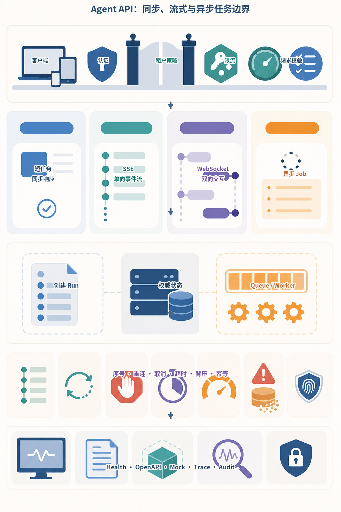
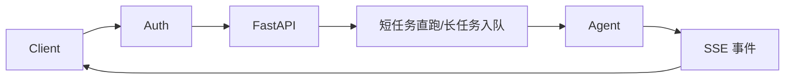
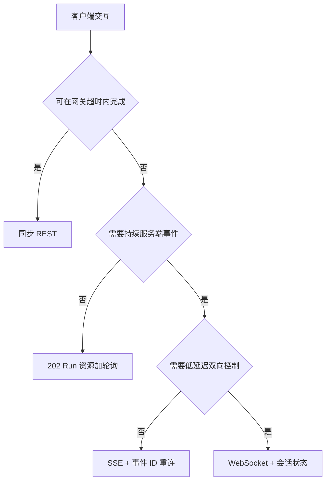
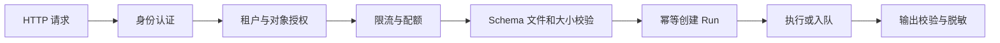
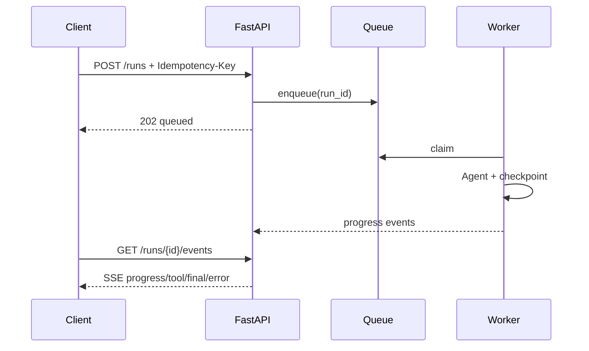
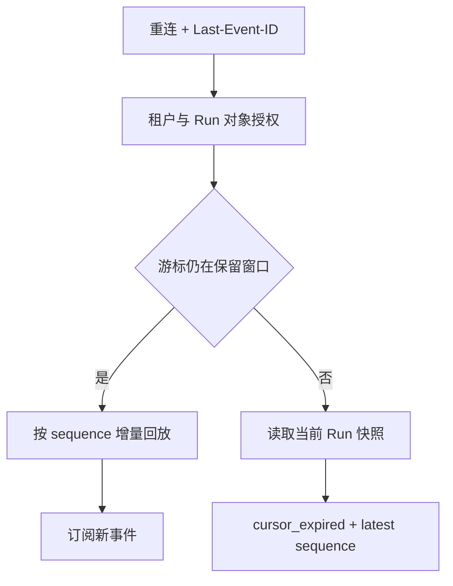

# 第24章：FastAPI 服务化

最后核对日期：2026-07-11。

## 导读、目标与前置知识
本章把 Agent 暴露为可认证、可取消、可观测的 API，覆盖 REST、模型、Streaming、SSE、WebSocket、依赖、鉴权、限流、上传、后台任务、OpenAPI 与测试。

学习目标是实现一个核心任务 API 示例，并解释每种实时协议的边界。前置知识为第23章。

Agent API 需要根据任务寿命和交互方向选择传输，而不是把所有请求都做成长连接。主图并列同步响应、SSE、WebSocket 和异步 Job，并把长任务的权威状态与客户端连接分离。



*图 24-A：Agent API 的同步、流式与异步任务边界。客户端断开 SSE 或 WebSocket 不应自动删除已经提交的长任务。*

图 24-A 的事件序号和重连游标用于恢复显示进度，而数据库中的 Run/Job 状态才是事实来源。Redis 或内存广播可以加速事件分发，但不能成为唯一任务记录。

## 架构与协议选择

Agent API 既要处理短请求，也要把长任务转成可观察资源。主图展示鉴权、任务分流和事件返回路径。



协议选择取决于交互方向和持久性，而不是“实时”两个字。SSE 适合单向事件，WebSocket 适合双向控制，轮询仍是可靠降级方案。



无论使用哪种协议，最终状态都写入 Run 资源；事件流只是状态变化的传输方式，不能成为唯一事实来源。



鉴权后仍需对象级授权，文件名与 MIME 仍不可信。内部异常映射成稳定错误模型，调用栈只保留在受控日志。
普通请求适合短任务；SSE 适合服务端单向事件；WebSocket 适合低延迟双向控制。流事件应有 `event_id`、类型、时间和数据，客户端可区分 token、tool、progress、done、error。

## 最小与完整工程
最小端点用 Pydantic 请求/响应和依赖注入。工程版加入 OAuth/API Key 主体、租户、请求 ID、限流、上传大小与格式验证、断连取消、幂等创建任务、OpenAPI 错误模型和 ASGI 测试。长任务不使用进程内 BackgroundTasks 代替持久队列。

## 误区、调试、实践与安全
不要在 async 路由中调用阻塞 SDK；不要把内部异常栈返回客户；不要信任文件名和 MIME。调试记录断连、首事件延迟和队列时间。鉴权之后仍需对象级授权。

## 总结、练习、面试与阅读

### REST 资源与 Agent API

不要把模型的“聊天”直接当完整 API 设计。短任务可以 `POST /runs` 同步返回，长任务创建 `Run` 资源并返回 202；客户端通过 `GET /runs/{id}`、事件流和 `POST /runs/{id}/cancel` 管理生命周期。请求含 agent_id、input、幂等键和可选 session，响应含 run_id、status、output、usage、citations 与 error。



202 响应确认资源已创建而不是任务已完成。客户端可断线重连并依据 `event_id` 从持久事件继续读取。

### 请求、响应与依赖注入

FastAPI 用 Pydantic 模型验证边界，路由保持薄：鉴权依赖产生 Principal，Service 执行业务，Repository 访问存储。路由不直接构造模型客户端或数据库连接。

```python
from typing import Annotated
from fastapi import Depends, FastAPI, status
from pydantic import BaseModel, Field

app = FastAPI()

class CreateRun(BaseModel):
    agent_id: str
    input: str = Field(min_length=1, max_length=20_000)

@app.post("/runs", status_code=status.HTTP_202_ACCEPTED)
async def create_run(
    request: CreateRun,
    principal: Annotated[Principal, Depends(current_principal)],
    service: Annotated[RunService, Depends(run_service)],
) -> RunResponse:
    return await service.create(principal, request)
```

示例中的 Principal/Service 是项目领域接口。对象级授权在 Service 中检查 agent、session 与租户，不因用户通过认证就允许访问所有 run。

### Streaming、SSE 与 WebSocket

普通 StreamingResponse 适合字节流；SSE 适合服务器到浏览器的单向事件并具备事件类型/ID；WebSocket 适合语音、实时协作等频繁双向控制。文本 Token 只是事件之一，API 还应发送 `run.started`、`tool.requested`、`approval.required`、`usage.updated`、`run.completed` 和 `run.failed`。

SSE 每条事件包含递增 ID，客户端断线带 Last-Event-ID 恢复。事件存储有保留期，慢客户端采用背压或断开。模型最终输出通过业务验证后才发送 completed，不能把最后一个 token 当成功信号。

### 鉴权、限流与权限

认证可用 OAuth/OIDC、服务 token 或 API Key，具体取决于产品。认证产生主体，授权再检查 tenant、role、resource 与 action。限流按主体、租户、IP 和高成本能力组合，返回 Retry-After。模型预算还限制 Token、并发 run 和工具费用。

上传接口校验 Content-Length、流式实际大小、扩展名、MIME、魔数和压缩炸弹；文件先存隔离区并扫描，再进入解析队列。文件名不用于路径，使用生成 ID。

### BackgroundTasks 与任务队列

FastAPI BackgroundTasks 在当前进程响应后运行，适合短小非关键动作，例如写辅助日志；进程重启会丢失，不能承载长 Agent。长任务写数据库状态并入持久队列，Worker checkpoint、retry 和取消。API 只是控制面。

### OpenAPI、错误与版本

请求/响应和错误模型进入 OpenAPI，客户端不解析自然语言错误。统一 Problem Details 类结构包含 code、message、trace_id、retryable 和字段错误。模型内部异常不暴露 stack。破坏性 Schema 变化采用新 API 版本，新增可选字段也要测试旧客户端。

### 测试与调试

ASGITransport/TestClient 测路由，无需启动端口；Fake Service 验证 HTTP 契约。集成测试连接临时数据库与队列；SSE 测事件顺序、断线恢复、取消和失败结束。负载测试关注首事件、总时长、连接数和 Worker 饱和。

调试拆分网关排队、API 处理、队列等待、模型与工具 span。请求 ID 贯穿代理、API、Worker 和 Trace。断连后确认上游是否取消，否则用户离开但费用继续产生。

### SSE 不是无限生命周期的 Token 管道

SSE 事件至少包含单调递增 ID、稳定类型、时间和 Schema Version。事件 ID 是 Run 内游标，不应假设
全局连续。客户端用 `Last-Event-ID` Header 或明确的 `after` 参数恢复；服务端先校验 Run 的租户和
对象权限，再读取游标之后的持久事件。若游标早于保留窗口，返回明确的 `cursor_expired`，让客户端
先读取当前 Run 快照，而不是静默从头播放。

```text
id: 42
event: tool.completed
data: {"schema_version":1,"run_id":"...","tool":"weather","status":"ok"}

```

生产流还要处理代理缓冲、空闲超时和半开连接。可以发送不含业务数据的 Heartbeat Comment，设置
适合 SSE 的缓存与代理配置，并让客户端指数退避重连。Heartbeat 只能证明传输仍活跃，不能证明
Run 在推进。慢消费者必须有每连接缓冲上限；超过上限后断开并要求按游标恢复，不能让一个移动端
连接无限占用内存。



这张图把事件流和事实快照分开：流可以过期或丢连接，Run 资源仍可恢复。最终事件之后关闭连接是
正常行为；客户端必须以 `run.completed`/`run.failed` 等业务事件判断终止，而不是把 EOF 当成功。

### WebSocket 的会话与安全边界

WebSocket 建连时完成认证并不够。长连接期间 Token 可能过期、角色可能撤销，服务端需设置最大
会话时长、定期重新授权或安全关闭。每条客户端消息都使用版本化 Schema、大小上限和动作级授权；
Ping/Pong、心跳和业务 Ack 不能混为一谈。单连接写入应串行或经过有界队列，避免并发 `send` 造成
帧乱序。

负载均衡器必须支持 Upgrade 与空闲时间，扩容时不能把进程内 Connection Map 当权威 Session。
若需要跨实例推送，可用 Broker 做广播，但历史与最终状态仍写数据库。WebSocket 适合低延迟双向
控制，不意味着任务必须依附于 Socket：网络断开后，已提交的 Run 按产品策略继续、暂停或请求取消，
而不是由 TCP 状态暗中决定。

### 断连、取消与背压

同步生成端点可以在 `request.is_disconnected()` 后取消上游，以节省费用，但取消是尽力而为，远端
模型或工具可能已执行。持久长任务通常不因显示连接断开而取消；用户需调用带对象授权的 Cancel API。
API 返回 `cancel_requested` 后，Worker 在边界协作停止，最终状态可能是 `cancelled`、`succeeded`
或 `unknown_external_state`，客户端必须接受竞争结果。

背压要贯穿模型流、事件缓冲和网络。若模型每秒生成速度高于客户端消费，系统可以合并 Token Chunk、
限制缓冲、暂停上游（若 Provider 支持）或断开并恢复。把所有 Token 永久写数据库通常代价过高；可
持久化语义事件与定期文本快照，Token 级流作为短期体验数据。具体保留策略由恢复精度、成本和隐私
共同决定。

### 稳定错误协议与幂等创建

错误响应使用机器可读 Code，不让客户端解析中文消息。HTTP 状态与业务状态分工：401/403 表达
认证授权失败，404 可避免跨租户枚举，409 表达幂等键冲突或非法状态转换，413 表达大小超限，429
配合 `Retry-After`。已创建的长任务返回 201/202；同一幂等键和相同请求可返回已有 Run，不同请求
复用同键必须 409。

```json
{
  "type": "https://errors.example.test/run-state-conflict",
  "title": "Run state conflict",
  "status": 409,
  "code": "run_state_conflict",
  "trace_id": "01J...",
  "retryable": false
}
```

示例采用 RFC 9457 风格，但具体字段必须进入 OpenAPI 并做契约测试。`trace_id` 便于支持人员定位，
不能泄露内部调用栈、SQL 或 Provider 原始敏感错误。

### 与十项目共享 API 的对应关系

仓库的 `src/ai_agent_book/project_service.py` 为十个教学项目提供统一持久 Run API。它实现幂等创建、
租户隔离、取消、事件表和 `after` 游标，`tests/test_project_service.py` 直接验证游标重放与权限。
这证明控制面契约可以离线运行，但当前 Event Endpoint 是一次性读取已有事件，不是长期保持连接的
Live Tail，也尚未实现事件保留过期、Heartbeat 和慢消费者背压。

项目 10 进一步提供租约 Worker、Trace 与 RBAC Metrics。生产版应在目标 ASGI Server、反向代理和
负载均衡器上测试真实断线、长连接、Graceful Shutdown 和多实例广播，不能从 TestClient 的一次响应
推断完整网络行为。

### 常见误区与安全注意事项

常见误区：用 WebSocket 表示“高级”、把长任务放 BackgroundTasks、只做路由鉴权、信任 MIME、返回内部异常。安全上设置 CORS allowlist、HTTPS、安全 header、请求大小、超时、限流和审计；OpenAPI 文档不应暴露内部管理接口给未授权网络。

### 练习参考答案与面试要点

1. **可恢复 SSE。** 事件表以 Run 内 Sequence 排序；Endpoint 做对象授权、保留窗口检查和增量读取；
   客户端保存最后处理成功的 ID。慢消费者超限断开，重连后不重复应用旧事件。
2. **取消竞争。** 同时注入客户端断开、Cancel 请求和 Worker 完成。断开不自动删除 Run，取消写入
   意图，最终状态由条件更新决定；已完成副作用保留审计。
3. **协议选择。** 单向进度使用 SSE，频繁双向音频/控制使用 WebSocket，无持续事件则 202 + 轮询；
   所有协议都以持久 Run 为事实来源。
4. **鉴权分层。** Authentication 产生 Principal；Authorization 依次检查租户、对象、动作和字段。
   通过登录不能自动读取任意 Run，404/403 策略还需避免资源枚举。

总结：Agent API 的核心是任务状态、事件游标和明确的断线/取消语义，而不只是聊天端点。延伸阅读包括
FastAPI、Starlette、OAuth/OIDC、RFC 9457、SSE 与 WebSocket 规范；代码目录为
[`projects/10-enterprise-platform/`](https://github.com/wujinjun/ai-agent-book/tree/main/projects/10-enterprise-platform)。

## 本章引用
<!-- chapter-citations:start -->
以下资料用于支撑本章的核心原理、工程边界与版本敏感说明：

- [fastapi-docs：FastAPI Documentation](../references.md#ref-fastapi-docs)
- [rfc9110：HTTP Semantics](../references.md#ref-rfc9110)
- [rfc9457：Problem Details for HTTP APIs](../references.md#ref-rfc9457)
- [html-sse：Server-Sent Events](../references.md#ref-html-sse)
- [rfc6455：The WebSocket Protocol](../references.md#ref-rfc6455)
<!-- chapter-citations:end -->
