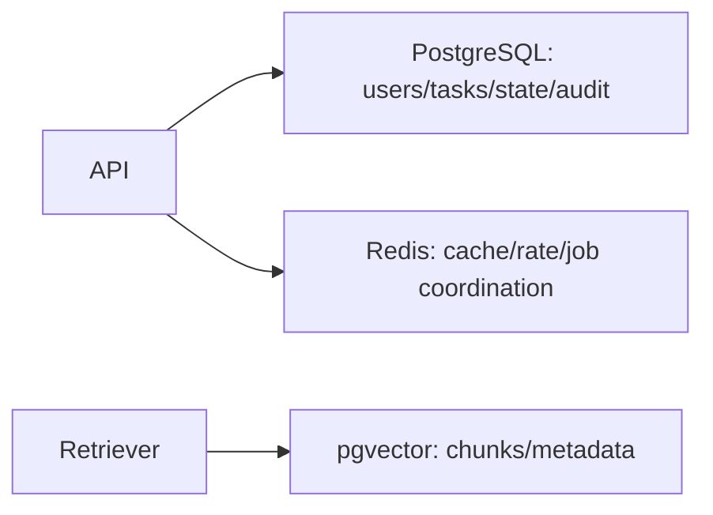
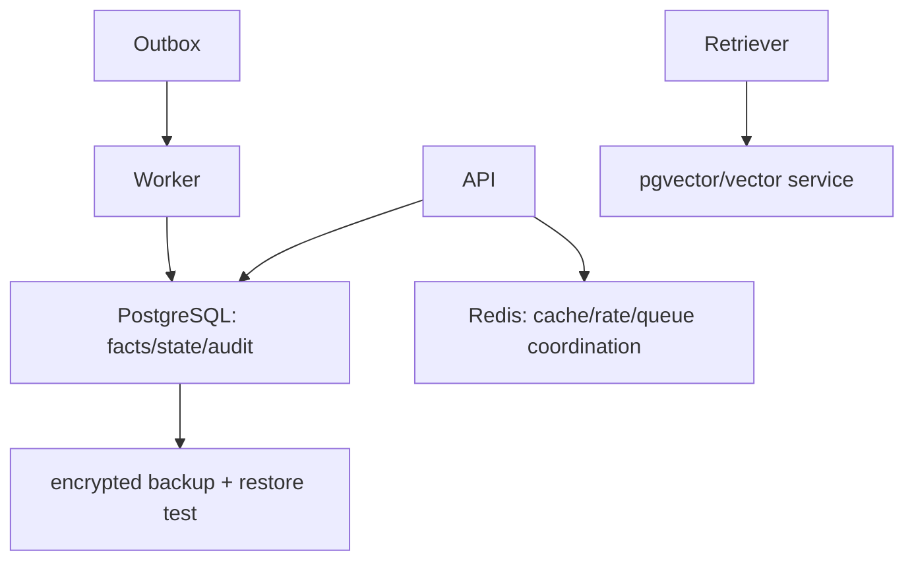

# 第25章：数据存储

最后核对日期：2026-07-11。

## 导读、目标与前置知识
本章为会话、Agent 状态、任务、缓存、Checkpoint、向量与审计选择 PostgreSQL、Redis 和 pgvector，并处理迁移、多租户与安全。

学习目标是完成一个带事务、缓存和租户隔离的数据示例。前置知识为 SQL、事务和第15—16章。

## 核心原理与架构
PostgreSQL 保存强一致业务记录、会话元数据和审计；Redis 适合有 TTL 的缓存、锁和队列协调；pgvector 将向量与关系过滤结合。事实状态与生成文本分表，事件采用追加写，派生摘要可重建。



## 最小与完整工程
工程 Schema 包含 `tenant_id`、稳定 ID、版本、创建/更新时间和乐观锁。迁移使用 Alembic 类工具并先向后兼容；Checkpoint 与外部副作用使用 outbox/idempotency。缓存键带租户和模型版本。

## 误区、调试、实践与安全
Redis 不是默认事实库；Checkpoint 不等于事务；向量库不自动隔离租户。调试慢查询、连接池、锁等待和缓存命中。启用最小数据库角色、传输/静态加密、备份恢复演练和删除流程。

## 总结、练习、面试与阅读

### 数据分类与事实来源

存储前先区分业务事实、运行状态、事件、派生文本、缓存和向量。用户、权限、任务、工具副作用与审计是事实；对话摘要和模型标签可重建；Token 流通常不需永久保存。每类数据有不同一致性、查询、保留和隐私要求。



### PostgreSQL Schema 与事务

Run 表保存 tenant、agent、status、version、budget、created/updated；Run Event 追加保存状态变化；Tool Execution 保存调用 ID、幂等键、批准和结果摘要；Message 保存角色、内容引用与敏感等级。外键和 check constraint 捕获确定性不变量。

```sql
CREATE TABLE agent_run (
    run_id uuid PRIMARY KEY,
    tenant_id uuid NOT NULL,
    status text NOT NULL CHECK (status IN
      ('queued','running','paused','succeeded','failed','cancelled')),
    version integer NOT NULL DEFAULT 1,
    created_at timestamptz NOT NULL DEFAULT now(),
    updated_at timestamptz NOT NULL DEFAULT now()
);
CREATE INDEX agent_run_tenant_status ON agent_run (tenant_id, status, created_at);
```

状态更新使用 `WHERE run_id=? AND version=?` 乐观锁，成功后 version 加一。数据库事务同时写状态和 outbox 事件，后台 Publisher 再投队列，避免“状态已写但消息未发”双写裂缝。

### Redis 的正确角色

Redis 适合带 TTL 缓存、限流计数、短锁、队列协调和 Pub/Sub，不默认作为不可丢失事实库。缓存键包含 tenant、模型、Prompt、输入哈希和权限版本；Value 有 Schema 版本。缓存穿透用负缓存和请求合并，但敏感错误不长时间缓存。

分布式锁有租约和失效风险，不能替代数据库唯一约束。任务队列是否可靠取决于具体产品配置、持久化和消费语义，不能因使用 Redis 就宣称不丢任务。

### pgvector 与文档数据

Chunk 表保存 document_id、version、location、text、embedding、tenant 与 ACL。关系过滤和向量距离在同一查询中实现时，应检查执行计划与过滤选择性。Embedding 模型迁移使用新列/表或 collection，不混合空间。

原文对象存储与数据库 Metadata 通过稳定 ID 关联。删除文档先标记不可检索，再异步删除向量、缓存和对象，最终记录删除完成。恢复备份时重新应用删除 tombstone。

### Session、Checkpoint 与 Memory

Session 记录对话归属和消息顺序；Run State 记录当前任务；Checkpoint 是某个版本的可恢复 State；Memory 是经治理的跨会话信息。四者不能都塞进一张 messages 表。Checkpoint 可压缩，但副作用执行记录永久独立保存。

### 数据迁移与版本

迁移采用 expand/contract：先新增可选字段与双读兼容，部署写入新格式，回填，切换读取，最后删除旧字段。大型索引并发创建。迁移脚本在生产规模副本测试，备份可恢复后才执行。模型/Prompt/Schema 版本写入结果，支持重放。

### 多租户与安全

每表有 tenant_id，Repository 自动注入过滤；可用 PostgreSQL Row Level Security 作纵深防御。连接账号按服务职责分离，Worker 不拥有用户管理权限。跨租户管理操作使用独立审计路径。仅在应用层“记得加 where”不足够。

PII 字段分类、加密和最小保留；日志只写 ID/哈希；Secret 不入数据库普通列。备份加密、权限、保留与恢复演练纳入同一安全策略。审计日志追加写，修改需要补充事件而非覆盖。

### 调试、性能与测试

监控连接池、慢查询、锁等待、deadlock、缓存命中、复制延迟和存储增长。Agent 长事务容易占连接，外部模型调用绝不能放在数据库事务内。先提交待执行状态，再调用外部服务，最后以幂等方式确认结果。

测试使用临时 PostgreSQL/Redis 容器，覆盖迁移、事务回滚、乐观锁、outbox、租户隔离、TTL、删除传播和备份恢复。Mock 数据库无法证明 SQL constraint 与隔离有效。

### 常见误区与工程实践

常见误区：Redis 是更快数据库、Checkpoint 等于事务、向量库自动多租户、备份存在就等于能恢复。工程实践从数据分类、明确事实来源、版本和生命周期开始，再做性能优化。
总结：数据层必须为恢复、权限和审计提供确定证据。练习：设计任务状态表、outbox 和幂等更新，并写跨租户测试。面试：状态、事件和 Checkpoint 有何区别？缓存如何避免跨租户污染？为什么外部模型调用不能放在数据库事务内？延伸阅读：PostgreSQL、Redis、pgvector 与所选迁移工具官方文档。代码目录：项目4、10。
