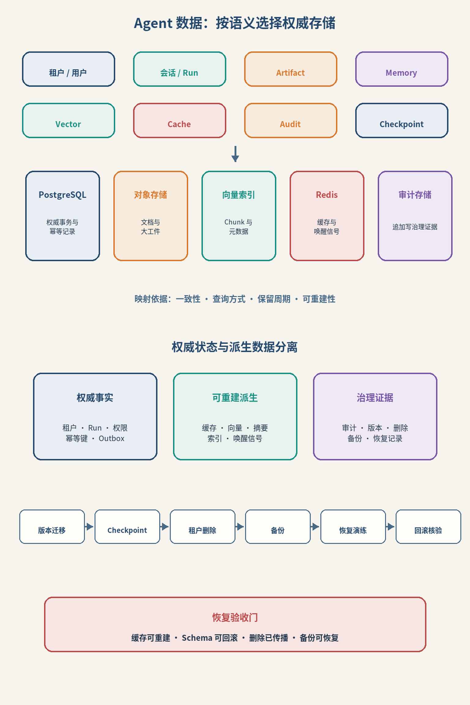
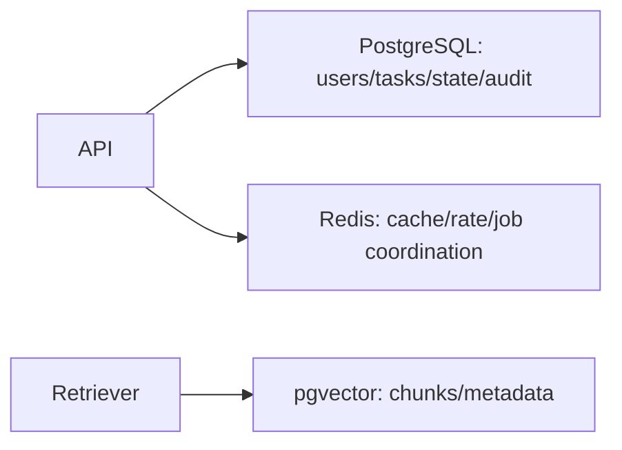
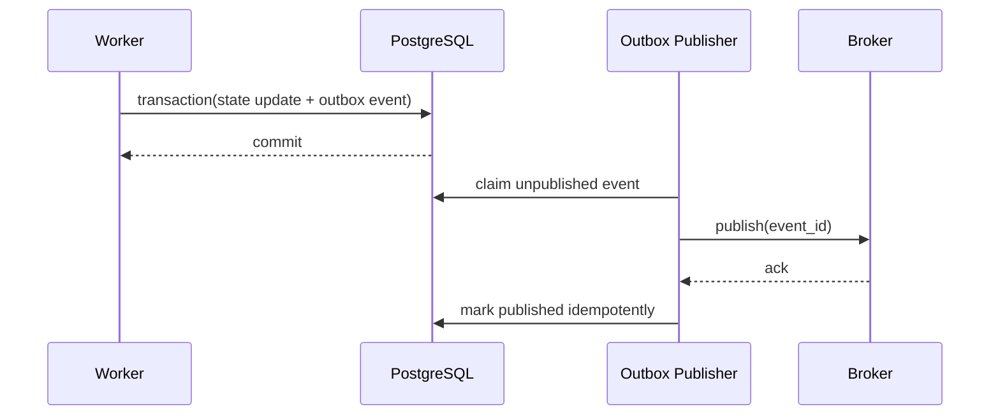
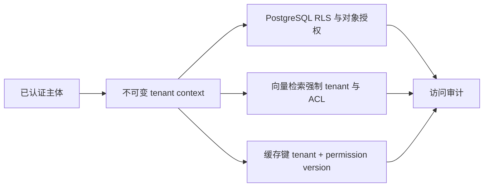
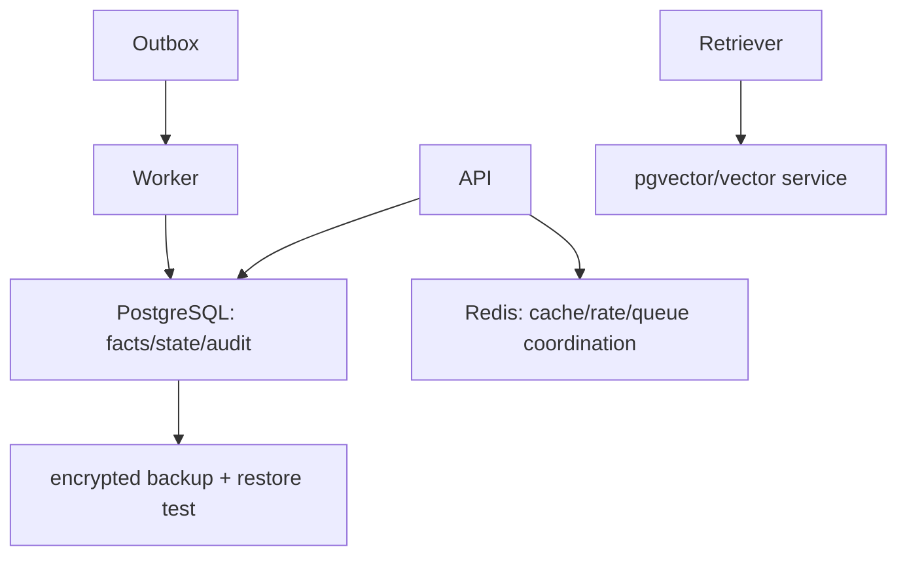
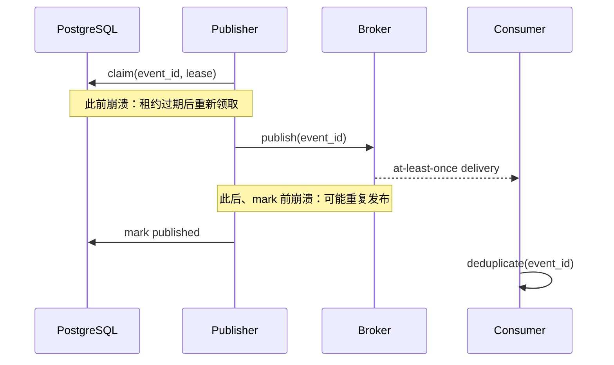

# 第25章：数据存储

最后核对日期：2026-07-11。

## 导读、目标与前置知识
本章为会话、Agent 状态、任务、缓存、Checkpoint、向量与审计选择 PostgreSQL、Redis 和 pgvector，并处理迁移、多租户与安全。

学习目标是完成一个带事务、缓存和租户隔离的数据示例。前置知识为 SQL、事务和第15—16章。

Agent 平台的数据具有不同一致性、访问模式和保留周期，不能因为部署方便就塞入同一个存储。主图先按语义分类数据，再映射到权威事务库、对象存储、向量索引、缓存信号和审计存储。



*图 25-A：Agent 数据按语义选择权威存储。PostgreSQL 保存任务与幂等事实，Redis 只承担可重建缓存、锁或唤醒信号。*

图 25-A 的恢复要求不是“有备份文件”，而是定期证明备份可恢复、迁移可回滚、缓存丢失可重建，并能在租户撤权或删除请求后追踪所有派生数据。

## 核心原理与架构
PostgreSQL 保存强一致业务记录、会话元数据和审计；Redis 适合有 TTL 的缓存、锁和队列协调；pgvector 将向量与关系过滤结合。事实状态与生成文本分表，事件采用追加写，派生摘要可重建。

下面的职责图把权威事实、暂态协调和语义检索拆到不同存储，避免以单一数据库承担相互冲突的一致性需求。



存储选型由一致性、生命周期和查询方式决定。Redis 与向量索引都不应成为权威业务事实的唯一副本。



Outbox 解决“状态已提交但消息未发送”这类双写裂缝。消费者仍按 event ID 幂等处理，因为至少一次投递可能重复。



多租户过滤应在数据访问层强制执行，不能依赖每个调用者记得添加条件。缓存和备份也属于隔离范围。

## 最小与完整工程
工程 Schema 包含 `tenant_id`、稳定 ID、版本、创建/更新时间和乐观锁。迁移使用 Alembic 类工具并先向后兼容；Checkpoint 与外部副作用使用 outbox/idempotency。缓存键带租户和模型版本。

## 误区、调试、实践与安全
Redis 不是默认事实库；Checkpoint 不等于事务；向量库不自动隔离租户。调试慢查询、连接池、锁等待和缓存命中。启用最小数据库角色、传输/静态加密、备份恢复演练和删除流程。

## 总结、练习、面试与阅读

### 数据分类与事实来源

存储前先区分业务事实、运行状态、事件、派生文本、缓存和向量。用户、权限、任务、工具副作用与审计是事实；对话摘要和模型标签可重建；Token 流通常不需永久保存。每类数据有不同一致性、查询、保留和隐私要求。



拓扑中的每个派生存储都必须能从事实库或原始数据重建；备份只有经过恢复演练才是有效证据。

### PostgreSQL Schema 与事务

Run 表保存 tenant、agent、status、version、budget、created/updated；Run Event 追加保存状态变化；Tool Execution 保存调用 ID、幂等键、批准和结果摘要；Message 保存角色、内容引用与敏感等级。外键和 check constraint 捕获确定性不变量。

```sql
CREATE TABLE agent_run (
    run_id uuid PRIMARY KEY,
    tenant_id uuid NOT NULL,
    status text NOT NULL CHECK (status IN
      ('queued','running','paused','succeeded','failed','cancelled')),
    version integer NOT NULL DEFAULT 1,
    created_at timestamptz NOT NULL DEFAULT now(),
    updated_at timestamptz NOT NULL DEFAULT now()
);
CREATE INDEX agent_run_tenant_status ON agent_run (tenant_id, status, created_at);
```

状态更新使用 `WHERE run_id=? AND version=?` 乐观锁，成功后 version 加一。数据库事务同时写状态和 outbox 事件，后台 Publisher 再投队列，避免“状态已写但消息未发”双写裂缝。

### Redis 的正确角色

Redis 适合带 TTL 缓存、限流计数、短锁、队列协调和 Pub/Sub，不默认作为不可丢失事实库。缓存键包含 tenant、模型、Prompt、输入哈希和权限版本；Value 有 Schema 版本。缓存穿透用负缓存和请求合并，但敏感错误不长时间缓存。

分布式锁有租约和失效风险，不能替代数据库唯一约束。任务队列是否可靠取决于具体产品配置、持久化和消费语义，不能因使用 Redis 就宣称不丢任务。

### pgvector 与文档数据

Chunk 表保存 document_id、version、location、text、embedding、tenant 与 ACL。关系过滤和向量距离在同一查询中实现时，应检查执行计划与过滤选择性。Embedding 模型迁移使用新列/表或 collection，不混合空间。

原文对象存储与数据库 Metadata 通过稳定 ID 关联。删除文档先标记不可检索，再异步删除向量、缓存和对象，最终记录删除完成。恢复备份时重新应用删除 tombstone。

### Session、Checkpoint 与 Memory

Session 记录对话归属和消息顺序；Run State 记录当前任务；Checkpoint 是某个版本的可恢复 State；Memory 是经治理的跨会话信息。四者不能都塞进一张 messages 表。Checkpoint 可压缩，但副作用执行记录永久独立保存。

### 数据迁移与版本

迁移采用 expand/contract：先新增可选字段与双读兼容，部署写入新格式，回填，切换读取，最后删除旧字段。大型索引并发创建。迁移脚本在生产规模副本测试，备份可恢复后才执行。模型/Prompt/Schema 版本写入结果，支持重放。

### 多租户与安全

每表有 tenant_id，Repository 自动注入过滤；可用 PostgreSQL Row Level Security 作纵深防御。连接账号按服务职责分离，Worker 不拥有用户管理权限。跨租户管理操作使用独立审计路径。仅在应用层“记得加 where”不足够。

PII 字段分类、加密和最小保留；日志只写 ID/哈希；Secret 不入数据库普通列。备份加密、权限、保留与恢复演练纳入同一安全策略。审计日志追加写，修改需要补充事件而非覆盖。

### 调试、性能与测试

监控连接池、慢查询、锁等待、deadlock、缓存命中、复制延迟和存储增长。Agent 长事务容易占连接，外部模型调用绝不能放在数据库事务内。先提交待执行状态，再调用外部服务，最后以幂等方式确认结果。

测试使用临时 PostgreSQL/Redis 容器，覆盖迁移、事务回滚、乐观锁、outbox、租户隔离、TTL、删除传播和备份恢复。Mock 数据库无法证明 SQL constraint 与隔离有效。

### 状态所有权与一致性边界

Agent 平台最重要的存储决策不是“选 PostgreSQL 还是 Redis”，而是谁拥有哪一种事实。一个可审计的
最小划分如下：

| 数据 | 权威来源 | 可派生副本 | 丢失后的处理 |
|---|---|---|---|
| Run 状态与版本 | PostgreSQL | Redis 状态缓存 | 从数据库重建 |
| 工具副作用结果 | PostgreSQL 执行记录、远端业务 ID | Trace、指标 | 先向远端对账，不能盲重放 |
| 队列唤醒 | Broker/Redis | 无 | 扫描数据库中可领取 Job 补发 |
| 文档原件 | 受控对象存储 | 解析 Chunk、向量 | 按版本重新解析与索引 |
| 长期 Memory | 治理后的主记录 | Embedding、摘要 | 从主记录重建并重新应用删除 |
| Audit Event | 追加式审计存储 | 检索索引、报表 | 从受保护原始事件重建 |

“Redis 丢失后扫描 PostgreSQL”成立的前提是数据库能够表达所有可领取状态，而且扫描器不会重复推进
非幂等副作用。若任务只存在 Broker 中，队列短暂不可用就可能变成永久丢失；若任务只存在数据库但
没有高效索引和唤醒机制，系统虽不丢数据却会出现不可接受的调度延迟。

状态更新必须同时验证旧状态、Version 或租约所有者。下面的条件更新不是普通 `UPDATE` 的写法偏好，
而是防止两个 Worker 同时声称完成同一个 Run 的并发契约：

```sql
UPDATE agent_run
SET status = 'succeeded',
    output_ref = :output_ref,
    version = version + 1,
    worker_id = NULL,
    lease_expires_at = NULL
WHERE tenant_id = :tenant_id
  AND run_id = :run_id
  AND status = 'running'
  AND worker_id = :worker_id
  AND version = :expected_version;
```

应用必须检查 `rowcount == 1`。零行不是可以忽略的“最终一致性”，它表示状态已变化、租约已丢失或
请求越过租户边界；旧 Worker 此时不得发布结果。更严格的系统使用单调递增 Fencing Token，使每次
重新领取都有更大的 Epoch，并要求所有可控下游拒绝较旧 Epoch。仅有过期时间而没有所有者或
Fencing 条件，无法阻止暂停很久的旧进程恢复后覆盖新结果。

### Outbox 的真实交付语义

Outbox 把业务状态和“需要发布的事件”放进同一个数据库事务，消除了第一次双写裂缝，但它不提供
端到端 Exactly Once。Publisher 仍有两个崩溃窗口：

1. 发布前崩溃：事件仍是未发布，下一实例可继续领取；
2. Broker 已接收但 `published_at` 尚未提交：下一实例会再次发布同一 `event_id`。

所以消费者必须以 `event_id` 或业务幂等键去重。Publisher 领取 Outbox 行也应使用短租约或
`FOR UPDATE SKIP LOCKED`，不能在发送网络请求期间持有数据库长事务。若 Broker 支持事务或去重，
它只能缩小局部重复窗口，不能替代外部 Tool 的幂等设计。



这张图说明 Outbox 的价值是让“需要发送”成为可恢复事实，而不是神奇地消除所有重复。

### 删除、备份与恢复闭环

删除请求必须沿数据血缘传播到主记录、对象、Chunk、向量、缓存、搜索索引和导出文件。常用流程是
先写 Tombstone 并立即阻止在线读取，再异步清理派生副本；每个清理器回写完成证据。备份通常按
保留周期清除，而不是原地修改不可变快照，因此隐私说明必须准确披露恢复后的重放删除机制。

恢复演练不能止于“数据库能启动”。验收应证明 Schema 版本一致、最新 Tombstone 已重放、租户策略
仍启用、对象与数据库引用闭合、密钥可解密且审计连续。推荐记录 RPO（最多可接受丢失多久的数据）
和 RTO（多久恢复服务），再用实测时间验证，而不是从备份产品宣传页推断。

### 与项目 10 的实现对照

[`projects/10-enterprise-platform/`](https://github.com/wujinjun/ai-agent-book/tree/main/projects/10-enterprise-platform)
提供本章的生产参考纵切面。`EnterprisePlatform.process_next()` 先在短事务中以租户条件领取 Run，写入
`worker_id + lease_expires_at`，随后在事务外执行 Provider；完成和失败都必须匹配 Worker ID。
测试覆盖租户隔离、过期租约恢复、迟到结果保护、DLQ、取消和 SQLite 可恢复备份。

该实现也明确保留边界：SQLite 用于离线可重复测试，不能证明 PostgreSQL 的 `SKIP LOCKED`、RLS、
连接池或并发性能；教学迁移函数也不替代 Alembic 等正式迁移工具。生产验收必须在目标数据库版本、
并发规模和故障模型下重新执行。

### 常见误区与工程实践

常见误区：Redis 是更快数据库、Checkpoint 等于事务、向量库自动多租户、备份存在就等于能恢复。工程实践从数据分类、明确事实来源、版本和生命周期开始，再做性能优化。

### 练习参考答案与面试要点

1. **任务状态表。** 至少包含租户、状态、Version、Worker/Fencing、租约、预算和时间；领取与完成
   都用条件更新。状态变化与 Outbox Event 同事务写入，消费者按 Event ID 幂等。
2. **跨租户测试。** 使用两个真实租户和同名业务 ID，分别验证普通查询、缓存命中、向量检索、
   管理接口和备份导出。只测试 Repository 的一个方法不足以证明系统隔离。
3. **缓存污染。** Key 包含 Tenant、Subject/Permission Version、Model、Prompt、Data Version 和
   输入哈希；撤权提升权限版本，使旧条目不可命中。敏感结果设短 TTL 并支持主动失效。
4. **事务边界。** 外部模型调用耗时且结果不确定，把它放进事务会长期占连接和锁；正确做法是先
   提交待执行事实，事务外调用，再用幂等和条件更新提交结果。

总结：数据层必须为恢复、权限和审计提供确定证据。状态所有权、条件写入、Outbox、租约和删除血缘
比“用了哪种数据库”更能决定可靠性。延伸阅读包括 PostgreSQL、Redis、pgvector 与所选迁移工具的
官方文档；代码目录为项目 4 和
[`projects/10-enterprise-platform/`](https://github.com/wujinjun/ai-agent-book/tree/main/projects/10-enterprise-platform)。

## 本章引用
<!-- chapter-citations:start -->
以下资料用于支撑本章的核心原理、工程边界与版本敏感说明：

- [postgresql-docs：PostgreSQL Documentation](../references.md#ref-postgresql-docs)
- [redis-docs：Redis Documentation](../references.md#ref-redis-docs)
- [pgvector：pgvector](../references.md#ref-pgvector)
<!-- chapter-citations:end -->
