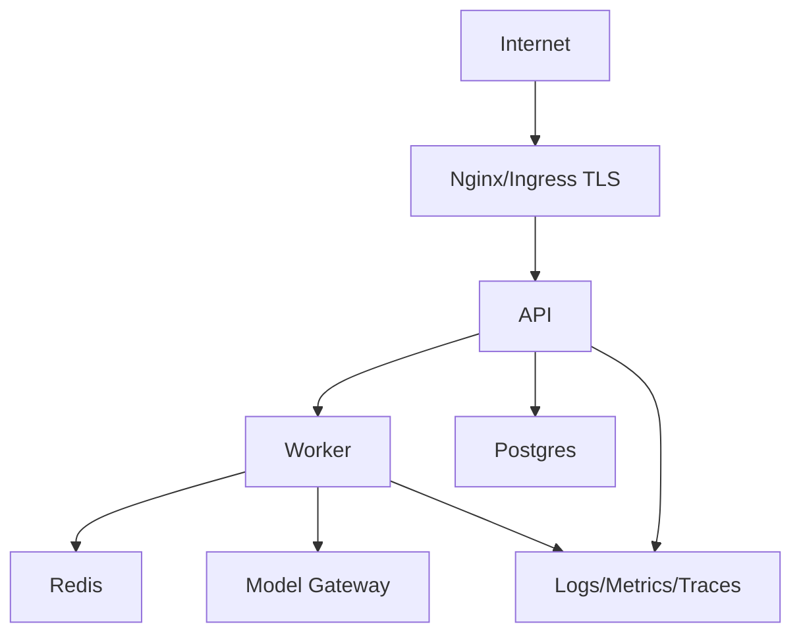

# 第26章：Docker 与部署

最后核对日期：2026-07-11。

## 导读、目标与前置知识
本章覆盖 Dockerfile、Compose、变量、Secret、多阶段构建、健康检查、PostgreSQL、Redis、Nginx、HTTPS、云部署、容器平台、日志监控与 CI/CD。

学习目标是掌握核心部署边界，并完成一个非 root、可健康检查的容器示例。前置知识为第23—25章。

## 架构图


## 最小与完整工程
多阶段镜像固定基础 digest/版本，非 root 用户运行，只复制运行产物。liveness 只判断进程可用，readiness 检查必要依赖但不调用昂贵模型。Compose 为本地提供 API、worker、Postgres、Redis；生产 Secret 由平台注入，HTTPS 在入口终止。

## 误区、调试、实践与安全
不要把 API Key 写入镜像层，不用 `latest`，不把数据库端口公开互联网。调试镜像架构、DNS、健康检查、时区和只读权限。CI 顺序为测试、扫描、构建、SBOM、签名、部署、烟测、回滚。

## 总结、练习、面试与阅读

### 可复现镜像与多阶段构建

镜像是运行时契约，不是开发目录打包。基础镜像固定 Python 小版本或 digest，依赖从锁文件安装，构建阶段产生 wheel，运行阶段只包含 wheel 和运行库。非 root 用户、只读根文件系统与明确工作目录减少攻击面。

```dockerfile
FROM python:3.12-slim AS build
WORKDIR /build
COPY pyproject.toml README.md ./
COPY src ./src
RUN pip wheel --no-cache-dir --wheel-dir /wheels .

FROM python:3.12-slim AS runtime
RUN useradd --create-home --uid 10001 app
WORKDIR /app
COPY --from=build /wheels /wheels
RUN pip install --no-cache-dir /wheels/*.whl && rm -rf /wheels
USER app
EXPOSE 8000
CMD ["uvicorn", "agent_service.api:app", "--host", "0.0.0.0", "--port", "8000"]
```

构建上下文通过 `.dockerignore` 排除 `.git`、`.env`、缓存、测试产物和本地数据。Secret 不使用 `ARG` 或 `ENV` 写入镜像层；若构建需私有仓库凭证，使用 BuildKit secret mount。

### 环境变量与 Secret

非敏感配置可用环境变量，启动时由 Settings 一次验证。生产 Secret 来自 Secret Manager、Kubernetes Secret/CSI 或容器平台，不写 Compose 文件和日志。轮换时应用能重新加载或滚动重启，旧 token 及时撤销。

模型供应商 key 按环境和服务拆分，Worker 只拿所需 key。数据库账号使用最小角色。`.env.example` 只提供空值与说明，本地 `.env` 在 `.gitignore`。

### Docker Compose 本地拓扑

Compose 适合教材和开发集成，启动 API、Worker、PostgreSQL、Redis 与可选代理。`depends_on` 的启动顺序不等于应用 ready，依赖必须有 healthcheck，客户端仍执行重连。

```yaml
services:
  api:
    build: .
    ports: ["8000:8000"]
    depends_on:
      postgres: {condition: service_healthy}
      redis: {condition: service_healthy}
  postgres:
    image: postgres:17-alpine
    healthcheck:
      test: ["CMD-SHELL", "pg_isready -U agent"]
  redis:
    image: redis:7-alpine
    healthcheck:
      test: ["CMD", "redis-cli", "ping"]
```

生产不直接复制开发 Compose 密码和卷配置；它只说明服务依赖。

### 健康检查与优雅关闭

liveness 判断进程是否卡死，失败会重启；readiness 判断是否接新流量。readiness 可检查关键连接池和迁移状态，但不能每次调用付费模型。startup probe 给大模型或索引加载时间。健康端点不泄漏版本、Secret 或内部拓扑。

SIGTERM 后 API 停止接新 run，等待短请求完成；Worker 停止领取任务，把可恢复状态 checkpoint，再退出。超过 grace period 的任务由下一个 Worker 根据幂等/租约恢复。

### Nginx、HTTPS 与网络

入口代理终止 TLS、限制请求体、连接和超时，传递可信 request ID。只暴露 80/443，PostgreSQL、Redis 和内部 Worker 网络不发布公网端口。Host header、转发 header 与 CORS 由明确 allowlist 控制。

流式 SSE 需要关闭不适当缓冲并设置足够 idle timeout；WebSocket 需要 Upgrade 配置。代理超时不表示上游任务取消，API 仍处理断连。

### 云服务器与容器平台

单台云服务器适合早期低负载，但也要自动更新、最小防火墙、备份和监控。容器平台提供滚动部署、Secret、autoscaling 和调度，但不能自动解决状态恢复。API 可按并发扩展，Worker 按队列与外部限流扩展，数据库单独容量规划。

模型 API 是上游依赖，跨区延迟、egress 和数据驻留纳入架构。自托管模型需要 GPU 调度、模型文件校验、预热与显存监控。

### Logging、Monitoring 与 CI/CD

容器日志写 stdout/stderr 结构化事件，由平台采集；文件日志不依赖容器本地磁盘。Metrics/Trace 使用 OTLP 或受控 exporter。部署面板显示镜像 digest、配置版本、迁移和评估结果。

CI 执行测试、lint/type、依赖与镜像扫描、SBOM、构建和签名；CD 部署到测试环境，运行迁移检查、健康、smoke 与黄金 eval，再灰度生产。回滚使用上一个镜像和兼容数据库 Schema；不可逆迁移先设计恢复。

### 常见误区、调试与安全

常见误区是使用 `latest`、在镜像写 key、以 root 运行、把数据库端口暴露互联网、只测容器能启动。调试比较架构、DNS、证书、代理缓冲、文件权限和健康日志。安全扫描不替代最小镜像和运行时限制。
总结：部署是可复现产物、配置、网络、状态与运营的组合。练习：为项目2写非 root 多阶段 Dockerfile、健康检查和 Compose。面试：liveness/readiness 有何区别？为何多阶段构建仍需扫描最终镜像？代理超时与任务取消如何关联？延伸阅读：Docker、Compose、OCI、Nginx 与目标容器平台官方文档。代码目录：各项目 `Dockerfile` 和根 Compose。
