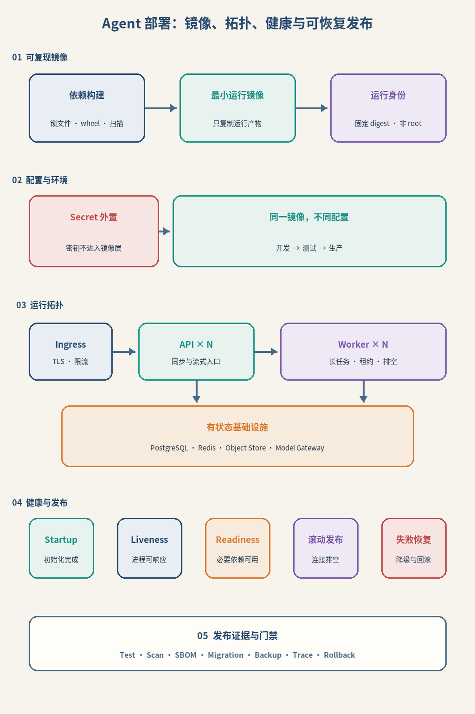
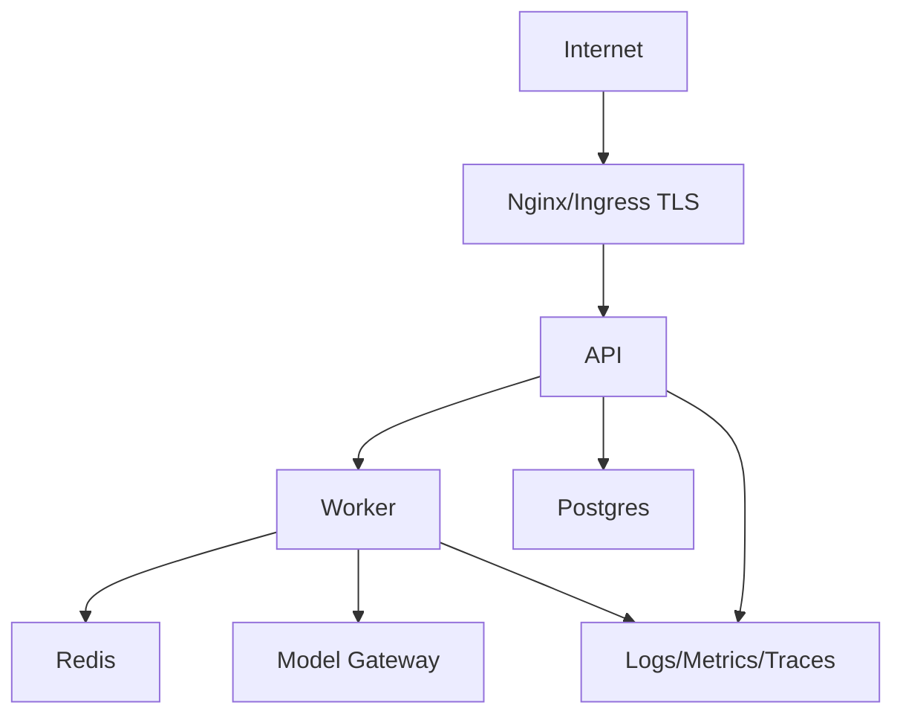
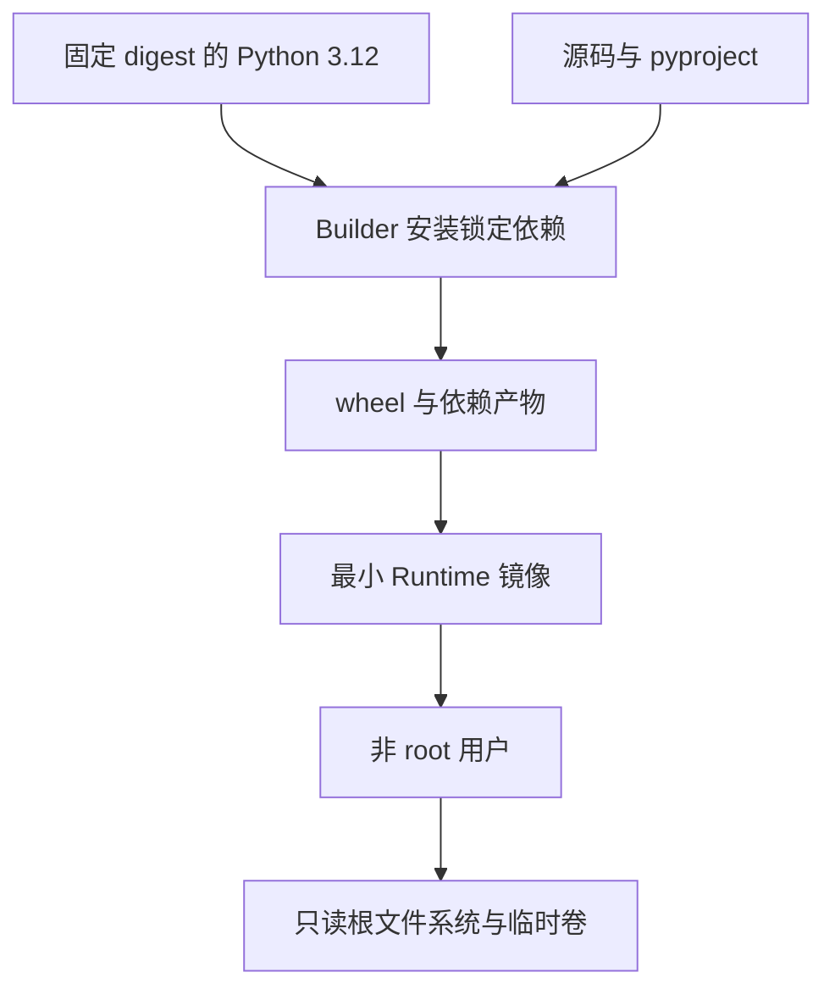
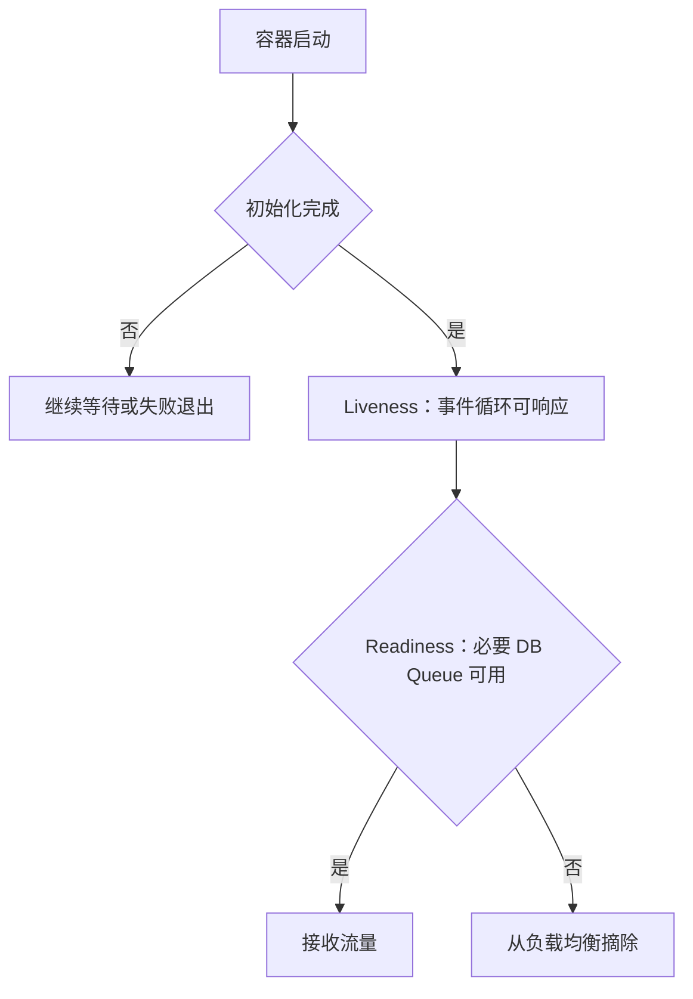
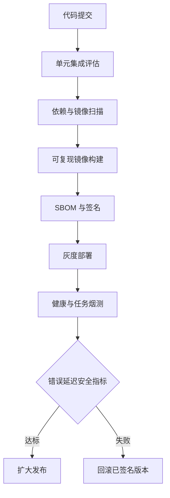
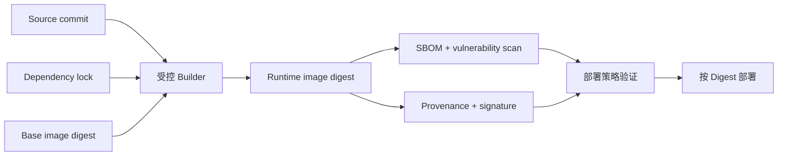
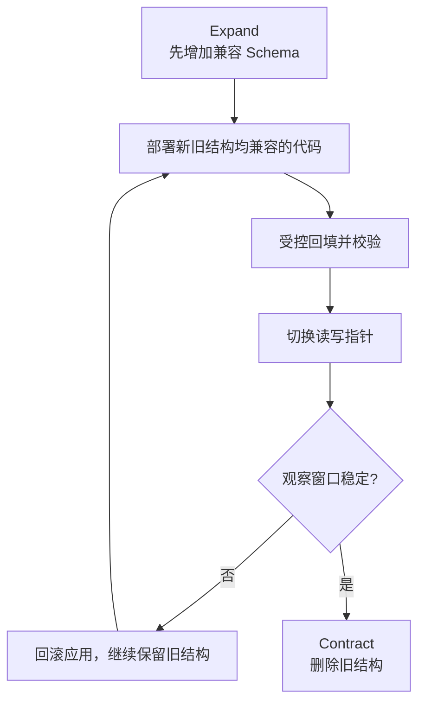

# 第26章：Docker 与部署

最后核对日期：2026-07-11。

## 导读、目标与前置知识
本章覆盖 Dockerfile、Compose、变量、Secret、多阶段构建、健康检查、PostgreSQL、Redis、Nginx、HTTPS、云部署、容器平台、日志监控与 CI/CD。

学习目标是掌握核心部署边界，并完成一个非 root、可健康检查的容器示例。前置知识为第23—25章。

镜像与编排语义分别参考 [Dockerfile](../references.md#ref-dockerfile-docs)、[Compose Specification](../references.md#ref-compose-spec)和 [Kubernetes](../references.md#ref-kubernetes-docs)官方资料；供应链证据的层级模型参见 [SLSA](../references.md#ref-slsa)。本章不把本地 Compose 拓扑直接等同于生产高可用部署。

部署链从可复现镜像开始，经过 Secret 外置、服务拓扑、健康语义和发布恢复，最终形成可审计交付过程。下图将“容器能启动”与“服务可以安全接流量”明确区分。



*图 26-A：Agent 服务的镜像、拓扑、健康与可恢复发布。启动、存活和就绪检查回答不同问题，不能只使用同一个 HTTP 端点。*

图 26-A 中滚动发布与数据库迁移必须协调：新旧实例并存期间 Schema 需要兼容，Worker 要支持连接排空和租约转移，回滚路径则要在发布前验证。

## 架构图

生产部署把公网入口、API、Worker、数据服务、模型出口与观测面分区。下图展示最小拓扑及主要依赖方向。



数据库和 Redis 仅在私网开放，Worker 不接受公网流量；模型与工具的出站网络也应经过 allowlist 或代理策略。



Secret 不参与镜像构建，也不保存在层历史。运行时只包含服务必需文件和 CA/时区等明确依赖。



Readiness 不调用昂贵或不稳定的模型 API，否则上游故障会触发容器重启风暴。依赖降级由应用状态明确表达。



发布物以 digest 标识，回滚不重新构建。数据库迁移采用向后兼容顺序，确保旧代码在回滚窗口仍可运行。

## 最小与完整工程
多阶段镜像固定基础 digest/版本，非 root 用户运行，只复制运行产物。liveness 只判断进程可用，readiness 检查必要依赖但不调用昂贵模型。Compose 为本地提供 API、worker、Postgres、Redis；生产 Secret 由平台注入，HTTPS 在入口终止。

## 误区、调试、实践与安全
不要把 API Key 写入镜像层，不用 `latest`，不把数据库端口公开互联网。调试镜像架构、DNS、健康检查、时区和只读权限。CI 顺序为测试、扫描、构建、SBOM、签名、部署、烟测、回滚。

## 可复制部署与发布治理的深化设计

### 可复现镜像与多阶段构建

镜像是运行时契约，不是开发目录打包。基础镜像固定 Python 小版本或 digest，依赖从锁文件安装，构建阶段产生 wheel，运行阶段只包含 wheel 和运行库。非 root 用户、只读根文件系统与明确工作目录减少攻击面。

```dockerfile
FROM python:3.12-slim AS build
WORKDIR /build
COPY pyproject.toml README.md LICENSE-CODE ./
COPY src ./src
RUN pip wheel --no-cache-dir --wheel-dir /wheels .

FROM python:3.12-slim AS runtime
RUN useradd --create-home --uid 10001 app
WORKDIR /app
COPY --from=build /wheels /wheels
RUN pip install --no-cache-dir /wheels/*.whl && rm -rf /wheels
USER app
EXPOSE 8000
CMD ["uvicorn", "agent_service.api:app", "--host", "0.0.0.0", "--port", "8000"]
```

构建上下文通过 `.dockerignore` 排除 `.git`、`.env`、缓存、测试产物和本地数据。Secret 不使用 `ARG` 或 `ENV` 写入镜像层；若构建需私有仓库凭证，使用 BuildKit secret mount。
`pyproject.toml` 引用的许可证、README 等构建元数据必须同时进入 Builder；否则本地可编辑安装可能成功，而干净镜像会在生成包元数据时失败。本仓库的 P9 容器复验曾实际捕获这一错误，因此对所有 Dockerfile 增加了回归契约。

### 环境变量与 Secret

非敏感配置可用环境变量，启动时由 Settings 一次验证。生产 Secret 来自 Secret Manager、Kubernetes Secret/CSI 或容器平台，不写 Compose 文件和日志。轮换时应用能重新加载或滚动重启，旧 token 及时撤销。

模型供应商 key 按环境和服务拆分，Worker 只拿所需 key。数据库账号使用最小角色。`.env.example` 只提供空值与说明，本地 `.env` 在 `.gitignore`。

### Docker Compose 本地拓扑

Compose 适合教材和开发集成，启动 API、Worker、PostgreSQL、Redis 与可选代理。`depends_on` 的启动顺序不等于应用 ready，依赖必须有 healthcheck，客户端仍执行重连。

```yaml
services:
  api:
    build: .
    ports: ["8000:8000"]
    depends_on:
      postgres: {condition: service_healthy}
      redis: {condition: service_healthy}
  postgres:
    image: postgres:17-alpine
    healthcheck:
      test: ["CMD-SHELL", "pg_isready -U agent"]
  redis:
    image: redis:7-alpine
    healthcheck:
      test: ["CMD", "redis-cli", "ping"]
```

生产不直接复制开发 Compose 密码和卷配置；它只说明服务依赖。

只读根文件系统与持久卷组合时，每一个状态路径都要显式落到可写卷，而不只是主数据库。例如项目 4 除服务状态外还有摄取 Pipeline 数据库和导入目录；漏掉任一路径都会让容器启动时因创建 `.data` 失败。配置应把相关路径作为一个整体审计：

```yaml
services:
  knowledge-api:
    read_only: true
    volumes: ["knowledge-data:/app/data"]
    environment:
      DATABASE_PATH: /app/data/service.db
      PIPELINE_DATABASE_PATH: /app/data/pipeline.db
      IMPORT_ROOT: /app/data/imports
```

验收不能停留在 `docker compose config` 或镜像构建成功；还要启动服务、等待 Readiness，并逐个访问健康端点。这样才能发现包元数据遗漏、非 root 权限和次级状态路径等运行期问题。

### 健康检查与优雅关闭

liveness 判断进程是否卡死，失败会重启；readiness 判断是否接新流量。readiness 可检查关键连接池和迁移状态，但不能每次调用付费模型。startup probe 给大模型或索引加载时间。健康端点不泄漏版本、Secret 或内部拓扑。

SIGTERM 后 API 停止接新 run，等待短请求完成；Worker 停止领取任务，把可恢复状态 checkpoint，再退出。超过 grace period 的任务由下一个 Worker 根据幂等/租约恢复。

### Nginx、HTTPS 与网络

入口代理终止 TLS、限制请求体、连接和超时，传递可信 request ID。只暴露 80/443，PostgreSQL、Redis 和内部 Worker 网络不发布公网端口。Host header、转发 header 与 CORS 由明确 allowlist 控制。

流式 SSE 需要关闭不适当缓冲并设置足够 idle timeout；WebSocket 需要 Upgrade 配置。代理超时不表示上游任务取消，API 仍处理断连。

### 云服务器与容器平台

单台云服务器适合早期低负载，但也要自动更新、最小防火墙、备份和监控。容器平台提供滚动部署、Secret、autoscaling 和调度，但不能自动解决状态恢复。API 可按并发扩展，Worker 按队列与外部限流扩展，数据库单独容量规划。

模型 API 是上游依赖，跨区延迟、egress 和数据驻留纳入架构。自托管模型需要 GPU 调度、模型文件校验、预热与显存监控。

### Logging、Monitoring 与 CI/CD

容器日志写 stdout/stderr 结构化事件，由平台采集；文件日志不依赖容器本地磁盘。Metrics/Trace 使用 OTLP 或受控 exporter。部署面板显示镜像 digest、配置版本、迁移和评估结果。

CI 执行测试、lint/type、依赖与镜像扫描、SBOM、构建和签名；CD 部署到测试环境，运行迁移检查、健康、smoke 与黄金 eval，再灰度生产。回滚使用上一个镜像和兼容数据库 Schema；不可逆迁移先设计恢复。

### 镜像供应链与可验证发布物

Tag 可移动，部署和回滚应记录镜像 Digest。构建证据至少关联源码 Commit、Builder、基础镜像 Digest、
依赖锁、SBOM、测试结果和签名。多阶段构建减少 Runtime 内容，但 Builder 被污染仍可能把恶意 Wheel
复制进去，因此扫描最终镜像并验证 Provenance。



漏洞扫描结果具有时间性，昨日通过不代表今日无新 CVE。团队定义修复 SLA、例外审批和重建策略；
基础镜像更新触发测试与评估，而不是在生产节点自动拉取 `latest`。

### Secret 注入与轮换

Secret 不进入 Dockerfile、Build Arg、Compose Git 文件或环境打印。平台以文件、短时身份或 Secret
Volume 注入；应用读取后不写 Prompt、Checkpoint 和 Trace。环境变量虽然常用，但可能被进程检查、
崩溃转储或误打印，仍需字段脱敏与最小进程权限。

轮换流程先让服务接受新旧凭证的短兼容窗口，发布新配置并验证，再撤销旧凭证。数据库账号、模型 Key
和 Webhook Secret 分别轮换，避免一次变更无法定位。泄漏响应包含撤销、影响审计和历史清理，简单从
Git 删除并不能抹去镜像层或提交历史。

### 滚动发布、排空与租约

API 收到终止信号后先 Readiness=false，从负载均衡摘除，再停止新 Run 并完成短请求。Worker 先停止
领取，续租或 Checkpoint 当前任务，在 Grace Period 内完成安全边界后退出；超时任务由租约过期接管。
旧 Worker 的迟到结果必须因 Worker ID/Fencing 不匹配而拒绝。

SSE/WebSocket 在滚动发布中会断线，客户端必须按事件游标恢复。仅设置容器 `stop_grace_period` 不会
自动产生这些语义，应用和队列都要配合。Autoscaler 还要避免在任务运行中直接杀死唯一持有状态的
进程。

### 数据库迁移与回滚顺序

滚动期间新旧代码并存，所以采用 Expand/Migrate/Contract：先添加兼容字段或表，发布兼容读写代码，
异步回填并验证，再切换读取，最后在回滚窗口结束后删除旧结构。破坏性 Migration 与新镜像同时执行，
会让旧 Pod 无法回滚。



大型索引和回填有锁、I/O 与复制延迟风险，必须在生产规模副本演练。回滚镜像前检查 Schema 仍兼容；
已经执行的数据转换或外部副作用可能需要前向修复，而非简单回退二进制。

### 健康、容量与故障注入

Liveness 只回答进程能否继续，不应因数据库短暂故障重启所有实例。Readiness 检查接流量所需的本地
状态和关键依赖，并设置短超时；模型供应商故障通常触发产品降级而非容器重启。健康端点本身应有
低成本、低基数指标。

上线验收注入数据库断连、Redis 丢失、DNS/证书错误、磁盘只读、SIGTERM、慢客户端和上游限流。
证明任务不丢、Secret 不泄漏、旧 Worker 不覆盖、客户端可恢复和告警可操作。`docker compose config`
只能验证配置语法，不能证明这些运行时性质。

## 常见误区、调试与安全

常见误区包括使用 `latest`、在镜像写入 Key、以 root 运行、把数据库端口暴露到互联网，以及只测试容器能否启动。调试时比较镜像架构、DNS、证书、代理缓冲、文件权限和健康日志；安全扫描仍不能替代最小镜像和运行时限制。

## 本章总结

部署不是把源码复制进容器，而是形成可验证的镜像、配置、Secret、网络、迁移、健康检查、排空、回滚和供应链契约。多阶段构建降低运行面，但不能替代最终镜像扫描；Readiness 与 Liveness 承担不同职责；数据库迁移必须与应用兼容窗口协调。下一章将处理超出 HTTP 生命周期的长任务和可靠工作队列。

## 课后练习

### 设计题

1. 为项目 2 设计多阶段镜像和 Compose 拓扑。输出镜像边界、运行用户、只读文件系统、Secret、私网与健康检查清单。

### 概念题

2. 比较 Liveness 与 Readiness；说明为什么模型供应商短暂故障不应触发所有实例重启。
3. 解释多阶段构建为什么不能替代最终镜像的 SBOM、依赖扫描和签名验证。

### 编码题

为容器增加 `HEALTHCHECK`、非 Root 用户和固定依赖版本。输出构建日志与 `docker inspect` 证据；检查标准是运行镜像不含构建工具和明文 Key。

### 故障实验

4. 让反向代理先于 Worker 超时，证明客户端断开后持久任务仍可能继续；给出授权取消和事件游标恢复方案。

## 参考答案位置

本章参考答案已移至[书末参考答案](../exercise-answers.md)，便于先独立完成练习再核对。

## 面试问题

1. Startup、Liveness 与 Readiness 分别回答什么问题？
2. 为什么滚动发布要求数据库 Schema 同时兼容新旧应用？
3. 多阶段构建、镜像扫描、SBOM 与签名之间是什么关系？

## 延伸阅读与代码目录

延伸阅读包括 Docker、Compose、OCI、Nginx、SLSA 与目标容器平台官方文档；代码目录为各项目 `Dockerfile` 和根 Compose。

## 本章引用
<!-- chapter-citations:start -->
以下资料用于支撑本章的核心原理、工程边界与版本敏感说明：

- [dockerfile-docs：Dockerfile Reference](../references.md#ref-dockerfile-docs)
- [compose-spec：Compose Specification](../references.md#ref-compose-spec)
- [kubernetes-docs：Kubernetes Documentation](../references.md#ref-kubernetes-docs)
- [twelve-factor：The Twelve-Factor App](../references.md#ref-twelve-factor)
- [slsa：Supply-chain Levels for Software Artifacts](../references.md#ref-slsa)
<!-- chapter-citations:end -->
