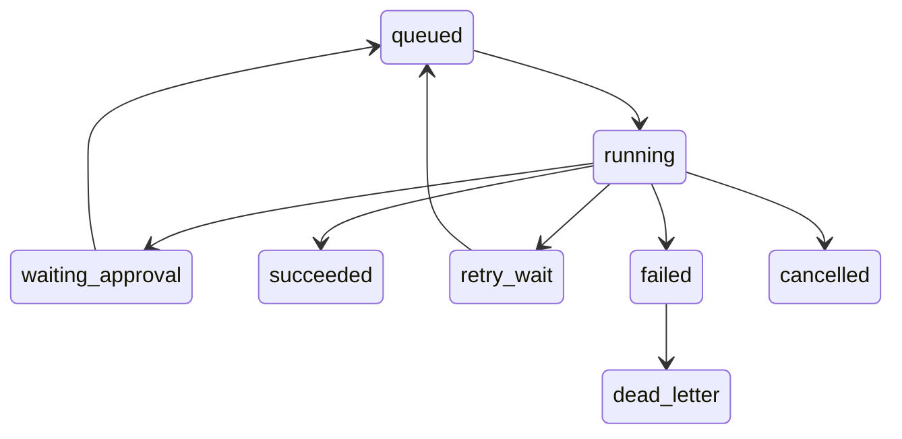
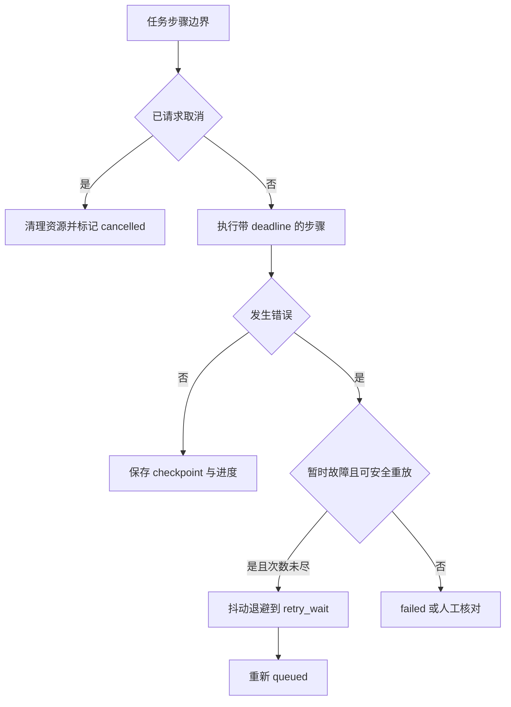
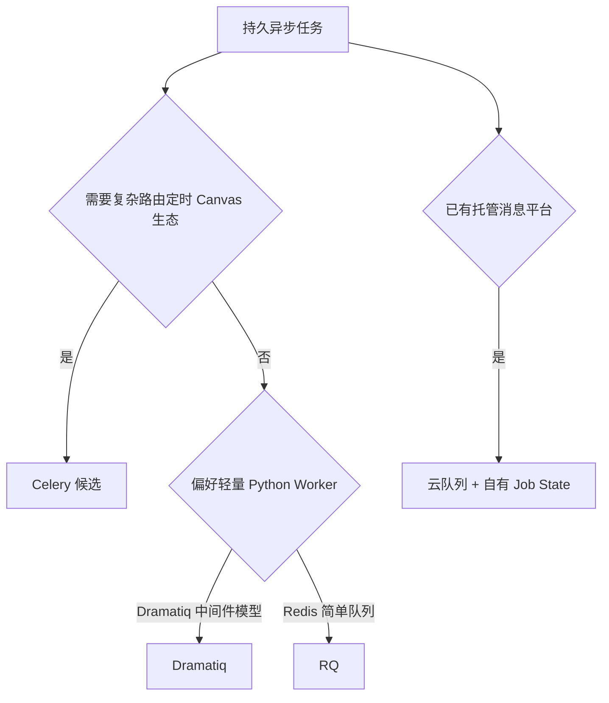
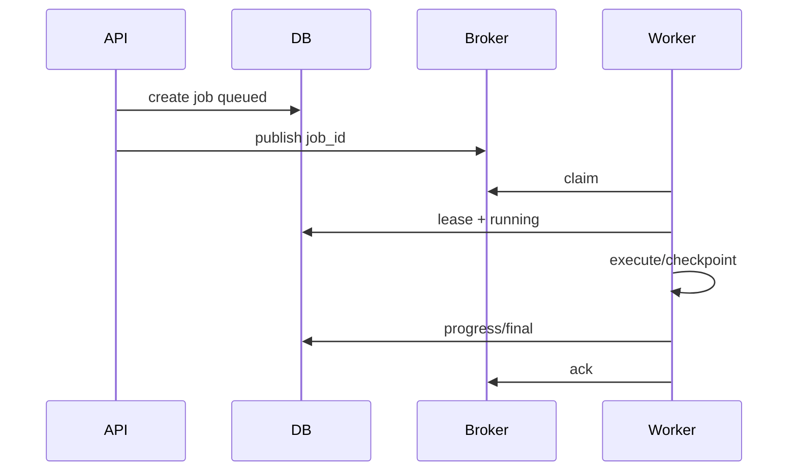

# 第27章：异步任务与工作队列

最后核对日期：2026-07-11。

## 导读、目标与前置知识
Agent 任务会因搜索、工具和人工审批持续较久。本章讨论 Celery、RQ、Dramatiq 类方案、Job State、Retry、DLQ、定时任务、取消、进度和分布式执行。

学习目标是掌握核心投递语义并设计可恢复的长任务示例。前置知识为第9、25—26章。

## 状态机

长任务必须以持久状态机表达，队列只是推动状态变化的分发机制。下图列出运行、审批、重试、取消与死信路径。



每个状态变化写入数据库事件并携带版本。Worker 只有持有有效租约时才能更新当前任务，避免并发重复推进。



取消是协作式协议，不能保证任意外部调用立刻停止。写动作超时后先核对外部状态，再决定是否重试。



无论采用哪种框架，用户可见状态、租约、幂等和审计都应由应用数据库定义，不能交给 broker 内部状态替代。

## 最小与完整工程
任务消息只携带稳定 ID，Worker 从数据库读取状态。每步保存 checkpoint 和进度事件；重试使用抖动退避且仅针对暂时故障；消费采用幂等键。取消是协作式的，Worker 在工具边界检查标志并清理资源。

## 误区、调试、实践与安全
“至少一次投递”不代表业务恰好一次；进度百分比不应伪造；超时后外部调用可能仍在执行。调试队列等待、执行时长、重试原因和僵尸任务。任务载荷不含密钥，队列网络隔离，DLQ 受审计。

## 总结、练习、面试与阅读

### 为什么 Agent 任务容易超时

Agent 可能执行多个模型回合、搜索、文档解析、工具重试和人工审批，持续时间远超过 HTTP 请求。把它留在 Web Worker 会占连接、难以升级恢复，也无法可靠取消。API 应创建持久 Job，Worker 异步执行，客户端订阅状态。

### Celery、RQ、Dramatiq 与选择

Celery 功能完整，支持多 broker、定时、routing 与复杂 Worker，但配置和运行语义较多。RQ 基于 Redis、心智负担较低，适合简单 Python 队列。Dramatiq 等方案强调中间件与可靠消费。选择依据 broker、投递语义、优先级、可观测、取消、生态和团队运维，不按示例代码长度。

队列框架不替代 Job 数据库。数据库记录用户可见状态与审计，broker 只负责分发。消息携带 job_id 和版本，不放完整 Prompt、文件或 Secret。



只有最终状态或可恢复 checkpoint 已提交后才确认消息。Worker 崩溃导致重新投递时，租约和幂等键保证安全接管。

### Job State 与租约

状态机只允许合法转换。Worker 领取时写 owner、lease_expires_at 和 attempt；运行中续租。Worker 崩溃且租约过期后，Reaper 把任务重新排队。两个 Worker 竞争时用数据库条件更新确保只有一个拥有当前 attempt。

进度是事件和已完成单元，不随意估算“73%”。研究任务可报告 `3/5 sources read`，文档导入报告页数。用户看到 queued、running、waiting_approval、retry_wait、succeeded、failed、cancelled 和 unknown_external_state。

### Retry、Backoff 与 DLQ

Retry 只针对暂时网络、限流或可恢复 Worker 错误，使用指数退避和 jitter。参数、权限和业务拒绝直接失败或等待用户。任务总 attempts、工具 attempts 和模型 turns 有统一上限，避免嵌套重试乘法。

超过尝试或遇不可识别异常进入 Dead Letter Queue/失败表，保存安全错误摘要与 Trace。DLQ 不是垃圾桶，需要告警、分类、修复和受控 replay。Replay 使用原幂等键并先检查外部副作用。

```python
def next_delay(attempt: int, base: float = 1.0, cap: float = 60.0) -> float:
    if attempt < 1:
        raise ValueError("attempt 从 1 开始")
    return min(cap, base * (2 ** (attempt - 1)))
```

工程实现再加入随机 jitter，测试通过注入随机源保持确定。

### 定时、取消与人工审批

定时任务生成普通 Job，并用 schedule_id + scheduled_time 做幂等。错过窗口时定义 catch-up 或 skip，不能重启后把几百次任务同时执行。时区使用 IANA 名称，数据库存 UTC。

取消是协作式：API 写 cancel_requested，Worker 在模型/工具边界检查并传播取消。已完成的外部动作不能靠取消回滚，使用补偿或人工。waiting_approval 不占 Worker；批准后创建新 attempt，从 checkpoint 恢复。

### 分布式执行与一致性

大任务拆为有依赖的子 Job，父任务聚合状态。Fan-out 设并发上限，避免同时冲击模型配额。Artifact 存对象存储，消息传 ID。只有独立节点并行；共享 State 用版本/Reducer 合并。

至少一次投递意味着 handler 必须幂等。所谓“exactly once”通常只在某个局部成立，外部 API 仍需幂等键。Ack 在业务状态成功持久化后发送，ack 丢失导致重复消费也应安全。

### 调试、观测与安全

监控 queue depth、oldest age、claim/execute、成功、retry、DLQ、lease expiration 和取消延迟。Trace 从 API 创建贯穿 Worker attempt 与工具。调试僵尸任务先查 lease、心跳、外部调用和 ack。

消息 broker 网络隔离与认证，payload 加密或仅 ID，Worker 角色最小权限。不同风险任务用独立队列/Worker，代码执行 Worker 无生产数据库凭证。

### 常见误区与测试

常见误区：队列自动保证只执行一次、HTTP 断开就取消任务、超时等于外部动作未完成、DLQ 可永远不看。测试覆盖重复投递、Worker 崩溃、租约恢复、取消、重试上限、审批恢复和外部写幂等。
总结：队列把长任务从请求中分离，可靠性来自状态、租约、幂等和恢复。练习：设计可恢复研究任务并注入 Worker 崩溃。面试：如何实现幂等消费？取消与超时有何不同？为什么 DLQ replay 有风险？延伸阅读：Celery、RQ、Dramatiq、Redis/RabbitMQ 与分布式任务官方文档。代码目录：项目8、10。
