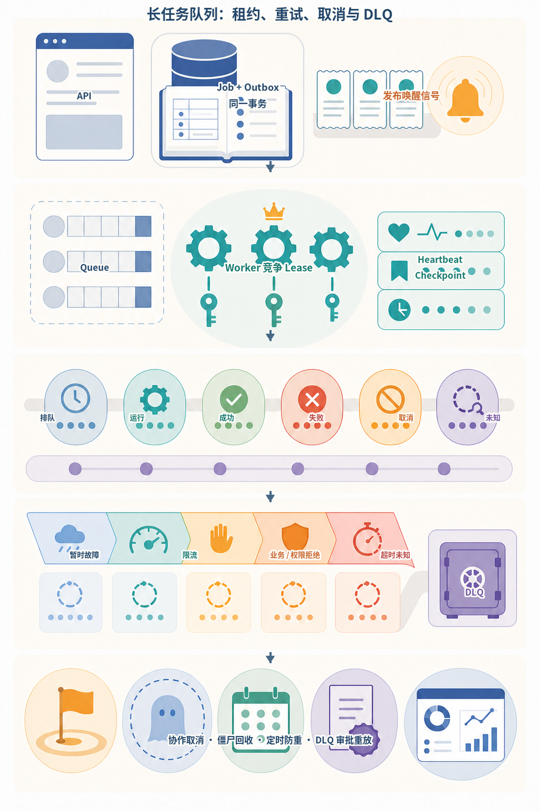
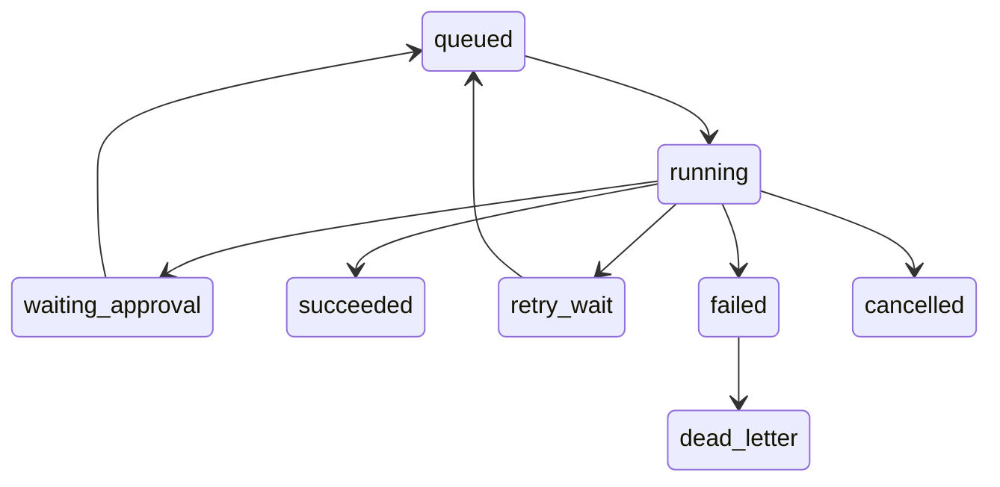
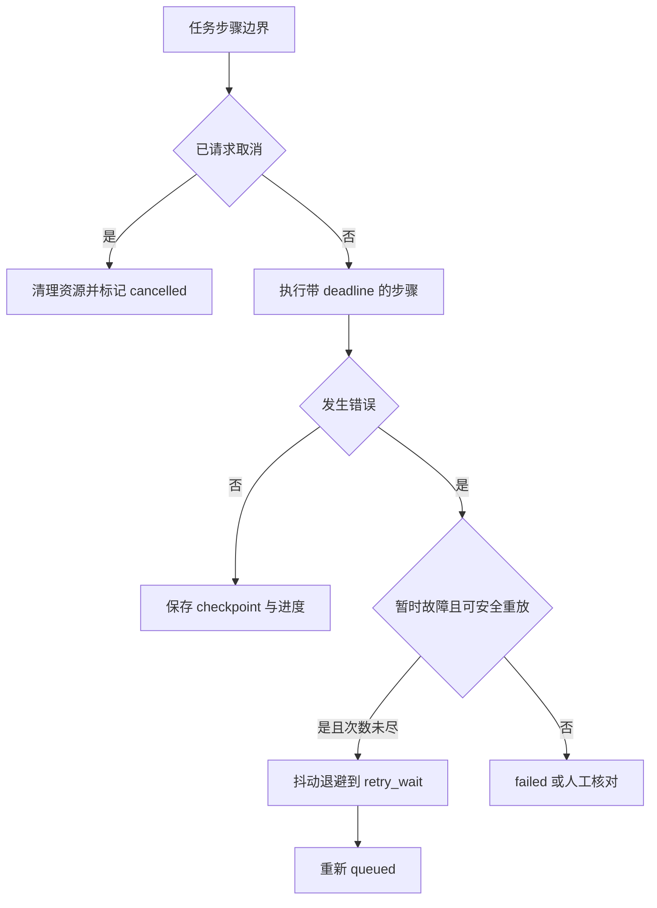
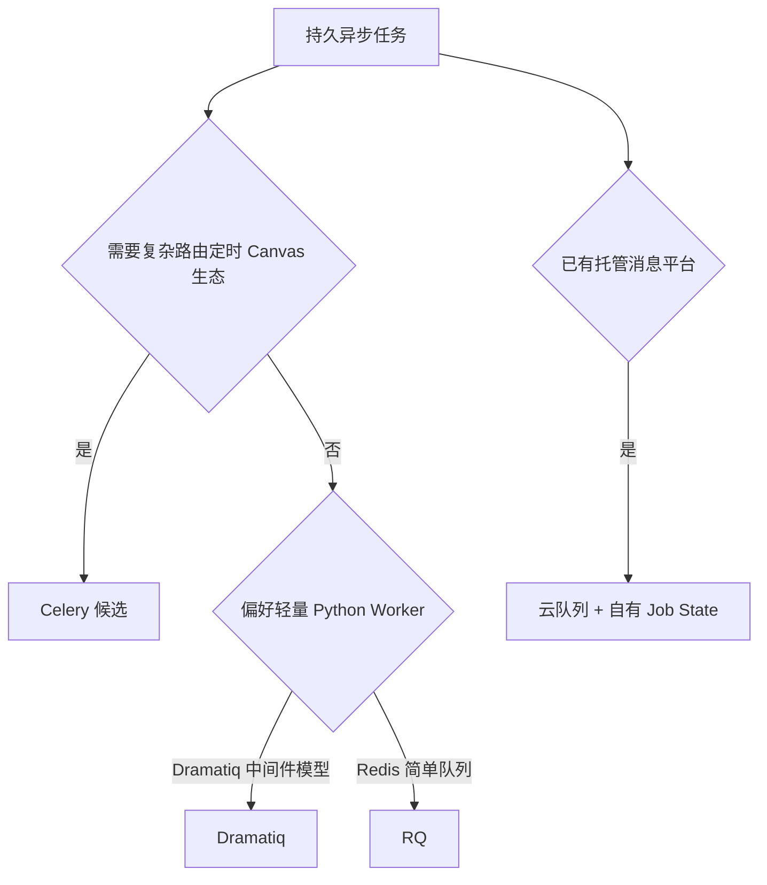
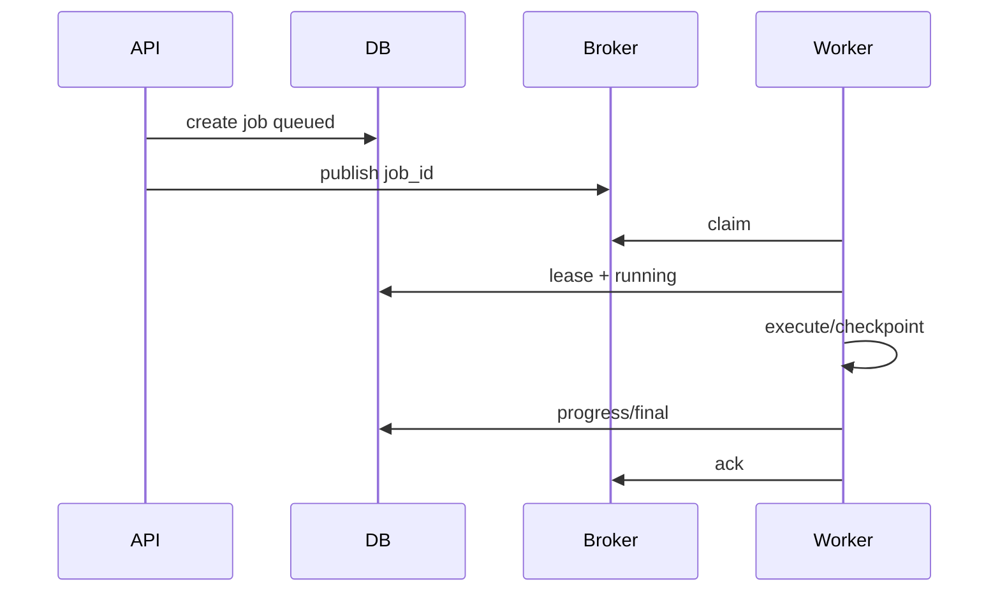
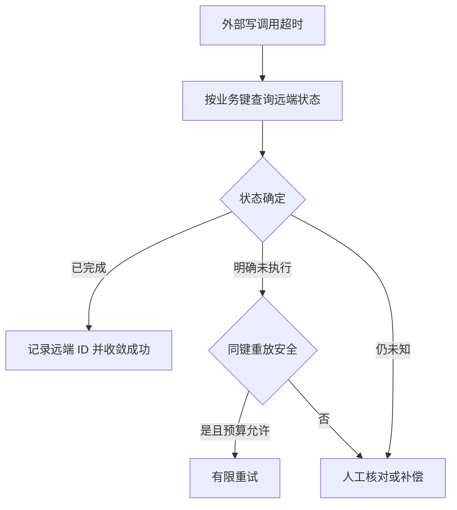

# 第27章：异步任务与工作队列

最后核对日期：2026-07-11。

## 导读、目标与前置知识
Agent 任务会因搜索、工具和人工审批持续较久。本章讨论 Celery、RQ、Dramatiq 类方案、Job State、Retry、DLQ、定时任务、取消、进度和分布式执行。

学习目标是掌握核心投递语义并设计可恢复的长任务示例。前置知识为第9、25—26章。

Celery 与 Dramatiq 的具体配置以 [Celery](../references.md#ref-celery-docs)和 [Dramatiq](../references.md#ref-dramatiq-docs)当前文档为准。本章的租约、幂等、Checkpoint 和 DLQ 设计是跨框架可靠性原则，不能由某个 Broker 的“已确认投递”替代业务完成证明。

长任务可靠性来自权威 Job 状态、租约、Checkpoint、错误分类和幂等语义，而不是简单把函数放进队列。主图从事务创建和 Outbox 开始，直到 Worker 执行、六种状态、重试分流和 DLQ 治理。



*图 27-A：长任务队列的租约、重试、取消与 DLQ。进度百分比是展示信息，权威状态与副作用记录必须持久化。*

图 27-A 中超时后的未知状态不能直接重试非幂等动作。Worker 应先核对外部结果；无法确认时进入人工复核或专用补偿流程，而不是伪装成普通失败。

## 状态机

长任务必须以持久状态机表达，队列只是推动状态变化的分发机制。下图列出运行、审批、重试、取消与死信路径。



每个状态变化写入数据库事件并携带版本。Worker 只有持有有效租约时才能更新当前任务，避免并发重复推进。



取消是协作式协议，不能保证任意外部调用立刻停止。写动作超时后先核对外部状态，再决定是否重试。



无论采用哪种框架，用户可见状态、租约、幂等和审计都应由应用数据库定义，不能交给 broker 内部状态替代。

## 最小与完整工程
任务消息只携带稳定 ID，Worker 从数据库读取状态。每步保存 checkpoint 和进度事件；重试使用抖动退避且仅针对暂时故障；消费采用幂等键。取消是协作式的，Worker 在工具边界检查标志并清理资源。

## 误区、调试、实践与安全
“至少一次投递”不代表业务恰好一次；进度百分比不应伪造；超时后外部调用可能仍在执行。调试队列等待、执行时长、重试原因和僵尸任务。任务载荷不含密钥，队列网络隔离，DLQ 受审计。

## 持久任务与可靠交付的深化设计

### 为什么 Agent 任务容易超时

Agent 可能执行多个模型回合、搜索、文档解析、工具重试和人工审批，持续时间远超过 HTTP 请求。把它留在 Web Worker 会占连接、难以升级恢复，也无法可靠取消。API 应创建持久 Job，Worker 异步执行，客户端订阅状态。

### Celery、RQ、Dramatiq 与选择

Celery 功能完整，支持多 broker、定时、routing 与复杂 Worker，但配置和运行语义较多。RQ 基于 Redis、心智负担较低，适合简单 Python 队列。Dramatiq 等方案强调中间件与可靠消费。选择依据 broker、投递语义、优先级、可观测、取消、生态和团队运维，不按示例代码长度。

队列框架不替代 Job 数据库。数据库记录用户可见状态与审计，broker 只负责分发。消息携带 job_id 和版本，不放完整 Prompt、文件或 Secret。



只有最终状态或可恢复 checkpoint 已提交后才确认消息。Worker 崩溃导致重新投递时，租约和幂等键保证安全接管。

### Job State 与租约

状态机只允许合法转换。Worker 领取时写 owner、lease_expires_at 和 attempt；运行中续租。Worker 崩溃且租约过期后，Reaper 把任务重新排队。两个 Worker 竞争时用数据库条件更新确保只有一个拥有当前 attempt。

进度是事件和已完成单元，不随意估算“73%”。研究任务可报告 `3/5 sources read`，文档导入报告页数。用户看到 queued、running、waiting_approval、retry_wait、succeeded、failed、cancelled 和 unknown_external_state。

### Retry、Backoff 与 DLQ

Retry 只针对暂时网络、限流或可恢复 Worker 错误，使用指数退避和 jitter。参数、权限和业务拒绝直接失败或等待用户。任务总 attempts、工具 attempts 和模型 turns 有统一上限，避免嵌套重试乘法。

超过尝试或遇不可识别异常进入 Dead Letter Queue/失败表，保存安全错误摘要与 Trace。DLQ 不是垃圾桶，需要告警、分类、修复和受控 replay。Replay 使用原幂等键并先检查外部副作用。

```python
def next_delay(attempt: int, base: float = 1.0, cap: float = 60.0) -> float:
    if attempt < 1:
        raise ValueError("attempt 从 1 开始")
    return min(cap, base * (2 ** (attempt - 1)))
```

工程实现再加入随机 jitter，测试通过注入随机源保持确定。

### 定时、取消与人工审批

定时任务生成普通 Job，并用 schedule_id + scheduled_time 做幂等。错过窗口时定义 catch-up 或 skip，不能重启后把几百次任务同时执行。时区使用 IANA 名称，数据库存 UTC。

取消是协作式：API 写 cancel_requested，Worker 在模型/工具边界检查并传播取消。已完成的外部动作不能靠取消回滚，使用补偿或人工。waiting_approval 不占 Worker；批准后创建新 attempt，从 checkpoint 恢复。

### 分布式执行与一致性

大任务拆为有依赖的子 Job，父任务聚合状态。Fan-out 设并发上限，避免同时冲击模型配额。Artifact 存对象存储，消息传 ID。只有独立节点并行；共享 State 用版本/Reducer 合并。

至少一次投递意味着 handler 必须幂等。所谓“exactly once”通常只在某个局部成立，外部 API 仍需幂等键。Ack 在业务状态成功持久化后发送，ack 丢失导致重复消费也应安全。

### 调试、观测与安全

监控 queue depth、oldest age、claim/execute、成功、retry、DLQ、lease expiration 和取消延迟。Trace 从 API 创建贯穿 Worker attempt 与工具。调试僵尸任务先查 lease、心跳、外部调用和 ack。

消息 broker 网络隔离与认证，payload 加密或仅 ID，Worker 角色最小权限。不同风险任务用独立队列/Worker，代码执行 Worker 无生产数据库凭证。

### 领取协议：租约不是一把永久锁

可靠领取至少包含 Job ID、Worker ID、Attempt/Epoch、租约截止时间和当前状态。数据库是事实来源时，
多个 Worker 可以用锁定跳过或条件更新竞争；Broker 的消息只是优先提示。领取事务必须短，Provider、
模型和工具调用全部在事务外运行。

```sql
WITH candidate AS (
    SELECT job_id
    FROM agent_job
    WHERE status = 'queued'
       OR (status = 'running' AND lease_expires_at < now())
    ORDER BY created_at
    FOR UPDATE SKIP LOCKED
    LIMIT 1
)
UPDATE agent_job AS j
SET status = 'running',
    worker_id = :worker_id,
    attempt = attempt + 1,
    lease_epoch = lease_epoch + 1,
    lease_expires_at = now() + :lease_interval
FROM candidate
WHERE j.job_id = candidate.job_id
RETURNING j.*;
```

SQL 是 PostgreSQL 风格示例，部署前需按目标版本验证。`SKIP LOCKED` 提高并行领取吞吐，但不是权限
边界；查询仍须限定 Worker 可处理的租户、队列和风险级别。`lease_epoch` 是 Fencing Token，完成时
必须匹配。租约过期仅表示其他 Worker 可以接管，不表示旧进程已经停止，因此可控下游也应记录并
拒绝旧 Epoch；无法支持 Fencing 的外部 API 必须依赖业务幂等键和结果对账。

长步骤要续租，但不能无限续租掩盖挂死。续租前检查取消、总 Deadline 和最大运行时间；监控
`lease_remaining`，在到期前留出足够安全余量。若 Worker 失去数据库连接，最安全的默认行为是停止
发起新的副作用，而不是继续离线执行到最后再尝试覆盖状态。

### 取消、超时与未知外部状态

三者是不同概念：取消是用户或系统表达“不再继续”的意图；超时是本地等待预算耗尽；未知外部状态
表示请求可能已经被远端接受，但本地未收到确定响应。对只读动作，超时后有限重试通常安全；对发送、
购买、删除或权限修改，未知状态必须先按幂等键或业务对象查询。



这张图禁止把网络超时直接映射为“业务失败”。取消已运行任务时，Worker 在步骤边界停止后续动作并
保存可解释状态；已经完成的副作用只能补偿，不能被 `cancelled` 标签抹去。等待人工审批的 Job 应
释放 Worker 与租约，把恢复所需 Checkpoint 持久化。

### 重试预算与错误分类

嵌套重试会产生乘法放大。若 Job 最多 3 次、模型 3 次、工具 4 次，最坏可能产生 36 次工具相关
尝试。Runtime 应维护共享总预算，并把错误分为：

| 错误类别 | 示例 | 默认处理 |
|---|---|---|
| 暂时基础设施故障 | 连接重置、限流、短暂 5xx | 抖动退避，受总预算约束 |
| 确定性输入错误 | Schema、参数、文件损坏 | 直接失败或请求用户修正 |
| 权限/策略拒绝 | Scope 不足、需审批 | 不重试；进入授权或审批状态 |
| 未知副作用状态 | 写请求超时 | 先对账，禁止盲重放 |
| 程序缺陷 | 不变量破坏、未知异常 | 安全失败、告警，有限隔离后进 DLQ |

Backoff 应加入全抖动并遵守服务端 `Retry-After`。测试注入 Clock 和随机源，从而断言调度区间而不
真实睡眠。每次 Attempt 记录错误类型、剩余预算、下次可运行时间和 Trace Link，不能把敏感 Prompt
复制到错误消息。

### DLQ 是受控运维工作流

死信至少保存 Job/租户 ID、失败分类、Attempts、代码与配置版本、最后 Checkpoint、发生时间和安全
Trace 引用。管理员查看与 Replay 都要租户隔离和审计。修复代码或依赖后，Replay 仍需检查原任务
是否过期、用户权限是否变化、外部副作用是否已发生以及输入数据是否仍允许处理。

Replay 应创建新的 Attempt 或 Run 关联，而不是删除历史失败证据。高风险副作用需要再次人工批准；
批量 Replay 设置速率、并发和停止阈值，防止恢复时形成重试风暴。DLQ 年龄、增长速率和最高错误类
应有告警与处理 SLA。

### 与项目 10 的实现和边界

[`projects/10-enterprise-platform/`](https://github.com/wujinjun/ai-agent-book/tree/main/projects/10-enterprise-platform)
实现了租户限定领取、`worker_id + lease_expires_at`、过期租约接管、迟到 Worker 写入拒绝、有限
Attempts、租户隔离 DLQ、RBAC Replay 与排队状态取消。`tests/test_enterprise_resilience.py` 注入
Provider 故障和崩溃租约，验证恢复路径，而不是只 Mock 队列的 `push()`。

当前教学实现有意保持范围：只允许取消 `queued` Run，没有实现运行中协作取消和租约心跳；DLQ
Replay 由管理员触发，但尚未实现内容绑定的再次审批；SQLite 测试也不能证明 PostgreSQL 高并发领取。
这些边界必须在正文中保留，不能因 Happy Path 通过就宣称已具备所有生产能力。

### 常见误区与测试

常见误区：队列自动保证只执行一次、HTTP 断开就取消任务、超时等于外部动作未完成、DLQ 可永远不看。测试覆盖重复投递、Worker 崩溃、租约恢复、取消、重试上限、审批恢复和外部写幂等。

## 本章总结

工作队列把长任务从请求生命周期分离，但可靠性来自权威 Job 状态、租约与 Fencing、幂等处理、有限重试、取消协作和受控 DLQ，而不是 Broker 名称。超时只结束等待，不能证明远端副作用停止；DLQ Replay 也必须重新授权和对账。下一章将建立跨 API、Worker、模型和工具的可观测证据链。

## 课后练习

### 故障实验

1. 分别在领取后、Checkpoint 后、外部写返回前后和最终提交前终止 Worker。输出每个注入点的最终状态、租约、重复副作用和 Trace；检查标准是系统最终收敛且旧 Worker 不能覆盖。

### 编码题

2. 实现只携带稳定 Job ID 的幂等消费者。输入包括重复投递与 Ack 丢失；输出为同一业务结果；检查标准是事件和业务状态都不会重复提交。

### 概念题

3. 比较取消、超时和失败三种状态，说明它们分别能否证明远端副作用没有发生。

### 设计题

4. 设计 DLQ Replay 工作流，包含分类、对账、重新授权、速率、审批、原幂等键和新 Attempt 证据。

## 参考答案位置

本章参考答案已移至[书末参考答案](../exercise-answers.md)，便于先独立完成练习再核对。

## 面试问题

1. 至少一次投递为什么要求业务处理幂等？
2. 租约、Fencing 与 Checkpoint 如何共同阻止旧 Worker 覆盖？
3. DLQ Replay 为什么必须重新授权和对账？

## 延伸阅读与代码目录

延伸阅读包括 Celery、Dramatiq、Redis 队列语义、租约和 Outbox 模式。项目6、8与10分别展示审批外发、研究长任务和平台级 Worker 的可靠交付边界。

## 本章引用
<!-- chapter-citations:start -->
以下资料用于支撑本章的核心原理、工程边界与版本敏感说明：

- [celery-docs：Celery Documentation](../references.md#ref-celery-docs)
- [dramatiq-docs：Dramatiq Documentation](../references.md#ref-dramatiq-docs)
- [redis-docs：Redis Documentation](../references.md#ref-redis-docs)
- [python-asyncio：asyncio — Asynchronous I/O](../references.md#ref-python-asyncio)
<!-- chapter-citations:end -->
