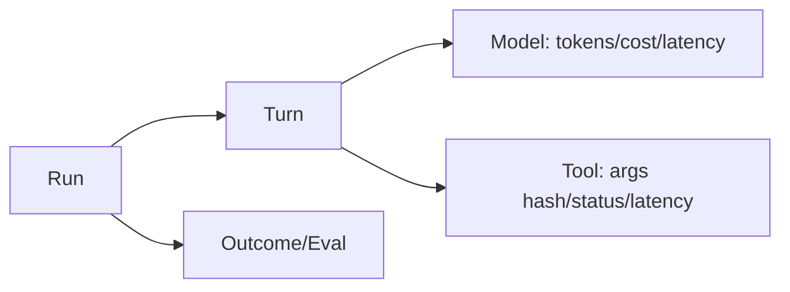
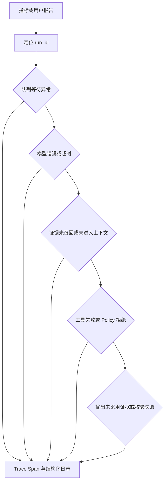
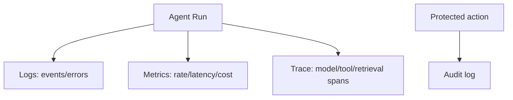
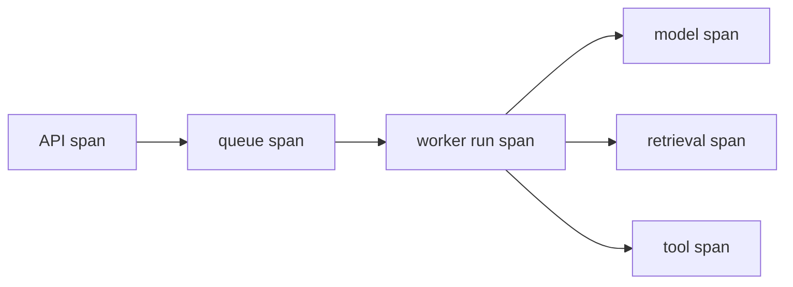
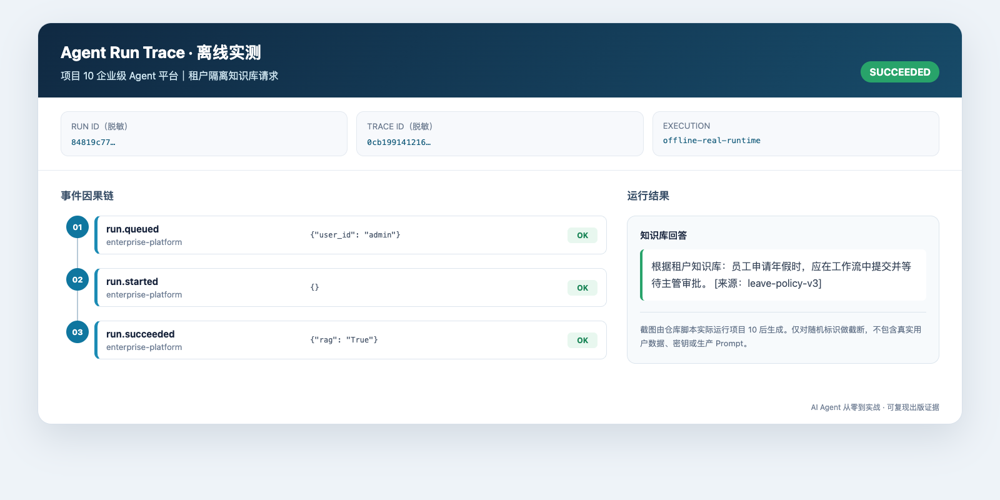

# 第28章：Observability

最后核对日期：2026-07-11。

## 导读、目标与前置知识
本章用日志、Metrics 和 Trace 解释 Agent 的质量、成本和延迟，覆盖 Token、Tool、Prompt、OpenTelemetry、线上调试和隐私脱敏。

学习目标是构建核心观测示例，并能从一次失败 run 定位模型、工具或检索问题。前置知识为第17、23章。

## 观测模型

一次 Agent Run 会跨越模型、工具和评估步骤。主图以 Trace 层级连接这些事件，并为成本和延迟归因提供共同标识。



日志描述事件，指标用于聚合告警，Trace 连接因果路径。三者共享 run、tenant、task、model 和 prompt 版本，但不把高基数字段塞入 Metrics。



排障从异常 Run 的因果链开始，不从全量 Prompt 日志搜索开始。字段白名单和短期受控捕获可以兼顾诊断与隐私。

## 最小与完整工程
最小 Trace 记录每轮开始结束。工程版采用 OpenTelemetry 语义、成本表版本、首 Token/总延迟、工具错误分类、检索候选与评估结果；Langfuse 等平台作为后端而非业务依赖。

## 误区、调试、实践与安全
不要默认记录完整 Prompt、秘密或 PII；不要只看平均延迟；不要用 Trace 代替审计。采用采样、字段 allowlist、脱敏和保留期。线上调试先定位异常 run，再重放脱敏输入到隔离环境。

## 总结、练习、面试与阅读

### Logs、Metrics、Traces 的分工

日志是离散事件，适合调查具体错误；Metrics 是时间序列聚合，适合趋势与告警；Trace 记录一次请求跨组件的因果路径。三者通过 trace_id/run_id 关联。Audit Log 则记录主体对受保护资源的动作，具有独立保留和完整性要求。



四类记录共享关联 ID，但保留期、完整性和访问权限不同。Trace 可采样，关键安全审计通常不能随意采样。

### 结构化日志

事件名稳定，如 `run.started`、`model.completed`、`tool.failed`。字段包含 timestamp、service、environment、run、turn、tenant、model、tool、duration、status 和 error_code。不要把整段 Prompt 塞进 `message`；正文按受控 debug capture 存储并有短保留。

```python
logger.info(
    "tool.completed",
    extra={
        "run_id": run_id,
        "tool": tool_name,
        "duration_ms": duration_ms,
        "result_bytes": result_bytes,
        "status": "ok",
    },
)
```

Python 标准 logging 可通过 formatter 输出 JSON。异常只在边界记录一次 stack，内部层追加 context 后继续抛出，避免重复十条错误。

### Metrics、Token 与 Cost

核心 Metrics 包括 run 吞吐、任务成功、P50/P95/P99、首 Token、模型与工具错误、重试、队列年龄、Token、费用和预算拒绝。Label 不使用 run_id、用户 ID、Prompt 等高基数字段；它们进 Trace/日志。

Usage 根据供应商响应记录输入、输出、缓存与特殊计算项。Cost 通过带生效时间的价格表计算，结果携带 currency 和 pricing_version。核心业务指标是 cost per successful task，而不是平均单次模型调用费用。

### Trace 与 Span 设计

根 span 是 run，子 span 包含 context build、model、tool、retrieval、guardrail、handoff、checkpoint 和 approval。Span attribute 保存模型别名、结束原因、Token 数、工具名和状态，不保存 Secret。并行工具各自成为兄弟 span。

OpenTelemetry 提供跨服务传播与 vendor-neutral 协议。Langfuse、LangSmith、Logfire 或自建后端可作为 processor/exporter；业务代码依赖 OTel 接口而不是到处调用厂商 SDK。采样保留所有错误/高风险 run，并对成功流量比例采样。



队列消息只传播 trace context 与 run ID，不携带敏感正文。每个 Adapter 记录稳定属性，后端平台可替换而不修改业务语义。

### 一次真实离线 Trace 的阅读方法



图 28-5 不是观测平台的概念稿，而是运行项目 10 的 SQLite 离线实现后，由 `scripts/build_trace_screenshot.py` 将实际 `TraceRecord` 记录渲染成的界面截图。随机 Run ID 与 Trace ID 仅保留前缀，教材仓库没有写入真实用户数据或生产 Prompt；可复核的规范化事件保存在 `notes/trace-sample.json`。这条短链展示 `run.queued`、`run.started` 和 `run.succeeded` 的顺序，适合验证租户隔离、队列恢复和最终结果。真实生产系统还应把模型、检索、工具与审批拆成子 Span，并记录可靠时钟下的耗时，不能从这三个事件推断供应商延迟。

### Prompt、Tool 与 Retrieval Trace

Prompt Trace 记录模板版本、变量来源、Token 数和内容哈希；仅在受控环境保存脱敏正文。Tool Trace 记录候选、Policy 判定、参数摘要、执行、重试与结果。Retrieval Trace 保存过滤、候选 ID、各阶段分数和进入上下文的片段 ID。

这种分解能回答“模型没看到证据”“看到但没采用”“工具返回错误”“Policy 拒绝”中的哪一种。只有最终回答日志无法定位。

### Error Analysis 与线上调试

错误 taxonomy 与异常 code 一致。Dashboard 从任务成功下钻到模型、工具、检索和队列；告警基于 SLO 燃尽率而非每个单次 500。线上调试先找失败 run，查看 Trace 与版本，再用脱敏输入在隔离环境重放。重放写工具必须禁用或使用 Fake。

每周聚类高频失败，加入黄金集和工程 backlog。没有转化为测试的临时排查经验会重复发生。

### 隐私、脱敏与保留

采用字段 allowlist：默认不记录内容，必要字段明确允许。PII 使用 tokenization/哈希时要理解可重识别风险；访问 Trace 需要最小权限和审计。不同数据类型设置保留期和删除传播。生产禁止把 Authorization header、Cookie、API Key、完整数据库 URI 写入 span。

### 常见误区、测试与工程实践

常见误区：只装一个平台就可观测、平均延迟代表体验、Trace 可以替代审计、先全量采集以后再脱敏。测试日志字段、Trace parent、敏感信息扫描、Usage/Cost 计算和 exporter 故障；观测后端不可用时业务应降级而非停止核心任务。
总结：可观测性必须能解释质量、成本和失败路径，同时尊重隐私。练习：为 Tool Loop 加 span、P95 和敏感字段测试。面试：Trace 和 Audit Log 区别？Token 成本如何与任务成功关联？为什么 Metrics 不应带 run_id？延伸阅读：OpenTelemetry、所选观测平台和隐私日志规范。代码目录：项目10。

## 本章引用
<!-- chapter-citations:start -->
以下资料用于支撑本章的核心原理、工程边界与版本敏感说明：

- [otel-spec：OpenTelemetry Specification](../references.md#ref-otel-spec)
- [w3c-trace-context：Trace Context](../references.md#ref-w3c-trace-context)
- [openai-data-controls：Data Controls in the OpenAI Platform](../references.md#ref-openai-data-controls)
<!-- chapter-citations:end -->
