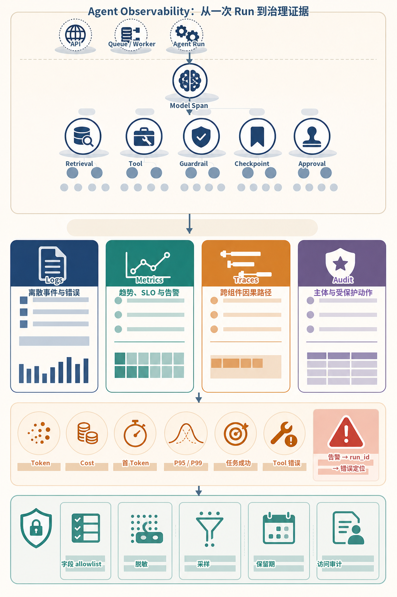
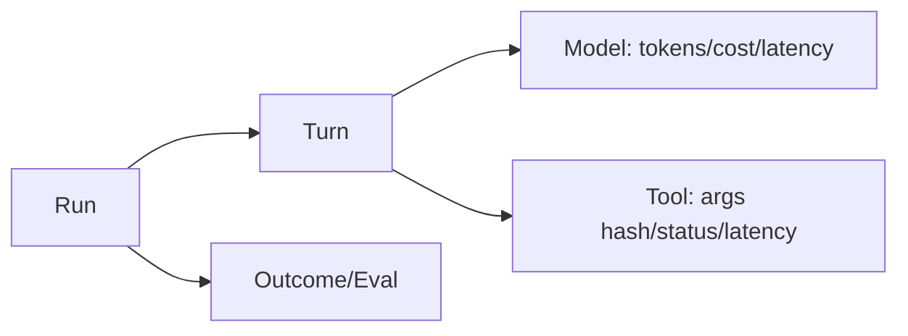
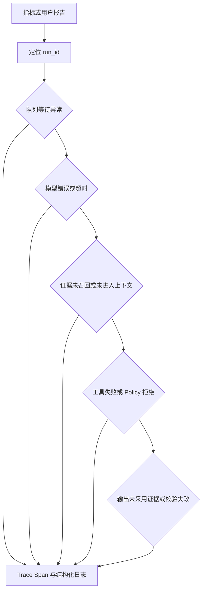
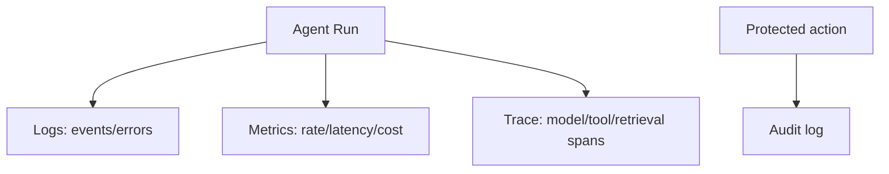
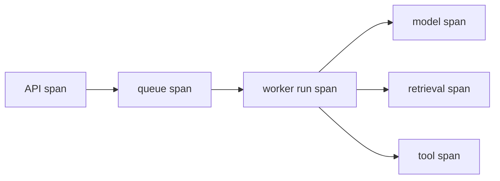
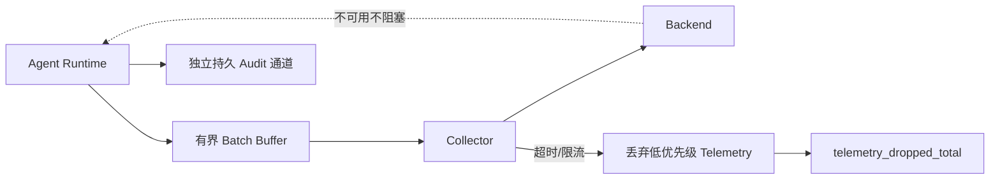

# 第28章：Observability

最后核对日期：2026-07-11。

## 导读、目标与前置知识
本章用日志、Metrics 和 Trace 解释 Agent 的质量、成本和延迟，覆盖 Token、Tool、Prompt、OpenTelemetry、线上调试和隐私脱敏。

学习目标是构建核心观测示例，并能从一次失败 run 定位模型、工具或检索问题。前置知识为第17、23章。

## 观测模型

一次 Agent Run 会跨越模型、工具和评估步骤。主图以 Trace 层级连接这些事件，并为成本和延迟归因提供共同标识。

下面的信息图从一次 Run 的因果树展开：API、队列与 Worker 把 Trace Context 传给模型、检索、工具、策略、Checkpoint 和审批 Span；中部四类记录分别回答“发生了什么”“整体是否异常”“异常沿哪条路径传播”和“谁对受保护资源做了什么”；底部指标与隐私边界共同约束采集和排障。



*图 28-A：Agent Observability 从一次 Run 到治理证据。四类记录可以共享关联 ID，但采样、保留期、访问权限和完整性要求不同；Trace 不能替代安全审计。*

图 28-A 的错误定位从告警进入 `run_id`，再沿 Trace 查看具体 Span，而不是先搜索全量 Prompt。正文内容默认不进入普通日志或 Metrics；确需调试时，应使用字段 allowlist、脱敏、受控采样、短保留期和访问审计。



日志描述事件，指标用于聚合告警，Trace 连接因果路径。三者共享 run、tenant、task、model 和 prompt 版本，但不把高基数字段塞入 Metrics。



排障从异常 Run 的因果链开始，不从全量 Prompt 日志搜索开始。字段白名单和短期受控捕获可以兼顾诊断与隐私。

## 最小与完整工程
最小 Trace 记录每轮开始结束。工程版采用 OpenTelemetry 语义、成本表版本、首 Token/总延迟、工具错误分类、检索候选与评估结果；Langfuse 等平台作为后端而非业务依赖。

## 误区、调试、实践与安全
不要默认记录完整 Prompt、秘密或 PII；不要只看平均延迟；不要用 Trace 代替审计。采用采样、字段 allowlist、脱敏和保留期。线上调试先定位异常 run，再重放脱敏输入到隔离环境。

## 总结、练习、面试与阅读

### Logs、Metrics、Traces 的分工

日志是离散事件，适合调查具体错误；Metrics 是时间序列聚合，适合趋势与告警；Trace 记录一次请求跨组件的因果路径。三者通过 trace_id/run_id 关联。Audit Log 则记录主体对受保护资源的动作，具有独立保留和完整性要求。



四类记录共享关联 ID，但保留期、完整性和访问权限不同。Trace 可采样，关键安全审计通常不能随意采样。

### 结构化日志

事件名稳定，如 `run.started`、`model.completed`、`tool.failed`。字段包含 timestamp、service、environment、run、turn、tenant、model、tool、duration、status 和 error_code。不要把整段 Prompt 塞进 `message`；正文按受控 debug capture 存储并有短保留。

```python
logger.info(
    "tool.completed",
    extra={
        "run_id": run_id,
        "tool": tool_name,
        "duration_ms": duration_ms,
        "result_bytes": result_bytes,
        "status": "ok",
    },
)
```

Python 标准 logging 可通过 formatter 输出 JSON。异常只在边界记录一次 stack，内部层追加 context 后继续抛出，避免重复十条错误。

### Metrics、Token 与 Cost

核心 Metrics 包括 run 吞吐、任务成功、P50/P95/P99、首 Token、模型与工具错误、重试、队列年龄、Token、费用和预算拒绝。Label 不使用 run_id、用户 ID、Prompt 等高基数字段；它们进 Trace/日志。

Usage 根据供应商响应记录输入、输出、缓存与特殊计算项。Cost 通过带生效时间的价格表计算，结果携带 currency 和 pricing_version。核心业务指标是 cost per successful task，而不是平均单次模型调用费用。

### Trace 与 Span 设计

根 span 是 run，子 span 包含 context build、model、tool、retrieval、guardrail、handoff、checkpoint 和 approval。Span attribute 保存模型别名、结束原因、Token 数、工具名和状态，不保存 Secret。并行工具各自成为兄弟 span。

OpenTelemetry 提供跨服务传播与 vendor-neutral 协议。Langfuse、LangSmith、Logfire 或自建后端可作为 processor/exporter；业务代码依赖 OTel 接口而不是到处调用厂商 SDK。采样保留所有错误/高风险 run，并对成功流量比例采样。



队列消息只传播 trace context 与 run ID，不携带敏感正文。每个 Adapter 记录稳定属性，后端平台可替换而不修改业务语义。

### 一次真实离线 Trace 的阅读方法


图 28-5 不是观测平台的概念稿，而是运行项目 10 的 SQLite 离线实现后，由 `scripts/build_trace_screenshot.py` 将实际 `TraceRecord` 记录渲染成的界面截图。随机 Run ID 与 Trace ID 仅保留前缀，教材仓库没有写入真实用户数据或生产 Prompt；可复核的规范化事件保存在 `notes/trace-sample.json`。这条短链展示 `run.queued`、`run.started` 和 `run.succeeded` 的顺序，适合验证租户隔离、队列恢复和最终结果。真实生产系统还应把模型、检索、工具与审批拆成子 Span，并记录可靠时钟下的耗时，不能从这三个事件推断供应商延迟。

### Prompt、Tool 与 Retrieval Trace

Prompt Trace 记录模板版本、变量来源、Token 数和内容哈希；仅在受控环境保存脱敏正文。Tool Trace 记录候选、Policy 判定、参数摘要、执行、重试与结果。Retrieval Trace 保存过滤、候选 ID、各阶段分数和进入上下文的片段 ID。

这种分解能回答“模型没看到证据”“看到但没采用”“工具返回错误”“Policy 拒绝”中的哪一种。只有最终回答日志无法定位。

### Error Analysis 与线上调试

错误 taxonomy 与异常 code 一致。Dashboard 从任务成功下钻到模型、工具、检索和队列；告警基于 SLO 燃尽率而非每个单次 500。线上调试先找失败 run，查看 Trace 与版本，再用脱敏输入在隔离环境重放。重放写工具必须禁用或使用 Fake。

每周聚类高频失败，加入黄金集和工程 backlog。没有转化为测试的临时排查经验会重复发生。

### 从用户目标定义 SLI 与 SLO

基础设施可用不等于 Agent 成功。健康检查 100% 正常时，回答仍可能没有引用、Tool 参数错误或因预算
提前终止。可操作的 SLI 至少分四层：

| 层次 | SLI 示例 | 事件边界 |
|---|---|---|
| 入口 | 有效请求率、创建 Run 延迟 | 认证后进入到持久 Run 创建 |
| 执行 | 队列年龄、完成率、P95/P99 | queued 到终态，排除等待人工的定义要明确 |
| 能力 | Tool 成功率、Retrieval Recall、引用完整率 | 按版本化黄金集或真实结果核对 |
| 用户结果 | Task Success、单位成功成本 | 由明确 Rubric、业务确认或人工评价判定 |

例如“30 分钟窗口内，非用户取消且无需人工审批的 Run 中，99% 在 60 秒内进入成功终态”才是可计算
目标。分母、排除项、时间窗口和成功定义都必须固定。平均延迟和模型 API 成功率不能替代端到端 SLO。

错误预算为 `1 - SLO`。告警优先使用多窗口燃尽率：短窗口快速发现事故，长窗口避免瞬时噪声。
高延迟但最终成功、低质量回答和权限拒绝应进入不同 SLI，不能全部合成一个不可解释的“成功率”。

```text
task_success_rate = successful_tasks / eligible_tasks
cost_per_success = total_attributed_cost / successful_tasks
queue_wait_ms = run_started_at - run_created_at
time_to_first_event_ms = first_visible_event_at - request_accepted_at
```

若成功数为零，单位成功成本应报告为未定义/无穷而不是 0。价格必须带币种、地区、生效时间和
Pricing Version；历史成本重算时保留原版本，避免仪表盘随今天的价格悄悄改变过去。

### Span 状态、事件与链接

Span 名称保持低基数，例如 `agent.run`、`model.generate`、`tool.execute`，具体模型和工具放 Attribute。
异常不一定等于 Span Error：Guardrail 按设计拒绝、缓存未命中或用户取消可以是正常业务结果；网络
超时、Schema 破坏和未处理异常才标记 Error。否则错误率会被正常控制流污染。

同步子调用使用 Parent/Child；队列生产与消费跨时间或 Fan-out 时，可用 Trace Context 传播，并在
必要处用 Span Link 表达因果。重试 Attempt 各自建 Span，共享 Logical Call ID；这样既能看到物理
调用次数，也能计算重试放大。Handoff、审批暂停和恢复要保留 Run ID，即使新进程创建了新的 Trace。

```python
with tracer.start_as_current_span("tool.execute") as span:
    span.set_attribute("tool.name", tool_name)
    span.set_attribute("tool.attempt", attempt)
    span.set_attribute("tool.logical_call_id", logical_call_id)
    try:
        result = await adapter.execute(request, timeout=timeout)
    except TimeoutError as exc:
        span.record_exception(exc)
        span.set_status(Status(StatusCode.ERROR, "tool_timeout"))
        raise
```

代码仅示范 OTel Span 语义；实际导入与版本按当前 OpenTelemetry Python 官方文档核对。不要把
`request`、Authorization 或完整结果作为 Attribute。参数 Schema Version、摘要哈希、字节数和安全
错误码通常足以定位控制问题。

### 采样不会自动保持统计真相

Head Sampling 在请求开始时决定，成本低但不知道最终是否失败；Tail Sampling 可保留错误、高延迟和
高风险 Trace，却需要 Collector 缓冲与决策资源。常见策略是保留全部安全审计、错误和高风险动作，
成功 Run 按低比例采样；Metrics 独立聚合，不从已偏置的 Trace 样本直接估计总体成功率。

调试采样必须有过期时间、责任人和访问审计。若因事故临时提高内容捕获，恢复后自动回落；不能把
“先全量记录再清理”当默认方案。采样规则本身版本化并进入 Trace Resource，便于解释为什么某条链
路不存在。

### Telemetry 管线也会失败

Exporter 超时、Collector 背压或后端限额不应阻塞核心 Agent。SDK 使用有界队列和 Batch Export，
达到上限时丢弃低优先级 Telemetry 并递增自监控计数；关键 Audit 走独立持久通道。应用退出时给出
有限 Flush Deadline，不能无限等待观测后端。



这张图强调观测系统是生产依赖但不是核心业务事务参与者。若审计写入是合规前置条件，则应明确采用
Fail Closed 或本地持久缓冲；它与可采样 Trace 的降级策略不同。

### 隐私脱敏是数据流设计

Regex 脱敏无法覆盖任意自然语言中的 PII。更可靠做法是在产生 Telemetry 前按字段 Allowlist 建模：
内容默认不采集，必要调试正文进入独立加密存储，Trace 只持引用。租户、环境和数据分类决定访问、
保留与地域；删除请求沿日志、Trace Debug Capture 和导出传播。

哈希并非匿名化：低熵邮箱、手机号可被字典反推，稳定哈希还会形成跨事件追踪标识。需要关联时使用
租户范围的 Keyed Token，并轮换密钥；不需要关联则直接删除。Secret 扫描在单元测试、Collector
Processor 和发行审计多层执行。

### 与项目 10 证据的对应与局限

项目 10 的 `traces` 表和 `/runs/{run_id}/traces` 保留租户限定事件，`/metrics` 只向管理员暴露低基数
Run 与 DLQ 数；`notes/trace-sample.json` 和截图来自实际离线运行。它们证明事件顺序、租户隔离和
可复核展示链路，但当前实现不是完整 OpenTelemetry Span 树，也没有真实模型 Token、尾延迟直方图、
Collector 故障注入或生产价格表。

因此教材把该样本称为“离线 Trace 事件证据”，不把三条事件宣称为生产可观测性完成。完整验收应在
多服务环境传播 W3C Trace Context，验证并行 Tool、Retry、Queue Link、采样、脱敏和 Exporter 降级。

### 隐私、脱敏与保留

采用字段 allowlist：默认不记录内容，必要字段明确允许。PII 使用 tokenization/哈希时要理解可重识别风险；访问 Trace 需要最小权限和审计。不同数据类型设置保留期和删除传播。生产禁止把 Authorization header、Cookie、API Key、完整数据库 URI 写入 span。

### 常见误区、测试与工程实践

常见误区：只装一个平台就可观测、平均延迟代表体验、Trace 可以替代审计、先全量采集以后再脱敏。测试日志字段、Trace parent、敏感信息扫描、Usage/Cost 计算和 exporter 故障；观测后端不可用时业务应降级而非停止核心任务。

### 练习参考答案与面试要点

1. **Tool Loop Span。** 根 Run 下每次逻辑工具调用建父 Span，每个物理 Attempt 建子 Span；记录工具名、
   Attempt、耗时、错误码和参数哈希，不记录 Secret。并行调用是兄弟 Span。
2. **P95 测试。** 固定窗口和样本定义，使用直方图或可合并分布；分别观察队列、首事件和总时长。
   三个样本算出的 P95 只适合代码测试，不足以作生产 SLO 结论。
3. **敏感字段测试。** 构造 Authorization、Cookie、邮箱、数据库 URI 与 Prompt Fixture，断言日志、
   Span 和 Metrics 均无原文；Debug Capture 需要显式权限和短 TTL。
4. **面试要点。** Trace 可采样并解释因果，Audit 记录受保护动作且强调完整性；成本按 Run 归因后
   除以成功任务数；Metrics Label 不能带 Run ID，因为高基数会造成存储与查询爆炸。

总结：可观测性必须用明确 SLI 解释质量、成本和失败路径，同时尊重隐私并能在后端故障时安全降级。
延伸阅读包括 OpenTelemetry、W3C Trace Context、所选观测平台和隐私日志规范；代码目录为
[`projects/10-enterprise-platform/`](https://github.com/wujinjun/ai-agent-book/tree/main/projects/10-enterprise-platform)。

## 本章引用
<!-- chapter-citations:start -->
以下资料用于支撑本章的核心原理、工程边界与版本敏感说明：

- [otel-spec：OpenTelemetry Specification](../references.md#ref-otel-spec)
- [w3c-trace-context：Trace Context](../references.md#ref-w3c-trace-context)
- [openai-data-controls：Data Controls in the OpenAI Platform](../references.md#ref-openai-data-controls)
<!-- chapter-citations:end -->
