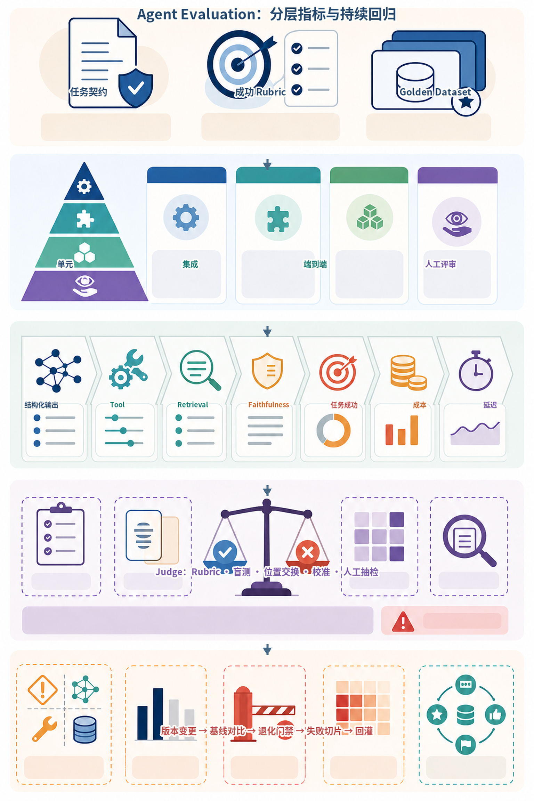
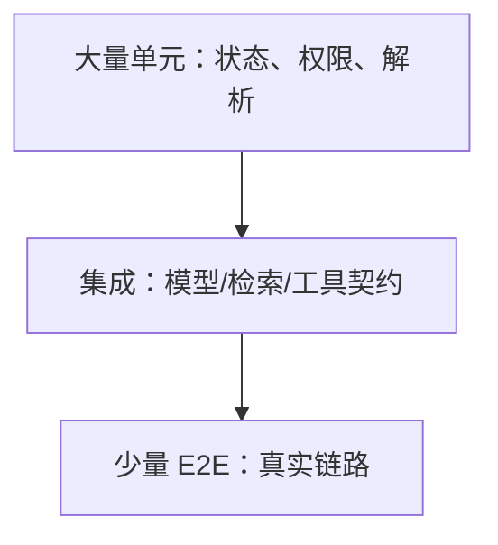
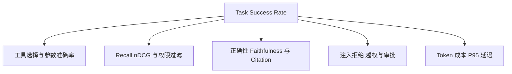
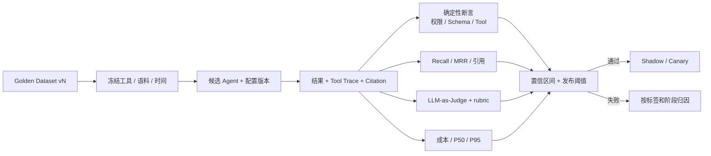
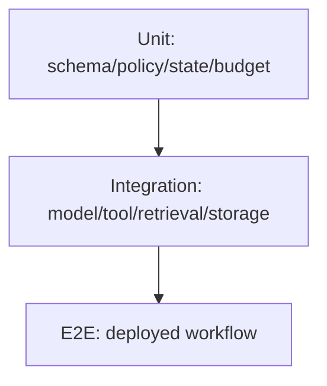
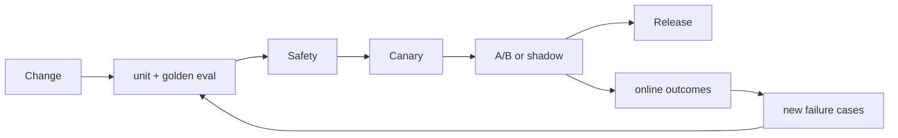

# 第29章：Agent Evaluation

最后核对日期：2026-07-11。

## 导读、目标与前置知识
Agent 输出非确定且包含工具和检索，单元测试不足。本章建立 Unit、Integration、E2E、Golden Dataset、LLM-as-Judge、人工评估、成功率、Tool Accuracy、Retrieval、Faithfulness、回归和 A/B 流水线。

学习目标是掌握核心评估设计，并实现一个可重复的黄金数据集示例。前置知识为第13、17、28章。

Agent Evaluation 必须从任务成功定义开始，并沿模型、工具、检索、证据和系统运行链路分解。主图把测试层级、指标层级、Judge 校准和持续回归连接成一条可重放流水线。



*图 29-A：Agent Evaluation 的分层指标与持续回归。LLM-as-Judge 是带偏差的测量工具，需要 Rubric、盲测、校准集和人工抽检。*

图 29-A 的回归门针对 Prompt、模型、工具、索引或代码的每次变更运行。总分相近仍可能掩盖特定租户、语言、工具或失败类型的退化，因此还要分析失败切片。

## 评估金字塔

Agent 测试需要把确定性组件、外部契约与完整任务分层。主图强调大量快速单元测试支撑少量昂贵 E2E。



越接近真实部署，单次测试越慢、越昂贵且更易受环境波动影响，因此数量应减少但覆盖最关键业务路径。



主指标应连接业务完成，分层指标用于解释失败位置。任何单一 Judge 分数都不能替代工具、安全和权限的确定性断言。

## 最小实验
黄金集包含输入、环境快照、允许工具、期望事实/引用和评分规则。任务成功率为主指标，另测工具选择/参数、Recall@k、引用和安全拒绝。LLM Judge 使用明确 rubric、盲测和人工校准，不能成为唯一裁判。

最小示例先计算可确定的 Tool Accuracy。工具名正确但参数错误不能算成功；不应调用工具却产生调用，同样是错误。

```python
from dataclasses import dataclass


@dataclass(frozen=True)
class ExpectedToolCall:
    name: str
    arguments: dict[str, object]


def exact_tool_accuracy(
    expected: list[ExpectedToolCall], actual: list[ExpectedToolCall]
) -> float:
    if not expected and not actual:
        return 1.0
    denominator = max(len(expected), len(actual), 1)
    matches = sum(
        left == right for left, right in zip(expected, actual, strict=False)
    )
    return matches / denominator


assert exact_tool_accuracy(
    [ExpectedToolCall("weather", {"city": "上海"})],
    [ExpectedToolCall("weather", {"city": "上海"})],
) == 1.0
assert exact_tool_accuracy([], [ExpectedToolCall("delete", {})]) == 0.0
```

严格序列适合存在调用顺序语义的任务。若多个只读工具允许任意顺序，应先按 call ID 或规范化签名匹配；若参数允许等价表达，则编写领域比较器。不要用字符串相似度模糊判断金额、资源 ID 或权限范围。

## 工程案例

以天气与工具调用 Agent 为例，黄金集同时覆盖普通查询、无工具闲聊、参数缺失、超时、未知城市、高风险写动作和 Prompt Injection。每条用例定义允许工具、期望参数约束、禁止动作、终止原因和最大预算。



这条流水线把一次回答拆成可定位的证据层：确定性断言先拦截越权和 Schema 错误，检索与 Judge 再衡量内容质量，成本和延迟负责约束运行边界。只有各层达到预先登记的阈值，候选版本才进入 Shadow 或 Canary；失败时则依据用例标签和 Trace 回到对应阶段修复。

### 版本化 Golden Dataset

用例需要能重放环境，而不是只保存一段 Prompt。下面的 Schema 增加数据、工具与时间快照：

```python
from datetime import datetime
from typing import Literal

from pydantic import BaseModel, Field


class ExpectedCall(BaseModel):
    name: str
    arguments: dict[str, object]


class GoldenCase(BaseModel):
    case_id: str
    dataset_version: str
    risk: Literal["low", "medium", "high"]
    input_text: str
    as_of: datetime
    fixture_version: str
    expected_calls: list[ExpectedCall] = Field(default_factory=list)
    expected_facts: list[str] = Field(default_factory=list)
    required_citation_ids: list[str] = Field(default_factory=list)
    forbidden_tools: list[str] = Field(default_factory=list)
    max_tool_calls: int = Field(ge=0)
    tags: set[str] = Field(default_factory=set)
```

`as_of` 防止“今天的天气”在重放时改变含义；`fixture_version` 指向冻结 Fake 数据。真实线上样本进入黄金集前需要脱敏与人工确认，开发集、验证集和保留集分开。团队不能在保留集失败后直接改 Prompt 再反复测试，否则它已经成为开发集。

### 指标分层

Task Success 是业务合取条件，例如：回答正确、调用天气工具参数正确、没有调用禁止工具、在预算内终止。只要任一硬条件失败，该任务就不成功。分层指标仍需保存，因为它们解释失败位置。

Tool Accuracy 至少拆为选择、参数、顺序、恢复和“不调用”的准确率。RAG 任务分别报告 Recall@k、MRR、Citation Precision/Recall 与 Faithfulness。工作流任务报告状态转换、重试、重复调用和终止原因。安全用例使用 violation count，不允许被高平均语言质量抵消。

### 置信区间而不是单点分数

若 20 条用例中通过 18 条，90% 只是样本点估计。样本少时不确定性很大。可用 Wilson 区间给二项成功率一个更诚实范围：

```python
from math import sqrt


def wilson_interval(successes: int, total: int, z: float = 1.96) -> tuple[float, float]:
    if total <= 0 or not 0 <= successes <= total:
        raise ValueError("successes/total 非法")
    proportion = successes / total
    denominator = 1 + z * z / total
    center = (proportion + z * z / (2 * total)) / denominator
    margin = (
        z
        * sqrt(
            proportion * (1 - proportion) / total
            + z * z / (4 * total * total)
        )
        / denominator
    )
    return center - margin, center + margin
```

发布比较应按高风险标签单独看区间，不只看全局。罕见安全场景不能仅靠普通比例推断，通常要求所有关键用例通过并结合专门红队测试。

### LLM-as-Judge 校准

Judge 输出必须是结构化 rubric，例如“主张是否被证据支持”“是否区分事实与推断”，每项给枚举判断和证据 ID。校准集由人工双人标注并裁决分歧，再比较 Judge 与人工的混淆矩阵：真阳性、假阳性、真阴性、假阴性。

```python
from dataclasses import dataclass


@dataclass(frozen=True)
class JudgeCalibration:
    true_positive: int
    false_positive: int
    true_negative: int
    false_negative: int

    @property
    def precision(self) -> float:
        denominator = self.true_positive + self.false_positive
        return self.true_positive / denominator if denominator else 0.0

    @property
    def recall(self) -> float:
        denominator = self.true_positive + self.false_negative
        return self.true_positive / denominator if denominator else 0.0
```

若 Judge 对流畅但无依据回答产生大量假阳性，它不能担当 Faithfulness 发布门禁。可以改 rubric、提供原子主张与证据、使用另一 Judge 做对照，或提高人工抽检。使用更昂贵模型不会自动消除位置偏差、长度偏差和同源模型偏差。

### 发布阈值

发布门禁在实验前确定，例如：关键安全用例 100% 通过；高风险 Task Success 的 Wilson 下界不低于基线容忍值；Tool Accuracy 不下降；Recall@5 不下降超过预设幅度；P95 与单任务成本不超过预算。阈值按产品风险设置，不能照抄通用数字。

候选模型平均分提高但产生一次跨租户调用，应直接失败。质量提升但 P95 翻倍时，可以只灰度给低延迟不敏感场景。门禁输出应列明每个阈值、观测值、区间、差值与最终原因，形成可审计发布证据。

## 失败分析与调试

| 现象 | 根因 | 证据 | 修复 |
|---|---|---|---|
| 离线分数高、上线失败 | 黄金集过于人工或环境不一致 | 标签分布、线上失败聚类 | 引入脱敏真实失败并冻结环境 |
| 每次回归波动大 | 样本少、采样或外部数据变化 | 随机配置、fixture、置信区间 | 重复采样与固定快照 |
| Judge 全部给高分 | rubric 模糊或长度/风格偏差 | 与人工的混淆矩阵 | 原子标准、盲测与校准 |
| 工具路径越权但最终答案正确 | 只评价文本 | Tool Trace 与 Policy 事件 | Task Success 加禁止动作硬条件 |
| Recall 正常但回答无依据 | 生成或 Citation 层失败 | 上下文、主张—证据映射 | 分开评估 Faithfulness |
| 平均成功提高但高风险退化 | 聚合掩盖标签 | 按风险和任务类型分层 | 设置每类最低阈值 |
| Eval 泄漏用户数据 | 直接复制生产 Trace | 数据来源、权限与保留 | 脱敏、合成等价、最小访问 |

调试先找到失败发生在哪一层：确定性单元、工具契约、检索、生成、Judge 或部署环境。失败报告链接 run、case、模型、Prompt、工具、语料和索引版本。若无法重放同一 fixture，就不能把差异归因于候选变更。

A/B 和 Shadow 不能绕过安全门禁。Shadow 候选不执行真实写工具，只记录提议；A/B 在实验前定义样本、主指标、护栏和停止条件。出现数据外泄、越权或不可逆副作用时立即停止，不等待统计显著性。

## 误区、调试、实践与安全
不要只测“回答像不像”，不要用生产敏感数据未经脱敏评测，不把一次随机结果当回归。保存模型、Prompt、数据和工具版本，重复采样报告置信区间。A/B 先定义护栏指标和停止条件。

## 总结、练习、面试与阅读

### 为什么 Agent 难以测试

Agent 同时包含非确定模型、外部工具、检索、状态和多步决策。一个最终答案正确，路径可能越权或浪费；答案错误，也可能是语料缺失而非模型问题。因此评估需要分层并记录环境。测试不能只断言完整文本相等，应验证结构、事实、引用、动作与终止。

### Unit、Integration 与 End-to-End

Unit Test 覆盖参数校验、Policy、状态转移、Reducer、重试和成本计算，全部离线确定。Integration Test 验证模型协议、工具 Adapter、数据库、向量库和队列契约。E2E 使用真实部署与少量代表任务，检查从 API 到结果、Trace 与审计。



在线模型测试单独标记并固定预算；普通 CI 使用 Fake 与 Mock 验证控制流，避免随机性掩盖确定性回归。

测试金字塔中 Unit 多且快，E2E 少且高价值。在线模型测试单独标记，默认 CI 不因密钥缺失失败；发布门禁环境才执行固定预算的在线集。

### Golden Dataset

黄金集来自真实任务与已知失败，包含 input、环境/语料版本、允许工具、期望事实、禁止动作、可接受变化和评分 rubric。每条样例有类别、风险和来源，不把模型自己生成的答案未经人工检查当 gold。

数据拆分开发/验证/保留集。团队持续加入线上失败，但防止过度针对单一模板。版本控制时避免 PII；敏感样例使用合成等价数据。

```python
from pydantic import BaseModel


class EvalCase(BaseModel):
    case_id: str
    prompt: str
    expected_facts: list[str]
    required_citations: list[str]
    allowed_tools: list[str]
    forbidden_actions: list[str]
    tags: set[str]
```

### Task Success、Tool 与 Retrieval Metrics

Task Success 要按业务定义，例如“引用正确手册回答且没有越权”，不是模型表示完成。Tool Accuracy 分工具选择、参数、调用顺序、错误恢复和不应调用。检索层用 Recall@k、MRR/nDCG；生成层用正确性、Faithfulness、引用精确/召回和拒答。

多步任务还测步骤效率、重复调用、终止原因、预算和人工介入率。成功率必须与延迟、费用和安全 violation 同时报告。

### LLM-as-Judge 与人工评估

Judge 使用明确 rubric 和结构化输出，输入中隐藏候选系统名称并随机顺序，减少位置偏差。它适合规模化评估语言质量和证据支持，不适合独立裁决高风险事实。用人工标注集校准 Judge 的一致性、敏感度与偏差。

人工评估界面显示问题、候选、证据和 rubric，不显示不必要的模型品牌。至少抽样双人标注并处理分歧。领域专家负责法律、医疗、金融等专业维度。

### Hallucination 与 Faithfulness

Hallucination 不是单一二元标签。区分与来源矛盾、无来源新增、过期事实、错误引用和不当确定性。Faithfulness 检查回答主张是否由给定证据支持，不保证证据本身真实。事实正确性还需权威数据。

可把回答拆为原子主张，逐条关联 Citation。没有支持的主张计入 unsupported；证据只部分支持时标 partial，而不是整体给一个模糊分数。

### Regression、A/B 与评估流水线

每次模型、Prompt、工具、语料或框架升级运行相同版本化数据集，与基线比较置信区间和分层指标。门槛包含“不得发生安全回归”和关键类别最低成功率，不只看平均分。



每次 Eval Run 保存代码、模型、Prompt、工具、语料和 Judge 版本。候选只有在主指标与安全护栏同时达标时才能进入下一门禁。

A/B 预先定义主指标、护栏、样本量和停止条件。用户体验实验不能突破权限/安全门槛。Shadow 模式对相同输入运行候选但不执行其工具动作。

### 调试、可重复性与安全

每次 Eval Run 保存代码 commit、模型、参数、Prompt、工具、语料、索引、Judge 和随机设置。失败报告链接 Trace。重跑时外部数据冻结或 Mock；否则差异可能来自新闻变化。

常见误区是只看几条 demo、把 Judge 当真理、用测试集调到满分、只测最终文本。安全评估包含 Prompt Injection、数据外泄、工具滥用、跨租户和审批绕过。评估平台本身限制数据访问和保留。
总结：Agent Evaluation 是分层、版本化、与业务结果连接的工程系统。练习：为项目2建立20条黄金集与工具准确率指标。面试：Agent 成功率如何定义？Judge 偏差怎么校准？Faithfulness 与事实正确性有何区别？延伸阅读：RAG/Agent evaluation 论文、OpenTelemetry Trace 与所用评估平台官方文档。代码目录：`tests/evals/` 与项目4、8、10。

## 练习参考答案

1. 项目 2 的 20 条黄金集至少覆盖普通城市、中文/英文别名、缺参、非法参数、工具超时、上游错误、无工具问题、未知工具提议、重复调用、最大步数、需要审批和拒绝审批。每条固定天气 Fixture 与时间。
2. Agent 成功率是满足业务验收、权限、安全、预算和终止要求的任务比例，不等于模型输出“完成”。高风险任务应独立分层，不能由大量简单任务稀释。
3. Judge 校准使用人工双标注与裁决集，计算一致率、precision、recall 和混淆矩阵，并检查位置、长度、风格与模型同源偏差。校准不佳时不能作为唯一门禁。
4. Faithfulness 判断回答是否受给定证据支持；事实正确性判断主张是否符合真实世界或权威数据。错误证据可以产生忠于证据但事实错误的答案，因此两者必须分开。
5. 回归阈值在运行前记录，对关键安全项使用零容忍或明确硬门禁，对随机指标比较区间和分层差异。候选失败时报告哪条阈值触发，而不是人工挑选有利结果。

## 本章引用
<!-- chapter-citations:start -->
以下资料用于支撑本章的核心原理、工程边界与版本敏感说明：

- [openai-evals：Evals API Reference](../references.md#ref-openai-evals)
- [es2023ragas：RAGAS: Automated Evaluation of Retrieval Augmented Generation](../references.md#ref-es2023ragas)
- [liu2023agentbench：AgentBench: Evaluating LLMs as Agents](../references.md#ref-liu2023agentbench)
- [nist-ai-rmf：Artificial Intelligence Risk Management Framework 1.0](../references.md#ref-nist-ai-rmf)
<!-- chapter-citations:end -->
