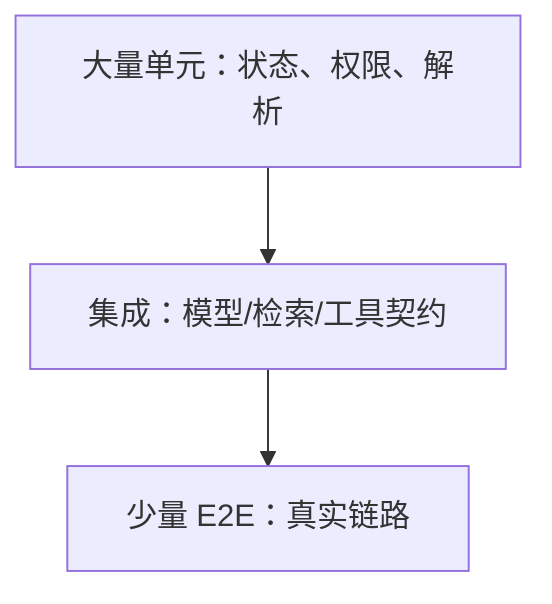
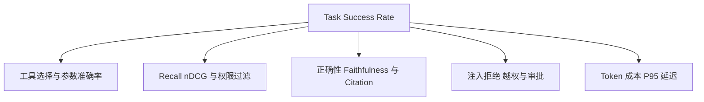
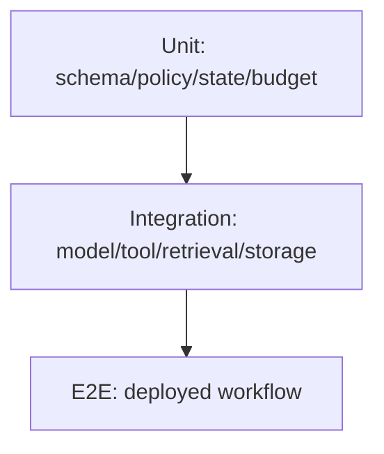
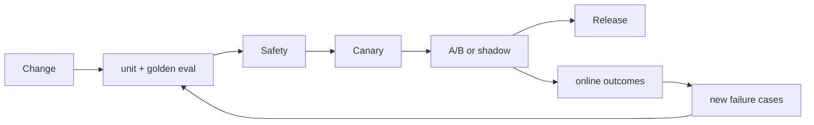

# 第29章：Agent Evaluation

最后核对日期：2026-07-11。

## 导读、目标与前置知识
Agent 输出非确定且包含工具和检索，单元测试不足。本章建立 Unit、Integration、E2E、Golden Dataset、LLM-as-Judge、人工评估、成功率、Tool Accuracy、Retrieval、Faithfulness、回归和 A/B 流水线。

学习目标是掌握核心评估设计，并实现一个可重复的黄金数据集示例。前置知识为第13、17、28章。

## 评估金字塔

Agent 测试需要把确定性组件、外部契约与完整任务分层。主图强调大量快速单元测试支撑少量昂贵 E2E。



越接近真实部署，单次测试越慢、越昂贵且更易受环境波动影响，因此数量应减少但覆盖最关键业务路径。



主指标应连接业务完成，分层指标用于解释失败位置。任何单一 Judge 分数都不能替代工具、安全和权限的确定性断言。

## 最小与完整工程
黄金集包含输入、环境快照、允许工具、期望事实/引用和评分规则。任务成功率为主指标，另测工具选择/参数、Recall@k、引用和安全拒绝。LLM Judge 使用明确 rubric、盲测和人工校准，不能成为唯一裁判。

## 误区、调试、实践与安全
不要只测“回答像不像”，不要用生产敏感数据未经脱敏评测，不把一次随机结果当回归。保存模型、Prompt、数据和工具版本，重复采样报告置信区间。A/B 先定义护栏指标和停止条件。

## 总结、练习、面试与阅读

### 为什么 Agent 难以测试

Agent 同时包含非确定模型、外部工具、检索、状态和多步决策。一个最终答案正确，路径可能越权或浪费；答案错误，也可能是语料缺失而非模型问题。因此评估需要分层并记录环境。测试不能只断言完整文本相等，应验证结构、事实、引用、动作与终止。

### Unit、Integration 与 End-to-End

Unit Test 覆盖参数校验、Policy、状态转移、Reducer、重试和成本计算，全部离线确定。Integration Test 验证模型协议、工具 Adapter、数据库、向量库和队列契约。E2E 使用真实部署与少量代表任务，检查从 API 到结果、Trace 与审计。



在线模型测试单独标记并固定预算；普通 CI 使用 Fake 与 Mock 验证控制流，避免随机性掩盖确定性回归。

测试金字塔中 Unit 多且快，E2E 少且高价值。在线模型测试单独标记，默认 CI 不因密钥缺失失败；发布门禁环境才执行固定预算的在线集。

### Golden Dataset

黄金集来自真实任务与已知失败，包含 input、环境/语料版本、允许工具、期望事实、禁止动作、可接受变化和评分 rubric。每条样例有类别、风险和来源，不把模型自己生成的答案未经人工检查当 gold。

数据拆分开发/验证/保留集。团队持续加入线上失败，但防止过度针对单一模板。版本控制时避免 PII；敏感样例使用合成等价数据。

```python
from pydantic import BaseModel


class EvalCase(BaseModel):
    case_id: str
    prompt: str
    expected_facts: list[str]
    required_citations: list[str]
    allowed_tools: list[str]
    forbidden_actions: list[str]
    tags: set[str]
```

### Task Success、Tool 与 Retrieval Metrics

Task Success 要按业务定义，例如“引用正确手册回答且没有越权”，不是模型表示完成。Tool Accuracy 分工具选择、参数、调用顺序、错误恢复和不应调用。检索层用 Recall@k、MRR/nDCG；生成层用正确性、Faithfulness、引用精确/召回和拒答。

多步任务还测步骤效率、重复调用、终止原因、预算和人工介入率。成功率必须与延迟、费用和安全 violation 同时报告。

### LLM-as-Judge 与人工评估

Judge 使用明确 rubric 和结构化输出，输入中隐藏候选系统名称并随机顺序，减少位置偏差。它适合规模化评估语言质量和证据支持，不适合独立裁决高风险事实。用人工标注集校准 Judge 的一致性、敏感度与偏差。

人工评估界面显示问题、候选、证据和 rubric，不显示不必要的模型品牌。至少抽样双人标注并处理分歧。领域专家负责法律、医疗、金融等专业维度。

### Hallucination 与 Faithfulness

Hallucination 不是单一二元标签。区分与来源矛盾、无来源新增、过期事实、错误引用和不当确定性。Faithfulness 检查回答主张是否由给定证据支持，不保证证据本身真实。事实正确性还需权威数据。

可把回答拆为原子主张，逐条关联 Citation。没有支持的主张计入 unsupported；证据只部分支持时标 partial，而不是整体给一个模糊分数。

### Regression、A/B 与评估流水线

每次模型、Prompt、工具、语料或框架升级运行相同版本化数据集，与基线比较置信区间和分层指标。门槛包含“不得发生安全回归”和关键类别最低成功率，不只看平均分。



每次 Eval Run 保存代码、模型、Prompt、工具、语料和 Judge 版本。候选只有在主指标与安全护栏同时达标时才能进入下一门禁。

A/B 预先定义主指标、护栏、样本量和停止条件。用户体验实验不能突破权限/安全门槛。Shadow 模式对相同输入运行候选但不执行其工具动作。

### 调试、可重复性与安全

每次 Eval Run 保存代码 commit、模型、参数、Prompt、工具、语料、索引、Judge 和随机设置。失败报告链接 Trace。重跑时外部数据冻结或 Mock；否则差异可能来自新闻变化。

常见误区是只看几条 demo、把 Judge 当真理、用测试集调到满分、只测最终文本。安全评估包含 Prompt Injection、数据外泄、工具滥用、跨租户和审批绕过。评估平台本身限制数据访问和保留。
总结：Agent Evaluation 是分层、版本化、与业务结果连接的工程系统。练习：为项目2建立20条黄金集与工具准确率指标。面试：Agent 成功率如何定义？Judge 偏差怎么校准？Faithfulness 与事实正确性有何区别？延伸阅读：RAG/Agent evaluation 论文、OpenTelemetry Trace 与所用评估平台官方文档。代码目录：`tests/evals/` 与项目4、8、10。
