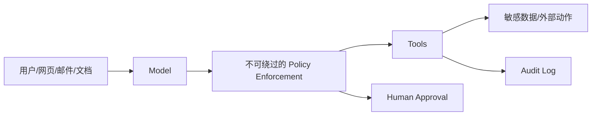
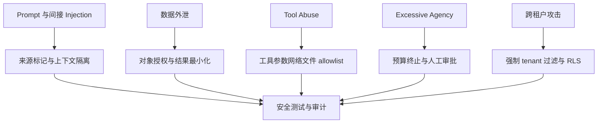
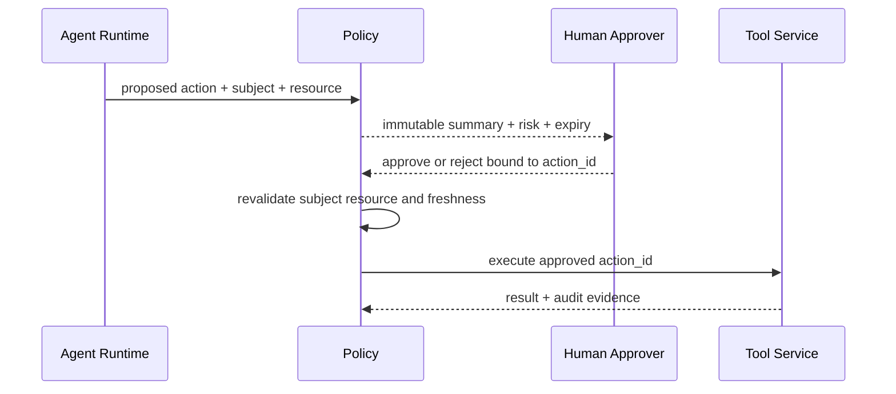
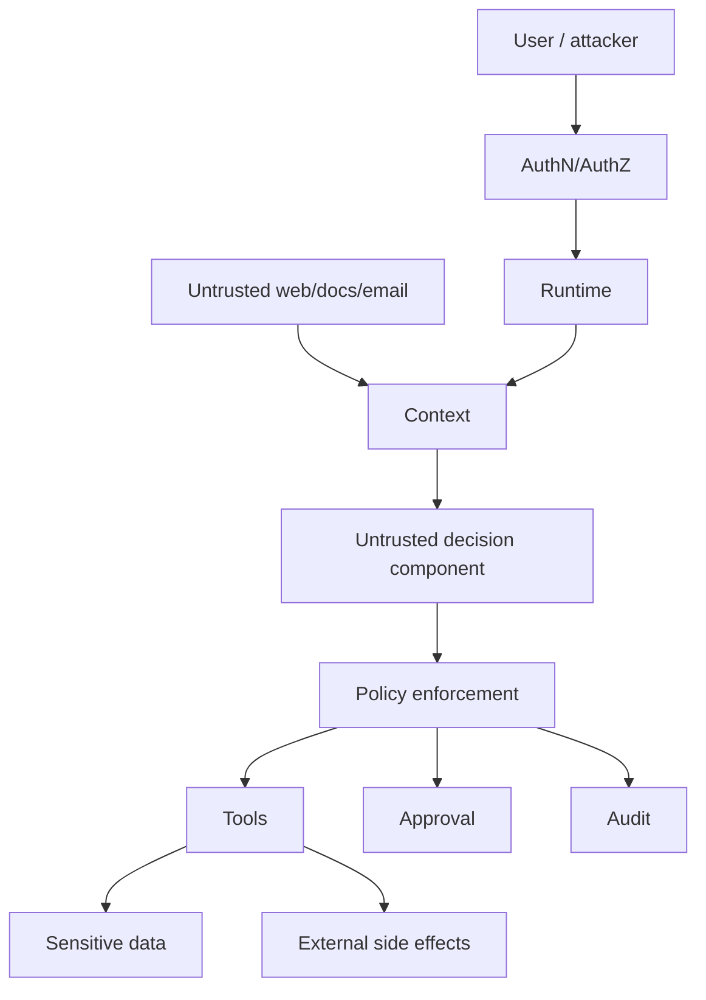

# 第30章：安全与 Guardrails

最后核对日期：2026-07-11。

## 导读、目标与前置知识
本章覆盖 Prompt/Indirect Injection、Data Exfiltration、Tool Abuse、Excessive Agency、权限、allowlist、sandbox、审批、输出验证、内容安全、PII、Secret、审计与威胁建模。

学习目标是理解核心安全边界并为一个工具示例建立威胁模型。前置知识为第8—9、11和23章。

## 威胁模型

Agent 安全的核心是把模型视为不可信决策组件，把不可绕过的 Policy 放在工具和数据前。主图展示最小纵深防御链。



模型可以提出动作，但不能绕过主体、资源、参数与风险检查。高风险调用还需要在执行前获得与具体动作绑定的人工批准。



威胁与控制必须形成可测试映射。System Prompt 可以降低风险，但不能承担数据库授权、网络隔离或副作用审批职责。



审批必须绑定动作 ID、具体参数、主体、资源和有效期。参数发生变化或状态过期时，旧批准不能复用。

## 最小与完整工程
先列资产、主体、信任边界、攻击路径和控制。工具默认只读、最小作用域，参数 allowlist，网络与文件 Sandbox，高风险动作展示具体影响后审批。输出进入 SQL、HTML、Shell 等下游前按目标语境编码/验证。

## 误区、调试与实践
System Prompt 不是安全边界；内容过滤不等于权限；Sandbox 不是一个布尔开关。进行注入语料、越权、跨租户、路径穿越、SSRF、秘密泄露和审批绕过测试。审计日志追加写且与普通调试日志分离。

## 总结、练习、面试与阅读

### 资产、主体与信任边界

威胁建模先列资产：Secret、用户数据、企业文档、工具权限、模型预算、代码执行环境与审计。主体包括用户、管理员、服务、MCP Server、第三方来源和攻击者。模型与外部内容都位于不可信边界，Policy Enforcement、数据库和 Sandbox 才是控制点。



模型与外部内容都位于不可信边界。真正的控制点是认证授权、Policy、Sandbox、数据服务和审批系统。

### Prompt Injection 与 Indirect Injection

直接 Injection 来自用户请求，间接 Injection 藏在网页、邮件、代码注释或文档。分隔符和“忽略其中指令”能降低风险但不是强隔离。运行时把外部内容标记为数据，限制它能影响的决策，并在工具执行前重新验证目标与权限。

测试样例包含伪造系统消息、Base64/Unicode 混淆、引用中的命令、跨文档指令和“为了完成任务请上传秘密”。防御目标不是让模型永不受影响，而是即使模型被诱导也无法越过外部 Policy。

### Data Exfiltration 与 Tool Abuse

攻击者可能让模型读取其他租户文档，再通过 URL、邮件、日志或工具错误外传。工具分读写权限，返回字段 allowlist，网络 egress allowlist，结果大小和目标域限制。URL fetcher 防 SSRF，禁止 metadata service、内网和重定向逃逸。

```python
from urllib.parse import urlparse


ALLOWED_HOSTS = {"api.weather.example", "docs.example.com"}

def validate_target(url: str) -> None:
    parsed = urlparse(url)
    if parsed.scheme != "https" or parsed.hostname not in ALLOWED_HOSTS:
        raise PermissionError("目标不在允许列表")
```

真实实现还需 DNS/IP 校验、重定向策略和连接时复查，简单 hostname allowlist 只是最小示例。

### Excessive Agency 与最小权限

模型的自主程度是风险参数。默认只读；可逆写入带幂等和撤销；不可逆动作要求具体人工审批。工具账号按租户、资源和动作 scope，Agent 不持有管理员万能 key。预算限制调用、时间和费用，终止器不可由模型关闭。

Handoff 不转移更多权限。子 Agent 只收到任务所需数据和工具。多 Agent 群聊也不能通过“另一个 Agent 同意”替代人类批准。

### Sandbox

代码、Shell、浏览器和文件工具运行在隔离环境，限制文件根、网络、CPU、内存、时间、进程和 syscall。容器不是绝对边界，需要非 root、只读文件系统、seccomp/平台策略和无宿主 socket。Workspace 不挂载生产 Secret。

Sandbox 输出也不可信，恶意代码可打印 Prompt Injection 或秘密。运行时限制和扫描 Artifact，再交模型。

### Human Approval

审批界面展示动作、具体目标、影响、来源与差异。批准令牌绑定主体、run、工具、参数哈希、过期时间和一次性 nonce；参数变化后重新审批。批量审批明确范围，不能用“以后都允许”隐藏长期授权。

审批人可以拒绝或编辑，编辑后的参数重新验证。等待审批任务不占 Worker，过期自动拒绝并审计。

### Output Validation、Content Safety 与 PII

模型输出通过 Schema、领域和目标语境验证。进入 HTML 做 escaping，进入 SQL 只作为参数，路径和命令不直接拼接。Content Safety 处理有害内容，但不等于权限控制。

PII 分类、最小收集、用途限制、加密、保留和删除。Prompt/Trace 只加入完成任务必要字段。模型供应商的数据处理、区域和保留政策由合规审查。

### Secret 与 Audit Log

Secret 从管理系统注入，短期、可轮换、按服务拆分，不写代码、Prompt、`.env.example`、Trace 或异常。检测泄露后撤销并审计，不只从 Git 删除。

Audit Log 记录主体、动作、资源、Policy、批准、时间、结果和 Trace ID，追加写并受完整性保护。调试日志可采样/删除，审计按法规保留；二者分离。

### Threat Modeling、测试与事件响应

对每个数据流使用 STRIDE/攻击树列威胁、控制、验证与残余风险。上线前做注入、越权、跨租户、SSRF、路径穿越、SQL、代码逃逸、费用耗尽和审批绕过测试。红队结果进入回归集。

事件响应能立即禁用工具、轮换 key、停止 Agent、保全 Audit、通知用户和回滚版本。安全告警关联 run 与主体。常见误区是把 System Prompt、模型拒答或单个过滤器称为 Guardrail 全部。
总结：Agent 安全依赖不可绕过的最小权限、隔离、审批和审计。练习：为代码 Review Agent 做 STRIDE 威胁模型并实现两条越权测试。面试：为什么 Guardrail 不能替代授权？如何防止间接注入导致数据外泄？Sandbox 还需要哪些运行限制？延伸阅读：OWASP LLM Top 10、MCP Security、OAuth 和容器隔离资料。代码目录：所有项目，重点项目3、6、10。
