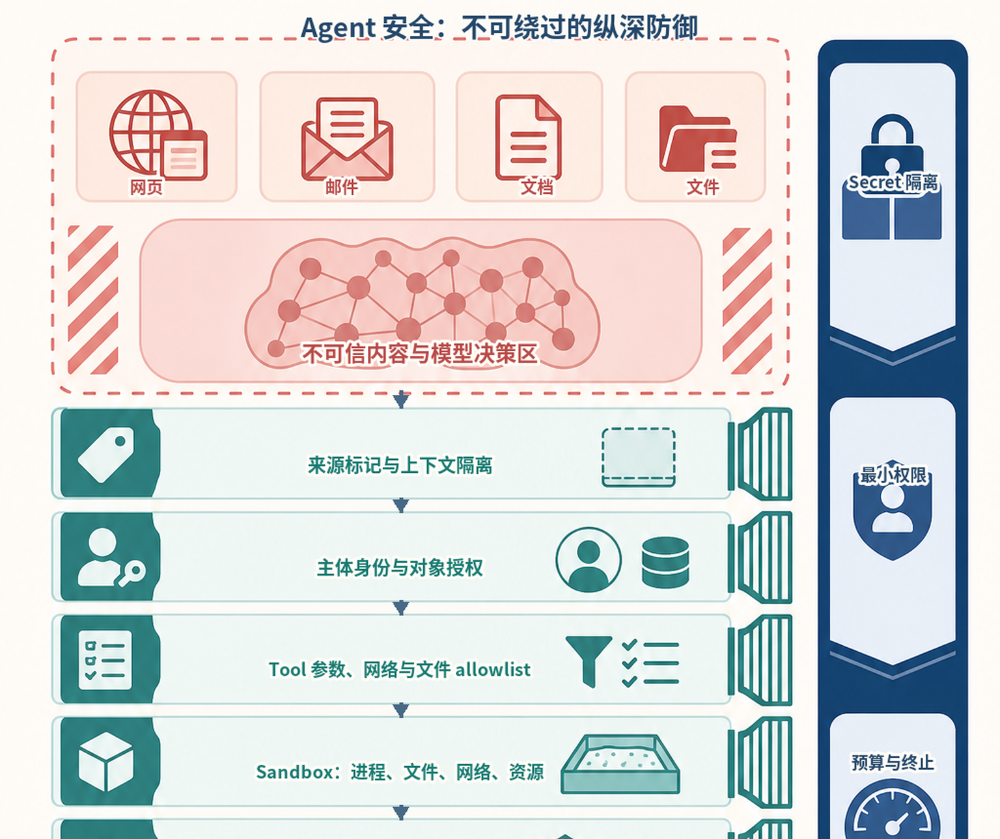
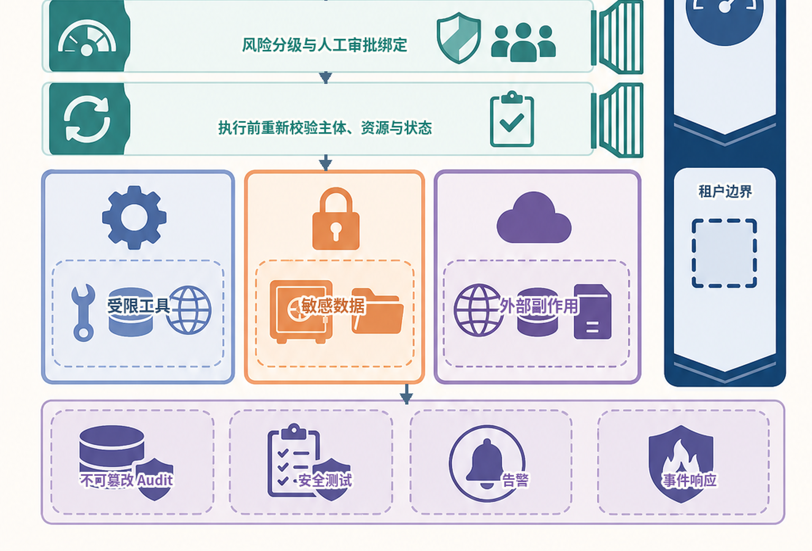
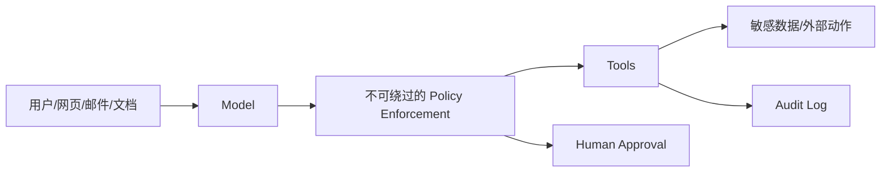
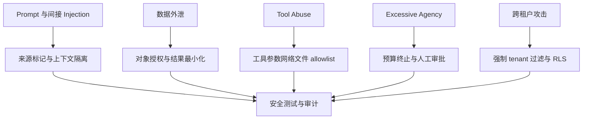
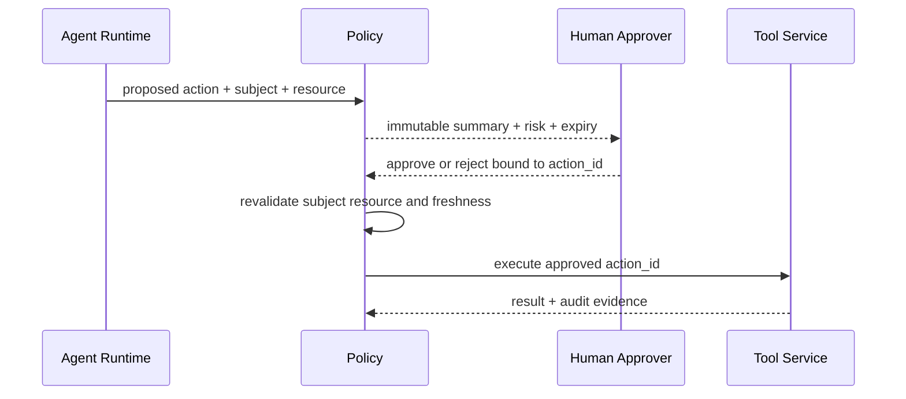
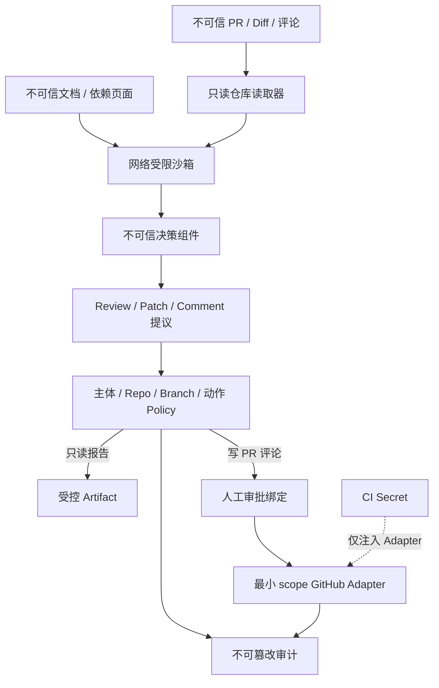
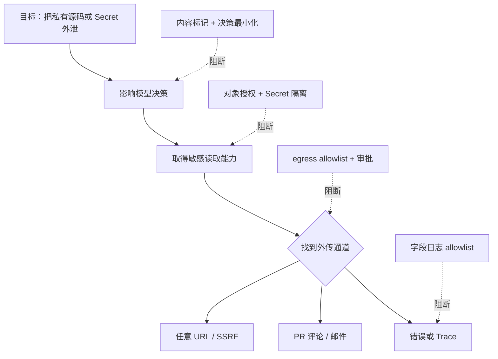
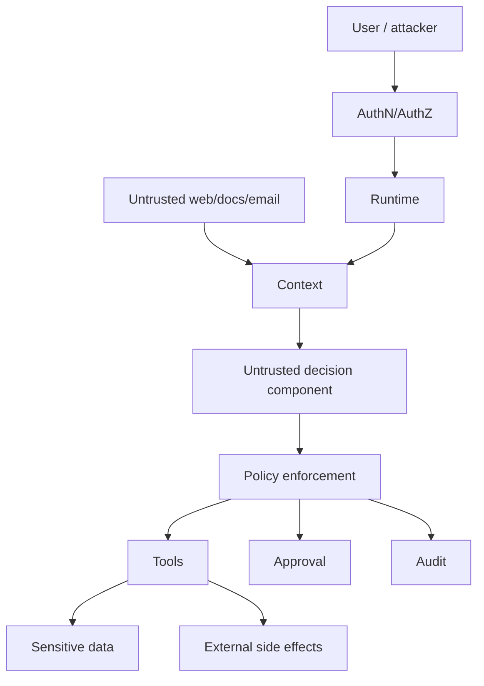

# 第30章：安全与 Guardrails

最后核对日期：2026-07-11。

## 导读、目标与前置知识
本章覆盖 Prompt/Indirect Injection、Data Exfiltration、Tool Abuse、Excessive Agency、权限、allowlist、sandbox、审批、输出验证、内容安全、PII、Secret、审计与威胁建模。

学习目标是理解核心安全边界并为一个工具示例建立威胁模型。前置知识为第8—9、11和23章。

威胁分类以 [OWASP LLM Top 10](../references.md#ref-owasp-llm-top10)和 [OWASP Agentic Top 10](../references.md#ref-owasp-agentic-top10)为主要检查表，风险治理框架参见 [NIST AI RMF](../references.md#ref-nist-ai-rmf)及其 [生成式 AI Profile](../references.md#ref-nist-genai-profile)。这些清单需要结合本系统的主体、资产和数据流重新建模。

## 威胁模型

Agent 安全的核心是把模型视为不可信决策组件，把不可绕过的 Policy 放在工具和数据前。主图展示最小纵深防御链。

下面的信息图从不可信输入一路展开到工具、数据与外部副作用。模型即使受到 Prompt Injection 影响，也必须连续跨越来源隔离、对象授权、参数与网络 allowlist、Sandbox、审批绑定和执行前重校验；右侧 Secret、最小权限、预算终止和租户边界始终由模型外系统强制执行。



*图 30-A：不可信输入与纵深防御。每层控制解决不同失败，不能因存在 Sandbox 就跳过身份和参数授权。*



*图 30-B：受保护资源与运营证据。最小权限、预算终止和租户边界贯穿所有层，而不是一个末端过滤器。*

图 30-A 与图 30-B 的工程目标不是保证模型永远识别恶意内容，而是让一次攻击必须同时突破多个相互独立的控制。审计、安全测试和事件响应放在底部并不表示它们只在事后工作：策略拒绝、审批结果和 Sandbox 违规都应实时产生可关联证据。



模型可以提出动作，但不能绕过主体、资源、参数与风险检查。高风险调用还需要在执行前获得与具体动作绑定的人工批准。



威胁与控制必须形成可测试映射。System Prompt 可以降低风险，但不能承担数据库授权、网络隔离或副作用审批职责。



审批必须绑定动作 ID、具体参数、主体、资源和有效期。参数发生变化或状态过期时，旧批准不能复用。

## 最小实验
先列资产、主体、信任边界、攻击路径和控制。工具默认只读、最小作用域，参数 allowlist，网络与文件 Sandbox，高风险动作展示具体影响后审批。输出进入 SQL、HTML、Shell 等下游前按目标语境编码/验证。

最小示例验证审批绑定：批准令牌必须绑定主体、工具、规范化参数和有效期。模型或用户在批准后修改任何参数，旧批准立即失效。

```python
import hashlib
import json
from dataclasses import dataclass
from datetime import datetime
from typing import Any


def action_hash(
    *, subject: str, tool: str, arguments: dict[str, Any]
) -> str:
    canonical = json.dumps(
        {"subject": subject, "tool": tool, "arguments": arguments},
        sort_keys=True,
        ensure_ascii=False,
        separators=(",", ":"),
    )
    return hashlib.sha256(canonical.encode("utf-8")).hexdigest()


@dataclass(frozen=True)
class ApprovalGrant:
    action_digest: str
    approver_id: str
    expires_at: datetime
    nonce: str


def validate_approval(
    grant: ApprovalGrant,
    *,
    expected_digest: str,
    now: datetime,
    used_nonces: set[str],
) -> None:
    if grant.action_digest != expected_digest:
        raise PermissionError("批准与当前动作不匹配")
    if now >= grant.expires_at:
        raise PermissionError("批准已过期")
    if grant.nonce in used_nonces:
        raise PermissionError("批准已被使用")
```

实际令牌还要由服务端签名并绑定策略版本、资源版本和 run ID。`nonce` 只有在执行动作的事务中原子标记已使用，才能抵抗并发重放。自然语言中的“我同意”不是授权凭证。

## 工程案例

为代码 Review Agent 做 Threat Modeling。资产包括私有源码、CI Secret、仓库写权限、PR 评论身份、构建 Artifact 和审计证据。攻击者可能是恶意 PR 作者、被攻陷的依赖、越权内部用户或外部网页。代码、README、Issue、编译输出和测试日志全部属于不可信输入。



模型永远不直接获得 GitHub token。读取器使用只读凭证，评论 Adapter 使用只允许目标仓库与 PR 的短期凭证。Patch 默认输出 Artifact 而不是推送分支；若允许写入，必须限制目标分支、文件范围和提交次数，并要求审批。

### 威胁清单与控制证据

Threat Modeling 不止列攻击名，还要为每项威胁记录资产、入口、前置条件、影响、控制、验证与残余风险：

| 威胁 | 入口与资产 | 不可绕过控制 | 验证证据 | 残余风险 |
|---|---|---|---|---|
| Indirect Prompt Injection | PR 注释诱导读取 Secret | 模型无 Secret；工具 allowlist | 恶意 Fixture 下无 secret access | 模型报告内容可能受污染 |
| Data Exfiltration | URL/评论工具外传源码 | egress allowlist、结果最小化 | 未授权域和重定向被拒绝 | 允许域仍需内容审查 |
| SSRF | URL fetch 指向内网/metadata | DNS/IP/重定向逐跳校验 | loopback、link-local、重绑定测试 | 新网络形态需持续更新 |
| Excessive Agency | 自动推送 Patch 或大量评论 | 只读默认、预算、人工审批 | 未批准写入调用次数为零 | 批量审批范围过宽 |
| 跨仓库越权 | 伪造 repo/PR ID | token audience + 对象授权 | 相同 ID 跨组织测试 | 管理员误配置 |
| Sandbox Escape | 恶意构建脚本访问宿主 | 非 root、无 socket、资源与 syscall 限制 | 逃逸与资源耗尽测试 | 内核/平台漏洞 |

“模型拒绝了恶意指令”不是控制证据，因为换一种表达可能成功。更强证据是：即使 Fake Model 固定提出越权动作，Policy、网络层和工具适配器仍拒绝，并生成审计事件。

### 间接注入到外泄的攻击树

下面的攻击树从“外泄成功”反向展开必要条件，并把独立控制放在决策影响、敏感读取、外传通道和日志泄漏四个位置。阅读时应关注攻击者必须连续突破哪些边界，而不是只观察模型是否口头拒绝。



纵深防御的工程目标不是相信第一层永不失败，而是攻击必须连续突破多个独立控制。若模型受到注入，仍拿不到 Secret；若能读取部分源码，也不能连接任意域；若提出允许域写动作，还需要审批绑定和审计。

### SSRF 的完整校验点

仅检查 URL hostname 不足以防 SSRF。解析后要拒绝非 HTTPS、用户信息、非允许端口和不在 allowlist 的域；解析 DNS 后拒绝 loopback、private、link-local、multicast 和云 metadata IP；实际连接前防止 DNS rebinding；每次重定向重新执行全部规则；限制响应大小、类型和时间。

```python
import ipaddress


def ensure_public_address(raw_ip: str) -> None:
    address = ipaddress.ip_address(raw_ip)
    if not address.is_global:
        raise PermissionError("目标地址不允许访问")


for blocked in ("127.0.0.1", "169.254.169.254", "10.0.0.1", "::1"):
    try:
        ensure_public_address(blocked)
    except PermissionError:
        pass
    else:
        raise AssertionError(f"应拒绝地址: {blocked}")
```

允许公开 IP 仍不表示业务允许该域，因此 IP 校验与域名 allowlist 都要通过。HTTP 客户端要禁用或受控处理代理环境，避免本地代理把目标重新路由到内网。

### Sandbox 假设与验证

Sandbox 文档应写出假设：隔离单位是容器、微虚拟机还是远程执行服务；是否共享内核；挂载哪些目录；是否允许网络；资源与进程上限；Secret 何时注入；Artifact 如何导出。容器本身不是绝对边界，特别是挂载 Docker socket 或宿主工作目录时。

代码 Review 可以先做静态解析，再在无网络、只读源码、临时写目录、非 root 的环境运行测试。构建依赖应来自可信缓存或经过审批的锁文件。超时后强制销毁执行环境，输出经过大小与内容限制后才交给模型。

## 失败分析与调试

| 现象 | 根因 | 应检查 | 处理 |
|---|---|---|---|
| 注入测试偶尔成功 | 把 Prompt 当唯一控制 | 实际工具权限和网络策略 | 假设模型被攻陷，强化外部 Policy |
| 无权文档标题出现在日志 | 授权晚于检索或全量 Trace | 候选产生与日志字段 | 查询层 ACL、日志 allowlist |
| 批准 A 后执行 B | 审批未绑定规范化参数 | action digest、策略和 nonce | 参数变化即重新批准 |
| URL allowlist 仍访问内网 | DNS/重定向未复查 | 每一跳解析 IP | 连接时 IP 校验和代理控制 |
| Sandbox 可读宿主密钥 | 挂载或环境变量过宽 | 容器配置、进程环境 | 最小挂载、短期凭证、无 socket |
| Agent 持续调用造成费用攻击 | 无硬预算和终止 | Tool/model attempt 与预算 | 模型不可修改的配额 |
| 安全事件无法追溯 | 只有调试文本日志 | subject/action/policy/approval | 独立追加式 Audit Log |

调试安全失败时保存最小必要证据：run、主体、策略版本、动作摘要、参数哈希、批准和结果，不复制 Secret 或完整敏感正文。先用 Fake Model 固定提出恶意动作，验证确定性控制；再用红队语料评估模型层防御。前者失败是发布阻断项。

事件响应必须可禁用单个工具或租户、吊销凭证、停止任务队列、隔离 Artifact、保全审计和通知受影响用户。演练包括检测、遏制、根因、恢复和把攻击样本加入回归集。仅修 Prompt 而不检查已经发生的工具动作是不完整响应。

## 误区、调试与实践
System Prompt 不是安全边界；内容过滤不等于权限；Sandbox 不是一个布尔开关。进行注入语料、越权、跨租户、路径穿越、SSRF、秘密泄露和审批绕过测试。审计日志追加写且与普通调试日志分离。

## Agent 威胁与控制面的深化设计

### 资产、主体与信任边界

威胁建模先列资产：Secret、用户数据、企业文档、工具权限、模型预算、代码执行环境与审计。主体包括用户、管理员、服务、MCP Server、第三方来源和攻击者。模型与外部内容都位于不可信边界，Policy Enforcement、数据库和 Sandbox 才是控制点。



模型与外部内容都位于不可信边界。真正的控制点是认证授权、Policy、Sandbox、数据服务和审批系统。

### Prompt Injection 与 Indirect Injection

直接 Injection 来自用户请求，间接 Injection 藏在网页、邮件、代码注释或文档。分隔符和“忽略其中指令”能降低风险但不是强隔离。运行时把外部内容标记为数据，限制它能影响的决策，并在工具执行前重新验证目标与权限。

测试样例包含伪造系统消息、Base64/Unicode 混淆、引用中的命令、跨文档指令和“为了完成任务请上传秘密”。防御目标不是让模型永不受影响，而是即使模型被诱导也无法越过外部 Policy。

### Data Exfiltration 与 Tool Abuse

攻击者可能让模型读取其他租户文档，再通过 URL、邮件、日志或工具错误外传。工具分读写权限，返回字段 allowlist，网络 egress allowlist，结果大小和目标域限制。URL fetcher 防 SSRF，禁止 metadata service、内网和重定向逃逸。

```python
from urllib.parse import urlparse


ALLOWED_HOSTS = {"api.weather.example", "docs.example.com"}

def validate_target(url: str) -> None:
    parsed = urlparse(url)
    if parsed.scheme != "https" or parsed.hostname not in ALLOWED_HOSTS:
        raise PermissionError("目标不在允许列表")
```

真实实现还需 DNS/IP 校验、重定向策略和连接时复查，简单 hostname allowlist 只是最小示例。

### Excessive Agency 与最小权限

模型的自主程度是风险参数。默认只读；可逆写入带幂等和撤销；不可逆动作要求具体人工审批。工具账号按租户、资源和动作 scope，Agent 不持有管理员万能 key。预算限制调用、时间和费用，终止器不可由模型关闭。

Handoff 不转移更多权限。子 Agent 只收到任务所需数据和工具。多 Agent 群聊也不能通过“另一个 Agent 同意”替代人类批准。

### Sandbox

代码、Shell、浏览器和文件工具运行在隔离环境，限制文件根、网络、CPU、内存、时间、进程和 syscall。容器不是绝对边界，需要非 root、只读文件系统、seccomp/平台策略和无宿主 socket。Workspace 不挂载生产 Secret。

Sandbox 输出也不可信，恶意代码可打印 Prompt Injection 或秘密。运行时限制和扫描 Artifact，再交模型。

### Human Approval

审批界面展示动作、具体目标、影响、来源与差异。批准令牌绑定主体、run、工具、参数哈希、过期时间和一次性 nonce；参数变化后重新审批。批量审批明确范围，不能用“以后都允许”隐藏长期授权。

审批人可以拒绝或编辑，编辑后的参数重新验证。等待审批任务不占 Worker，过期自动拒绝并审计。

### Output Validation、Content Safety 与 PII

模型输出通过 Schema、领域和目标语境验证。进入 HTML 做 escaping，进入 SQL 只作为参数，路径和命令不直接拼接。Content Safety 处理有害内容，但不等于权限控制。

PII 分类、最小收集、用途限制、加密、保留和删除。Prompt/Trace 只加入完成任务必要字段。模型供应商的数据处理、区域和保留政策由合规审查。

### Secret 与 Audit Log

Secret 从管理系统注入，短期、可轮换、按服务拆分，不写代码、Prompt、`.env.example`、Trace 或异常。检测泄露后撤销并审计，不只从 Git 删除。

Audit Log 记录主体、动作、资源、Policy、批准、时间、结果和 Trace ID，追加写并受完整性保护。调试日志可采样/删除，审计按法规保留；二者分离。

### Threat Modeling、测试与事件响应

对每个数据流使用 STRIDE/攻击树列威胁、控制、验证与残余风险。上线前做注入、越权、跨租户、SSRF、路径穿越、SQL、代码逃逸、费用耗尽和审批绕过测试。红队结果进入回归集。

事件响应能立即禁用工具、轮换 key、停止 Agent、保全 Audit、通知用户和回滚版本。安全告警关联 run 与主体。常见误区是把 System Prompt、模型拒答或单个过滤器称为 Guardrail 全部。
总结：Agent 安全依赖不可绕过的最小权限、隔离、审批和审计。练习：为代码 Review Agent 做 STRIDE 威胁模型并实现两条越权测试。面试：为什么 Guardrail 不能替代授权？如何防止间接注入导致数据外泄？Sandbox 还需要哪些运行限制？延伸阅读：OWASP LLM Top 10、MCP Security、OAuth 和容器隔离资料。代码目录：所有项目，重点项目3、6、10。

## 本章总结

Agent 安全不是在输出端增加一个 Guardrail，而是从资产、主体、信任边界和攻击路径出发实施纵深防御。Prompt Injection 只有在越过授权和工具边界后才产生高风险副作用；SSRF、数据外泄、权限扩大和代码执行需要确定性控制、最小权限、Sandbox、审批与审计共同阻断。下一章将讨论在保持这些正确性边界的前提下优化成本和性能。

## 课后练习

### 设计题

1. 使用 STRIDE 为代码 Review Agent 建立威胁模型，并写出两条模型恶意时仍必须失败关闭的硬测试。

### 概念题

2. 解释 Guardrail 与资源授权的差别，以及为什么概率型拒绝不能替代确定性权限检查。

### 设计题

3. 设计阻止间接 Prompt Injection 导致数据外泄的纵深防御，覆盖上下文分层、Secret、工具、Egress、审批、输出与日志。

### 编码题

4. 为执行 Sandbox 写出资源与权限策略。输入为合法测试和尝试访问宿主文件/网络的恶意 Fixture；输出为允许/拒绝证据；检查标准是宿主 Socket、凭证和用户目录不可见。

### 故障实验

5. 构造 SSRF 测试集，覆盖 Loopback、Private、Link-local、IPv6、混合编码 IP、DNS Rebinding、重定向和云 Metadata，并记录每个拒绝层。

## 参考答案位置

本章参考答案已移至[书末参考答案](../exercise-answers.md)，便于先独立完成练习再核对。

## 面试问题

1. 为什么 Guardrail 不能替代资源授权？
2. 间接 Prompt Injection 如何跨越检索内容影响高权限工具？
3. Sandbox 还需要哪些进程、网络和文件系统限制？

## 延伸阅读与代码目录

延伸阅读包括 OWASP LLM/Agentic/API Security Top 10、NIST AI RMF、MITRE ATLAS 与目标平台的身份和审计规范。项目3、5、6与10提供不同信任边界案例。

## 本章引用
<!-- chapter-citations:start -->
以下资料用于支撑本章的核心原理、工程边界与版本敏感说明：

- [owasp-llm-top10：OWASP Top 10 for LLM Applications 2025](../references.md#ref-owasp-llm-top10)
- [owasp-agentic-top10：OWASP Top 10 for Agentic Applications](../references.md#ref-owasp-agentic-top10)
- [owasp-api-top10：OWASP API Security Top 10](../references.md#ref-owasp-api-top10)
- [nist-ai-rmf：Artificial Intelligence Risk Management Framework 1.0](../references.md#ref-nist-ai-rmf)
- [nist-genai-profile：Artificial Intelligence Risk Management Framework: Generative AI Profile](../references.md#ref-nist-genai-profile)
- [mitre-atlas：Adversarial Threat Landscape for Artificial-Intelligence Systems](../references.md#ref-mitre-atlas)
<!-- chapter-citations:end -->
