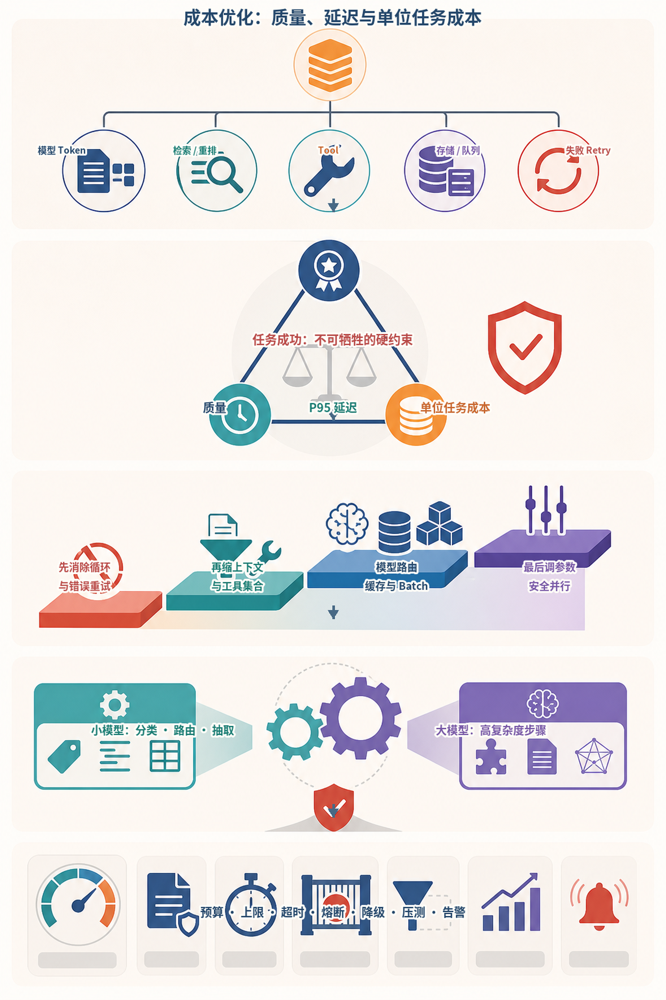
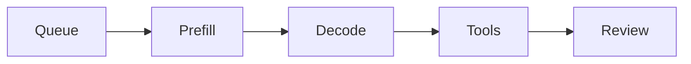
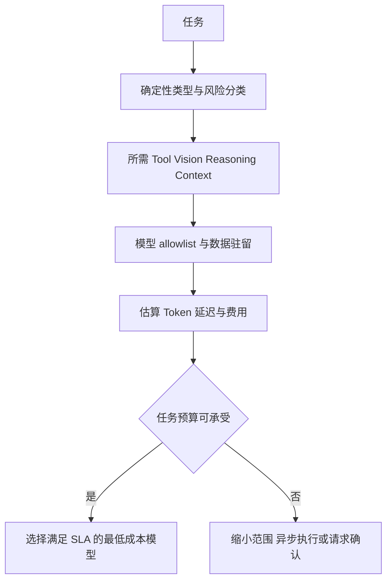
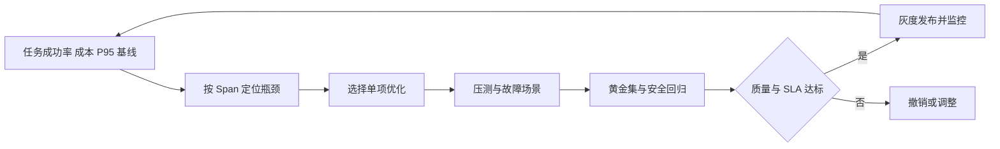
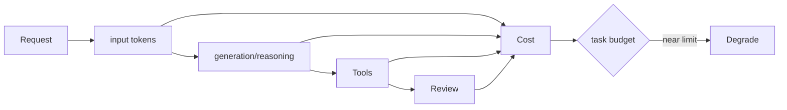

# 第31章：成本与性能优化

最后核对日期：2026-07-11；模型价格与限制不写死。

## 导读、目标与前置知识
本章从 Token、路由、缓存、压缩、Batch、并行工具、小/大模型协同、延迟、超时、降级、预算与压测优化“每个成功任务”的成本。

学习目标是掌握核心成本模型并完成一个带预算和降级的压测示例。前置知识为第2、4、28—29章。

成本优化应以成功任务为单位，同时约束质量和尾延迟。主图给出明确顺序：先消除无效循环与错误重试，再缩小上下文和工具集合，随后才使用模型路由、缓存、批处理和安全并行。



*图 31-A：质量、P95 延迟与单位成功任务成本的工程权衡。优化不能以绕过权限、校验或证据链为代价。*

图 31-A 中小模型适合分类、路由和抽取，大模型只处理高复杂度步骤，但任何路由都要由真实任务集验证。缓存命中率高也不等于有效，缓存键必须包含版本、权限和相关上下文。

## 延迟与成本分解

一次任务的延迟来自排队、模型预填充与生成、工具、评审和重试。主图用于建立 Span 分解，而不是假设模型调用永远是唯一瓶颈。



关键路径由实际 Span 决定：独立工具可以并行缩短墙钟时间，串行 Reviewer 与重复调用则会直接放大延迟。



路由首先满足能力、安全和数据策略，再优化价格。更便宜但频繁失败重试的模型可能提高每个成功任务的总成本。



缓存、上下文压缩和并行化都可能改变答案或权限行为，所以必须同时经过质量与安全评估，而不只是压测。
总延迟包括队列、模型首 Token、输出生成、工具和重试。优化前先按 span 测量。模型路由根据任务风险与复杂度选择，不以关键词随意切换；缓存键包含模型、Prompt、输入和权限版本。

## 最小与完整工程
定义任务预算：最大轮数、输入/输出 Token、工具次数、墙钟时间和费用。超限执行可解释降级：缩短上下文、跳过非关键 Reviewer、切换离线队列或请求用户继续。并行只用于独立只读工具；批处理适合离线吞吐，不一定改善单请求延迟。

## 误区、调试、实践与安全
更小模型不总更便宜，失败重试可能抵消单价；Prompt 压缩可能删除安全条件；缓存可能泄漏跨租户结果。压测覆盖不同输入/输出长度、并发、错误和上游限流，报告 P50/P95/P99 与成功率。

## 总结、练习、面试与阅读

### 成本模型与任务预算

总成本包含输入/输出 Token、缓存、推理计算、Embedding、Reranker、工具 API、搜索、存储和基础设施。价格会变化，Cost Calculator 使用带生效时间的配置，不在业务代码写死。主指标是每个成功任务成本和单位业务价值。



预算由运行时逐步扣减且不可由模型提高。降级顺序在任务开始前定义，并把影响明确告知用户或调用方。

预算在运行前设最大回合、输入、输出、工具、墙钟和费用；每步扣减，剩余不足时选择拒绝、请求用户继续或降级。模型不能自行提高预算。

### 模型路由

Router 根据任务类别、风险、长度和能力选择模型。确定性分类/抽取可用小模型，高风险综合与困难代码用强模型，Reviewer 只在收益明确时启用。路由规则先显式，模型 Router 也输出结构化理由并受 allowlist。

Fallback 不是无条件切更便宜模型。降级模型必须通过相同关键评估，输出标记能力变化。供应商故障切换考虑数据驻留、工具 Schema 和 Structured Output 差异。

### Prompt 与 Context 压缩

删除重复模板、缩短工具描述、按任务动态暴露工具，减少固定输入。历史使用近期窗口、结构化事实、摘要和检索。摘要有损，关键权限/数字固定保留。压缩前后运行安全与任务回归，不能为了省 Token 删除来源或否定。

检索先过滤和重排，只加入支持当前问题的片段。长工具结果存 Resource，模型只看摘要与引用。上下文预算按系统、工具、历史、检索和输出分配。

### Cache

确定性结果、Embedding、检索候选和不敏感模型响应可缓存。键包含模型、参数、Prompt、输入、工具/数据版本、租户和权限。缓存 Value 带 TTL 和 Schema。用户权限变化或文档更新时失效。

语义缓存有误命中风险，不用于交易、权限和精确事实。跨租户缓存是严重泄露，默认隔离。缓存命中仍记录 Usage=0 与来源，便于解释。

### Batch 与并行工具

Batch 提高离线 Embedding/评估吞吐，但增加等待和失败重试复杂度。在线动态 batching 由模型服务管理时要测尾延迟。并行工具仅限独立且资源允许的调用，设置 TaskGroup、每工具 timeout 和总 deadline。

两个调用争同一限流或数据库连接时，并行可能更慢。写操作和有依赖任务串行。并行结果按稳定 call ID 合并，而不是完成顺序。

```python
import asyncio

async def load_independent_data():
    async with asyncio.TaskGroup() as group:
        weather = group.create_task(get_weather())
        exchange = group.create_task(get_exchange_rate())
    return weather.result(), exchange.result()
```

### 小模型与大模型协同

小模型做分类、改写、过滤或格式化，大模型处理少量困难任务。级联先用小模型并基于可校准 confidence/规则升级；不要让小模型自己声称“确定”。抽样审计未升级结果，防止静默质量下降。

Reviewer 与 Generator 使用同一大模型会增加成本且错误相关。可以用规则/小模型预检格式，把昂贵 Judge 留给边界样例。

### 延迟、超时与降级

延迟分 queue、context/prefill、first token、decode、tool、retry 和 postprocess。目标分别设置 timeout 和总 deadline。首 Token 改善感知，不能掩盖总任务慢。Streaming UI 显示真实状态。

降级顺序预定义：关闭非关键 Reviewer、减少候选、延后丰富报告、转异步、使用验证过的小模型、最后拒绝。安全/权限检查永不降级。Circuit Breaker 在上游连续失败时快速失败并恢复探测。

### 压测与容量

测试矩阵覆盖短/长输入输出、并发、工具慢、模型限流、缓存冷热和错误。报告 P50/P95/P99、吞吐、成功、费用、队列和资源。稳态、突发、浸泡和故障注入分别运行。

GPU 自托管测 tokens/s、time-to-first-token、显存和批次；API 模型测配额与区域。容量规划按峰值成功任务，而非平均请求。

### 常见误区、调试与安全

常见误区：小模型一定便宜、Temperature 0 可缓存所有结果、并行总会更快、压缩只影响质量不影响安全。调试先用 Trace 找最大 span，再优化。费用异常告警按 tenant/run，预算耗尽安全终止，防止攻击者制造无限工具循环。
总结：优化目标是受质量和安全约束的每个成功任务成本。练习：为研究 Agent 制定预算、模型路由和三级降级并压测。面试：如何计算每个成功任务成本？并行工具何时增加延迟？缓存键为何包含权限版本？延伸阅读：目标模型 Usage/价格文档、OpenTelemetry、缓存和性能测试资料。代码目录：项目8、10。

## 本章引用
<!-- chapter-citations:start -->
以下资料用于支撑本章的核心原理、工程边界与版本敏感说明：

- [kaplan2020：Scaling Laws for Neural Language Models](../references.md#ref-kaplan2020)
- [hoffmann2022：Training Compute-Optimal Large Language Models](../references.md#ref-hoffmann2022)
- [twelve-factor：The Twelve-Factor App](../references.md#ref-twelve-factor)
- [openai-compat：API Backward Compatibility](../references.md#ref-openai-compat)
<!-- chapter-citations:end -->
