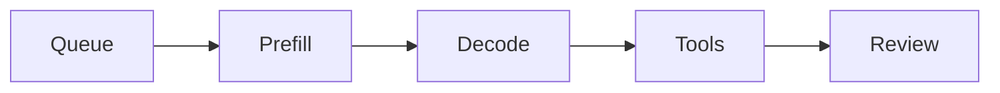
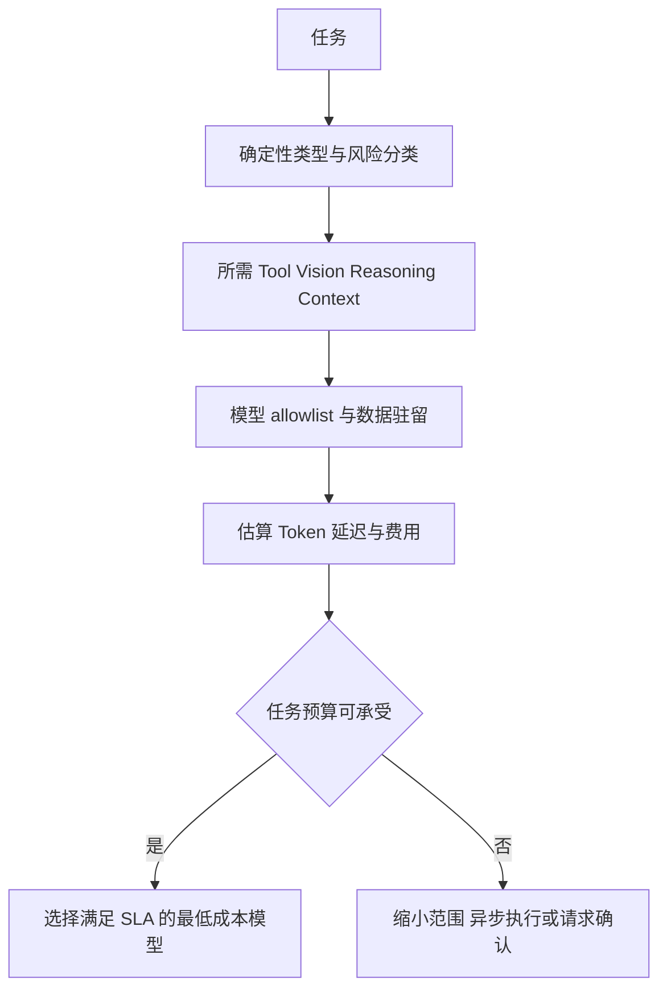
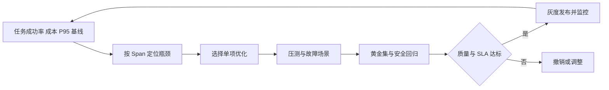
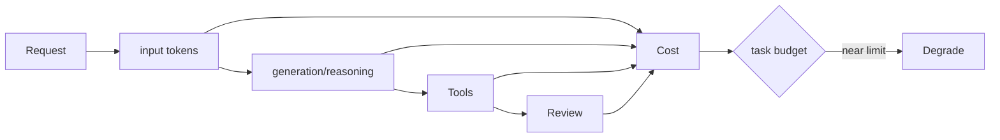

# 第31章：成本与性能优化

最后核对日期：2026-07-11；模型价格与限制不写死。

## 导读、目标与前置知识
本章从 Token、路由、缓存、压缩、Batch、并行工具、小/大模型协同、延迟、超时、降级、预算与压测优化“每个成功任务”的成本。

学习目标是掌握核心成本模型并完成一个带预算和降级的压测示例。前置知识为第2、4、28—29章。

成本优化应以成功任务为单位，同时约束质量和尾延迟。主图给出明确顺序：先消除无效循环与错误重试，再缩小上下文和工具集合，随后才使用模型路由、缓存、批处理和安全并行。


*图 31-A：质量、P95 延迟与单位成功任务成本的工程权衡。优化不能以绕过权限、校验或证据链为代价。*

图 31-A 中小模型适合分类、路由和抽取，大模型只处理高复杂度步骤，但任何路由都要由真实任务集验证。缓存命中率高也不等于有效，缓存键必须包含版本、权限和相关上下文。

## 延迟与成本分解

一次任务的延迟来自排队、模型预填充与生成、工具、评审和重试。主图用于建立 Span 分解，而不是假设模型调用永远是唯一瓶颈。



关键路径由实际 Span 决定：独立工具可以并行缩短墙钟时间，串行 Reviewer 与重复调用则会直接放大延迟。



路由首先满足能力、安全和数据策略，再优化价格。更便宜但频繁失败重试的模型可能提高每个成功任务的总成本。



缓存、上下文压缩和并行化都可能改变答案或权限行为，所以必须同时经过质量与安全评估，而不只是压测。
总延迟包括队列、模型首 Token、输出生成、工具和重试。优化前先按 span 测量。模型路由根据任务风险与复杂度选择，不以关键词随意切换；缓存键包含模型、Prompt、输入和权限版本。

## 最小与完整工程
定义任务预算：最大轮数、输入/输出 Token、工具次数、墙钟时间和费用。超限执行可解释降级：缩短上下文、跳过非关键 Reviewer、切换离线队列或请求用户继续。并行只用于独立只读工具；批处理适合离线吞吐，不一定改善单请求延迟。

本章的独立工程位于 [`examples/cost_latency_lab/`](https://github.com/wujinjun/ai-agent-book/tree/main/examples/cost_latency_lab)。它不请求真实模型，不写死供应商价格，也不使用 `sleep` 制造不稳定基准；输入是具有逻辑起止时间和微成本单位的合成 Span，因此每次运行都能复现同一关键路径、费用与路由结果。生产适配器只需把 OpenTelemetry Span、供应商 Usage 和带生效日期的价格目录映射到相同领域对象。

```bash
cd examples/cost_latency_lab
python3.12 -m venv .venv
.venv/bin/python -m pip install -e '.[test]'
.venv/bin/python -m cost_latency_lab.main --fixture baseline
.venv/bin/python -m pytest -q
```

确定性 Fixture 包含两个成功任务和一个失败任务。预期 `P95 wall = 250 ms`、总成本 `2550 microunits`、每成功任务成本 `1275 microunits`、重试放大 `4/3`。这些数字只证明控制逻辑，不代表任何真实模型或硬件的性能。

## 可计算的成本与延迟模型

令一次观察窗口包含任务集合 (R)，任务 `r` 的总费用为所有物理尝试的费用之和，成功指示量为 `success(r)`。单位成功任务成本定义为：

```text
cost_per_success = Σ cost(r) / Σ success(r)
```

分子必须包含失败、超时和被重试任务已经发生的费用。若只统计成功请求自身的账单，系统会在失败率升高时得到虚假的“成本下降”。当成功数为零时，指标应为不可计算或正无穷并触发告警，不能用零替代。

任务墙钟也不能简单累加 Span。设所有 Span 的时间区间为 `[start_i, end_i]`，最外层任务耗时是最晚结束减最早开始。并行天气和汇率工具分别耗时 60 ms 与 35 ms，若同时从 120 ms 开始，关键路径贡献是 60 ms 而不是 95 ms；费用仍要把两次调用都相加。

重试放大系数用于发现“单价不高但调用次数失控”的情况：

```text
retry_amplification = physical_attempts / logical_calls
```

这里 `logical_call_id` 在同一业务调用的所有重试中保持不变，`attempt` 递增。系数 1 表示没有重试；若模型、HTTP 客户端和队列各自允许三次，最坏物理尝试可能出现乘法放大，因此这些层必须共享 Run 级尝试预算。

### Trace 聚合的最小实现

下面是独立实验核心计算的缩略版本。真实系统还需处理采样、时钟偏差、异步子任务跨 Trace 和未知费用。

```python
def analyze(traces: tuple[TaskTrace, ...]) -> dict[str, float]:
    successes = sum(trace.success for trace in traces)
    total_cost = sum(trace.total_cost_microunits for trace in traces)
    walls = sorted(trace.wall_ms for trace in traces)
    return {
        "success_rate": successes / len(traces) if traces else 0.0,
        "cost_per_success": total_cost / successes if successes else float("inf"),
        "max_wall_ms": float(walls[-1] if walls else 0),
    }
```

生产 P95/P99 应使用足够样本的直方图或摘要结构，并按任务类型、模型、租户级别和输入长度分桶。将完全不同的短分类与长研究任务混在一个总体 P95 中，会掩盖真正的容量问题。

## 路由、缓存和降级的正确性实验

路由顺序是“能力与政策 → 数据边界 → 预算与 SLA → 最低成本”，价格不能排在前面。实验中的 `choose_model()` 先检查模型是否具有 `basic` 或 `advanced` 能力，再检查敏感数据是否允许进入该模型，最后才比较估算成本和耗时。敏感数据被策略排除时返回 `data_policy_rejected_all_models`，不能误报成“预算不足”后自动切换到不允许的供应商。

缓存键至少包含以下身份：

| 维度 | 缺失后的风险 |
|---|---|
| tenant ID | 跨租户数据泄漏 |
| permission version | 权限撤销后仍命中旧结果 |
| model version | 模型升级前后结果混淆 |
| Prompt/Tool version | 契约变化后复用不兼容对象 |
| data/index version | 文档更新后返回过期事实 |
| normalized request | 不同任务错误命中 |

实验通过对规范化 JSON 求 SHA-256 生成稳定键，并测试只改变 tenant 就必须得到不同键。语义缓存还存在相似但不等价的误命中，不能用于权限决定、交易执行、精确数值和需要最新状态的任务。

### 超时预算而不是超时拼盘

若 Run 总 deadline 为 10 秒，排队已花 2 秒，模型已花 5 秒，后续工具不能仍各自拿到完整 10 秒。Runtime 应把剩余 deadline 向下传递，并为清理和持久化预留尾部时间。客户端超时、工具超时和队列租约分别解决不同问题，但必须共享同一绝对截止时刻。

```text
run_deadline
├── queue budget
├── model budget
├── tool budget（取 min：工具上限、剩余 deadline）
└── checkpoint / cleanup reserve
```

预算耗尽后的降级必须事先声明。允许的例子包括减少非关键候选、把丰富报告转异步、关闭可选 Reviewer；不允许的例子包括跳过 ACL、删除引用校验、绕过人工审批或把敏感数据切到不合规模型。

## 性能实验设计与结果解释

一个可信优化实验至少需要基线、单变量改动、黄金任务集、负载形态和回退阈值。建议表格如下：

| 试验 | 变量 | 必看指标 | 质量门 | 失败解释 |
|---|---|---|---|---|
| 上下文压缩 | Chunk 数或摘要策略 | input Token、TTFT、P95 | Faithfulness、引用覆盖 | 证据被删时即使更快也失败 |
| 模型路由 | 路由阈值 | cost/success、升级率 | 分任务成功率 | 总体均值不能掩盖高风险子集 |
| 并行工具 | 并发度 | wall、连接池等待、错误率 | 结果一致性 | 共享限流可能让 P99 恶化 |
| 缓存 | 键与 TTL | 命中、陈旧命中、成本 | 租户/权限隔离 | 高命中不代表正确命中 |
| Reviewer | 启用策略 | 成本、延迟、返工率 | 缺陷发现增量 | 错误相关时只是重复花费 |

压测分稳态、突发、浸泡和故障注入。稳态验证持续容量，突发观察排队与限流，浸泡发现连接或内存泄漏，故障注入验证超时、重试、熔断和恢复。报告应同时给出样本量、时间窗口、环境、输入长度分布和缓存冷热，否则单个 P95 数字无法比较。

## 误区、调试、实践与安全
更小模型不总更便宜，失败重试可能抵消单价；Prompt 压缩可能删除安全条件；缓存可能泄漏跨租户结果。压测覆盖不同输入/输出长度、并发、错误和上游限流，报告 P50/P95/P99 与成功率。

## 总结、练习、面试与阅读

### 成本模型与任务预算

总成本包含输入/输出 Token、缓存、推理计算、Embedding、Reranker、工具 API、搜索、存储和基础设施。价格会变化，Cost Calculator 使用带生效时间的配置，不在业务代码写死。主指标是每个成功任务成本和单位业务价值。



预算由运行时逐步扣减且不可由模型提高。降级顺序在任务开始前定义，并把影响明确告知用户或调用方。

预算在运行前设最大回合、输入、输出、工具、墙钟和费用；每步扣减，剩余不足时选择拒绝、请求用户继续或降级。模型不能自行提高预算。

### 模型路由

Router 根据任务类别、风险、长度和能力选择模型。确定性分类/抽取可用小模型，高风险综合与困难代码用强模型，Reviewer 只在收益明确时启用。路由规则先显式，模型 Router 也输出结构化理由并受 allowlist。

Fallback 不是无条件切更便宜模型。降级模型必须通过相同关键评估，输出标记能力变化。供应商故障切换考虑数据驻留、工具 Schema 和 Structured Output 差异。

### Prompt 与 Context 压缩

删除重复模板、缩短工具描述、按任务动态暴露工具，减少固定输入。历史使用近期窗口、结构化事实、摘要和检索。摘要有损，关键权限/数字固定保留。压缩前后运行安全与任务回归，不能为了省 Token 删除来源或否定。

检索先过滤和重排，只加入支持当前问题的片段。长工具结果存 Resource，模型只看摘要与引用。上下文预算按系统、工具、历史、检索和输出分配。

### Cache

确定性结果、Embedding、检索候选和不敏感模型响应可缓存。键包含模型、参数、Prompt、输入、工具/数据版本、租户和权限。缓存 Value 带 TTL 和 Schema。用户权限变化或文档更新时失效。

语义缓存有误命中风险，不用于交易、权限和精确事实。跨租户缓存是严重泄露，默认隔离。缓存命中仍记录 Usage=0 与来源，便于解释。

### Batch 与并行工具

Batch 提高离线 Embedding/评估吞吐，但增加等待和失败重试复杂度。在线动态 batching 由模型服务管理时要测尾延迟。并行工具仅限独立且资源允许的调用，设置 TaskGroup、每工具 timeout 和总 deadline。

两个调用争同一限流或数据库连接时，并行可能更慢。写操作和有依赖任务串行。并行结果按稳定 call ID 合并，而不是完成顺序。

```python
import asyncio

async def load_independent_data():
    async with asyncio.TaskGroup() as group:
        weather = group.create_task(get_weather())
        exchange = group.create_task(get_exchange_rate())
    return weather.result(), exchange.result()
```

### 小模型与大模型协同

小模型做分类、改写、过滤或格式化，大模型处理少量困难任务。级联先用小模型并基于可校准 confidence/规则升级；不要让小模型自己声称“确定”。抽样审计未升级结果，防止静默质量下降。

Reviewer 与 Generator 使用同一大模型会增加成本且错误相关。可以用规则/小模型预检格式，把昂贵 Judge 留给边界样例。

### 延迟、超时与降级

延迟分 queue、context/prefill、first token、decode、tool、retry 和 postprocess。目标分别设置 timeout 和总 deadline。首 Token 改善感知，不能掩盖总任务慢。Streaming UI 显示真实状态。

降级顺序预定义：关闭非关键 Reviewer、减少候选、延后丰富报告、转异步、使用验证过的小模型、最后拒绝。安全/权限检查永不降级。Circuit Breaker 在上游连续失败时快速失败并恢复探测。

### 压测与容量

测试矩阵覆盖短/长输入输出、并发、工具慢、模型限流、缓存冷热和错误。报告 P50/P95/P99、吞吐、成功、费用、队列和资源。稳态、突发、浸泡和故障注入分别运行。

GPU 自托管测 tokens/s、time-to-first-token、显存和批次；API 模型测配额与区域。容量规划按峰值成功任务，而非平均请求。

### 常见误区、调试与安全

常见误区：小模型一定便宜、Temperature 0 可缓存所有结果、并行总会更快、压缩只影响质量不影响安全。调试先用 Trace 找最大 span，再优化。费用异常告警按 tenant/run，预算耗尽安全终止，防止攻击者制造无限工具循环。
总结：优化目标是受质量和安全约束的每个成功任务成本。练习：为研究 Agent 制定预算、模型路由和三级降级并压测。面试：如何计算每个成功任务成本？并行工具何时增加延迟？缓存键为何包含权限版本？延伸阅读：目标模型 Usage/价格文档、OpenTelemetry、缓存和性能测试资料。代码目录：项目8、10。

### 练习参考答案

1. **研究 Agent 预算。** 先定义最大墙钟、模型调用、工具调用、输入/输出 Token 与费用；Planner、Search、Read、Reviewer 共享同一 Run 预算。达到 70% 时减少可选查询，达到 90% 时转异步或请求用户确认，安全与引用校验永不降级。
2. **模型路由。** 先按任务需要的 Vision、Tool、上下文和推理能力形成 allowlist，再按数据驻留与敏感级别过滤，最后选择满足 P95 和费用预算的最低成本候选。用黄金任务集分别统计各路由桶的成功率，不能只看整体平均。
3. **三级降级。** 第一级减少非关键 Reviewer 或候选；第二级把完整报告转后台并先返回任务 ID；第三级明确拒绝并说明预算或能力不足。任何级别都不跳过权限、审批、事实校验和审计。
4. **并行何时更慢。** 调用竞争同一连接池、数据库锁、速率限制或 CPU 时，排队和重试会推高 P95/P99；写操作还有顺序与幂等风险。只有依赖图独立、资源有余量且总 deadline 可控时才并行。
5. **缓存为何包含权限版本。** 同一用户在权限撤销前后的查询文本完全相同，但合法结果集合已经变化。权限版本进入键后会自然失效旧结果；若只依赖 TTL，撤权窗口内可能继续泄漏数据。

## 本章引用
<!-- chapter-citations:start -->
以下资料用于支撑本章的核心原理、工程边界与版本敏感说明：

- [kaplan2020：Scaling Laws for Neural Language Models](../references.md#ref-kaplan2020)
- [hoffmann2022：Training Compute-Optimal Large Language Models](../references.md#ref-hoffmann2022)
- [twelve-factor：The Twelve-Factor App](../references.md#ref-twelve-factor)
- [openai-compat：API Backward Compatibility](../references.md#ref-openai-compat)
<!-- chapter-citations:end -->
