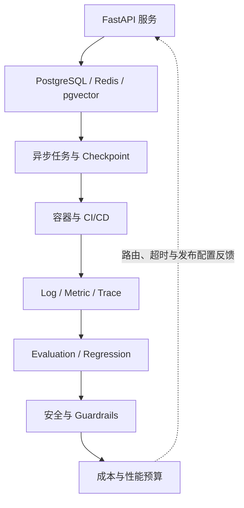

# 第五篇：Agent 工程化

本篇承接第四篇的应用实现，讨论它如何进入可运行、可恢复、可观测和可治理的生产环境。生产质量来自持续闭环，而不是部署完成这一单点事件。完成本篇后，读者应能为一个 Agent 服务定义 API、状态、任务、发布、SLO、评估、安全和成本门禁。

沿实线读取一次生产运行，虚线表示观测证据必须回到模型路由、超时、缓存和发布配置；没有反馈回路的 Agent 只能算一次性演示。

## 主案例的生产边界

设备研发企业知识助手在本篇成为多租户服务：FastAPI 接收员工问题并创建持久 Run；PostgreSQL 保存 `Document`、ACL、Run、审批和 Audit；Redis 只承担可丢弃缓存或队列协调；Worker 在租约与总 Deadline 内调用检索、模型和 Tool；每次结果绑定文档、索引、Prompt、模型和策略版本。平台管理员可以调整路由和预算，却不能借管理权限读取文档正文。

本篇的验收不以“接口返回 200”为完成，而是证明断线可恢复、重复请求不产生重复副作用、撤权后缓存和索引不泄漏、Trace 可定位版本、评估能阻止回归，并且供应商故障时系统按预定义降级而不是绕过权限。

| 章 | 主题 | 必须回答的问题 |
|---:|---|---|
| 23 | [Python 工程基础](ch23-python-engineering.md) | 类型、异步、配置、日志和测试 |
| 24 | [FastAPI 服务化](ch24-fastapi.md) | Streaming、鉴权、限流和协议 |
| 25 | [数据存储](ch25-storage.md) | 会话、状态、缓存和租户 |
| 26 | [Docker 与部署](ch26-docker-deployment.md) | 健康检查、Secret、数据库与 CI/CD |
| 27 | [异步任务](ch27-job-queues.md) | 取消、重试、恢复和进度 |
| 28 | [Observability](ch28-observability.md) | 日志、指标、Trace、Token 与成本 |
| 29 | [Evaluation](ch29-evaluation.md) | 黄金集与回归 |
| 30 | [安全与 Guardrails](ch30-security.md) | 注入、外泄和过度代理 |
| 31 | [成本与性能](ch31-cost-performance.md) | 路由、缓存、降级和压测 |

生产质量来自系统性约束，不来自一次演示成功。每章将用失败注入和可观测证据验证设计。第六篇会把这些横向能力组合进十个纵向项目，读者可以选择知识、代码、办公或研究路径形成作品。
