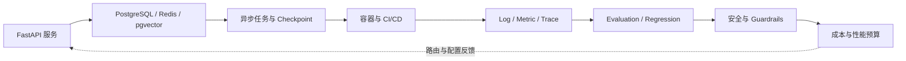

# 第五篇：Agent 工程化

生产质量来自持续闭环，而不是部署完成这一单点事件。下图把服务、数据、运行、观测、评估、安全和成本连接成反馈回路。

沿实线读取一次生产运行，虚线表示观测证据必须回到模型路由、超时、缓存和发布配置；没有反馈回路的 Agent 只能算一次性演示。

| 章 | 主题 | 必须回答的问题 | 状态 |
|---:|---|---|---|
| 23 | [Python 工程基础](ch23-python-engineering.md) | 类型、异步、配置、日志和测试 | 初稿完成 |
| 24 | [FastAPI 服务化](ch24-fastapi.md) | Streaming、鉴权、限流和协议 | 初稿完成 |
| 25 | [数据存储](ch25-storage.md) | 会话、状态、缓存和租户 | 初稿完成 |
| 26 | [Docker 与部署](ch26-docker-deployment.md) | 健康检查、Secret、数据库与 CI/CD | 初稿完成 |
| 27 | [异步任务](ch27-job-queues.md) | 取消、重试、恢复和进度 | 初稿完成 |
| 28 | [Observability](ch28-observability.md) | 日志、指标、Trace、Token 与成本 | 初稿完成 |
| 29 | [Evaluation](ch29-evaluation.md) | 黄金集与回归 | 初稿完成 |
| 30 | [安全与 Guardrails](ch30-security.md) | 注入、外泄和过度代理 | 初稿完成 |
| 31 | [成本与性能](ch31-cost-performance.md) | 路由、缓存、降级和压测 | 初稿完成 |

生产质量来自系统性约束，不来自一次演示成功。每章将用失败注入和可观测证据验证设计。
