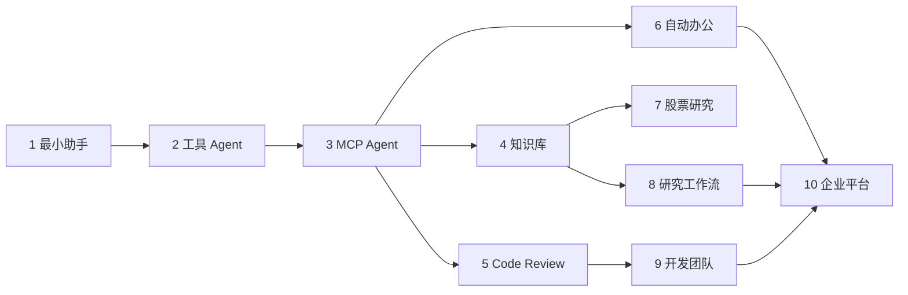

# 第六篇：完整项目实战

每个项目包含需求、数据流、目录、离线可运行代码、配置、共享行为测试、独立 Dockerfile、FAQ 与扩展方向。所有在线依赖都有确定性 Mock；共享 API 可通过 `docker-compose.yml` 启动。外部账号集成仍按各项目 README 的扩展说明接入。

!!! warning "投资风险"
    项目 7 仅用于软件工程与信息整理教学，不构成投资建议，不输出确定性买卖指令。行情、新闻与财报必须标记数据时间和来源，模型推断必须与事实分开。

十个项目不是互相独立的样例集合，而是一条从模型调用到企业平台的能力进阶路径。下图显示每组项目复用和扩展的主要能力。

从左向右先掌握通用运行时，再选择知识、代码或办公纵切面；项目 10 汇总工作流、权限、队列和可观测能力，不要求读者跳过中间项目直接搭建平台。

| 项目 | 核心纵切面 | 状态 |
|---:|---|---|
| 1 最小 AI Assistant | Streaming、Token、历史、配置、错误 | 离线纵切面完成 |
| 2 天气工具 Agent | 多工具、校验、重试、人工确认 | 离线纵切面完成 |
| 3 MCP 本地工具 Agent | Server、Client、文件、系统、数据库 | 离线纵切面完成/协议待核查 |
| 4 企业知识库 Agent | 文档导入、pgvector、重排、引用、评估 | 离线纵切面完成 |
| 5 代码 Review Agent | Diff、静态规则、风险与报告 | 离线纵切面完成 |
| 6 自动办公 Agent | 邮件、日历、日报、审批与审计 | 离线纵切面完成/在线需账号 |
| 7 股票研究 Agent | 带时间与来源的事实/推断分离报告 | 离线纵切面完成 |
| 8 研究工作流 Agent | 规划、搜索、Reviewer、Checkpoint、HITL | 离线纵切面完成/框架待核查 |
| 9 Multi-Agent 开发团队 | 共享状态、成本与终止 | 离线纵切面完成 |
| 10 企业级 Agent 平台 | 租户、权限、队列、Trace、Evaluation | 离线 API/Compose 完成 |
