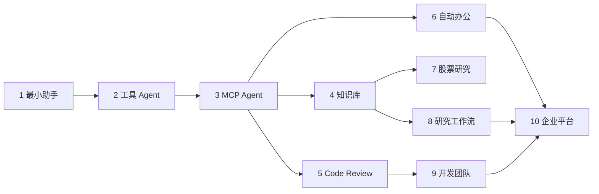
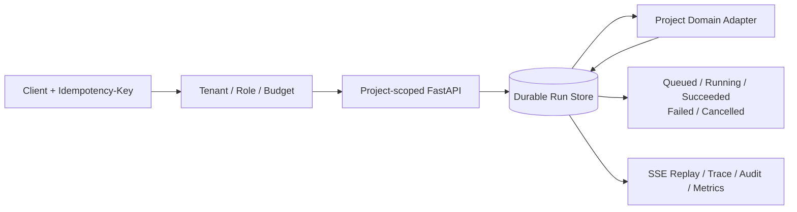

# 第六篇：完整项目实战

每个项目包含需求、数据流、目录、离线可运行代码、配置、共享行为测试、独立 Dockerfile、FAQ 与扩展方向。所有在线依赖都有确定性 Mock；项目 1—9 同时具备项目级 FastAPI 入口和统一服务 Compose，项目 10 使用完整企业平台 Compose。外部账号集成仍按各项目 README 的扩展说明接入。

!!! warning "投资风险"
    项目 7 仅用于软件工程与信息整理教学，不构成投资建议，不输出确定性买卖指令。行情、新闻与财报必须标记数据时间和来源，模型推断必须与事实分开。

十个项目不是互相独立的样例集合，而是一条从模型调用到企业平台的能力进阶路径。下图显示每组项目复用和扩展的主要能力。

从左向右先掌握通用运行时，再选择知识、代码或办公纵切面；项目 10 汇总工作流、权限、队列和可观测能力，不要求读者跳过中间项目直接搭建平台。

共享层只拥有传输与生命周期，领域层仍分别实现 Assistant、Tool、MCP、RAG、Review、Office、Research、Workflow 和团队协作。默认 Header 身份用于离线教学，公网部署必须替换为可信 OIDC/JWT 验证器。

| 项目 | 核心纵切面 | 状态 |
|---:|---|---|
| 1 最小 AI Assistant | Streaming、Token、历史、配置、错误 | 服务模板，Provider 待受控联调 |
| 2 天气工具 Agent | 多工具、校验、重试、人工确认 | 服务模板，真实天气待联调 |
| 3 MCP 本地工具 Agent | Server、Client、文件、系统、数据库 | 服务模板，远程授权待强化 |
| 4 企业知识库 Agent | 文档导入、pgvector、重排、引用、评估 | 服务模板，正式模型与异步摄取待强化 |
| 5 代码 Review Agent | Diff、静态规则、风险与报告 | 服务模板，GitHub App 与 Sandbox 待强化 |
| 6 自动办公 Agent | 邮件、日历、日报、审批与审计 | 服务模板，在线账号与 Outbox 待强化 |
| 7 股票研究 Agent | 带时间与来源的事实/推断分离报告 | 服务模板，正式数据源待强化 |
| 8 研究工作流 Agent | 规划、搜索、Reviewer、Checkpoint、HITL | 服务模板，持久 Worker 待强化 |
| 9 Multi-Agent 开发团队 | 共享状态、成本与终止 | 服务模板，Sandbox 与回滚待强化 |
| 10 企业级 Agent 平台 | 租户、权限、队列、Trace、Evaluation | 离线 API/Compose 完成 |

## 项目 10 企业平台部署拓扑

项目 10 汇总前九个项目中的运行时、工具、MCP、RAG、权限、队列和治理能力。下面的信息图强调生产部署中最容易混淆的两个边界：PostgreSQL 是 Run 与版本的权威事实来源，Redis 是可丢失并可重建的唤醒信号；控制面发布配置，数据面执行具体 Run，两者通过不可变版本关联。

*图 P10-A：项目 10 企业平台部署拓扑。API、Worker 和能力 Adapter 可以逐步拆分扩容，但身份、租户、策略版本、权威状态和审计关联不能因部署拆分而丢失。*

图中的健康检查、有限 Retry、租户 DLQ、备份与恢复演练属于部署验收，而不是“上线后再补”的附加功能。Redis 故障后 Worker 必须能扫描 PostgreSQL 的 queued 状态恢复任务；备份只有经过实际恢复与租户隔离验证，才能成为灾备证据。
