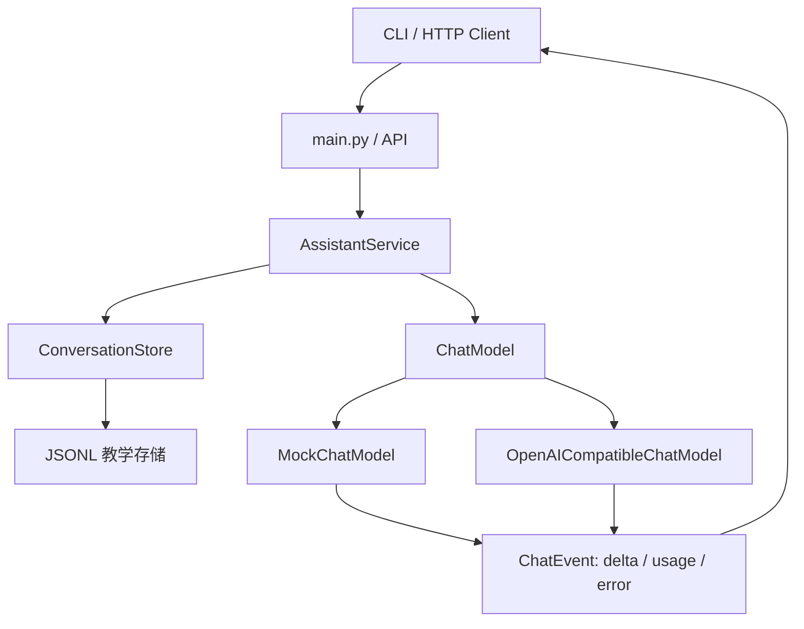
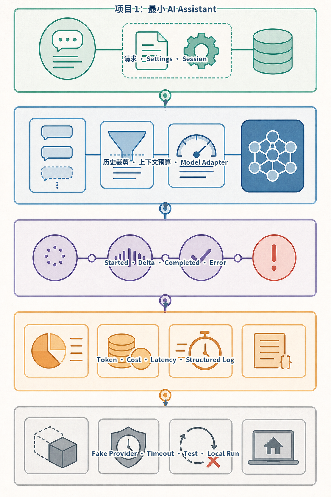
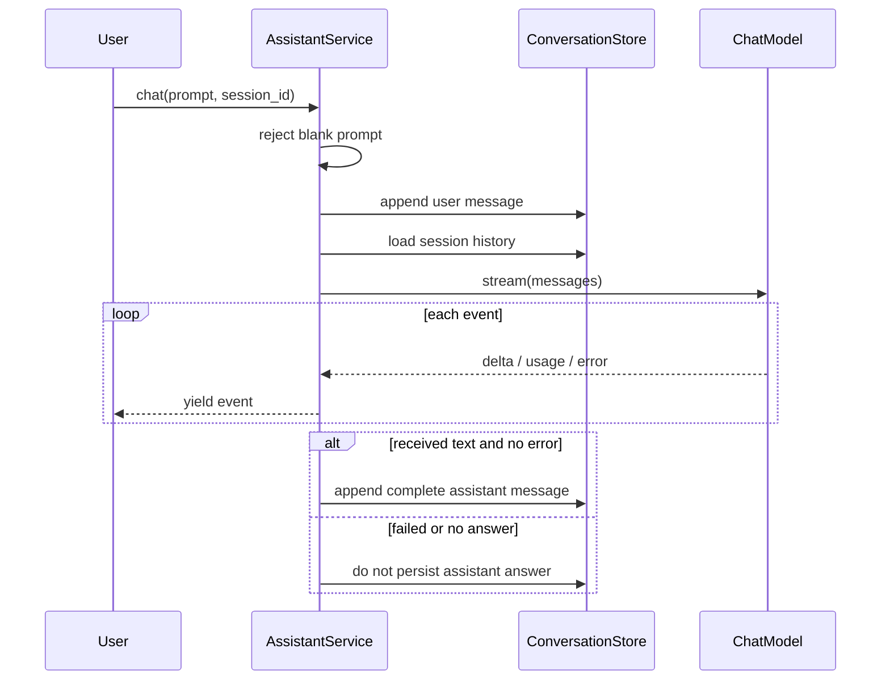
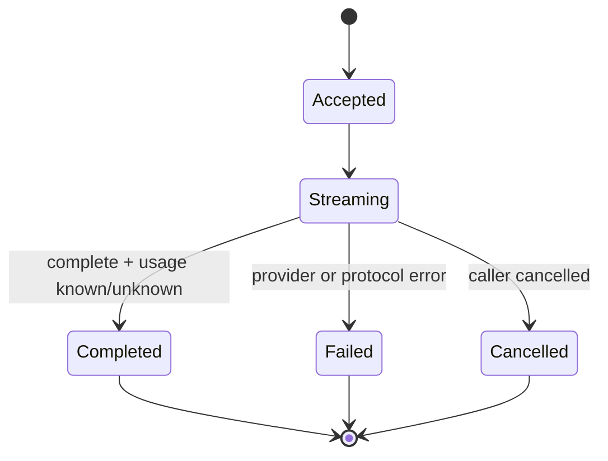

# 项目1：最小 AI Assistant

最后核对日期：2026-08-15。

## 项目导读

本项目实现一条最小但完整的对话链路：用户提交问题，服务加载会话历史，通过模型适配器接收流式增量，记录 Usage，并在成功结束后保存助手消息。它刻意不加入工具、RAG 和复杂工作流，使读者能够先看清模型调用之外仍然必需的配置、状态、事件和失败边界。

完成项目后，读者应能：

1. 区分领域服务、模型适配器和会话存储的职责；
2. 使用类型化事件表达增量文本、Usage 和错误；
3. 理解流式响应为什么需要明确终态；
4. 在没有 API Key 时使用确定性模型完成学习；
5. 说明 Token 估算、供应商 Usage 和实际账单之间的差异；
6. 把一个 CLI 领域流程暴露为可持久化的服务接口。

前置知识为第4章生成机制、第7章 Structured Output、第23章 Python 工程和第24章 FastAPI。

## 需求分析

### 用户故事

一名开发者希望在本地运行一个对话助手，观察流式输出和会话历史；当配置在线模型后，领域代码不需要随供应商改变。服务失败时，用户应看到明确错误，而不是一段截断后被误认为完成的回答。

### 功能需求

| 编号 | 需求 | 验收结果 |
|---|---|---|
| F1 | 接收非空用户 Prompt | 空白输入在调用模型前被拒绝 |
| F2 | 按 `session_id` 加载历史 | 不同会话不会互相读取消息 |
| F3 | 流式输出增量文本 | 客户端可逐段显示 `delta` |
| F4 | 返回 Usage | 已知时返回供应商值，未知时不得伪造 |
| F5 | 保存成功回答 | 失败或截断回答不写成正式助手消息 |
| F6 | 支持离线与在线适配器 | 领域服务不依赖供应商响应对象 |

### 非功能需求

- API Key 只从环境变量读取；
- 在线请求必须有超时；
- 错误事件不泄漏密钥、URL 参数或内部堆栈；
- 会话记录使用明确 Schema；
- 流式协议必须存在完成、失败或取消终态；
- 测试不依赖付费 API。

## 系统边界和架构

下图用纵向层次表达请求如何从接口进入领域服务，再穿过存储与模型端口。模型适配器可以替换，但 `ChatMessage`、`ChatEvent` 和会话规则属于应用自己的契约。



图中最重要的边界不是“离线或在线”，而是领域服务只消费统一事件。供应商以后改为其他流式协议时，只需要修改 Adapter；会话保存、失败规则和客户端事件不应跟着迁移。

项目总览图进一步显示配置、上下文预算和发布证据：



*图 P1-A：最小 Assistant 的请求、流式状态与用量证据。图中的 Token 估算只适合离线教学；在线计费必须以供应商 Usage 和价格版本为准。*

## 数据模型

消息、Usage 和事件是本项目最关键的三个契约：

```python
from typing import Literal

from pydantic import BaseModel, Field


class ChatMessage(BaseModel):
    session_id: str
    role: Literal["user", "assistant"]
    content: str


class TokenUsage(BaseModel):
    prompt_tokens: int = Field(ge=0)
    completion_tokens: int = Field(ge=0)
    total_tokens: int = Field(ge=0)


class ChatEvent(BaseModel):
    type: Literal["delta", "usage", "error"]
    delta: str = ""
    usage: TokenUsage | None = None
    error: str | None = None
```

`ChatEvent` 是教学简化版。正式产品通常还需要 `started`、`completed`、`cancelled`、`finish_reason`、`event_id` 和 `run_id`。当前实现依靠流结束表达完成，因此客户端必须把“连接结束”和“任务成功”区分开；后续项目会把终态建模得更完整。

## 数据流与状态转换

一次请求遵循以下顺序：



先保存用户消息有助于保留请求事实，但也意味着失败请求会留在历史中。产品需要明确这是否符合预期：可以给消息增加 `request_status`，或把用户消息和 Run 放在一个事务中。教学实现使用 JSONL，因此只能说明顺序，不能提供跨进程事务。

流状态至少应遵循：



## 目录结构与代码定位

```text
projects/01-minimal-assistant/
├── README.md
├── main.py
├── api.py
├── Dockerfile
└── tests/
    └── test_assistant.py

src/ai_agent_book/apps/minimal_assistant.py
```

项目目录保存入口与运行说明，完整领域实现位于共享 `src` 包。这种布局便于复用，但读者需要注意：`projects/01-minimal-assistant/` 不是完全独立发布包，运行时应把仓库根 `src/` 加入 Python 路径。

## 分步骤实现

### 第一步：验证配置

在线模式必须在启动或构造阶段确认 API Key，而不是等到第一次用户请求才失败：

```python
class AssistantConfig(BaseModel):
    mode: Literal["offline", "online"] = "offline"
    api_key: str | None = None
    timeout_seconds: float = Field(default=30, gt=0, le=300)

    @model_validator(mode="after")
    def require_online_key(self) -> "AssistantConfig":
        if self.mode == "online" and not self.api_key:
            raise ValueError("online mode requires an API key")
        return self
```

配置模型还应限制 Base URL、模型名称和历史路径。生产系统不应把 Secret 写回配置转储或 Trace。

### 第二步：定义模型端口

```python
from collections.abc import AsyncIterator
from typing import Protocol


class ChatModel(Protocol):
    def stream(
        self,
        messages: list[ChatMessage],
    ) -> AsyncIterator[ChatEvent]: ...
```

领域层不知道 HTTP、SSE 或供应商 SDK。这个端口的不足是没有显式 Deadline 和取消参数，当前依赖协程取消与 Adapter 超时；在更复杂系统中应通过调用上下文传入共享 Deadline。

### 第三步：建立确定性离线模型

离线模型按固定规则分块，并返回可预测 Usage：

```python
class MockChatModel:
    async def stream(
        self,
        messages: list[ChatMessage],
    ) -> AsyncIterator[ChatEvent]:
        prompt = messages[-1].content if messages else ""
        answer = f"离线助手已收到：{prompt}"
        for start in range(0, len(answer), 6):
            yield ChatEvent(type="delta", delta=answer[start : start + 6])
```

这里的 Token 计数是字符估算，只用于演示 Usage 数据怎样传播。它不应与真实 Tokenizer 或账单混用。

### 第四步：保存成功结果

领域服务先收集增量；只有确实产生回答且没有错误事件时才保存助手消息：

```python
answer_parts: list[str] = []
failed = False

async for event in self.model.stream(messages):
    if event.type == "delta":
        answer_parts.append(event.delta)
    elif event.type == "error":
        failed = True
    yield event

if answer_parts and not failed:
    self.store.append(
        ChatMessage(
            session_id=session_id,
            role="assistant",
            content="".join(answer_parts),
        )
    )
```

这段实现防止把明确失败写成正式回答，但仍有一个边界：如果上游在返回部分文本后直接断连且没有生成 `error`，调用方可能无法区分截断与正常结束。工程版必须验证供应商 `finish_reason` 或自己的 `completed` 事件。

## 在线适配器

在线实现发送 `stream=true` 请求，读取 `data:` 行并映射为内部事件。适配器只捕获可公开分类的 HTTP 和 JSON 错误：

```python
try:
    async with client.stream("POST", url, headers=headers, json=payload) as response:
        response.raise_for_status()
        async for line in response.aiter_lines():
            if not line.startswith("data:"):
                continue
            # 解析供应商事件并转换为 ChatEvent
except (httpx.HTTPError, json.JSONDecodeError) as exc:
    yield ChatEvent(
        type="error",
        error=f"model request failed: {type(exc).__name__}",
    )
```

不能把 `str(exc)` 原样交给用户，因为异常可能包含内部 URL、代理信息或请求内容。在线接口属于版本敏感区域，切换供应商前应核对其流式事件、Usage 和结束原因。

## 失败场景：部分文本后连接中断

### 现象

客户端已经显示半句回答，连接随后结束，没有 Usage。若 UI 把网络结束当成成功，用户会看到一条看似完整但实际截断的答案；若服务保存已收集文本，下轮模型还会把它当作真实助手历史。

### 排查链路

```text
HTTP/SSE 是否正常结束
    ↓
是否收到供应商完成原因
    ↓
是否收到内部 completed 事件
    ↓
Usage 是已知、未知还是缺失
    ↓
助手消息是否满足持久化条件
```

### 改进原则

- 适配器把正常结束映射为显式 `completed`；
- 断连映射为 `error` 或 `cancelled`；
- Usage 缺失标记 `unknown`，不生成虚假精确值；
- 只有 `completed` 状态允许保存正式助手消息；
- UI 将部分文本标记为“未完成”，允许用户重试但不覆盖原 Run 证据。

## 运行与预期输出

离线 CLI：

```bash
PYTHONPATH=src .venv/bin/python projects/01-minimal-assistant/main.py
```

预期会连续输出若干文本增量，最后输出 Usage。服务入口：

```bash
PYTHONPATH=src \
DATABASE_PATH=.data/project-1.db \
.venv/bin/uvicorn --app-dir projects/01-minimal-assistant api:app --port 8101
```

容器运行：

```bash
docker build -f projects/01-minimal-assistant/Dockerfile \
  -t ai-agent-book/project-1 .
docker run --rm ai-agent-book/project-1
```

在线模式需要在本地环境中设置 `MODEL_BASE_URL`、`MODEL_API_KEY` 和 `MODEL_NAME`，不得把真实密钥写入命令历史、示例文件或截图。

## 测试设计

最小测试验证流以 Usage 结束：

```python
@pytest.mark.asyncio
async def test_stream_ends_with_usage(tmp_path: Path) -> None:
    service = AssistantService(
        MockChatModel(),
        JsonlConversationStore(tmp_path / "history.jsonl"),
    )
    events = [
        event async for event in service.chat("hello", session_id="test")
    ]
    assert events[-1].type == "usage"
```

教材练习还应补充以下场景：

| 场景 | 关键断言 |
|---|---|
| 空 Prompt | 模型未调用、历史未写入 |
| 两个 Session | 历史严格隔离 |
| 模型先发 Delta 后 Error | 助手消息不持久化 |
| 非法 SSE JSON | 返回安全错误，不泄漏原始异常 |
| 在线超时 | 流进入失败终态 |
| 调用方取消 | 取消传播，客户端不显示完成 |

## 安全与隐私

- 历史记录可能包含 PII，不应把 JSONL 当成长期生产存储；
- API Key 只属于模型适配器，不进入消息或领域状态；
- 日志记录 Session/Run ID、耗时和安全错误码，默认不记录完整 Prompt；
- 多用户服务必须把 `session_id` 与已认证主体绑定，不能信任客户端自由传入；
- 数据保留、导出和删除策略应在启用长期历史前确定。

## 常见问题

### 为什么项目名是“最小”，却仍有这么多边界？

最小指业务能力少，而不是省略错误、状态和安全。只有保留这些边界，后续工具、RAG 和工作流才有可靠基础。

### 能否直接把供应商 SDK 对象返回前端？

不建议。SDK 字段和流事件会变化，也可能包含内部元数据。应用应转换为自己的稳定事件协议。

### JSONL 能用于多人生产服务吗？

不能直接使用。它没有并发事务、租户授权、索引、压缩和删除传播。它只用于展示存储端口和消息顺序。

## 扩展方向

1. 增加显式 `started/completed/cancelled` 事件；
2. 使用真实 Tokenizer 进行调用前预算；
3. 将会话存储替换为 PostgreSQL，并加入主体授权；
4. 增加历史裁剪和摘要，但保留来源；
5. 记录模型、Prompt、价格表和 Usage 版本；
6. 增加模型路由和受预算降级；
7. 将长对话迁移为持久 Run 与可恢复事件流。

## 项目总结

最小 Assistant 已经展示了 Agent 产品最基础的工程事实：模型只负责生成候选文本，应用负责配置、会话、事件、失败、Usage 和持久化。流式输出提升体验，却也引入截断、取消和未知 Usage；只有显式终态和稳定领域协议才能避免把传输成功误认为任务成功。项目2将在此基础上加入结构化工具提议、参数验证、重试、幂等和人工审批。

## 项目练习

### 基础

1. 为 `ChatEvent` 增加 `started`、`completed` 和 `cancelled`，修改持久化条件。
2. 构造“先返回两个 Delta 再断连”的 Fake，证明截断回答不会保存。

### 进阶

3. 为 JSONL Store 增加会话导出与删除接口，并分析并发限制。
4. 为在线 Adapter 设计共享 Deadline，而不是只设置固定客户端 Timeout。

### 挑战

5. 画出把本项目迁移到 PostgreSQL 和持久 Run Store 后的数据流。

## 对应代码

- 项目入口：`projects/01-minimal-assistant/`；
- 领域实现：`src/ai_agent_book/apps/minimal_assistant.py`；
- 项目测试：`projects/01-minimal-assistant/tests/test_assistant.py`；
- 运行说明：`projects/01-minimal-assistant/README.md`。
