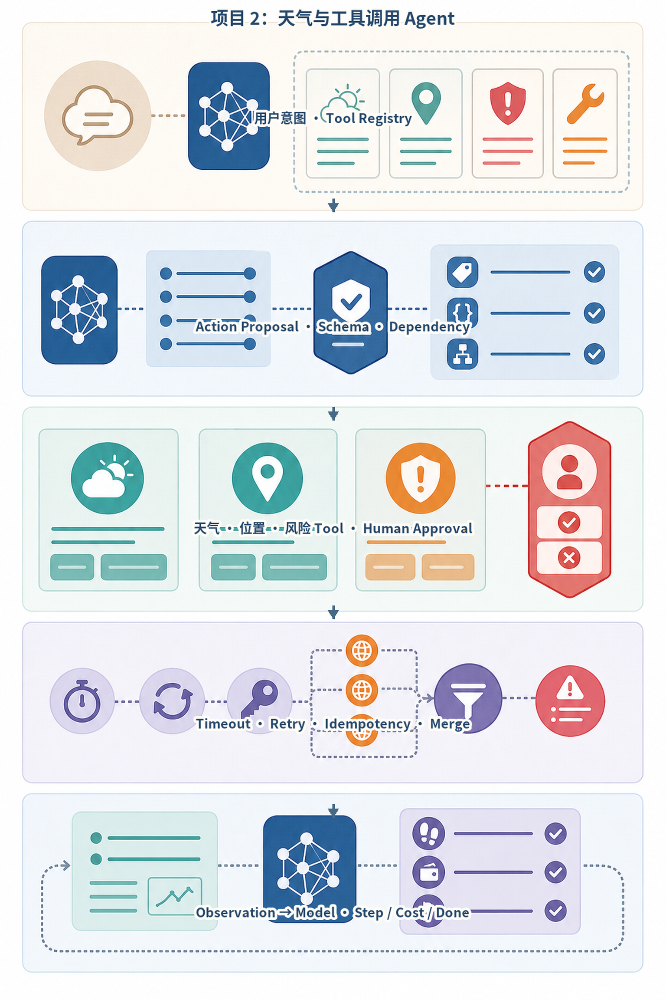
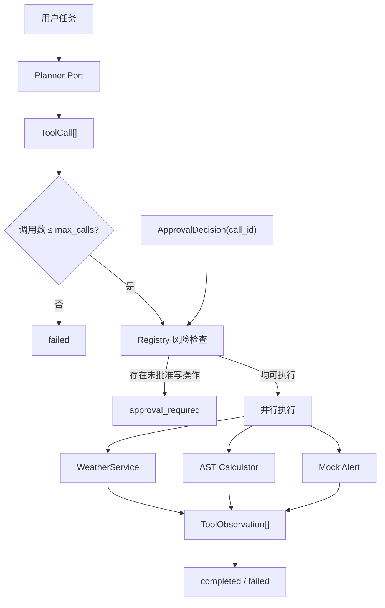
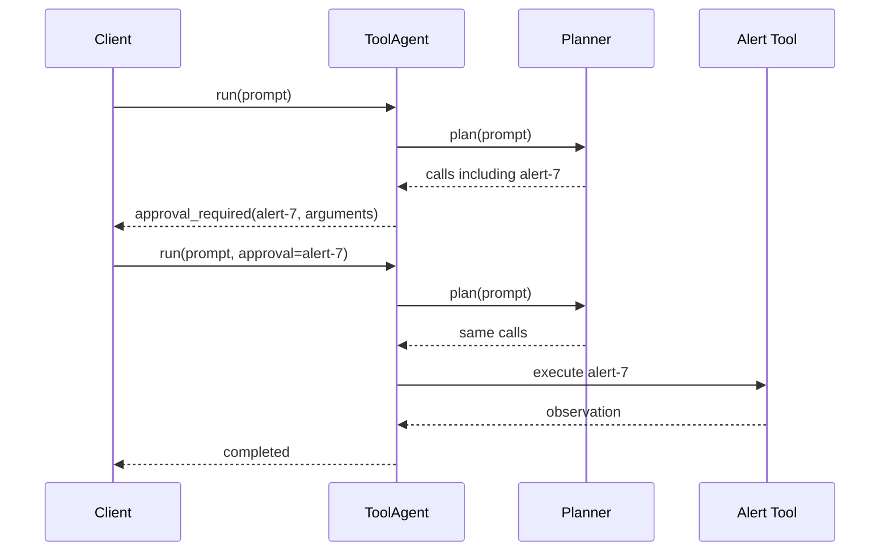
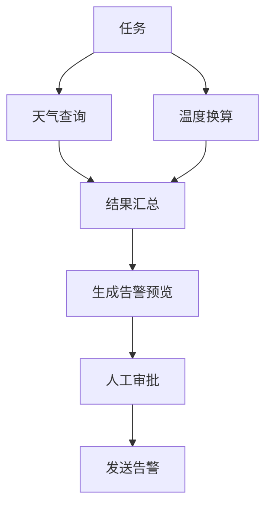

# 项目2：天气与工具调用 Agent

最后核对日期：2026-08-15。

## 项目导读

项目1只处理文本生成，本项目第一次允许模型或 Planner 提出外部动作。系统提供天气查询、受限计算器和告警发送三个工具，重点不在天气数据本身，而在 Tool Calling 的执行边界：模型只提出工具名和参数，Runtime 负责工具发现、Schema 校验、风险分类、审批、超时、有限重试和 Observation。

完成项目后，读者应能：

1. 定义稳定的 `ToolCall` 与 `ToolObservation`；
2. 使用 Pydantic 校验不同工具参数；
3. 区分只读工具和外部写工具；
4. 只并行执行相互独立的调用；
5. 将审批绑定到具体 `call_id`；
6. 区分参数错误、暂时故障、业务拒绝和未知状态。

前置知识为第7—9章和项目1。

## 需求与验收

| 编号 | 需求 | 验收结果 |
|---|---|---|
| F1 | Planner 一次可提出多个工具 | Runtime 对调用数量设置上限 |
| F2 | 工具参数类型化 | 非法城市、表达式或邮箱在执行前失败 |
| F3 | 独立只读工具可并行 | Observation 通过 `call_id` 对齐 |
| F4 | 天气暂时故障有限重试 | 最多三次并返回实际尝试次数 |
| F5 | 外部告警需审批 | 未批准时返回 `approval_required` |
| F6 | 工具错误稳定化 | 不把内部堆栈交给模型或客户端 |

非功能边界包括：单次最多八个调用、每个工具执行超时三秒、计算器不使用 `eval`、告警为 Mock 外部写、天气为离线 Fixture。真实告警系统还需要业务幂等键和投递状态核实，当前项目没有因此宣称生产写入已经完成。

## 架构



*图 P2-A：天气 Tool Agent 的模型提议与运行时门禁。图中的幂等与成本终止是工程目标；当前教学实现主要完成参数、超时、调用上限和审批边界。*



Planner 可以是确定性测试脚本，也可以是在线模型 Adapter。它只能返回候选调用，不能直接获得工具函数或凭证。

## 核心数据契约

```python
class ToolCall(BaseModel):
    call_id: str
    name: str
    arguments: dict[str, Any]


class ApprovalDecision(BaseModel):
    call_id: str
    approved: bool


class ToolObservation(BaseModel):
    call_id: str
    name: str
    ok: bool
    result: dict[str, Any] = Field(default_factory=dict)
    error: str = ""
```

`call_id` 贯穿提议、审批、执行和观察。多个工具并行完成时不能按返回顺序匹配结果；真正的生产系统还应增加 `run_id`、`attempt`、开始/结束时间和工具版本。

## 工具注册表与参数 Schema

```python
class WeatherArguments(BaseModel):
    city: str = Field(min_length=1, max_length=80)


class CalculatorArguments(BaseModel):
    expression: str = Field(min_length=1, max_length=200)


class AlertArguments(BaseModel):
    recipient: str = Field(pattern=r"^[^@\s]+@[^@\s]+\.[^@\s]+$")
    message: str = Field(min_length=1, max_length=1_000)


class ToolSpec(BaseModel):
    name: str
    risk: Literal["read", "external_write"]
    schema_model: type[BaseModel]
    handler: ToolHandler
```

描述、Schema 和风险元数据共同构成工具契约。当前风险只有两级；支付、删除和大批量发送等不可逆动作通常需要更细的资源授权、参数摘要和策略版本。

## 受限计算器

计算器解析 Python AST，只接受数字常量和四则运算：

```python
def _calculate(expression: str) -> float:
    def evaluate(node: ast.AST) -> float:
        if isinstance(node, ast.Expression):
            return evaluate(node.body)
        if isinstance(node, ast.Constant) and isinstance(node.value, int | float):
            return float(node.value)
        if isinstance(node, ast.BinOp) and type(node.op) in _OPERATORS:
            return _OPERATORS[type(node.op)](
                evaluate(node.left),
                evaluate(node.right),
            )
        raise ValueError("只允许数字和 + - * / 运算")

    return evaluate(ast.parse(expression, mode="eval"))
```

直接 `eval(model_expression)` 会把模型输出升级为代码执行权限。AST 白名单降低风险，但仍需限制输入长度、运算深度、数值范围和除零；更复杂计算应使用专门表达式引擎或领域函数。

## Tool Loop 与审批

Runtime 在执行前收集所有未批准的外部写调用：

```python
pending = [
    call
    for call in calls
    if registry.specs.get(call.name)
    and registry.specs[call.name].risk == "external_write"
    and not (
        approval
        and approval.call_id == call.call_id
        and approval.approved
    )
]
```

如果存在 Pending，系统返回调用详情供 UI 展示，不执行同批工具。当前接口一次只接收一个 `ApprovalDecision`；若计划包含多个外部写调用，需要逐个审批或提供带多个绑定项的批准集合。



这暴露一个重要契约：重新运行时 Planner 必须产生相同 `call_id` 和参数，否则旧审批不应继续有效。生产方案通常持久化原始候选并对规范化参数计算哈希，而不是重新调用模型生成一份“看起来相同”的计划。

## 有限重试与超时

天气重试发生在 `WeatherService` 内：

```python
for attempt in range(1, self.max_attempts + 1):
    try:
        async with asyncio.timeout(1):
            if attempt <= self.failures_before_success:
                raise TimeoutError("模拟瞬时故障")
            return WeatherResult(attempts=attempt, ...)
    except TimeoutError:
        if attempt == self.max_attempts:
            raise
```

Registry 外层再使用三秒工具超时。这里必须避免把每层都配置成三次重试，否则一次用户任务可能指数放大。参数错误、未知工具、审批拒绝和除零不属于天气暂时故障，不应进入相同重试。

## 并行执行边界

当前实现使用 `asyncio.gather` 执行获准的全部调用。它适合示例中的独立天气、计算和 Mock 告警，但通用 Runtime 不应默认把所有调用并行化。



若告警消息依赖天气结果，就不能像当前静态调用数组一样同时执行。工程 Planner 应表达依赖边，Runtime 只调度 Ready 节点。

## 失败案例：批准后参数发生变化

### 风险

用户看到“发送给 `ops@example.com`”并批准，Planner 第二次运行却把地址改成另一个邮箱。如果系统只检查 `call_id`，恶意或随机变化可能复用旧审批。

### 正确处理

审批令牌应绑定：

```text
principal + run_id + tool_name + canonical_arguments_hash
+ policy_version + expires_at
```

恢复时重新计算参数哈希，任何变化都使审批失效。当前教学实现只绑定 `call_id`，所以它用于解释审批流程，不是完整生产审批系统。

## 运行方式

```bash
PYTHONPATH=src .venv/bin/python projects/02-weather-tool-agent/main.py

PYTHONPATH=src \
DATABASE_PATH=.data/project-2.db \
.venv/bin/uvicorn --app-dir projects/02-weather-tool-agent api:app --port 8102
```

容器命令：

```bash
docker build -f projects/02-weather-tool-agent/Dockerfile \
  -t ai-agent-book/project-2 .
docker run --rm ai-agent-book/project-2
```

离线天气是 Fixture，不可用于业务告警或安全决策。

### 成功输出样例

下面是离线 Fixture 的结构化结果，不代表实时天气：

```json
{
  "run_id": "run_weather_001",
  "status": "completed",
  "tool_calls": [
    {"name": "get_weather", "arguments": {"city": "上海"}, "attempts": 1}
  ],
  "answer": "上海：22°C，阵雨（离线教学数据）"
}
```

## 测试设计

现有最小测试验证天气调用成功。完整教学验收还应覆盖：

| 场景 | 断言 |
|---|---|
| 未知工具 | `ok=false`，处理函数未调用 |
| 城市为空 | 返回字段级安全错误 |
| 非法计算表达式 | 不执行函数、属性或导入 |
| 调用数超过上限 | Agent 直接失败 |
| 外部写未批准 | 返回 Pending，所有工具均未执行 |
| 批准 ID 不匹配 | 仍保持 Pending |
| 天气瞬时失败 | 预算内成功并记录 `attempts` |
| 天气持续失败 | 工具失败，不无限重试 |

## 安全与工程边界

- Planner 不接触业务凭证；
- Registry 不接受任意模块或函数名；
- 参数校验成功后仍需资源授权；
- Observation 只返回安全错误类别；
- 外部写必须有业务幂等键和状态对账；
- 多租户服务不能让模型决定租户 ID；
- 工具输出仍是不可信数据，不能升级为系统指令。

## 项目总结

本项目把模型输出从文本推进为受控动作。可靠性来自模型外的工具注册表、Schema、风险策略、审批、超时和重试边界。当前实现适合解释 Tool Loop，不应把 Mock 告警、单 `call_id` 审批和静态并发计划描述为生产完成。项目3将把工具从进程内注册表迁移到 MCP Client/Server 协议边界。

## 项目练习

### 基础

1. 为审批增加规范化参数哈希与过期时间。
2. 让 Planner 输出依赖边，只并行执行 Ready 的只读节点。

### 进阶

3. 为外部告警加入幂等键、状态查询和 Unknown 终态。
4. 给计算器增加 AST 深度与结果范围限制。

### 挑战

5. 设计在线模型 Planner Adapter，但保持 `ToolCall` 领域契约不变。

## 对应代码

- 项目入口：`projects/02-weather-tool-agent/`；
- 领域实现：`src/ai_agent_book/apps/weather_agent.py`；
- 天气 Fixture：`src/ai_agent_book/project_domains.py`；
- 项目测试：`projects/02-weather-tool-agent/tests/test_weather.py`。
