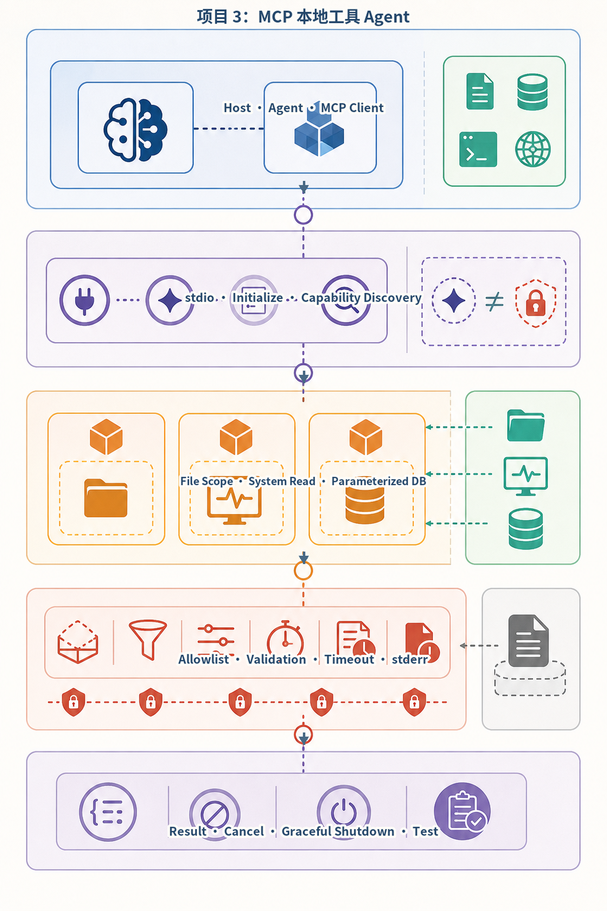
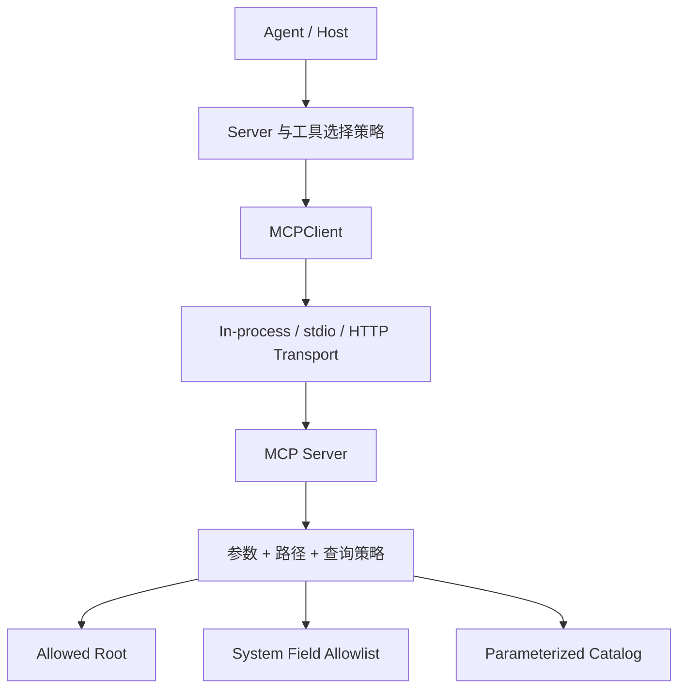
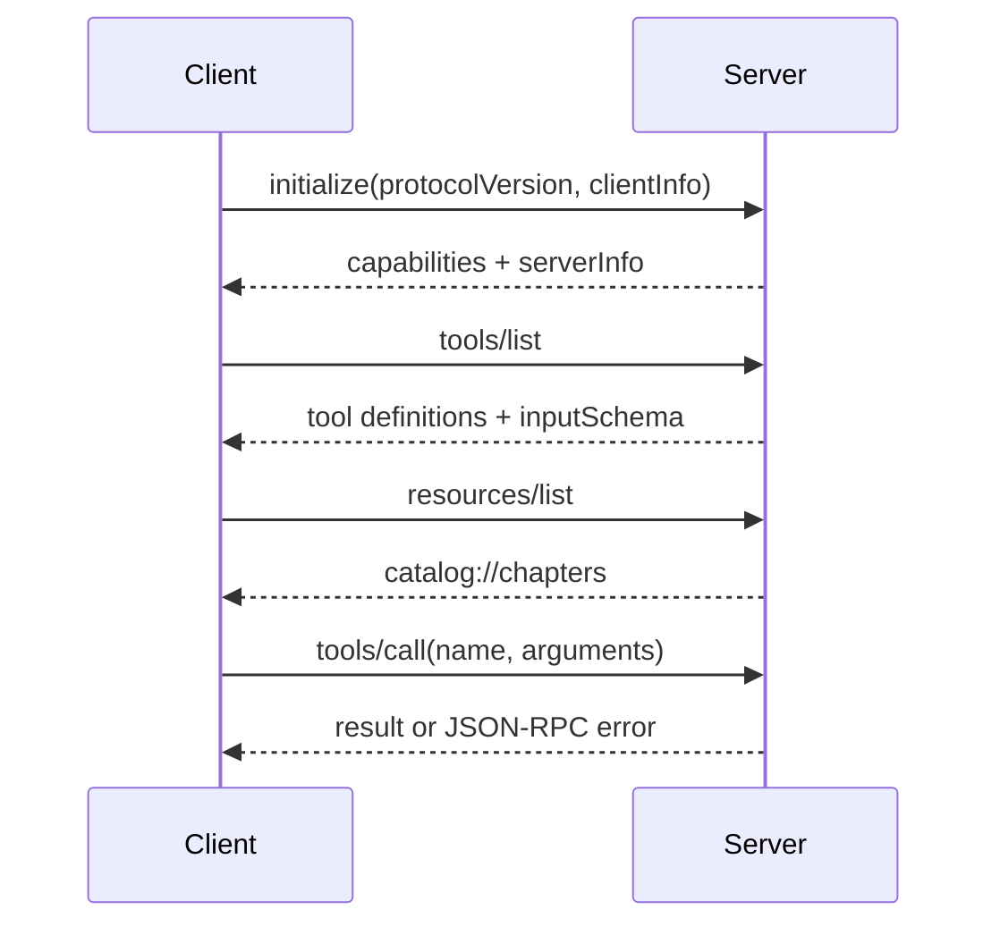
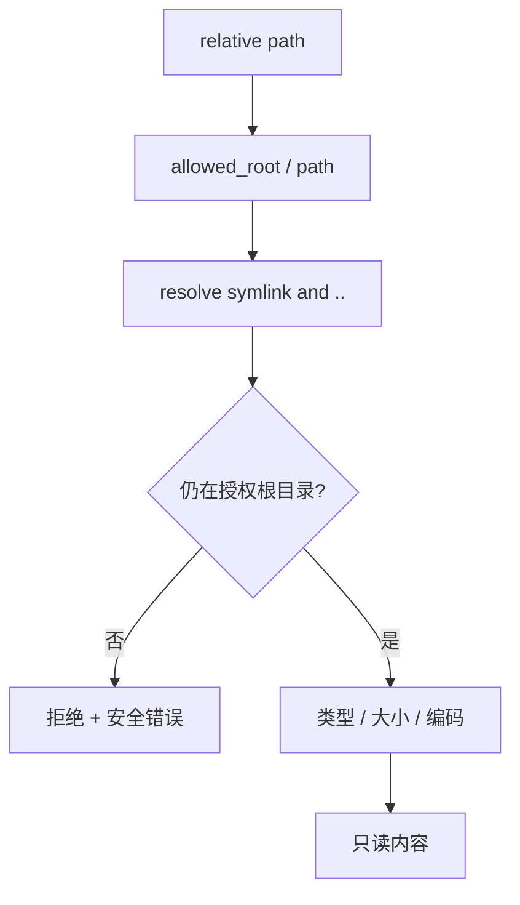

# 项目3：MCP 本地工具 Agent

最后核对日期：2026-08-15。协议和 SDK 属于版本敏感内容，生产使用前应重新核对正式规范与固定依赖。

## 项目导读

项目2把工具注册在应用进程内，本项目把能力移到 MCP Server，通过 Client、Transport、初始化和能力发现建立协议边界。Server 暴露只读文件、系统信息、目录查询和 Resource；Host 仍然决定连接哪个 Server、向模型展示哪些能力以及使用什么主体权限。

本项目包含两条路径：

- `src/ai_agent_book/apps/mcp_local.py`：为理解 JSON-RPC 生命周期编写的教学子集；
- `projects/03-mcp-local-agent/official_sdk/`：固定 `mcp==2.0.0` 的隔离 SDK 示例。

教学实现不应冒充完整 MCP SDK，官方 SDK 示例也不自动提供远程 OAuth、多租户授权和生产网络治理。

## 需求与威胁边界

| 能力 | 允许范围 | 明确禁止 |
|---|---|---|
| `read_file` | 授权根目录内 UTF-8 文本 | 目录穿越、任意绝对路径、Secret 目录 |
| `system_info` | Python 版本和操作系统名称 | 环境变量、进程参数、完整主机信息 |
| `query_catalog` | 参数化查询内置目录 | 任意 SQL、写入、跨库访问 |
| Resource | 固定 `catalog://chapters` | 任意 URI 到文件或网络的映射 |

非功能要求：stdout 只承载协议消息，日志写 stderr；参数和结果有大小限制；错误不泄漏真实物理路径；Client 能区分 JSON-RPC Error 与成功 Result。

## 架构



*图 P3-A：本地 MCP Client、Server 与资源信任边界。能力发现描述 Server 声明的能力，不代表当前主体已获得全部资源权限。*



Client 不应把 `tools/list` 的全部结果无条件交给模型。Host 可以按用户、任务和风险缩小候选工具；Server 仍需在每次调用中重新校验。

## 协议生命周期

教学实现使用 JSON-RPC 2.0，并把协议版本固定在源码声明值。生命周期如下：



完整规范还包含更丰富的生命周期、通知和能力。教材子集只实现本项目用到的方法，因此新增功能优先使用官方 SDK，不继续扩张自制协议栈。

## Server 分发和错误契约

入口先校验 JSON-RPC 形状，再分发方法：

```python
async def handle(self, request: dict[str, Any]) -> dict[str, Any]:
    request_id = request.get("id")
    try:
        if request.get("jsonrpc") != "2.0":
            raise MCPError(-32600, "invalid JSON-RPC request")
        result = await self._dispatch(
            str(request["method"]),
            request.get("params") or {},
        )
        return {"jsonrpc": "2.0", "id": request_id, "result": result}
    except MCPError as exc:
        return {
            "jsonrpc": "2.0",
            "id": request_id,
            "error": {"code": exc.code, "message": exc.message},
        }
```

稳定错误类别比抛出 Python 堆栈更适合跨进程协议。内部日志可以记录受保护的诊断上下文，响应只返回调用方需要的公开信息。

## Tool 定义与能力发现

```python
{
    "name": "read_file",
    "description": "读取允许根目录内的 UTF-8 文本文件",
    "inputSchema": ReadFileArguments.model_json_schema(),
}
```

Tool 描述影响模型选择，`inputSchema` 约束参数形状，Server Policy 决定资源访问。三者不能互相替代。描述中不能写“可读取任意文件”，即使代码随后会拒绝；错误描述会诱导模型不断产生不可能的调用。

## 文件边界与路径穿越

文件路径先与授权根目录组合并解析符号链接，再检查最终路径：

```python
def read_file(self, relative_path: str) -> str:
    target = (self.root / relative_path).resolve()
    if not target.is_relative_to(self.root):
        raise PermissionError("路径越过允许根目录")
    return target.read_text(encoding="utf-8")
```



生产实现还需限制文件大小、扩展名、读取超时和符号链接策略，并确保目录本身不会被其他低权限进程替换。

## 数据库和系统信息

目录查询只接受关键词并绑定参数：

```python
rows = self.db.execute(
    "SELECT title, kind FROM catalog "
    "WHERE title LIKE ? ORDER BY title",
    (f"%{keyword}%",),
).fetchall()
```

模型不能提供 SQL。`system_info` 只返回 Python 和 OS 名称，不读取环境变量、网络接口、用户名或进程列表。最小信息原则既减少隐私暴露，也降低 Prompt Injection 利用系统信息寻找后续目标的机会。

## Client 与 Transport 分离

```python
class MCPTransport(Protocol):
    async def request(
        self,
        method: str,
        params: dict[str, Any],
    ) -> dict[str, Any]: ...
```

`InProcessTransport` 让协议调用可确定性测试；stdio 或 HTTP Transport 可以替换而不改变 `MCPClient` 的业务接口。Transport 仍需管理取消、超时、进程退出、消息大小和连接关闭。

## stdio 的特殊规则

stdio Server 一行读取一个 JSON-RPC 消息，一行写一个响应。任何普通日志若写入 stdout，Client 都可能把它当协议 JSON 解析而失败。

```python
sys.stdout.write(json.dumps(response, ensure_ascii=False) + "\n")
sys.stdout.flush()
```

日志应通过 `logging` 指向 stderr。真实 Server 还要正确响应子进程关闭、取消未完成任务，并限制无换行超大输入。

## 官方 SDK 路径

隔离项目位于：

```text
projects/03-mcp-local-agent/official_sdk/
├── pyproject.toml
├── src/mcp_local_official/
└── tests/
```

它固定 `mcp==2.0.0`，用于验证 Tool、Resource、Prompt、stdio 子进程和无状态 Streamable HTTP。版本固定只证明当前候选可复现；远程生产部署仍需 Origin、OAuth、Protected Resource Metadata、对象授权、限流和审计。

## 失败案例：日志污染 stdout

### 现象

Server 启动时输出一行“ready”，Client 期待 JSON-RPC，却得到普通文本并报告 Parse Error。工具实现本身可能完全正确，但协议通道已经损坏。

### 排查

1. 捕获子进程 stdout 原始字节；
2. 检查启动代码和第三方库的 `print()`；
3. 确认日志 Handler 指向 stderr；
4. 逐行验证每个 stdout 消息都是合法协议对象；
5. 检查异常路径是否输出 Traceback 到 stdout。

### 修复

把普通日志转到 stderr，并在进程级测试中同时断言 stdout 可解析、stderr 不进入协议。不要通过 Client 忽略“非 JSON 行”掩盖 Server 违规。

## 运行与测试

```bash
PYTHONPATH=src .venv/bin/python projects/03-mcp-local-agent/main.py

PYTHONPATH=src \
DATABASE_PATH=.data/project-3.db \
.venv/bin/uvicorn --app-dir projects/03-mcp-local-agent api:app --port 8103
```

测试至少覆盖：

- 初始化版本成功与不支持版本；
- Tool 和 Resource 发现；
- 合法文件读取；
- `../`、绝对路径和符号链接逃逸；
- 未知 Tool、未知 Resource 和非法参数；
- SQL 关键词参数化；
- stdio 日志分离和进程关闭；
- 官方 SDK stdio 与 HTTP 路径。

### 成功输出样例

stdio 的 stdout 只包含协议消息；普通日志应出现在 stderr：

```json
{"jsonrpc":"2.0","id":1,"result":{"protocolVersion":"2026-07-28"}}
{"jsonrpc":"2.0","id":2,"result":{"tools":[{"name":"read_text"},{"name":"query_device"}]}}
{"jsonrpc":"2.0","id":3,"result":{"content":[{"type":"text","text":"fixture: device online"}]}}
```

## 安全清单

- Host 只连接 allowlist Server；
- Server 身份、版本和来源可追踪；
- 文件和数据库能力遵循最小权限；
- Tool 结果有大小限制并视为不可信数据；
- 远程传输使用认证、Origin 校验和 TLS；
- Client 与 Server 都设置 Deadline；
- 错误不泄漏物理路径、SQL、环境变量或堆栈；
- 审计记录主体、Server、Tool、参数摘要和结果状态。

## 项目总结

MCP 统一的是能力发现和调用协议，不是业务授权。Host、Client、Transport、Server 与资源策略必须分别建模。教学 JSON-RPC 子集帮助理解生命周期，生产接入应优先使用固定版本官方 SDK；无论使用哪条路径，文件根目录、SQL 目录、结果大小和凭证范围都必须由模型外代码强制执行。项目4将在这一外部能力边界上建立企业知识库和可引用 RAG。

## 项目练习

### 基础

1. 为文件工具增加扩展名、大小和读取 Deadline 限制。
2. 编写 stdio 子进程测试，证明 stdout 只有协议消息。

### 进阶

3. 增加分页 Resource，并设计稳定 Cursor。
4. 为远程 HTTP MCP 设计主体到对象权限的映射。

### 挑战

5. 对比自制 JSON-RPC 子集和官方 SDK，列出不应继续自行实现的协议能力。

## 对应代码

- 教学 Server/Client：`src/ai_agent_book/apps/mcp_local.py`；
- 项目入口：`projects/03-mcp-local-agent/`；
- 官方 SDK 示例：`projects/03-mcp-local-agent/official_sdk/`；
- 项目测试：`projects/03-mcp-local-agent/tests/test_local_tools.py`。
