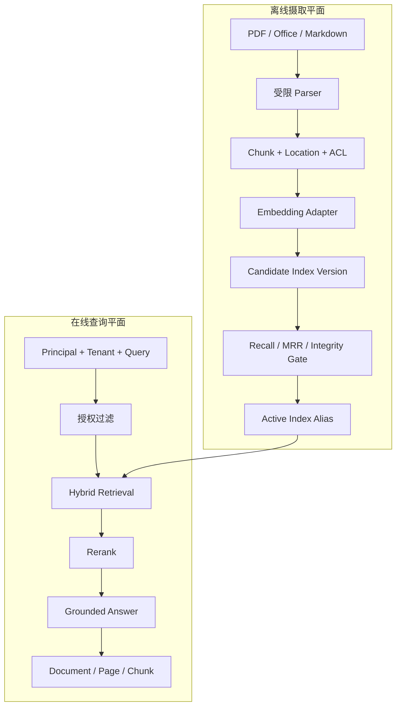
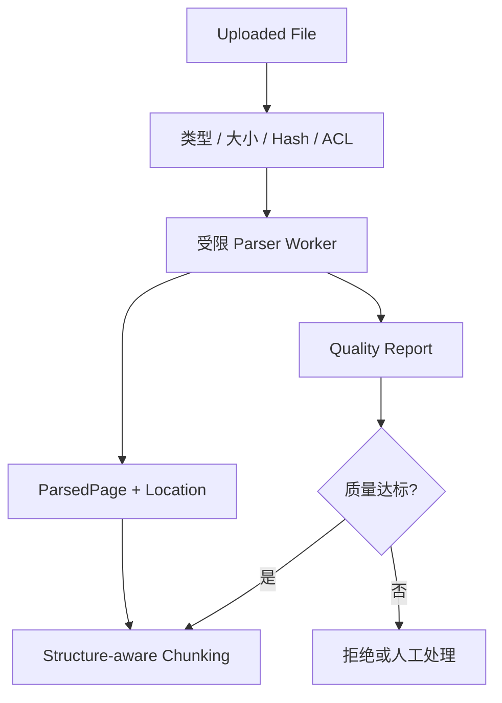
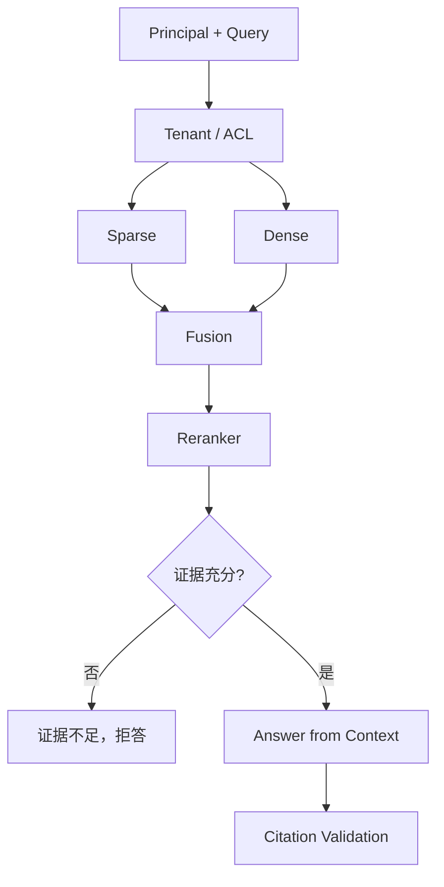
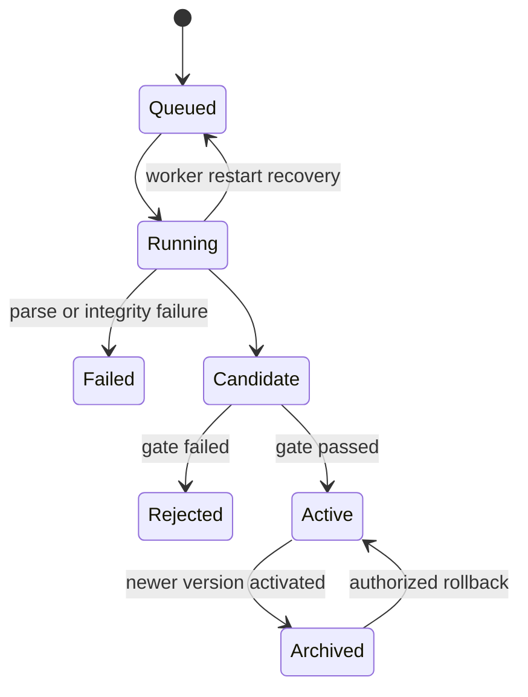

# 项目4：企业知识库 Agent

最后核对日期：2026-08-15。

## 项目导读

企业知识库不是“把 PDF 放进向量库”。完整系统包含不可信文件解析、位置化 Chunk、Embedding 和索引版本、租户权限、混合检索、重排、引用、黄金集评估、候选发布与回滚。本项目同时提供确定性离线实现和 pgvector Adapter 边界，使读者能在没有付费模型时理解控制流，又不会把哈希向量冒充真实语义质量。

完成项目后，读者应能：

1. 设计从原始文件到活动索引的版本化摄取流程；
2. 在检索前执行租户与 ACL 过滤；
3. 区分检索指标和答案指标；
4. 生成包含文档、页码、Chunk 和分数的引用；
5. 使用黄金集阻止低质量候选索引发布；
6. 解释回滚、删除和合规销毁的不同语义。

前置知识为第5、13—16、25和29章。

## 需求分析

### 业务场景

员工需要查询制度、产品文档和技术手册。回答必须只使用当前员工有权访问的文档，标出来源和页码；证据不足时拒答。管理员导入新版本后，系统先离线构建和评估，达标后再切换活动索引。

### 功能与质量要求

| 类别 | 要求 | 验收证据 |
|---|---|---|
| 摄取 | PDF、DOCX、PPTX、Markdown | 每个 Chunk 保留文档与位置 |
| 安全 | 文件大小、解压和租户限制 | 恶意压缩包和跨租户查询被拒绝 |
| 检索 | 稠密、词项和混合排序 | 黄金集 Recall@K、MRR |
| 回答 | 只根据检索证据生成 | Citation 与拒答样例 |
| 发布 | 候选索引先评估后激活 | 版本状态与发布门禁 |
| 恢复 | 中断 Job 可恢复，旧索引可回滚 | Job 与 Index Version 记录 |

## 总体架构


*图 P4-A：企业知识库的摄取、检索、引用与评估闭环。离线摄取质量和在线回答质量通过索引版本关联。*



两个平面共享文档、ACL、解析器、Embedding 和索引版本，但有不同 SLO。导入可以是长任务，查询必须保持低延迟；候选构建失败不能影响现有活动索引。

## 数据模型与引用

```python
class Chunk(BaseModel):
    chunk_id: str
    document_id: str
    tenant_id: str
    text: str
    source: str
    page: int
    embedding: list[float]


class Citation(BaseModel):
    document_id: str
    source: str
    page: int
    chunk_id: str
    score: float
```

引用不是装饰链接。它至少要能定位原始文档版本和片段位置；当文档更新或撤权时，历史回答仍需要说明当时使用的版本，但不能继续向无权用户暴露正文。

## 文件解析边界

`DocumentParser` 根据格式选择解析器。PDF 使用 `pypdf`，DOCX/PPTX 可以直接读取 ZIP 中的 XML，从而让离线环境理解结构；这不等于完整还原 Office 布局。生产解析还需要：

- 限制原始与解压后大小；
- 限制页数、嵌套对象和解析时间；
- 处理扫描页 OCR；
- 保留表格表头、图题、页码和版面区域；
- 在隔离 Worker 中处理不可信文件；
- 对失败页生成质量报告，而不是静默丢弃。



## Chunk、Embedding 与测试替身

离线 `_embed()` 使用确定性哈希生成固定维度向量。它的用途是让相同输入得到相同输出，从而测试索引、权限、版本和发布控制。它没有真实语义泛化能力，不能用于宣称企业问答效果。

正确证据分层是：

| 层次 | 离线哈希向量能证明 | 不能证明 |
|---|---|---|
| 控制流 | 摄取、查询、引用、版本可重复 | 自然语言语义相似性 |
| 权限 | 租户过滤和跨租户拒绝 | 生产身份系统正确性 |
| 评估代码 | Recall/MRR 计算逻辑 | 正式模型在真实语料的指标 |
| 迁移 | 候选构建、切换和回滚 | 目标规模性能 |

接入正式 Embedding 后，必须重新构建黄金真值、阈值和索引；不能沿用哈希向量产生的数字。

## 检索前权限过滤

查询必须携带租户，过滤先于结果进入模型：

```sql
SELECT chunk_id, document_id, page, content,
       1 - (embedding <=> :query_vector) AS score
FROM knowledge_chunks
WHERE tenant_id = :tenant_id
  AND document_version = :active_version
ORDER BY embedding <=> :query_vector
LIMIT :top_k;
```

参数绑定避免 SQL 注入，但租户隔离还应由 Repository、数据库账户或 RLS 强制。先全库 ANN 再在应用中过滤不仅可能不足 `top_k`，还会让越权候选进入日志和 Trace。

## 混合检索、重排与拒答

本地 `KnowledgeBase` 组合词项和向量分数，再返回带位置命中。Reranker 只能调整候选顺序，不能恢复第一阶段完全漏掉的证据，也不能证明文档事实正确。



拒答阈值必须在真实评估集上校准，不能照抄某个框架默认分数，因为不同模型、距离和重排器的分数范围不同。

## 检索评估

`evaluate_retrieval()` 计算 Recall@K 与 MRR：

```text
Recall@K = 至少在前 K 命中目标证据的查询比例
MRR      = 目标证据首次出现排名倒数的平均值
```

检索指标回答“证据是否被找到、排在何处”，不能证明模型最终使用了证据。答案层还需正确性、Faithfulness、引用支持和拒答准确率。

黄金集至少包含：

- 单文档直接问题；
- 跨文档组合问题；
- 编号、缩写和精确实体；
- 证据不足问题；
- 已废止版本；
- 跨租户攻击；
- 包含 Prompt Injection 的文档；
- 表格、扫描页和图像证据。

## 版本化摄取与发布

`VersionedKnowledgePipeline` 把摄取记录为持久 Job。Candidate 只有同时通过质量指标和完整性检查才激活：



Job 提交时绑定原文、Chunk 配置和黄金集指纹。活动切换在事务中完成，查询 Trace 记录实际索引版本。`rejected` 候选不能通过回滚绕过门禁。

## 失败案例：新 Embedding 直接覆盖活动索引

### 现象

团队更换 Embedding 模型，在同一集合中逐条覆盖向量。迁移期间查询同时命中新旧向量空间，分数阈值失效，部分文档不可检索，也无法一键回滚。

### 正确迁移

```text
冻结文档与 ACL 快照
  → 使用新模型构建独立 Candidate
  → 黄金集 + 精确真值 + 权限泄漏测试
  → 影子双读比较
  → 原子切换 Active Alias
  → 保留旧索引观察
  → 通过后清理或失败回滚
```

即使新旧模型维度相同，也不能假定向量空间兼容。阈值、HNSW 参数和 Reranker 都需要重新校准。

## 回滚与删除不是同一件事

回滚切换到仍保留且通过完整性校验的归档版本。合规删除则要求原文、Chunk、Embedding、缓存和派生摘要不可继续返回，并通过 Tombstone 防止备份恢复后复活。不能用“可以回滚”作为无限保留已删除数据的理由。

## 运行与存储

离线入口：

```bash
PYTHONPATH=src .venv/bin/python projects/04-knowledge-agent/main.py
```

服务入口：

```bash
PYTHONPATH=src \
DATABASE_PATH=.data/project-4.db \
.venv/bin/uvicorn --app-dir projects/04-knowledge-agent api:app --port 8104
```

pgvector 边界位于 `projects/04-knowledge-agent/schema.sql` 和 `PgVectorKnowledgeRepository`。运行真实数据库前需核对镜像、扩展、维度和距离操作符；离线测试通过不能替代数据库性能证据。

### 成功输出样例

```json
{
  "status": "answered",
  "answer": "设备进入保护模式前应先断开高压并等待规定放电时间。",
  "citations": [
    {"document_id": "manual-v3", "chunk_id": "safety-04", "page": 18}
  ],
  "index_version": "candidate-2026-08-15",
  "evidence_complete": true
}
```

该样例展示的是输出契约。正式答案必须由目标租户可见的实际文档支持；若 Citation 校验失败，应返回证据不足而不是保留无来源文字。

## 测试矩阵

| 层次 | 必测内容 |
|---|---|
| Parser | 格式、页码、超大文件、损坏 ZIP、扫描页 |
| Chunk | 重叠、表格、代码、来源位置、稳定 ID |
| Retrieval | 空索引拒答、Recall/MRR、阈值、候选不足 |
| Security | 跨租户、撤权、缓存键、恶意文档指令 |
| Release | Candidate 失败不影响 Active、原子切换、回滚 |
| Recovery | Running Job 重排队、内容哈希失败、重复提交 |
| Deletion | 主记录、向量、缓存、摘要和恢复 Tombstone |

## 安全与隐私

- 文档解析运行在受限资源环境；
- 原始文件、Chunk、Embedding 和 Trace 都按租户授权；
- Prompt Injection 文本始终作为证据数据，不得修改系统目标；
- Citation API 重新鉴权，不因回答曾引用就永久公开原文；
- Embedding 仍可能泄露语义，不能视为匿名数据；
- 评估集和失败样本可能包含敏感内容，需要独立保留策略。

## 项目总结

企业知识库 Agent 的可靠性来自完整证据生命周期：安全解析、位置化 Chunk、版本化 Embedding、检索前 ACL、混合检索、引用验证、黄金集门禁和可回滚发布。哈希向量使控制逻辑可离线复现，但不能证明真实语义质量；pgvector 提供存储边界，也不能替代文档治理和答案评估。项目5将把类似的证据链应用于代码 Diff 和 Review 报告。

## 项目练习

### 基础

1. 为一组 Markdown 和 PDF 文档建立含页码与 Chunk ID 的黄金集。
2. 对比固定长度与结构切分，报告 Recall、引用完整性和 Context Token。

### 进阶

3. 接入正式 Embedding，重新生成精确真值和阈值，不复用哈希指标。
4. 为 Active/Candidate 切换设计并发发布和回滚测试。

### 挑战

5. 设计跨主存储、向量、缓存和备份恢复的删除 Saga。

## 对应代码

- 项目入口：`projects/04-knowledge-agent/`；
- 领域实现：`src/ai_agent_book/apps/knowledge_agent.py`；
- pgvector Schema：`projects/04-knowledge-agent/schema.sql`；
- 项目测试：`projects/04-knowledge-agent/tests/test_knowledge.py`。
