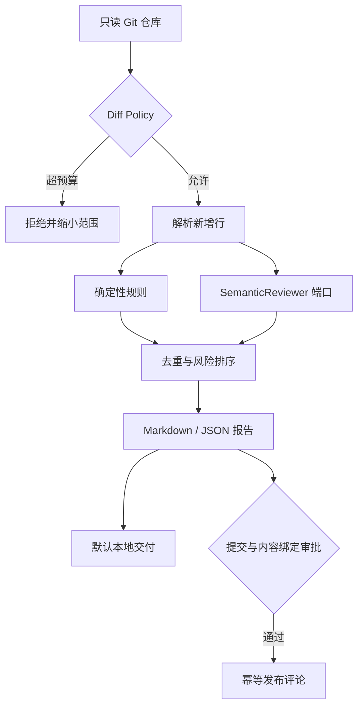
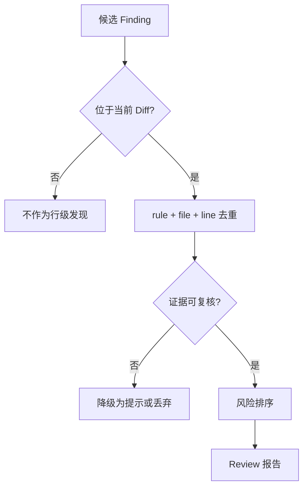
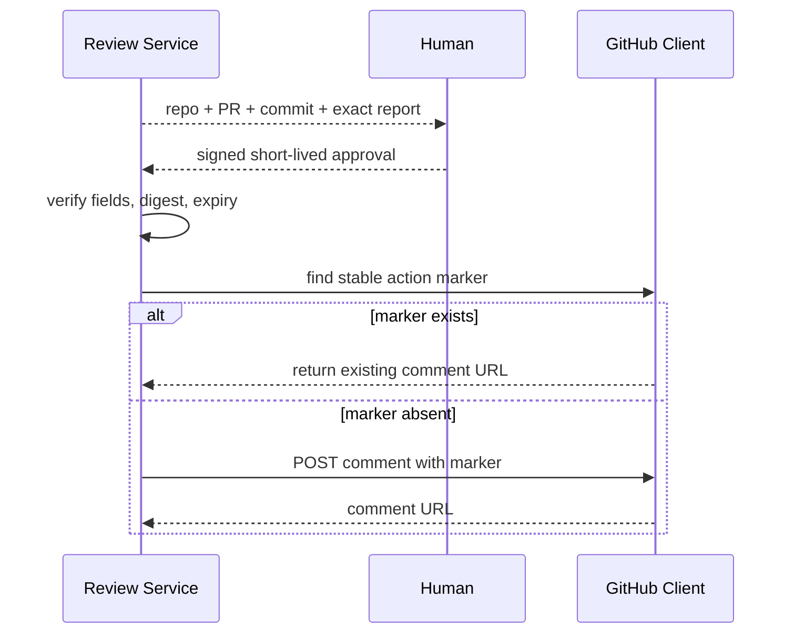

# 项目5：代码 Review Agent

最后核对日期：2026-08-15。

## 项目导读

代码审查 Agent 的价值不是替代编译器、静态分析器或资深 Reviewer，而是把多类证据组织成可定位、可复核的报告。本项目把 Git Diff 作为唯一默认范围：确定性规则负责可以重复证明的问题，语义 Reviewer 负责需要上下文判断的风险，最终报告保留文件、新行号、规则来源和建议。任何向 GitHub 发布评论的动作都位于独立审批门之后。

完成本项目后，读者应能设计 Diff 范围策略、合并确定性与概率性证据、绑定审批内容，并说明“生成建议”和“修改外部系统”为什么是两个不同权限。

## 需求与威胁模型

| 目标 | 验收证据 | 主要风险 |
|---|---|---|
| 只审查本次变更 | Finding 可回到新文件行号 | 巨型 Diff 消耗预算 |
| 合并静态和语义发现 | 保留 `rule`、`risk` 与来源 | 模型意见冒充确定事实 |
| 默认生成本地报告 | 未批准时网络调用数为零 | 自动评论污染 PR |
| 可选发布 PR 评论 | 审批绑定仓库、PR、SHA 和报告 | 旧批准被用于新提交 |
| Webhook 驱动 | 校验签名并去重 delivery | 重放导致重复审查 |

项目不运行仓库中的任意脚本，也不自动修改代码。若扩展到构建和测试，必须使用隔离执行环境；普通 Python 子进程不是安全沙箱。

## 总体架构


*图 P5-A：证据合并与外部发布门。报告生成是默认路径，PR 评论是额外授权动作。*



静态规则与模型建议都产生同一 `ReviewFinding`，但报告应标记来源和置信度。Schema 统一不等于证据强度相同。

## 核心数据模型

```python
from typing import Literal

from pydantic import BaseModel, Field


class ChangedLine(BaseModel):
    file: str
    line: int = Field(ge=1)
    content: str


class ReviewFinding(BaseModel):
    rule: str
    risk: Literal["low", "medium", "high"]
    file: str
    line: int
    message: str
    suggestion: str
```

位置采用 Diff 的新文件行号，而不是补丁文本行号。若扩展到重命名、删除行和多语言语法树，需要进一步记录旧路径、旧行号、Hunk 与提交 SHA。

## 从 Diff 到报告

`GitRepository.diff()` 使用参数列表调用 Git，并用 Ref 白名单避免 Shell 注入。`DiffPolicy` 在任何模型调用前限制字节数、文件数和新增行数。解析器只收集 `+` 新增行，静态规则检查硬编码凭证、可变默认参数、宽泛异常和动态执行。

```python
def run_static_rules(lines: list[ChangedLine]) -> list[ReviewFinding]:
    findings: list[ReviewFinding] = []
    for line in lines:
        if "eval(" in line.content or "exec(" in line.content:
            findings.append(
                ReviewFinding(
                    rule="dynamic-eval",
                    risk="high",
                    file=line.file,
                    line=line.line,
                    message="动态执行输入可能导致代码执行",
                    suggestion="使用显式解析器、白名单或隔离执行环境。",
                )
            )
    return findings
```

这是最小示例；仓库实现使用预编译正则和多条规则。生产系统应优先接入成熟静态分析器，并把其原生严重度与位置保存为证据，不能让 LLM 重新解释后覆盖原始结果。



## 审批、Webhook 与幂等发布

审批不是一个布尔值。`ApprovalAuthority` 对仓库、PR、提交 SHA、报告 SHA-256 和过期时间签名。报告或提交改变后，旧令牌必然失效。



“先查询再 POST”并非原子操作，并发 Worker 仍可能同时发布。工程版应在数据库中对动作键做单写领取，或由串行发布 Worker 处理。Webhook 的 delivery ID 也需要和载荷哈希一起保存：同一 ID、同一载荷返回已处理；同一 ID、不同载荷直接拒绝。

## 运行、验证与失败诊断

```bash
PYTHONPATH=src .venv/bin/python projects/05-code-review-agent/main.py
PYTHONPATH=src .venv/bin/python -m pytest tests/test_code_review_app.py -q
```

测试覆盖临时仓库 Diff、规则报告、未审批零网络、审批绑定、伪造 Webhook、重复 delivery、超预算范围和评论去重。排查时先按数据流定位：没有发现应检查 Diff Ref 与解析行号；重复评论应检查动作键、并发领取和远端分页；评论落在错误提交应立即检查批准令牌是否绑定 `commit_sha`。

### 成功输出样例

```json
{
  "commit_sha": "fixture-a1b2c3",
  "decision": "changes_requested",
  "findings": [
    {
      "severity": "high",
      "path": "app/auth.py",
      "line": 42,
      "source": "static_rule+llm_review",
      "evidence": "tenant_id filter removed"
    }
  ],
  "published": false,
  "approval_required": true
}
```

## 工程边界与扩展

- GitHub App 使用安装级短期 Token 和仓库 Allowlist；不要使用个人长期 Token 作为平台凭证。
- 模型只接收必要的 Diff 与上下文；凭证、二进制和生成文件先过滤。
- SARIF、构建、测试和 CodeQL 结果保持原始证据，不由模型替换。
- 评论发布失败区分确定未送达和结果未知；结果未知先查询远端，避免盲重试。
- 真实多语言审查应加入 Repo Map、依赖变更和调用关系，但仍受 Context 与成本预算约束。

## 小结与练习

本项目把审查拆成范围控制、证据生成、报告整合和外部发布四个边界。最重要的结论是：模型建议可以参与审查，但不能抹去确定性工具的证据，也不能自动获得写入 PR 的权限。

### 基础

1. 为 `ReviewFinding` 增加 `source` 与 `confidence`，设计兼容旧报告的迁移方式。

### 进阶

2. 画出“GitHub 已接受评论但客户端超时”的恢复流程。

### 挑战

3. 说明为什么仅限制 Prompt 长度不能替代 Diff 文件数和新增行预算。

本章代码目录：`projects/05-code-review-agent/` 与 `src/ai_agent_book/apps/code_review.py`。
