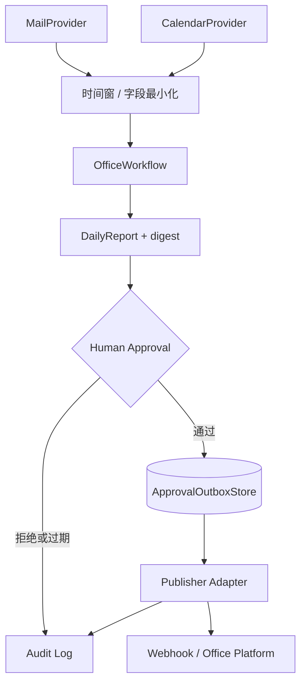
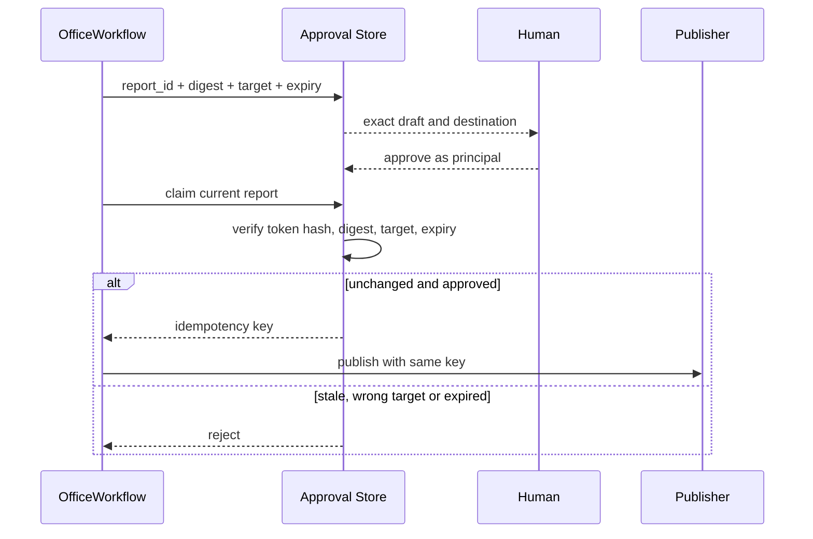
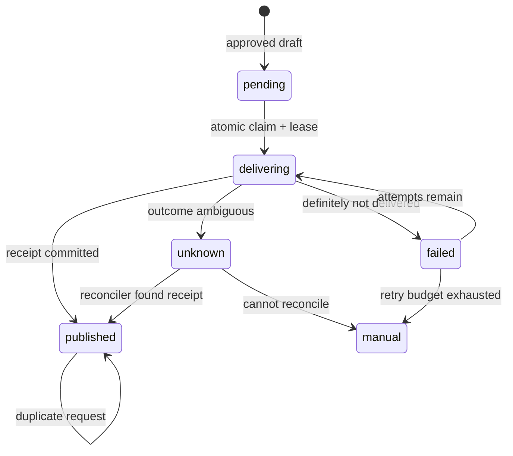
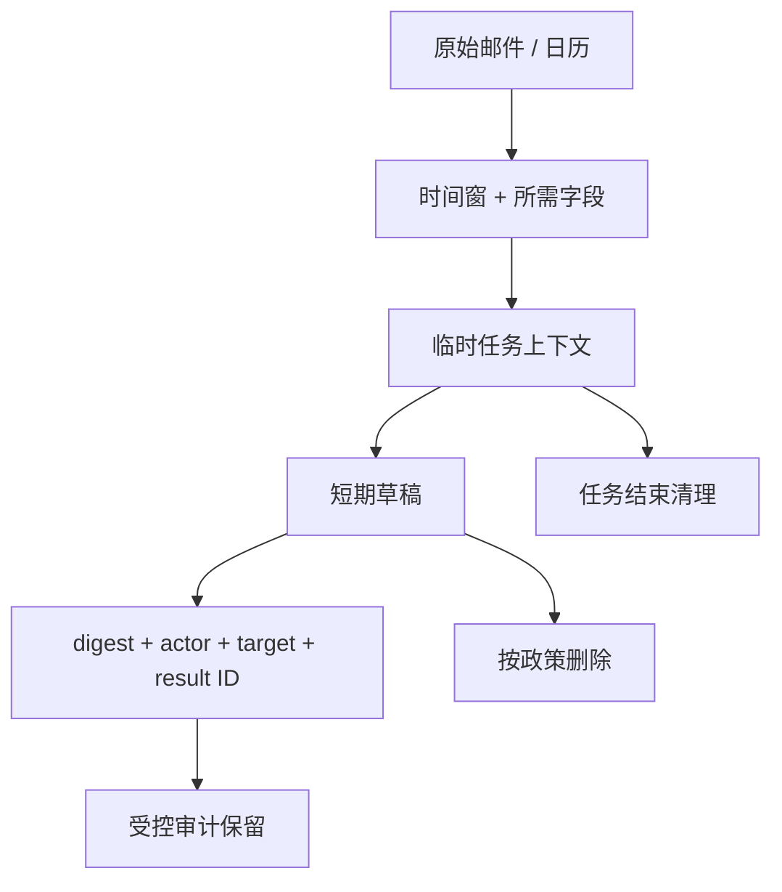

# 项目6：自动办公 Agent

最后核对日期：2026-08-15。

## 项目导读

自动办公 Agent 同时接触邮件、日历和外部发布接口，最大风险不是总结不够流畅，而是读取过量隐私数据、把草稿发错目标或在重试中重复发送。本项目把读取、生成和写入严格分层：Provider 只提供时间窗口内的最小字段，工作流生成日报草稿，内容绑定审批通过后才进入持久 Outbox。

完成项目后，读者应能定义 Provider 端口、设计可失效的审批令牌、解释 Outbox 的故障恢复边界，并区分“至少一次投递”“业务幂等”和“结果未知”。

## 需求与安全边界

| 能力 | 默认权限 | 发布条件 |
|---|---|---|
| 读取邮件与日历 | 指定时间窗、只读、字段最小化 | Provider 凭证具备最小 Scope |
| 生成日报 | 本地计算 | 不需要外部写权限 |
| 发布到 Webhook/办公平台 | 默认关闭 | 内容、目标、主体和有效期均获批 |
| 失败重试 | 有限次数 | 只有“确定未送达”可自动重试 |
| 结果未知 | 冻结 | 远端回执查询或人工对账 |

项目当前实现通用 Webhook 边界，没有冒充 Gmail、Outlook、Notion 或飞书的完整 OAuth 集成。

## 总体架构


*图 P6-A：自动办公 Agent 的审批与持久 Outbox。审批决定与外部投递状态分别持久化。*



## Provider 与领域模型

```python
from collections.abc import Sequence
from datetime import datetime
from typing import Protocol


class MailProvider(Protocol):
    async def list_messages(
        self, start: datetime, end: datetime
    ) -> Sequence[EmailMessage]: ...


class Publisher(Protocol):
    async def publish(
        self,
        title: str,
        markdown: str,
        *,
        idempotency_key: str,
    ) -> str: ...
```

Provider 隔离供应商认证、分页和限流；领域工作流只看到标准消息与事件。Fixture 实现相同协议，使读者在没有账号和 API Key 时仍能运行完整控制流。

`DailyReport` 保存开始与结束时间、Markdown 和内容摘要。摘要必须由规范化内容计算，不能依赖对象内存地址或不稳定 JSON 顺序。发布目标也必须进入幂等键，否则同一正文发往两个频道会被错误合并。

## 内容绑定审批



批准记录只存令牌哈希而不是明文。即便数据库泄漏，攻击者也不能直接复用令牌；不过数据库仍包含日报正文和目标，需要加密、访问控制和保留期限。

## Outbox 状态机

网络调用发生在数据库事务之外，因此存在“远端成功、本地尚未记录回执就崩溃”的窗口。项目用状态机显式表达这一事实。



`Idempotency-Key` 只有在目标服务真正支持时才有效。若服务既不支持幂等键，也不能按业务键查询回执，系统只能将歧义结果冻结为 `unknown`，不能宣称 exactly-once。

```python
async def publish(
    self,
    title: str,
    markdown: str,
    *,
    idempotency_key: str,
) -> str:
    response = await self.client.post(
        self.url,
        headers={"Idempotency-Key": idempotency_key},
        json={"title": title, "markdown": markdown},
    )
    response.raise_for_status()
    return str(response.json()["id"])
```

## 审计与隐私

审计记录应回答谁在何时读取了哪个时间窗口、生成了哪个草稿、谁批准了哪个目标以及外部返回了什么业务 ID。日志不应包含 OAuth Token、完整邮件正文或第三方错误响应中的敏感字段。Prompt Trace 也属于数据副本，必须遵循同样的保留和删除政策。



## 运行、调试与验收

```bash
PYTHONPATH=src .venv/bin/python projects/06-office-agent/main.py
PYTHONPATH=src .venv/bin/python -m pytest tests/test_office_agent_app.py -q
```

专项测试覆盖未批准零网络、内容/目标/过期绑定、重启后去重、确定失败重试、歧义超时回执核对和无法核对时人工处理。调试重复发布时，不要先增加重试次数；先检查目标是否尊重幂等键、动作键是否稳定、租约是否过早过期，以及结果未知是否被错误归类为确定失败。

### 成功输出样例

```json
{
  "action_id": "office_20260815_001",
  "target": "team-channel-rd",
  "content_digest": "sha256:fixture",
  "approval": "verified",
  "delivery": {"status": "sent", "provider_id": "fixture-msg-17"},
  "audit_event": "office.message.sent"
}
```

样例故意只保存内容摘要与供应商结果引用；邮件正文、附件和 OAuth Token 不进入普通 Audit Event。

## 工程扩展

- Gmail、Microsoft Graph 或飞书接入使用最小 OAuth Scope，支持 Token 轮换和撤销。
- 读取使用增量游标和分页，记录供应商时间语义；不要每次扫描整个邮箱。
- 创建日历、发送邮件和更新文档分别定义审批动作，不能共享宽泛的“允许办公操作”。
- 发送高风险邮件时增加收件人域、附件类型和敏感信息 DLP 门禁。
- Outbox Worker 独立扩展时使用数据库行锁或原子 Claim，避免双重领取。

## 小结与练习

办公自动化的工程核心是限制数据和副作用，而不是让模型写出更像人的邮件。读取、生成、批准、投递、对账和审计必须是可区分的状态。

### 基础

1. 设计一个“日报只允许发送到本团队频道”的目标策略。

### 进阶

2. 比较连接失败、读取超时和 HTTP 500 对自动重试的不同处理。

### 挑战

3. 为附件摘要补充恶意文件解析隔离流程图。

本章代码目录：`projects/06-office-agent/` 与 `src/ai_agent_book/apps/office_agent.py`。
