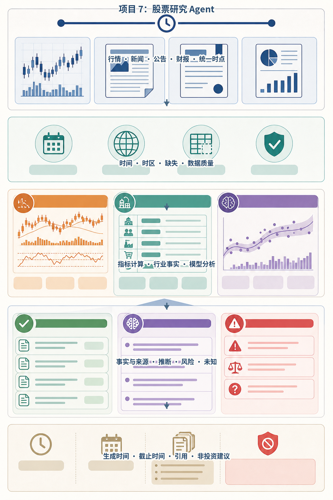
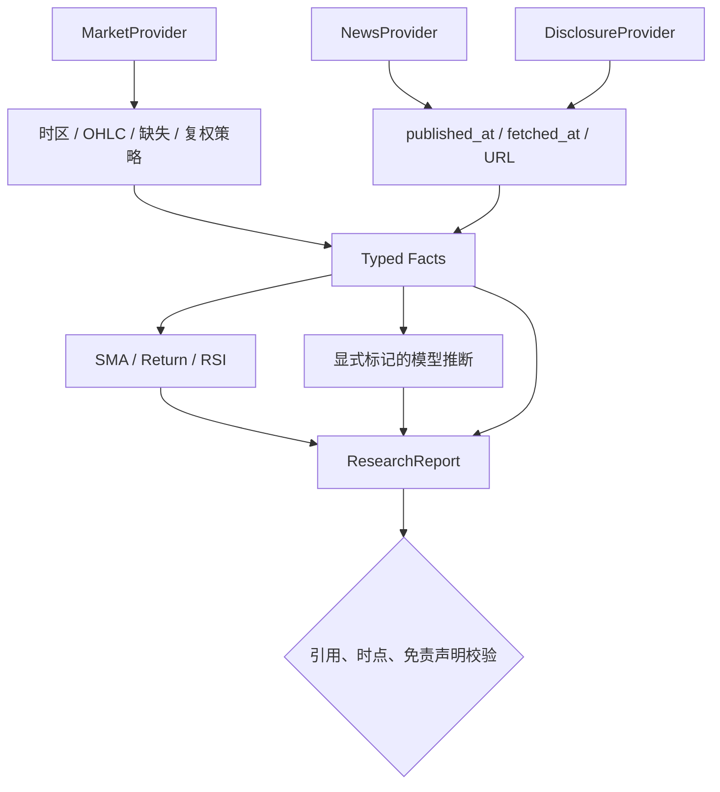
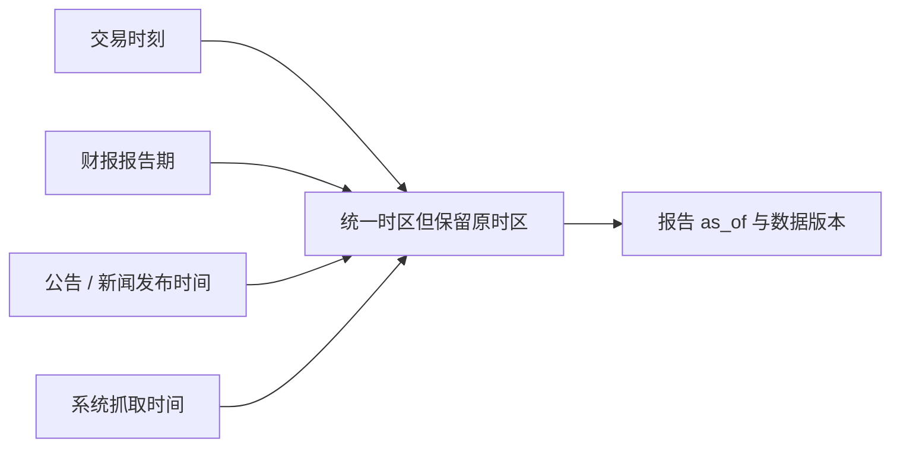
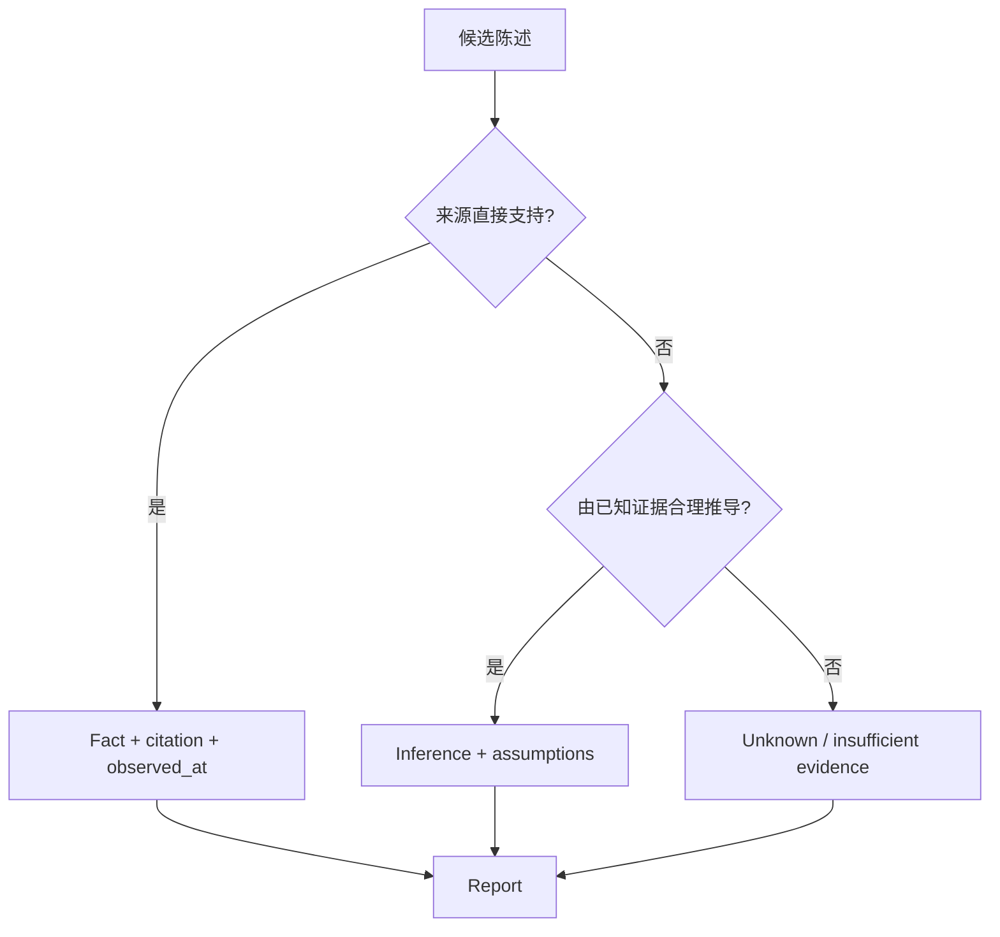

# 项目7：股票研究 Agent

最后核对日期：2026-08-15。

!!! warning "用途边界"
    本项目仅用于软件工程与信息整理教学，不构成投资建议，不执行交易，也不输出确定性买卖指令。

## 项目导读

股票研究 Agent 的首要任务是建立数据谱系：行情的交易时刻、新闻的发布时间、公告的报告期和系统的抓取时间不能混为一个“最新”。模型只能在可追溯事实和确定性指标之上给出明确标记的推断。本项目以结构化报告展示这种分层，而不是用语言流畅度掩盖数据质量问题。

完成项目后，读者应能设计多来源异步采集、校验 OHLC、计算基础指标、区分事实与推断、生成带时点和引用的报告，并列出正式数据源接入仍需完成的许可、复权和时区工作。

## 需求与验收

| 要求 | 报告中的证据 |
|---|---|
| 行情、新闻、公告分源采集 | 每个 `SourceItem` 有 URL 与 `published_at` |
| 标明数据截止时间 | 报告包含统一时区的 `as_of` |
| 指标可重复计算 | SMA、区间收益、RSI 来自确定性函数 |
| 事实与推断分离 | `facts` 和 `inferences` 是不同字段 |
| 不给确定性买卖建议 | 固定免责声明并有发布校验 |
| 无付费账号可运行 | Fixture Provider 覆盖完整链路 |

## 数据与推断架构



*图 P7-A：股票研究的数据时点、来源、事实与推断边界。任何结论都应能追溯到输入或明确标记为模型推断。*



## 数据模型与时点

```python
class Fact(BaseModel):
    category: str
    statement: str
    source_url: str
    observed_at: datetime


class ResearchReport(BaseModel):
    symbol: str
    as_of: datetime
    indicators: IndicatorSet
    facts: list[Fact]
    inferences: list[str]
    sources: list[SourceItem]
    disclaimer: str = "本报告仅用于技术教学，不构成投资建议。"
```

`published_at` 表示来源发布信息的时间，`observed_at` 表示事实对应或被观察的时间，抓取时间则说明系统何时取得该版本。正式财报还应记录报告期、修订版本和公告标识。它们不可互相替代。



## 并发采集与失败策略

当前 `StockResearchAgent.research()` 使用 `asyncio.gather` 并发读取三类来源。这样降低独立 I/O 的总延迟，但默认行为是任一 Provider 抛错则本次研究失败。生产系统应按来源重要性定义策略：行情缺失通常阻止发布；一条新闻源失败可以降级，但报告必须显示覆盖不完整。

```python
bars_result, news_result, disclosures_result = await asyncio.gather(
    self.market.get_bars(symbol),
    self.news.get_news(symbol),
    self.disclosures.get_disclosures(symbol),
)
```

不要用无限重试追求“完整”。每个 Provider 应有共享 Deadline、有限退避、速率限制和缓存策略；超过截止时间后，要么生成明确的不完整报告，要么失败，不能悄悄使用过期数据。

## 指标计算与边界

项目计算 5 日简单移动平均、5 日区间收益和 RSI14。OHLC 模型验证最高价和最低价是否覆盖开盘、收盘与彼此。RSI 数据不足时返回 `None`，而不是伪造中性值。

```python
def rsi(closes: list[float], period: int = 14) -> float | None:
    if len(closes) <= period:
        return None
    changes = [b - a for a, b in zip(closes, closes[1:], strict=False)]
    window = changes[-period:]
    avg_gain = sum(max(change, 0) for change in window) / period
    avg_loss = sum(max(-change, 0) for change in window) / period
    if avg_loss == 0:
        return 100.0
    strength = avg_gain / avg_loss
    return round(100 - 100 / (1 + strength), 2)
```

该实现适合教学，不应直接与交易软件结果比较：数据是否复权、交易日历、窗口定义和 Wilder 平滑方式都会影响数值。技术指标只描述历史窗口，不能单独推出未来方向。

## 事实、推断和未知



“公司公告收入增长 10%”可以是带来源事实；“增长可能来自新品”若没有直接来源就是推断；“下季度一定继续增长”既缺证据又包含确定性预测，应被拒绝。模型输出还需逐项验证引用确实支持陈述。

## 发布前质量门禁

- `as_of` 与每个来源的时区和时间语义明确；
- 事实均有有效来源，不能引用 Fixture URL 冒充线上数据；
- 指标包含输入窗口和算法版本；
- 推断与事实分栏，关键假设可见；
- 数据缺失和冲突明确呈现；
- 报告包含免责声明，不含确定性收益或买卖指令。

数据供应商通常有展示、缓存和再分发许可限制。即使 API 技术上可调用，也不等于可以把原始数据公开发布。

## 运行、验证与调试

```bash
PYTHONPATH=src .venv/bin/python projects/07-stock-research-agent/main.py
PYTHONPATH=src .venv/bin/python -m pytest tests/test_stock_research_app.py -q
```

测试验证带时间的事实、来源、指标、推断和 HTTP 行情适配器解析。若指标异常，先检查排序、时区、重复 Bar、缺失交易日和复权口径；若引用异常，检查来源去重和抓取版本；若报告看似最新但事实过期，检查 `as_of` 是否错误使用生成时间。

### 成功输出样例

```json
{
  "symbol": "DEMO",
  "as_of": "2026-08-15T08:00:00Z",
  "facts": [
    {"claim": "收盘价为 100.00（教学数据）", "source_id": "fixture-market-01"}
  ],
  "inferences": [
    {"claim": "短期波动上升", "basis": ["fixture-market-01"], "confidence": "low"}
  ],
  "unknowns": ["公告源尚未完成当天更新"],
  "disclaimer": "本报告仅用于教学，不构成投资建议。"
}
```

## 工程扩展

正式系统需要合规数据源、交易所日历、公司行动与复权策略、公告原文存档、新闻去重、来源可靠度、缓存版本和数据质量告警。行业分析还应记录分类标准版本。任何自动交易都是另一个高风险系统，需独立授权、风控和合规设计，不属于本项目扩展的默认路径。

## 小结与练习

股票研究 Agent 是数据工程、证据工程和报告治理问题。模型只有在时点、来源、指标和陈述类型已经明确后，才适合参与信息整理。

### 基础

1. 设计一个允许新闻源降级、但禁止行情源降级的并发采集结果模型。

### 进阶

2. 为财报修订建立版本关系，说明旧报告如何保持可追溯。

### 挑战

3. 编写发布校验规则，拒绝“必涨”“稳赚”和没有来源的数字陈述。

本章代码目录：`projects/07-stock-research-agent/` 与 `src/ai_agent_book/apps/stock_research.py`。
