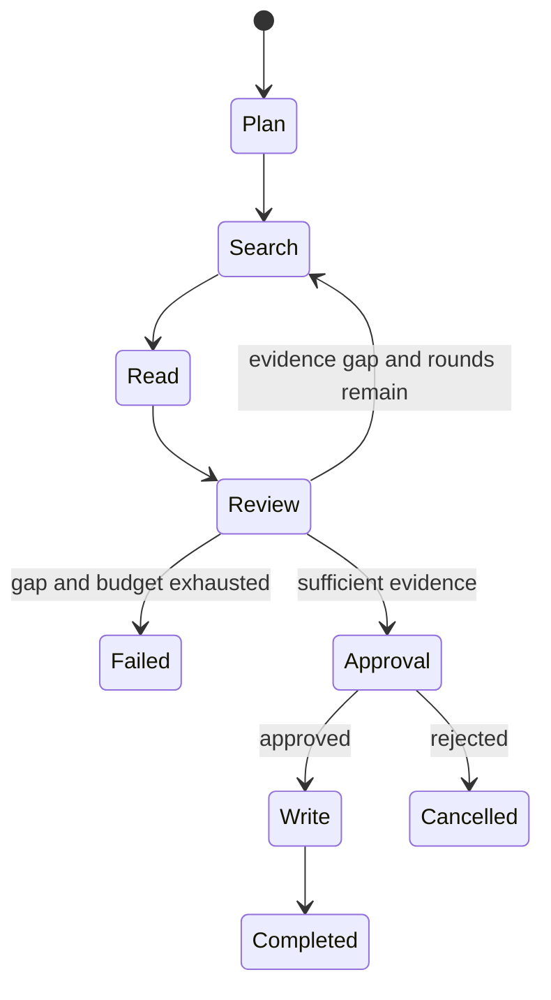
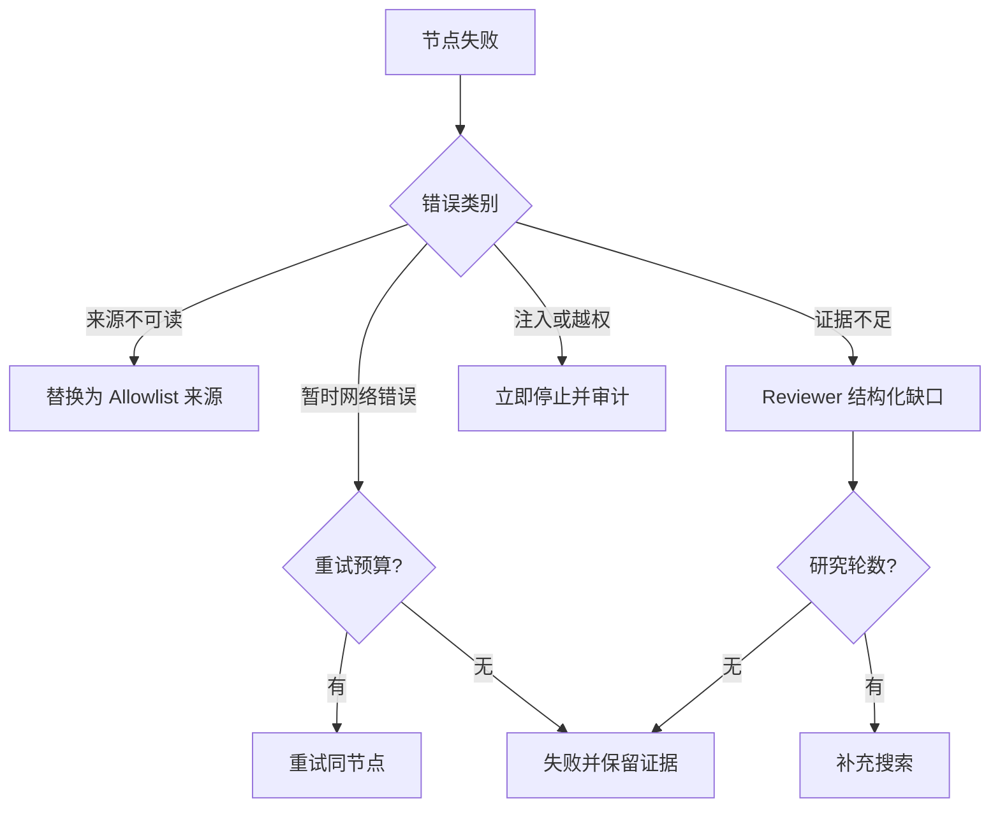
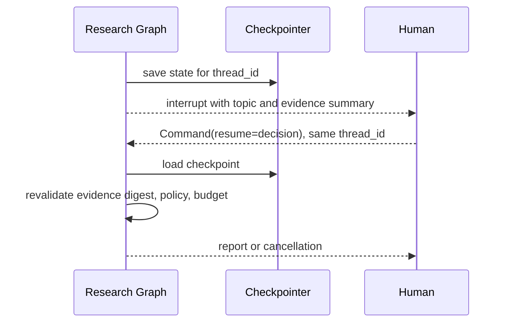
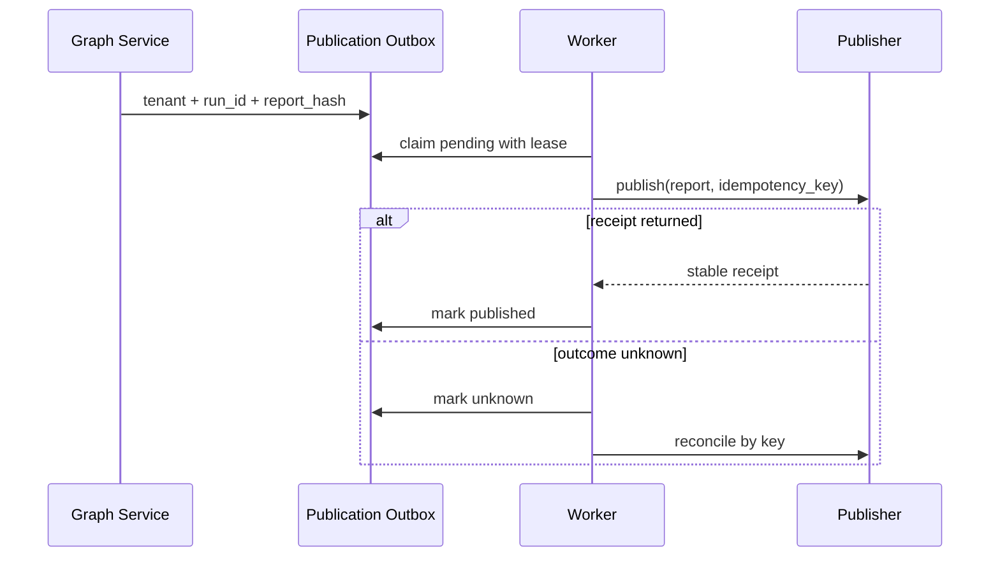

# 项目8：LangGraph 研究工作流 Agent

最后核对日期：2026-08-15。示例固定并实测 `langgraph==1.2.9`；升级时需对照官方迁移说明复验。

## 项目导读

研究任务不是一次模型生成，而是一条可能暂停、失败、补充证据和恢复的状态过程。本项目用 LangGraph 表达规划、搜索、读取、评审、人工批准和写作，并把可恢复计算与外部发布分开：Checkpoint 记录图状态，持久服务记录输入和审批，报告发布使用独立 Outbox。

完成项目后，读者应能定义类型化 State、节点和条件边，使用稳定 `thread_id` 恢复中断，判断哪些步骤可以重放，并解释为什么 Checkpoint 不能自动保证外部副作用不重复。

## 需求与成功条件

| 能力 | 成功条件 | 失败处理 |
|---|---|---|
| 任务规划 | 计划进入 State，可在 Trace 中检查 | 目标不明确则失败或请求澄清 |
| 搜索与读取 | 至少两个合规独立来源 | 有限重试、替换来源或停止 |
| Reviewer | 返回具体证据缺口 | 在研究轮数内回到 Search |
| Human in the Loop | 同一线程恢复并验证决定 | 错误线程不能冒充恢复 |
| Checkpoint | 中断前 State 可读取 | 版本迁移失败时禁止盲恢复 |
| 报告发布 | 只发布已完成、哈希未变的报告 | Outbox、幂等键或人工对账 |

## 总体状态架构


*图 P8-A：规划、研究节点与状态。每个节点提交可序列化更新，Checkpoint 记录可恢复的计算事实。*


*图 P8-B：恢复、评审与人工中断。Checkpoint 不替外部副作用提供幂等，报告发布仍需单独控制。*



状态图把允许的转移写死，模型不能自行跳过 Reviewer 或扩大来源范围。所谓 Agent 自主性必须位于系统批准的图和预算内。

## 类型化 State 与节点

```python
from typing import TypedDict


class Evidence(TypedDict):
    title: str
    url: str
    content: str


class ResearchState(TypedDict, total=False):
    topic: str
    plan: list[str]
    evidence: list[Evidence]
    review_passed: bool
    review_rounds: int
    approved: bool
    report: str
    error: str
```

State 只保存可序列化业务事实，不保存打开的 HTTP Client、数据库连接或不可重建对象。节点接收 State 并返回更新；同一字段由多个并行节点写入时，必须定义 Reducer，否则最后写入可能覆盖前一结果。

```python
def review(state: ResearchState) -> ResearchState:
    evidence = state.get("evidence", [])
    independent_urls = {item["url"] for item in evidence}
    return {
        "review_passed": len(independent_urls) >= 2,
        "review_rounds": state.get("review_rounds", 0) + 1,
    }
```

该规则是确定性教学门禁，不等于真实来源独立性评估。正式系统还需域名、发布主体、引用关系、时间和内容重复检测。

## Retry、Reviewer 与预算

临时网络错误可以由节点 `RetryPolicy` 有限重试；权限拒绝、来源不在 Allowlist 和 Prompt Injection 属于策略错误，不能靠重试解决。Reviewer 应返回“缺少第二个独立来源”“日期冲突未解释”等可执行缺口，而不是模糊地说“质量不够”。



## Checkpoint 与人工恢复

LangGraph 的 `interrupt()` 会暂停节点并把批准载荷交给调用方；恢复必须用同一个 `thread_id` 和 `Command(resume=...)`。新的线程标识表示新的运行，不是旧运行恢复。



仓库中的基础图使用 `InMemorySaver`，只能证明进程内恢复。`DurableResearchService` 另行把允许来源的证据、主题、哈希、状态和事件保存到 SQLite；重启后验证哈希，重建相同版本图并用只读证据确定性重放到中断点。这个方法只适合重放安全步骤。

## 副作用与发布 Outbox

搜索缓存写入、发送报告和创建外部页面都可能在图重放时重复。项目不把发布直接放在可重放图节点，而是在 Run 完成后创建稳定动作记录。



如果 Publisher 不支持幂等键或回执查询，结果未知只能转人工对账。数据库无法通过本地事务替远端系统提供 exactly-once。

## 运行、验证与调试

```bash
PYTHONPATH=src .venv/bin/python projects/08-research-workflow/main.py
PYTHONPATH=src .venv/bin/python -m pytest tests/test_langgraph_research_app.py -q
PYTHONPATH=src .venv/bin/python -m pytest tests/test_durable_research_service.py -q
```

测试应观察实际 Snapshot、待恢复节点、搜索调用次数、批准前后状态、证据篡改和发布去重。出现“恢复后从头执行”时，依次检查 `thread_id`、Checkpointer、图版本和 State Schema；出现重复外部写入时，检查副作用是否错误放进可重放节点。

### 成功输出样例

```json
{
  "thread_id": "research-fixture-01",
  "state_version": 7,
  "completed_nodes": ["plan", "search", "read", "organize", "review"],
  "evidence_ids": ["src-01", "src-02"],
  "review": {"status": "passed", "missing_claims": []},
  "publication": {"status": "waiting_approval"}
}
```

`waiting_approval` 是成功的可恢复中间状态，而不是失败；批准后恢复应从发布边界继续，不重新执行已确认检索节点。

## 工程扩展

生产系统应换用与当前 LangGraph 版本兼容的持久 Checkpointer，制定 State Schema 迁移，给节点和整体任务设置 Deadline，记录来源快照和内容哈希，并对网页不可信指令做隔离。外部搜索、读取和发布都通过最小权限 Adapter，不把网页内容提升为系统指令。

## 小结与练习

LangGraph 的价值在于让状态、转移、暂停和恢复可见。图式工作流提高可控性，但不会自动解决来源质量、幂等、权限和版本迁移。

### 基础

1. 给 Reviewer 设计结构化 `EvidenceGap` Schema。

### 进阶

2. 说明哪些节点可以安全重放，哪些节点必须使用 Outbox。

### 挑战

3. 设计从 State v1 到 v2 增加 `source_policy_version` 的迁移测试。

本章代码目录：`projects/08-research-workflow/` 与 `src/ai_agent_book/apps/langgraph_research.py`。
