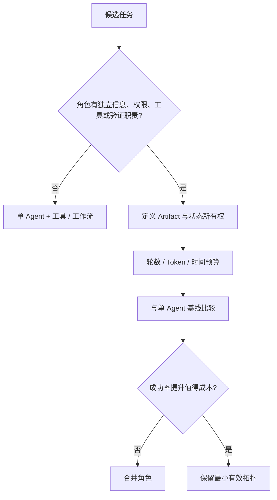
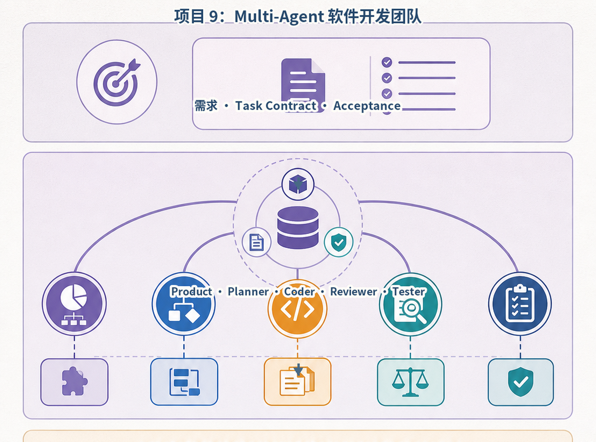
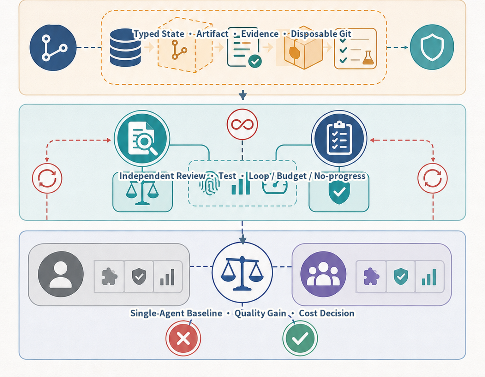
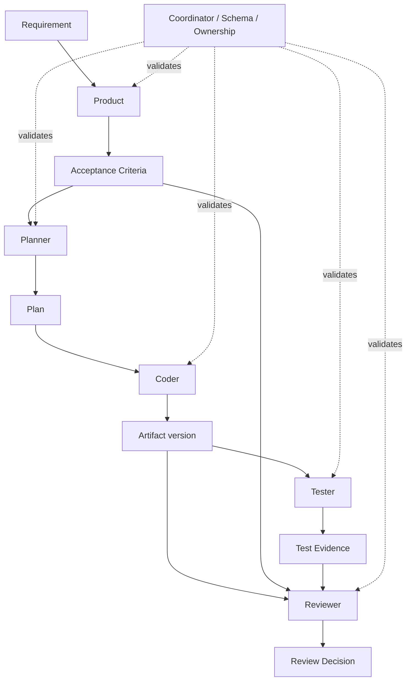
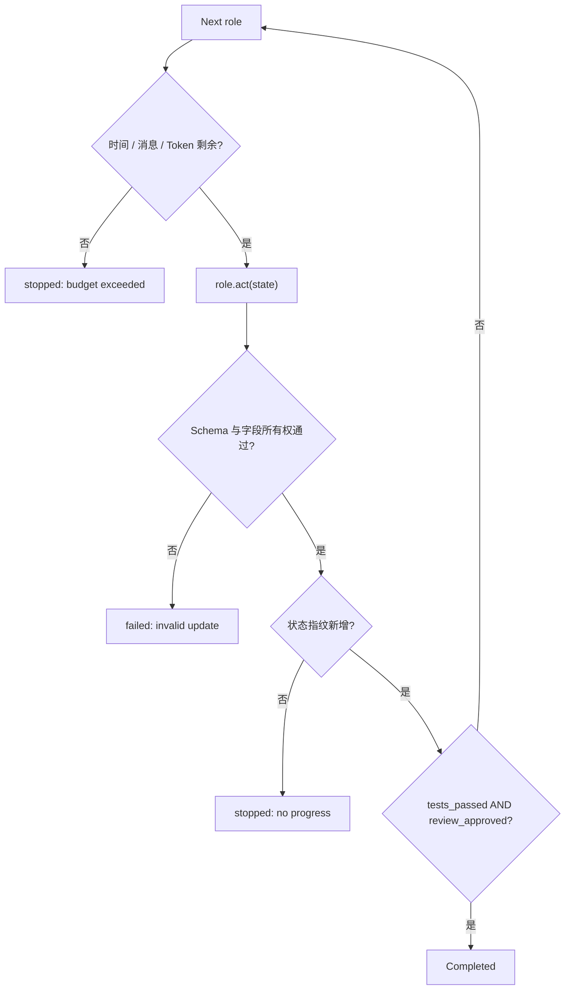
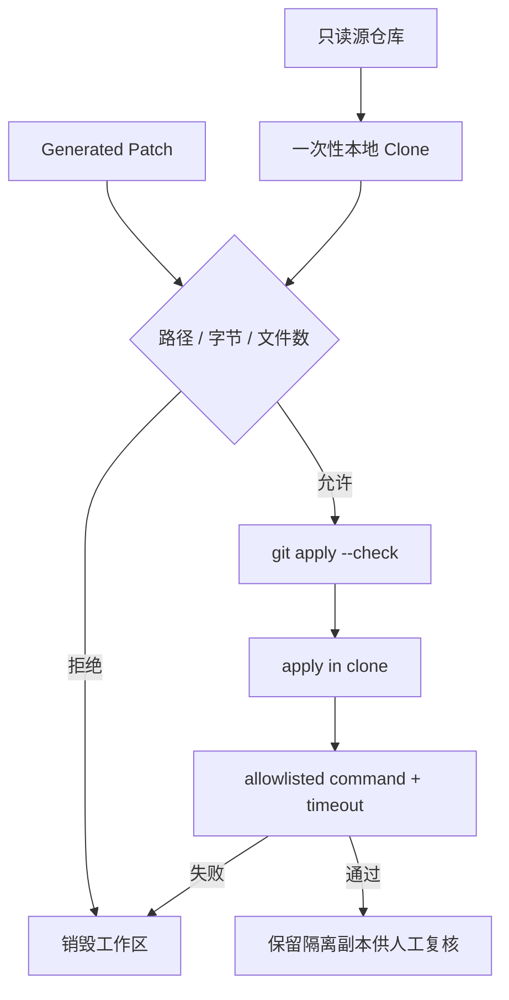

# 项目9：Multi-Agent 软件开发团队

最后核对日期：2026-08-15。

## 项目导读

多个 Agent 不会因为角色名称不同就自然形成高效团队。只有当角色拥有独立信息、工具、权限或验证职责时，拆分才可能产生价值。本项目保留 Product、Planner、Coder、Tester 和 Reviewer 五个职责，但禁止角色自由群聊；Coordinator 驱动固定顺序，所有结果通过版本化共享状态提交，并与单 Agent 基线比较消息量和估算 Token。

完成项目后，读者应能设计角色契约、共享状态所有权、硬终止条件与成本预算，并说明一次性 Git 工作区为什么仍不等于安全沙箱。

## 是否需要 Multi-Agent



角色式 Prompt 不是架构边界。若五个角色使用同一模型、同一上下文和同一工具，仅复述彼此内容，系统只增加延迟和费用。

## 总体架构与共享状态



*图 P9-A：角色与共享状态。角色名称只是职责提示，所有工件仍通过 Coordinator 校验的版本化状态交接。*



*图 P9-B：执行隔离、硬终止与基线对照。多 Agent 是否值得保留必须由任务质量、成本和延迟共同决定。*

```python
class SharedState(BaseModel):
    version: int = 0
    requirement: str = ""
    acceptance_criteria: list[str] = Field(default_factory=list)
    plan: list[str] = Field(default_factory=list)
    artifact: str = ""
    tests_passed: bool = False
    review_approved: bool = False


class RoleOutput(BaseModel):
    content: str
    updates: dict[str, object]
```

`RoleOutput.updates` 是教学简化。生产系统应为每个角色定义独立 Schema，并由 Coordinator 校验角色只能写自己拥有的字段。例如 Coder 不得把 `tests_passed` 直接设为真，Reviewer 也不能修改实现 Artifact。



## 成本与终止条件

仓库实现固定五次角色调用，调用前检查消息数和估算 Token。每次状态更新排除版本号后计算指纹；同一业务状态再次出现意味着没有进展，立即以 `no_progress_loop_detected` 停止。只有测试通过且 Reviewer 批准才成功。

```python
payload = state.model_dump(exclude={"version"}, mode="json")
fingerprint = hashlib.sha256(
    json.dumps(payload, sort_keys=True).encode()
).hexdigest()
if fingerprint in fingerprints:
    return stopped("no_progress_loop_detected")
```



当前 Token 只是字符估算，适合比较同一 Fixture 路径，不是账单数据。在线系统应记录供应商 Usage、缓存命中、工具耗时和每个角色的尾延迟。

## 一次性仓库工作区

Coder 产生补丁时不应直接写用户源仓库。`RepositoryWorkspace` 把源仓库克隆到源仓库之外，检查补丁路径与大小，先执行 `git apply --check`，再运行完整匹配 Allowlist 的测试命令。失败时销毁整个副本。



```python
allowed_commands = (
    ("python", "-m", "pytest", "-q"),
    ("python", "-m", "compileall", "-q", "."),
)

if command not in allowed_commands:
    raise WorkspacePolicyError("test command is not allowlisted")
```

此工作区只提供文件隔离和进程约束，不提供操作系统安全保证。测试代码仍能创建子进程、打开 Socket 或消耗资源。执行不可信代码必须迁移到禁网、非 Root、只读根文件系统且有 CPU、内存、PID、磁盘和时间配额的容器或微虚拟机。

## 基线比较与评估

`compare_with_baseline()` 对同一需求运行五角色和单 Agent 流程，报告额外消息与估算 Token。真正的选型需要在真实任务集比较：任务成功率、测试通过但语义错误率、人工修改量、P50/P95 延迟、总成本和安全事件。只展示一次成功 Demo 不能证明多 Agent 更优。

## 运行、验证与调试

```bash
PYTHONPATH=src .venv/bin/python projects/09-multi-agent-dev-team/main.py
PYTHONPATH=src .venv/bin/python -m pytest tests/test_multi_agent_team_app.py -q
PYTHONPATH=src .venv/bin/python -m pytest tests/test_coding_workspace.py -q
```

测试覆盖五角色状态版本、预算停止、基线成本、状态循环、补丁路径、命令 Allowlist、测试失败回滚和成功副本。无效对话增多时检查 Artifact 是否有新版本；角色越权时检查更新 Schema；测试通过但源码被污染时检查工作区是否建在源仓库内部。

### 成功输出样例

```text
task=fixture-add-validation
final_state=completed
artifacts=product_spec,plan,patch,review,test_report
tests=12 passed
source_worktree_changed=false
multi_agent_messages=9
single_agent_baseline_messages=3
decision=保留单 Agent；当前任务未证明多角色净收益
```

项目成功不等于必须采用 Multi-Agent。样例把基线结论写入产物，允许系统在额外角色没有净收益时选择更简单方案。

## 小结与练习

多 Agent 的真实价值来自职责和证据边界，而不是角色数量。共享状态、预算、终止、隔离执行和基线对照比“让角色讨论直到满意”更重要。

### 基础

1. 把 `updates: dict` 改为五个独立输出模型，并设计字段所有权表。

### 进阶

2. 设计一个 Reviewer 返工一次后仍无进展的终止流程。

### 挑战

3. 为真实任务集定义三项能证明多角色值得保留的指标。

本章代码目录：`projects/09-multi-agent-dev-team/`、`src/ai_agent_book/apps/multi_agent_team.py` 与 `src/ai_agent_book/apps/coding_workspace.py`。
