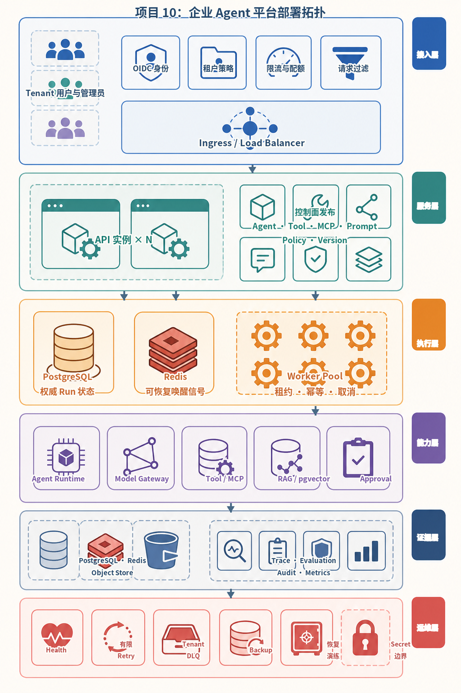
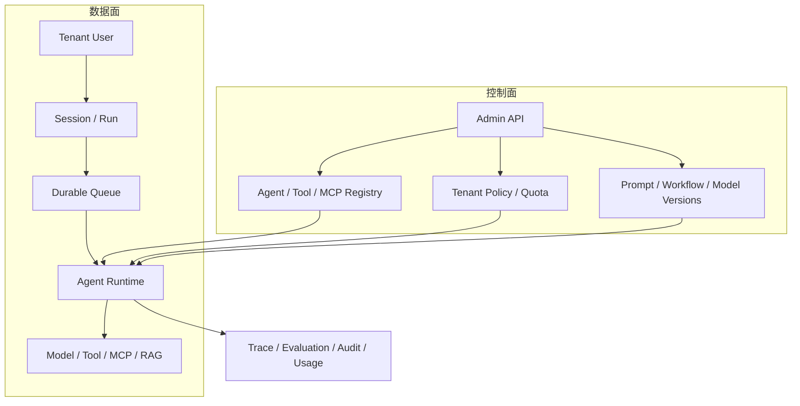
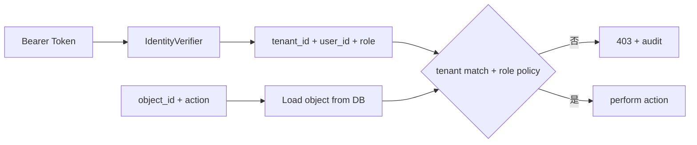
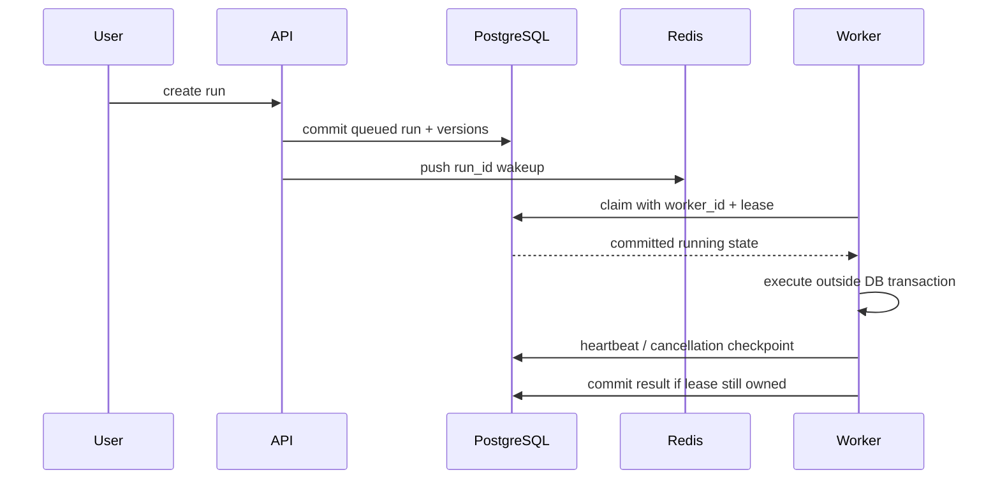
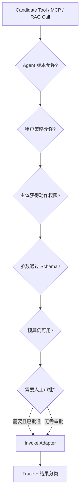
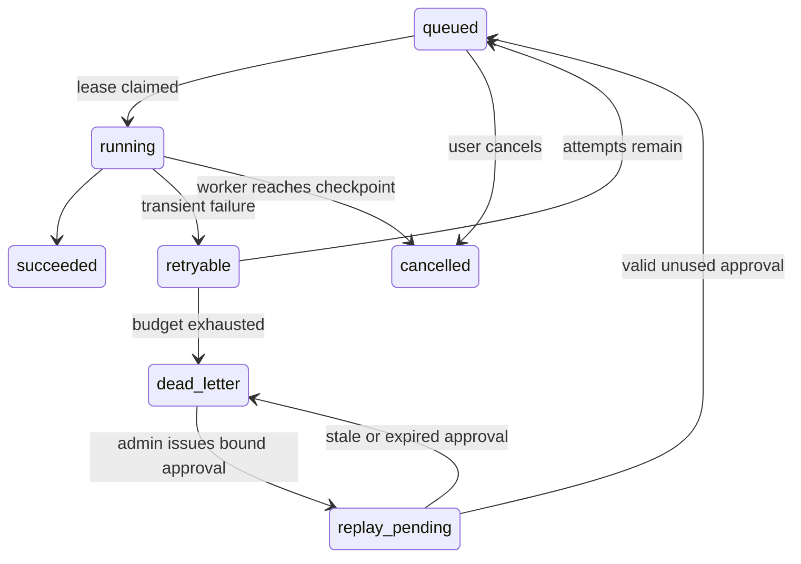

# 项目10：企业级 Agent 平台

最后核对日期：2026-08-15。

## 项目导读

企业 Agent 平台不是把前九个项目塞进一个 FastAPI 进程，而是建立可治理的控制面和执行面：谁可以发布 Agent 与 Tool，哪个租户能访问哪些会话和文档，Run 如何排队、领取、取消、重试和恢复，Trace 与 Evaluation 如何关联版本，失败副作用如何进入审计与人工批准。

本项目实现一个可验证纵向切片。SQLite 与内存队列支持离线学习；PostgreSQL 与 Redis Compose 展示部署边界。它没有伪装完成真实 OIDC、pgvector、模型网关、完整 MCP 网关、跨区域灾备或生产配额。

## 目标与非目标

| 平台目标 | 仓库证据 | 仍需外部工程 |
|---|---|---|
| 多租户与角色授权 | 租户、用户、对象级检查 | OIDC/JWKS、组织同步、RLS |
| Agent/Tool 注册 | 管理员注册接口与记录 | 不可变发布版本、签名供应链 |
| Session 与 Run | 持久状态、租约、取消 | 大规模调度与公平配额 |
| RAG 边界 | 当前租户文档检索 | pgvector、正式 Embedding 与 ACL |
| Trace/Evaluation | Run 关联记录 | OpenTelemetry 后端与评估平台 |
| 失败恢复 | 重试、DLQ、审批重放 | 多区域灾备演练 |

## 企业部署拓扑



*图 P10-A：企业平台部署拓扑。数据库保存权威 Run 状态，Redis 只承担可恢复唤醒；API 和 Worker 可独立扩展。*



控制面发布不可变版本，Run 记录实际使用的 Agent、工具、Prompt、工作流、模型和索引版本。仅保存“当前配置”无法复现历史运行。

## 多租户身份与授权

认证回答“你是谁”，授权回答“你能否对这个对象执行这个动作”。API 取得经过验证的 `tenant_id`、`user_id` 与角色后，仍要查询对象是否属于同一租户。不能信任请求正文中的租户字段。



本地 `HMACIdentityVerifier` 只用于离线验收。生产应接入 OIDC/JWT，验证签名、发行者、受众、过期时间和 JWKS 轮换，并将外部组织映射到内部租户。

## 数据库权威队列与 Worker 租约

提交 Run 时先在数据库事务中写入 `queued`，提交后再向 Redis 推送 `run_id`。Redis 消息丢失时 Worker 可以扫描数据库恢复；反过来如果 Redis 是唯一事实来源，消息丢失会让任务永久消失。



迟到 Worker 不能覆盖新 Worker 的结果：完成更新必须匹配 `worker_id` 和有效租约。长时间 Provider 调用不持有数据库事务，并且要在阶段边界续租与检查取消。协作式取消无法强杀卡死的第三方 SDK，因此每个外部调用仍需超时。

```python
class RunExecutionContext:
    def heartbeat(self) -> datetime:
        return self.platform.heartbeat_run(self.run.id, self.worker_id)

    def checkpoint(self) -> None:
        if self.cancellation_requested():
            raise RunCancelled(self.run.id)
```

## RAG、Tool 与 MCP 边界

平台注册 Tool 不意味着所有 Agent 都可调用。Runtime 在每次调用时组合租户策略、Agent 版本允许列表、用户角色、参数 Schema、预算和审批要求。RAG 检索必须在数据库或 Repository 层强制租户与 ACL 过滤，不能检索全库后再在 Prompt 前删除越权结果。



## 重试、DLQ 与批准重放

可恢复错误在有限次数内重新排队；超过预算进入租户隔离的 DLQ。重放不是管理员点一下就清空计数：批准票据绑定租户、Run、Prompt、Trace、错误类型和尝试次数的规范化哈希，并有过期时间与一次性使用状态。



DLQ 只保存错误类型、次数与 Run 引用，避免复制 Prompt 和 Secret。结果未知的外部副作用不能当作普通瞬时失败盲重试，应进入专项对账流程。

## Trace、Evaluation 与版本证据

Trace 至少记录 Run、租户、节点或工具、时间、结果分类、Token 与版本标识。Prompt 和工具参数默认做字段级脱敏；“为了调试全量保存”会制造新的敏感数据库。Evaluation 结果必须关联运行输入、评分器版本和数据集版本，否则无法进行回归比较。

```text
Run
├── identity: tenant / principal / role
├── versions: agent / prompt / workflow / model / index
├── lifecycle: queued / running / terminal timestamps
├── usage: tokens / cost / latency / tool calls
├── traces: node and adapter events
├── evaluations: metric + evaluator version
└── audit: approvals, cancellations, replay and admin changes
```

## 运行与验收

```bash
PYTHONPATH=src .venv/bin/python projects/10-enterprise-platform/main.py
PYTHONPATH=src .venv/bin/python -m pytest tests/test_enterprise_platform_app.py -q
PYTHONPATH=src .venv/bin/python -m pytest tests/test_enterprise_resilience.py -q
```

Compose 纵向验收命令位于项目 README。它展示 API、PostgreSQL 和 Redis 的组合，不代表已完成容量、故障注入和灾备演练。正式验收还需验证数据库恢复点、Redis 中断、Worker 崩溃、租约抢占、跨租户攻击、Secret 轮换和依赖供应链。

### 成功输出样例

```json
{
  "run_id": "tenant-a/run-001",
  "status": "succeeded",
  "versions": {"agent": "agent-v7", "prompt": "prompt-v12", "policy": "policy-v4"},
  "usage": {"input_tokens": 820, "output_tokens": 164, "estimated_cost": 0.0},
  "trace_summary": {"tool_calls": 2, "retries": 0, "policy_denials": 0},
  "evaluation": {"task_success": true, "citation_valid": true}
}
```

`estimated_cost: 0.0` 表示离线 Fixture，不应被解读为真实供应商免费；生产记录必须绑定价格表版本与计费时间。

## 从纵向切片到生产平台

优先演进顺序通常是：真实身份与对象授权、不可变版本发布、数据库迁移、独立 Worker、模型与工具网关、租户配额、OpenTelemetry、正式 RAG 与评估、备份恢复演练。微服务拆分应由独立扩缩、故障隔离或权限边界驱动；在这些条件出现之前，模块化单体更容易保持事务和可调试性。

## 小结与练习

企业平台的核心不是 UI 中能创建多少 Agent，而是每次运行能否回答谁发起、使用哪些版本、访问哪些能力、花费多少、为何失败以及如何安全恢复。

### 基础

1. 设计 Agent 版本发布表，使历史 Run 永远能定位原配置。

### 进阶

2. 说明 Redis 可用而 PostgreSQL 不可用时，API 为什么不能继续接受 Run。
3. 为跨租户文档检索攻击编写授权与审计验收用例。

### 挑战

4. 画出模型供应商已完成生成但客户端超时的成本与结果对账流程。

本章代码目录：`projects/10-enterprise-platform/` 与 `src/ai_agent_book/apps/enterprise_platform.py`。
