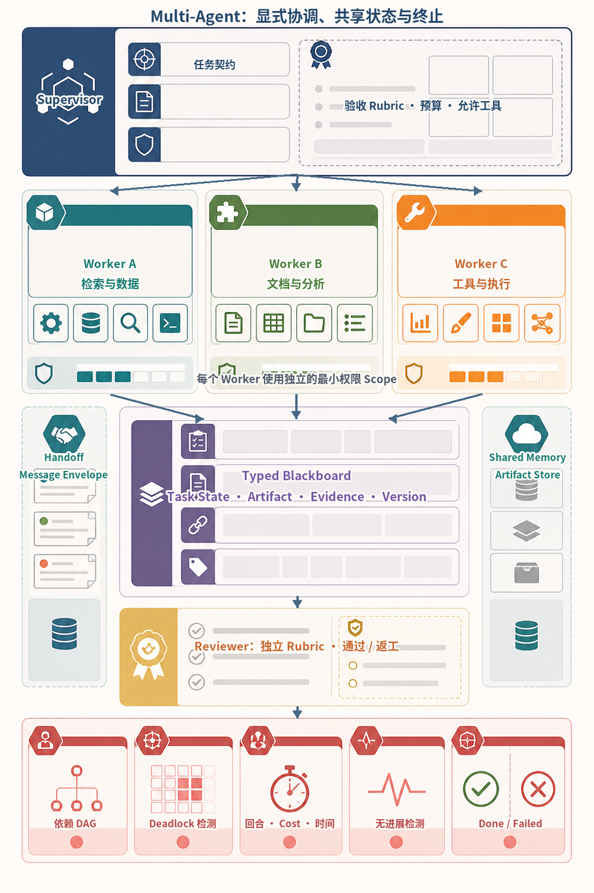
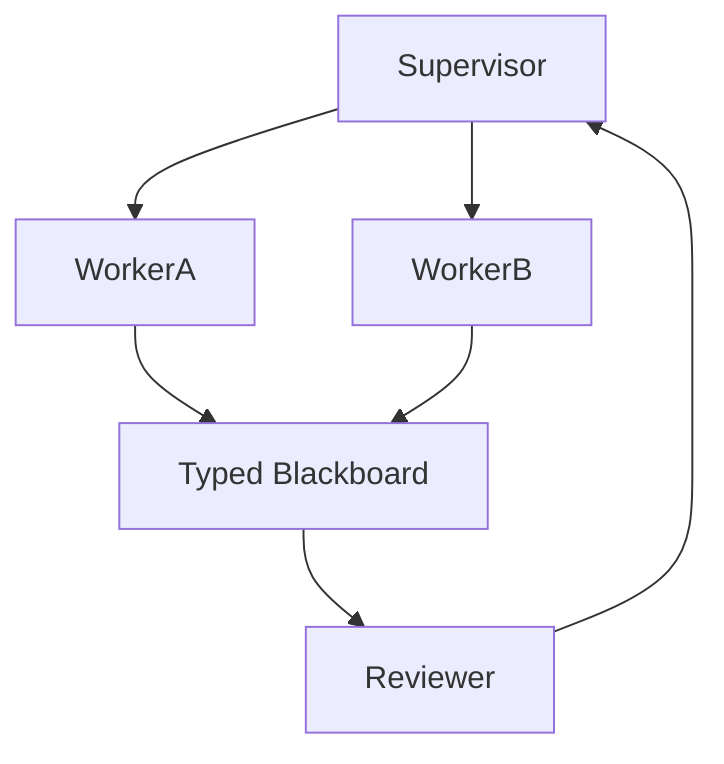
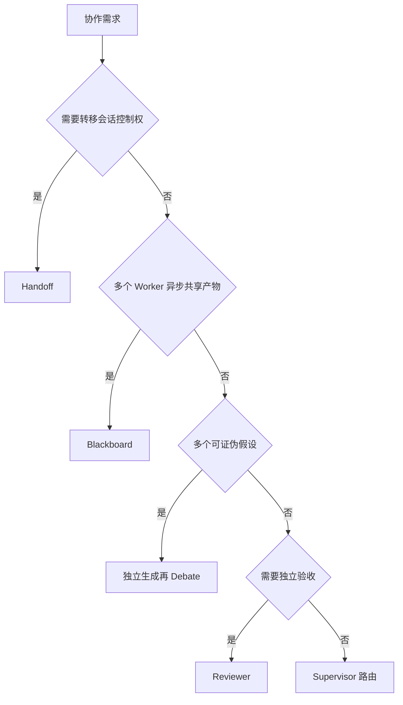
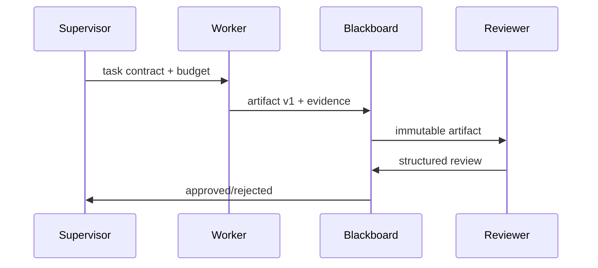
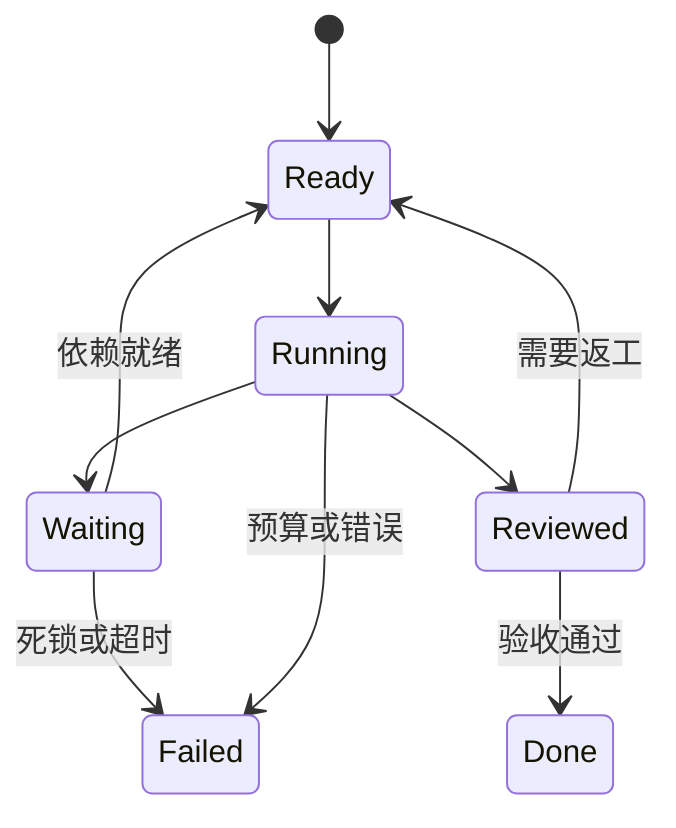
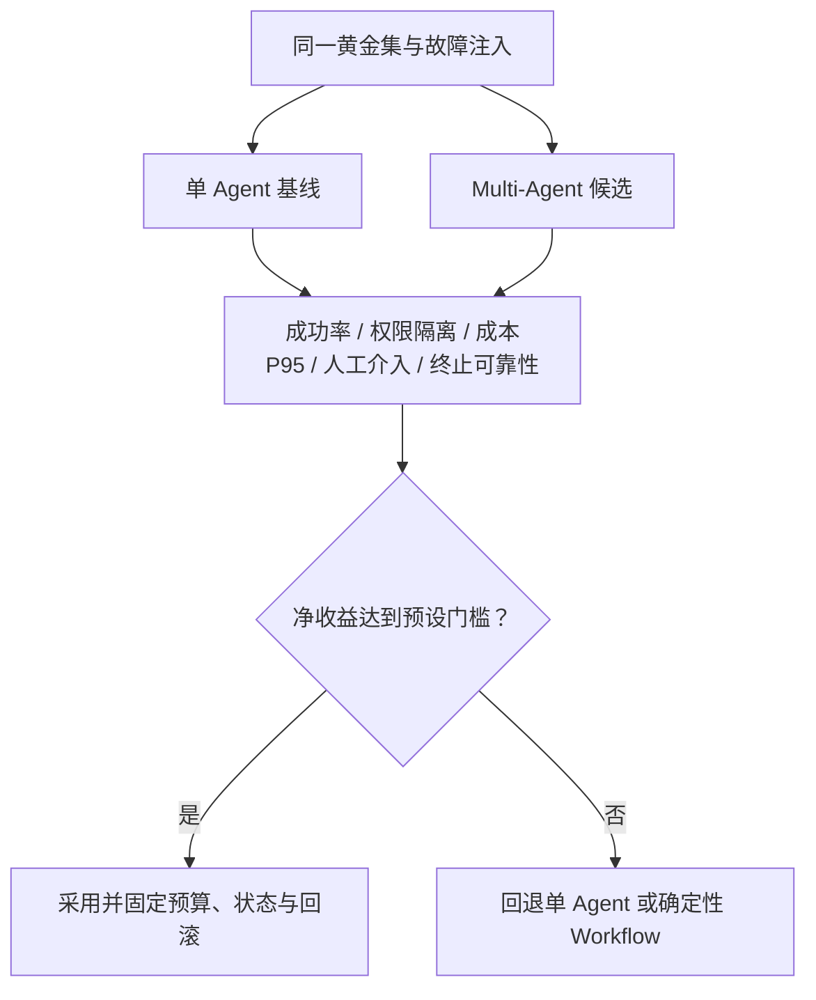
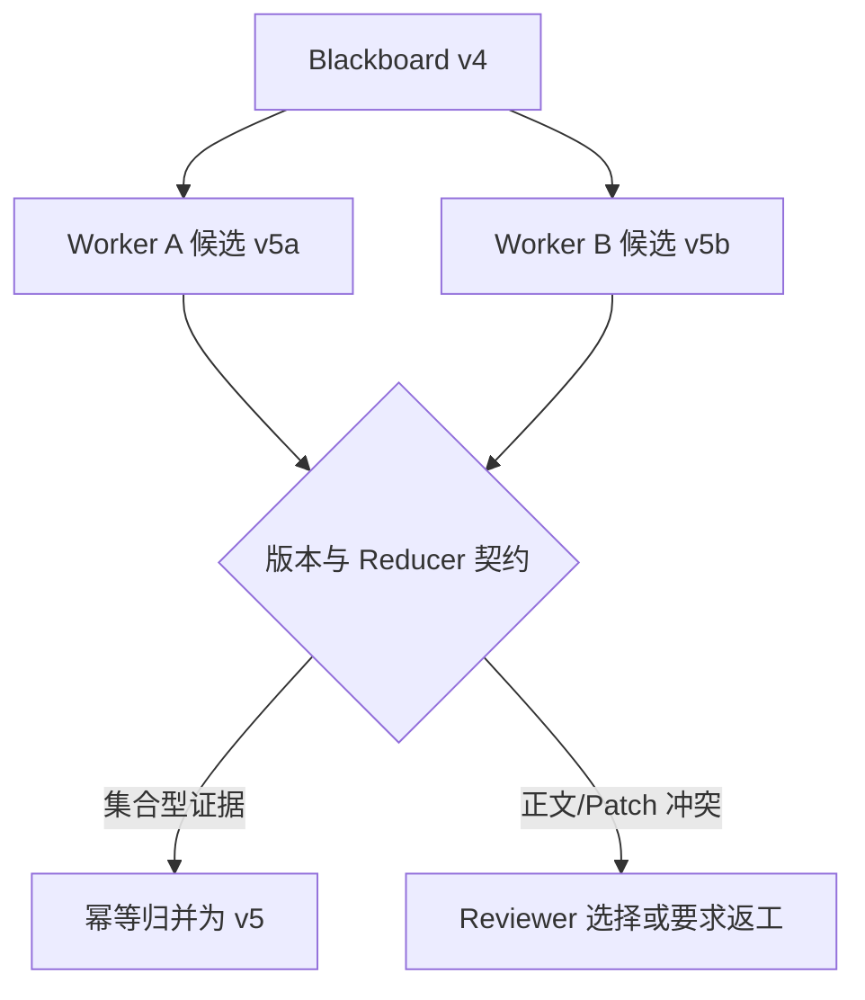

# 第32章：Multi-Agent 原理

最后核对日期：2026-08-07。

## 导读、目标与前置知识
Multi-Agent 的价值来自职责、上下文或权限隔离，而不是角色数量。本章覆盖 Handoff、Supervisor、Blackboard、Debate、Reviewer、Shared Memory、Message Passing、协调、死锁与终止。

学习目标是理解核心协调机制，并实现一个有终止条件的 Blackboard 示例。前置知识为第9—10、22章。

## 模式与架构

多 Agent 的价值来自职责、权限或上下文边界，而不是角色数量。主图展示 Supervisor、Worker、Blackboard 与 Reviewer 的最小协调结构。

下面的信息图把协作所需的共享状态、权限与终止机制放在同一视野。Supervisor 按任务契约分派三个边界化 Worker；Worker 只能使用自己的最小权限工具，并通过 Typed Blackboard 提交版本化 Artifact 和 Evidence；独立 Reviewer 按 Rubric 验收，底部运行时则检测依赖、死锁、预算和无进展。



*图 32-A：Multi-Agent 的显式协调、共享状态与终止体系。Worker 卡片表示职责和权限边界，不是人格角色；Blackboard 是版本化事实源，不应退化为无限自然语言群聊。*

图 32-A 中最重要的不是 Worker 数量，而是每次通信都有任务、Artifact、证据与版本。若单 Agent 在相同黄金集上以更低成本达到相同成功率和权限隔离效果，应删除多余角色；Multi-Agent 必须通过净收益评估，而不是仅证明框架能运行。



Handoff 转移当前控制；Supervisor 统一路由；Blackboard 让角色读写共享结构化状态；Debate 只在观点多样性可验证时使用；Reviewer 根据独立 rubric 验收产物。



模式可以组合，但每增加一种通信路径都增加状态一致性和终止成本，必须由任务证据支撑。

## 最小与完整工程
先建立单 Agent 基线，再将检索和评审拆分。共享状态带版本与所有者，消息有 sender、recipient、task、artifact 引用和 TTL。终止器限制回合、费用、重复消息和无进展次数。

## 误区、调试、实践与安全
角色人格不是能力隔离；多次同模型回答不等于独立证据；自然语言共享记忆易冲突。调试消息图、等待依赖和状态版本。不同 Agent 最小权限，避免通过消息转发秘密。

## 总结、练习、面试与阅读

### Multi-Agent 的真实价值

拆分 Agent 只有四类常见理由：上下文隔离，避免每个角色看到全部材料；权限隔离，让 Reviewer 不能写代码；能力隔离，为视觉、搜索或代码选择不同模型；并行隔离，把独立子任务分给 Worker。角色名称和“人格”本身不创造能力。若单 Agent 配多个工具达到相同成功率，应保留简单方案。

### Handoff、Supervisor 与 Blackboard

Handoff 把当前任务所有权转给下一个 Agent，任务包包含目标、已验证事实、未决问题、预算和允许工具。Supervisor 保持所有权，把子任务分给 Worker 并验证 Artifact。Blackboard 是共享类型化工作区，Agent 通过版本化记录协作，而不是用无限群聊维持事实。

```python
from pydantic import BaseModel, Field


class Artifact(BaseModel):
    artifact_id: str
    task_id: str
    author: str
    version: int = Field(ge=1)
    content: str
    evidence_ids: list[str]
    status: str
```

Worker 写新版本，Reviewer 追加 review，不直接覆盖作者内容。Supervisor 依据验收将状态从 proposed 变 approved/rejected。数据库乐观锁防止并发覆盖。



Worker 与 Reviewer 不直接覆盖彼此内容。Blackboard 使用版本与乐观锁保留作者、证据和评审的完整演进。

### Debate 与 Reviewer

Debate 适合存在多个合理假设且可由证据裁决的问题。各 Agent 独立生成后再互评，避免第一个答案锚定全部角色。Judge 使用 rubric 与来源，不因多数票就判真。多个实例使用同一模型和语料时错误高度相关，不能宣称独立专家共识。

Reviewer 模式更常用：Executor 产出，Reviewer 对明确标准检查，Executor 只修复驳回项。最大往返次数有限。高风险结论由人类或权威工具最终判断。

### Shared Memory 与 Message Passing

共享 Memory 分事实、Artifact、任务状态与消息。事实和 Artifact 可持久，消息主要用于传递意图，不是唯一事实源。消息 Envelope 有 id、sender、recipient、task、type、payload reference、timestamp 和 correlation ID；大内容放 Artifact Store。

Agent 只订阅任务所需消息，避免广播全部 PII。消息至少一次投递时 handler 幂等；顺序依赖用 task version/sequence 检查，不能假设网络总按发送顺序。

### Coordination、Deadlock 与 Termination

任务依赖形成 DAG；就绪任务才分配。Deadlock 可能来自环依赖、所有 Agent 等待审批、资源锁或互相要求对方先回答。运行时定期构造 wait-for graph，检测环和超时，转人工或失败。

终止包括验收通过、不可恢复失败、预算/时间/回合上限、用户取消和无进展。无进展可比较 Blackboard 版本、Evidence 数和重复动作。模型说“完成”只是一条候选消息。



无进展可通过 Artifact 版本、证据数量和动作去重确定性判断。模型声称“完成”只能触发评审，不能直接终止系统。

### 成本、调试与评估

记录每个 Agent 的 Token、工具、延迟、消息和 Artifact 贡献，计算每个成功任务成本。与单 Agent 基线比较成功率、重复调用、人工介入和尾延迟。增加角色后质量没有显著提升，就移除。

调试可视化消息图和 State timeline，查谁等待谁、哪个 Artifact 被覆盖、终止器为何未触发。回放使用 Fake Model 与固定消息，副作用工具禁用。



本书的受限 Reviewer/Executor Fixture 在 CrewAI 1.15.12、AutoGen AgentChat 0.7.5 和 Semantic Kernel 1.44.1 中都能拒绝越权工具、导出状态并在四条消息内终止，但均未胜过一条消息的单 Agent 基线。这个结果说明“框架可运行”和“拆分有价值”是两个不同命题；代码与稳定证据位于 `examples/framework_comparison/multi_agent_spike/`。

### 任务契约与消息协议

自然语言“请研究这个问题”不是可调度契约。子任务至少声明输入 Artifact、预期输出 Schema、允许工具、
数据范围、Deadline、预算、依赖和验收 Rubric。消息 Envelope 只携带小型控制数据与 Artifact 引用，
并以 `message_id + task_version` 幂等；过期版本不得覆盖新状态。

```python
class TaskContract(BaseModel):
    task_id: str
    version: int = Field(ge=1)
    assignee: str
    input_artifact_ids: list[str]
    output_schema: str
    allowed_tools: set[str]
    max_turns: int = Field(ge=1, le=20)
    deadline_ms: int = Field(gt=0)
```

Handoff 必须显式转移所有权，而不是复制上下文后让两个 Agent 都认为自己是负责人。接收方校验契约，
拒绝超出 Scope 的任务；发送方只有在 Blackboard 记录接收确认后才释放所有权。消息丢失可重发，
但同一版本只能产生一个有效转移事件。

### Blackboard 并发冲突

共享状态使用 Append-only Artifact 与乐观锁。两个 Worker 基于版本 4 同时产出时，不应 Last-write-wins
覆盖；它们各自产生候选，Reducer 只能合并满足交换律、结合律且幂等的数据，例如证据 ID 集合。
报告正文和代码 Patch 通常不能自动合并，应由 Reviewer 或版本控制系统处理冲突。



这张图说明 Shared Memory 不是一个所有角色可随意改写的字符串。每次写入保留作者、基线版本、证据、
内容哈希和 Trace，才能解释最终产物来自哪些贡献。

### 可判定的终止与无进展

终止器维护状态指纹，例如“未完成任务集合、已批准 Artifact 哈希、证据集合、预算余额”。若连续若干
回合指纹不变，或动作签名重复，就判定无进展。阈值是防护参数，不是完成证明；真正完成仍要求所有
必需任务终态、依赖闭合、Reviewer Rubric 通过且没有悬空副作用。

Deadlock 检测构造 Wait-for Graph：Task A 等待 B、B 又等待 A 时形成环。人工审批是外部依赖，应进入
`waiting_approval` 并释放 Worker，而不是让角色互相发送“还在等待”。预算耗尽、用户取消和不可恢复
Policy 拒绝都是一等终态。

### 与项目 9 的对应及净收益门禁

[`projects/09-multi-agent-dev-team/`](https://github.com/wujinjun/ai-agent-book/tree/main/projects/09-multi-agent-dev-team)
使用 Product、Planner、Coder、Reviewer、Tester 角色演示共享状态，但工程强化把它们落成一次性 Git
工作区、Patch 范围策略、白名单测试、状态指纹和终止预算。进程隔离不等于恶意代码 Sandbox，角色名
也不等于权限边界。

采用 Multi-Agent 前在同一 Dataset 上比较单 Agent、确定性 Workflow 与多 Agent：任务成功率、权限
违规、P95、单位成功成本、人工接管和终止可靠性都进入报告。若差异没有超过预先声明的实际意义阈值，
保留更简单方案；不能用“对话更像团队”作为收益证据。

### 常见反模式与安全

反模式包括角色数量按组织架构复制、自由群聊、所有 Agent 共享管理员工具、用自然语言投票替代规则、无限 Reviewer 循环、每个角色重复读全部上下文。安全上每个 Agent 最小权限，handoff 不升级 scope，消息/Memory 按租户隔离，秘密使用引用而不是正文转发。

### 练习参考答案与面试要点

1. **Reviewer 净收益。** 固定模型、数据和预算，比较无 Reviewer 基线；报告成功率差异及置信范围、
   新增成本和返工次数。只列一个成功案例不构成证明。
2. **环依赖。** 构造 A 等 B、B 等 A 的 Wait-for Graph，断言运行时在超时前检测环、保存状态并进入
  人工/失败终态，而非继续对话。
3. **面试要点。** Blackboard 是版本化事实与 Artifact Store，群聊只是消息；同模型实例错误高度相关，
   不自动形成独立证据。无进展通过状态指纹与重复动作检测，完成由外部 Rubric 判定。

总结：Multi-Agent 是显式协调、版本化共享状态和可判定终止系统，不是角色扮演。延伸阅读包括分布式
系统、Actor、Blackboard、Agent Orchestration 与协作评估资料；代码目录为项目 9。

## 本章引用
<!-- chapter-citations:start -->
以下资料用于支撑本章的核心原理、工程边界与版本敏感说明：

- [wu2023autogen：AutoGen: Enabling Next-Gen LLM Applications via Multi-Agent Conversation](../references.md#ref-wu2023autogen)
- [autogen-teams：AutoGen AgentChat Teams](../references.md#ref-autogen-teams)
- [liu2023agentbench：AgentBench: Evaluating LLMs as Agents](../references.md#ref-liu2023agentbench)
- [yao2022：ReAct: Synergizing Reasoning and Acting in Language Models](../references.md#ref-yao2022)
<!-- chapter-citations:end -->
