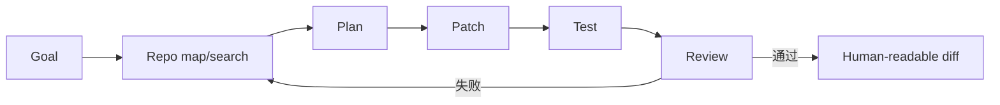
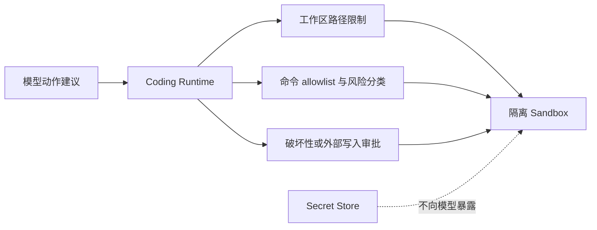
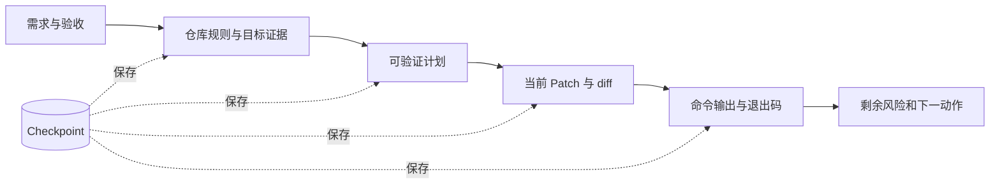
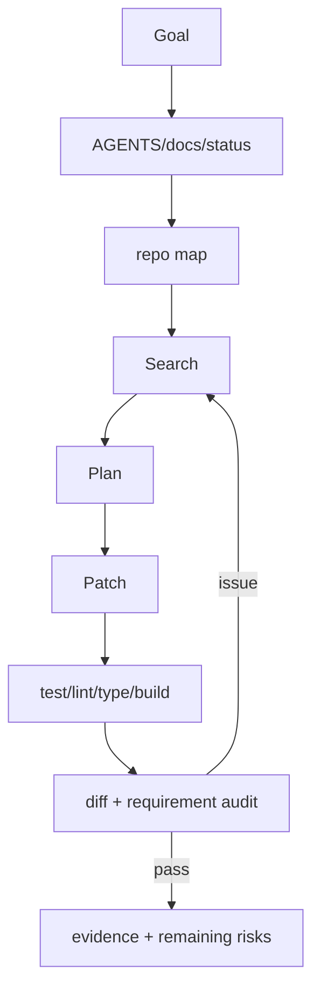

# 第33章：Agentic Coding

最后核对日期：2026-07-11。

## 导读、目标与前置知识
Coding Agent 需要 Repo Map、搜索、计划、Patch、测试、Review、Sandbox、Terminal、Git 和长任务恢复。本章从软件工程闭环而非代码生成单点理解它。

学习目标是完成从失败测试到受审 Patch 的闭环。前置知识为 Git、测试和第23、30章。

## 工作流

Coding Agent 的完成条件是产生受审 Patch 和验证证据。主图把仓库检查、计划、修改、测试与评审连接成闭环。



每一轮修改都从仓库事实开始，以验证结果结束；若失败，回到相关代码和测试重新定位，而不是重复生成更大的 Patch。



终端输出是 Observation，命令执行权属于 Runtime。敏感凭证、工作区外路径和破坏性 Git 操作都在模型不可绕过的边界处理。



Checkpoint 保存事实引用和产物哈希，不保存“应该已经完成”之类主观总结。恢复后重新检查工作树和外部状态。

## 最小与完整工程
最小 Agent 只修改一个受测函数。工程版先读取仓库约定，限制写入根目录，Patch 采用最小 diff，运行项目验证，记录命令与输出，保留用户未相关改动。长任务使用 checkpoint，不用自然语言声称测试通过。

## 误区、调试、实践与安全
生成代码不是完成；测试绿不证明需求全覆盖；Repo Map 不能替代读取目标文件。Terminal 使用 allowlist/sandbox，破坏性命令审批，秘密不进入模型。调试从原始失败和 diff 开始。

## 总结、练习、面试与阅读

### Coding Agent 的核心结构

Coding Agent 接收需求，检查仓库规则与工作树，建立 Repo Map，搜索目标符号，形成计划，生成最小 Patch，执行测试/静态检查，审查 diff，再交付证据。模型负责提出变化，文件系统、Sandbox、Git 和验证器提供事实。



交付内容包含 diff、验证命令与真实输出、未覆盖风险和文件链接；测试通过不能替代逐项需求审计。

### Repo Map 与 Code Search

Repo Map 记录目录、语言、构建系统、入口、测试和关键符号，不把每个文件全文塞进上下文。优先 `rg --files`、符号搜索、引用和目标测试。只读取与任务相关文件及其直接依赖。生成代码前确认现有模式，避免新建重复工具。

搜索结果带文件、行号和查询，计划引用证据。大型仓库可用 AST/语言服务器构建符号图，但文本搜索仍是验证实际内容的基础。Embedding 代码搜索用于语义发现，不替代精确引用搜索。

### Planning 与 Patch

计划将需求映射到文件、行为和测试，每步可验证。Bugfix 先写能复现原症状的失败测试；功能按最小行为逐步红—绿—重构。Patch 使用 diff 而非重写文件，保留用户无关改动。格式化只作用于范围可控文件。

```diff
- except Exception:
-     return None
+ except httpx.TimeoutException as exc:
+     raise DependencyTimeout("weather service timed out") from exc
```

示例把未知错误吞掉改为稳定领域错误。真实 Patch 还需要测试证明调用方正确处理。

### Terminal、Test 与 Sandbox

Terminal Tool 有工作目录、命令 allow/deny、超时、输出上限和退出码。网络、包安装、Git push、删除和系统目录写入单独审批。代码在容器/沙箱运行，不挂载宿主 Secret、Docker socket 或 SSH Agent。

验证顺序从目标测试到相关套件，再全量 lint/type/build。命令完成且 exit 0 才能声称通过。输出截断时不能根据前几行推断成功；长进程用 session 继续读取。

### Git Tool 与脏工作树

开始记录 `git status`，用户改动归用户，不使用 reset/checkout 覆盖。Agent 只 stage 自己文件，提交前检查 diff 与 secret。分支/worktree 用于隔离大功能，但不应无故移动现有改动。Push、PR 和 merge 是外部动作，需要明确授权。

### Review 与需求审计

Review 不只看代码风格，而逐条映射需求、数据流、错误、安全、并发、兼容和测试。Reviewer 使用实际 diff 和测试输出，不能只读 Coder 摘要。Inline comment 指向最小行范围，优先级依据影响。

需求审计区分“测试证明”“代码看似支持”“尚未验证”。例如单元测试绿不能证明 Docker 镜像可构建，必须运行构建或明确未验证。

### 长任务与 Checkpoint

Checkpoint 保存目标、已读文件、计划、完成步骤、测试证据、未提交 diff 和下一动作；不保存秘密或不可重建终端对象。自动续跑先重新检查工作树，因为用户可能在中间修改。已完成验证在代码变化后失效，必须重跑。

### 常见误区、调试与安全

常见误区：代码生成即完成、测试通过即满足全部需求、Repo Map 可替代阅读、Agent 可以整理用户脏改动、失败后无限重试。调试从原命令、exit、diff 和最小复现开始。安全上防 Prompt Injection 文件诱导执行命令，仓库内容是数据，权限规则来自受控指令。

### 完整工程示例与评估

项目5以 Diff 为输入，静态规则先发现明确问题，LLM 只审查语义风险，结果用 Pydantic 分类并附行号。项目9增加 Planner/Coder/Reviewer/Tester，但共享状态和终止由 Runtime。评估用真实修复任务，指标是补丁正确率、测试通过、无回归、无越权、时间与成本。
总结：Coding Agent 的价值来自闭环证据，而不只是生成速度。练习：实现搜索—失败测试—补丁—回归—Review 闭环。面试：如何保护脏工作树？怎样证明修复覆盖原始缺陷？何时使用 worktree？延伸阅读：Git、pytest、语言服务器、Sandbox 与安全供应链资料。代码目录：项目5、9。
