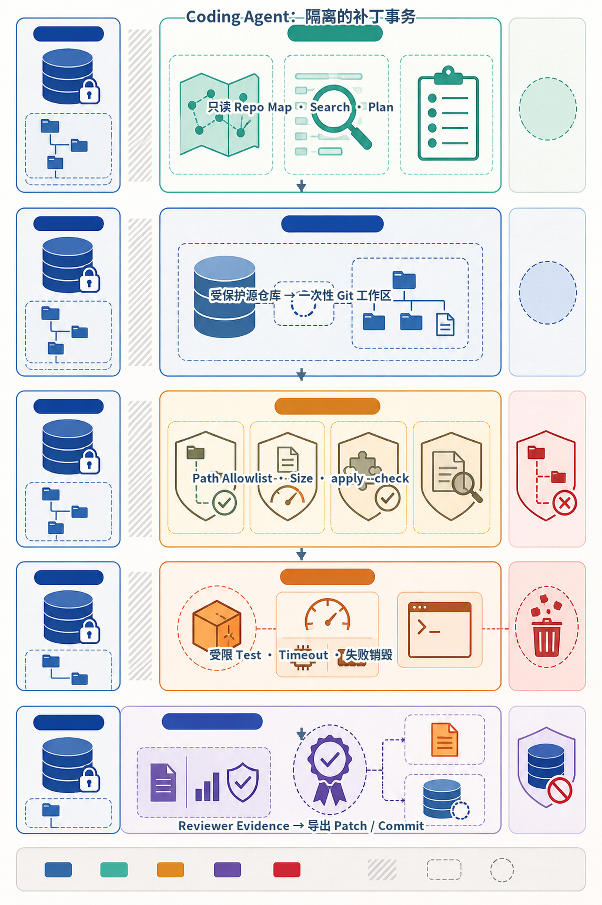
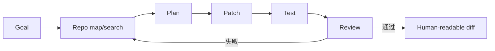
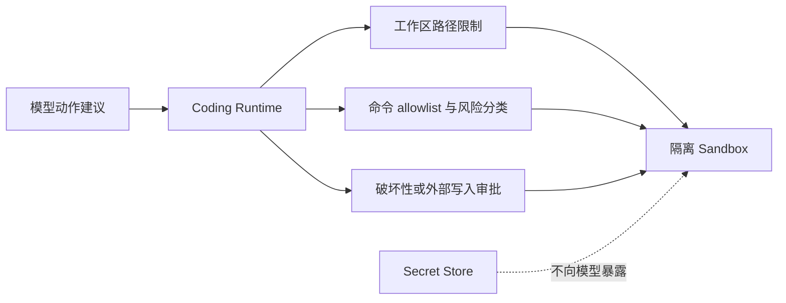
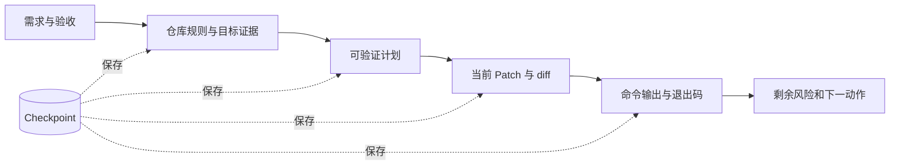
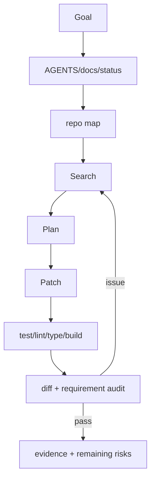
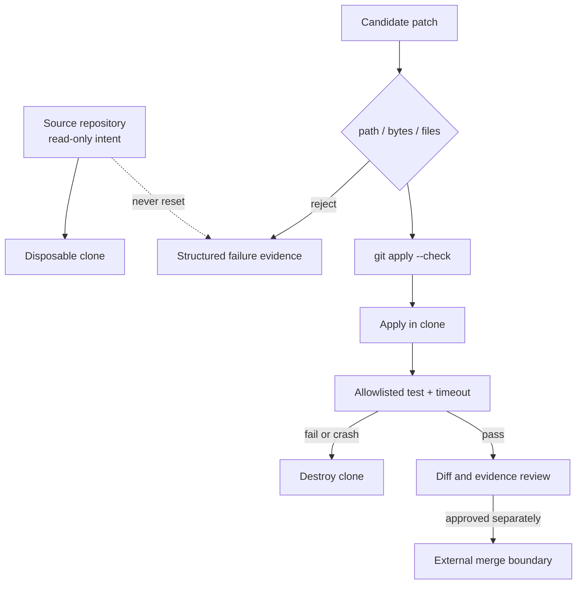

# 第33章：Agentic Coding



*图 33-A　Coding Agent 的隔离补丁事务。*

源仓库始终不是模型的直接写入目标。一次性工作区将补丁验证和测试失败变成可丢弃事务，但进程级隔离仍不等于针对恶意代码的完整操作系统沙箱；生产环境还需容器、虚拟机、网络和资源策略。

最后核对日期：2026-08-12。本章工作区代码已在 Python 3.12 下完成补丁策略、失败销毁、命令白名单和源仓库不变测试；操作系统级 Sandbox 仍作为明确外部边界。

## 导读、目标与前置知识
Coding Agent 需要 Repo Map、搜索、计划、Patch、测试、Review、Sandbox、Terminal、Git 和长任务恢复。本章从软件工程闭环而非代码生成单点理解它。

学习目标是完成从失败测试到受审 Patch 的闭环。前置知识为 Git、测试和第23、30章。

## 工作流

Coding Agent 的完成条件是产生受审 Patch 和验证证据。主图把仓库检查、计划、修改、测试与评审连接成闭环。



每一轮修改都从仓库事实开始，以验证结果结束；若失败，回到相关代码和测试重新定位，而不是重复生成更大的 Patch。



终端输出是 Observation，命令执行权属于 Runtime。敏感凭证、工作区外路径和破坏性 Git 操作都在模型不可绕过的边界处理。



Checkpoint 保存事实引用和产物哈希，不保存“应该已经完成”之类主观总结。恢复后重新检查工作树和外部状态。

## 最小与完整工程
最小 Agent 只修改一个受测函数。工程版先读取仓库约定，限制写入根目录，Patch 采用最小 diff，运行项目验证，记录命令与输出，保留用户未相关改动。长任务使用 checkpoint，不用自然语言声称测试通过。

## 误区、调试、实践与安全
生成代码不是完成；测试绿不证明需求全覆盖；Repo Map 不能替代读取目标文件。Terminal 使用 allowlist/sandbox，破坏性命令审批，秘密不进入模型。调试从原始失败和 diff 开始。

## 总结、练习、面试与阅读

### Coding Agent 的核心结构

Coding Agent 接收需求，检查仓库规则与工作树，建立 Repo Map，搜索目标符号，形成计划，生成最小 Patch，执行测试/静态检查，审查 diff，再交付证据。模型负责提出变化，文件系统、Sandbox、Git 和验证器提供事实。



交付内容包含 diff、验证命令与真实输出、未覆盖风险和文件链接；测试通过不能替代逐项需求审计。

### Repo Map 与 Code Search

Repo Map 记录目录、语言、构建系统、入口、测试和关键符号，不把每个文件全文塞进上下文。优先 `rg --files`、符号搜索、引用和目标测试。只读取与任务相关文件及其直接依赖。生成代码前确认现有模式，避免新建重复工具。

搜索结果带文件、行号和查询，计划引用证据。大型仓库可用 AST/语言服务器构建符号图，但文本搜索仍是验证实际内容的基础。Embedding 代码搜索用于语义发现，不替代精确引用搜索。

### Planning 与 Patch

计划将需求映射到文件、行为和测试，每步可验证。Bugfix 先写能复现原症状的失败测试；功能按最小行为逐步红—绿—重构。Patch 使用 diff 而非重写文件，保留用户无关改动。格式化只作用于范围可控文件。

```diff
- except Exception:
-     return None
+ except httpx.TimeoutException as exc:
+     raise DependencyTimeout("weather service timed out") from exc
```

示例把未知错误吞掉改为稳定领域错误。真实 Patch 还需要测试证明调用方正确处理。

### Terminal、Test 与 Sandbox

Terminal Tool 有工作目录、命令 allow/deny、超时、输出上限和退出码。网络、包安装、Git push、删除和系统目录写入单独审批。代码在容器/沙箱运行，不挂载宿主 Secret、Docker socket 或 SSH Agent。

验证顺序从目标测试到相关套件，再全量 lint/type/build。命令完成且 exit 0 才能声称通过。输出截断时不能根据前几行推断成功；长进程用 session 继续读取。

### Git Tool 与脏工作树

开始记录 `git status`，用户改动归用户，不使用 reset/checkout 覆盖。Agent 只 stage 自己文件，提交前检查 diff 与 secret。分支/worktree 用于隔离大功能，但不应无故移动现有改动。Push、PR 和 merge 是外部动作，需要明确授权。

### Review 与需求审计

Review 不只看代码风格，而逐条映射需求、数据流、错误、安全、并发、兼容和测试。Reviewer 使用实际 diff 和测试输出，不能只读 Coder 摘要。Inline comment 指向最小行范围，优先级依据影响。

需求审计区分“测试证明”“代码看似支持”“尚未验证”。例如单元测试绿不能证明 Docker 镜像可构建，必须运行构建或明确未验证。

### 长任务与 Checkpoint

Checkpoint 保存目标、已读文件、计划、完成步骤、测试证据、未提交 diff 和下一动作；不保存秘密或不可重建终端对象。自动续跑先重新检查工作树，因为用户可能在中间修改。已完成验证在代码变化后失效，必须重跑。

### 常见误区、调试与安全

常见误区：代码生成即完成、测试通过即满足全部需求、Repo Map 可替代阅读、Agent 可以整理用户脏改动、失败后无限重试。调试从原命令、exit、diff 和最小复现开始。安全上防 Prompt Injection 文件诱导执行命令，仓库内容是数据，权限规则来自受控指令。

### 完整工程示例与评估

项目5以 Diff 为输入，静态规则先发现明确问题，LLM 只审查语义风险，结果用 Pydantic 分类并附行号。项目9增加 Planner/Coder/Reviewer/Tester，但共享状态和终止由 Runtime。评估用真实修复任务，指标是补丁正确率、测试通过、无回归、无越权、时间与成本。

## 最小实验：在一次性克隆中验证 Patch

最小实验不让 Agent 直接编辑当前仓库，而把“候选 Patch 能否应用”和“测试是否通过”变成两个可观察阶段。仓库随附的 `RepositoryWorkspace` 先验证源目录确实是 Git 仓库，再用 `git clone --no-hardlinks` 创建位于源仓库之外的一次性副本。补丁应用前检查路径、字节数和文件数，并执行 `git apply --check`；只有预检成功才真正修改副本。

```python
from pathlib import Path

from ai_agent_book.apps.coding_workspace import RepositoryWorkspace, WorkspacePolicy

policy = WorkspacePolicy(
    max_patch_bytes=100_000,
    max_changed_files=20,
    test_timeout_seconds=30,
    allowed_commands=(("python", "-m", "pytest", "-q"),),
)
workspace = RepositoryWorkspace(
    source=Path("/workspace/repository"),
    workspace=Path("/tmp/coding-run-42"),
    policy=policy,
)
result = workspace.execute_patch(
    patch_text,
    test_command=("python", "-m", "pytest", "-q"),
)
assert result.test is not None
print(result.changed_files, result.test.returncode, result.kept)
```

这个 API 的重要语义是：测试失败或执行异常时，`rollback()` 删除整个一次性克隆，而不是在用户仓库中运行 `git reset --hard`。因此测试产生的缓存、临时文件和未跟踪文件也会一并消失，用户原工作树始终不变。测试必须同时断言候选副本的内容和源文件的内容，不能只检查退出码。



图中的“approved separately”很关键：测试通过并不自动授权提交、推送或合并。补丁生成、局部验证、代码审查和外部写入应使用不同权限。若 Agent 同时掌握仓库写入、Secret、网络与合并权限，一个间接 Prompt Injection 就可能跨越全部边界。

## 工程案例：失败补丁、未知结果与回滚

设想 Agent 修改支付回调。语法测试通过，但集成测试因数据库断言失败。正确处理不是反复在原工作树追加修改，而是保留以下结构化证据：需求 ID、基准提交、Patch 哈希、改变文件、命令、退出码、截断标记和失败日志摘要。工作区被销毁后，Planner 根据失败证据决定生成新 Patch，不能把上一次副本中的隐式文件状态带入下一轮。

测试超时比普通失败更棘手。超时可能表示死锁、用例过慢或进程留下子进程。本地教学实现能终止父进程并销毁副本，但无法证明所有子进程、网络连接和内核资源都被隔离。生产 Runner 应使用容器或微虚拟机作为一次性执行单元，并配置以下控制：

- 非 Root 用户、只读基础镜像和最小写层；
- 默认禁网，只允许显式代理访问批准域名；
- CPU、内存、PID、磁盘、运行时长和日志大小配额；
- 不挂载 Docker Socket、SSH Agent、云凭证和宿主用户目录；
- 依赖从内容寻址缓存读取，并验证 Lockfile 与制品签名；
- 测试结束后销毁执行单元，审计只保留脱敏证据和产物哈希。

命令 Allowlist 也不是安全 Sandbox。`python -m pytest` 会执行仓库代码，它可以创建子进程或直接打开 Socket。Allowlist 只控制入口命令的形状，操作系统隔离才控制命令运行后能访问什么。教材把这两个层次分开，是为了避免“我们只允许 pytest，所以安全”的错误结论。

## 失败分析与调试

当 Coding Agent 给出错误修改时，应按证据链逆序定位，而不是先更换模型。第一步检查测试是否真正覆盖用户现象；第二步检查 Patch 基准提交是否仍与工作树一致；第三步检查搜索是否遗漏调用方、配置或生成文件；第四步才分析计划和模型推断。常见症状与定位方式如下。

| 症状 | 优先证据 | 常见原因 | 修复方向 |
|---|---|---|---|
| `git apply --check` 失败 | 基准 SHA、Patch 上下文 | Patch 基于旧版本或上下文过大 | 重新读取目标文件并生成最小 Diff |
| 目标测试绿、全量测试红 | 两组命令与失败用例 | 只修局部契约，破坏调用方 | 扩展影响图和回归集 |
| 同一轮反复提出相同 Patch | 状态指纹、失败摘要 | Observation 未进入共享状态 | 按 artifact/evidence 哈希做无进展终止 |
| 测试超时且无日志 | PID/资源指标、最后事件 | 死锁、等待网络或子进程泄漏 | 更短分层超时并采集线程/进程证据 |
| 源仓库出现新文件 | 工作区根路径、挂载清单 | Runner 实际在源目录运行 | 失败关闭并改用源目录之外的副本 |

状态循环检测不能只比较自然语言消息，因为模型可用不同措辞描述同一结果。项目 9 对去掉版本号的共享状态做规范化序列化并计算 SHA-256；同一状态再次出现即以 `no_progress_loop_detected` 停止。实际系统还应把 Patch 哈希、测试集合哈希和失败分类加入进展定义，避免“每轮改一个空格”绕过门禁。

## 单 Agent 基线与评估设计

Multi-Agent 软件团队只有在角色具备独立信息、工具或权限时才可能抵消额外通信成本。项目 9 用同一需求运行五角色流程和单 Agent 基线，比较消息数与估算 Token；这只是机制演示，不足以证明质量优势。正式评估应固定任务集、仓库快照和执行预算，至少测量：任务成功率、隐藏测试通过率、回归率、越权率、有效 Patch 比例、人工接管率、P50/P95 时延和总成本。

为了避免选择性报告，同一任务应记录所有失败尝试，成功判定由独立验证器读取仓库与测试，而不是由 Coder 或 Reviewer 自报。若五角色与单 Agent 成功率接近，而五角色成本和尾延迟显著更高，工程结论应是减少角色。角色数量不是成熟度指标。

## 练习参考答案

1. **为什么不在用户仓库里用 `reset --hard` 回滚？** 因为无法证明未提交文件和用户改动都属于 Agent；销毁一次性副本不会触碰源工作树，恢复边界更清楚。
2. **命令白名单为何不能替代 Sandbox？** 白名单只约束启动入口，被允许的解释器或测试程序仍可访问文件、网络和进程；必须用操作系统边界限制运行后的能力。
3. **如何定义“有进展”？** 至少应出现新的可验证 Artifact、不同的测试证据或明确缩小的失败集合；仅版本号、措辞或时间戳变化不算进展。
4. **何时使用多个 Agent？** 当不同角色需要独立权限、并行读取互不依赖的信息，或 Reviewer 使用与 Coder 不同的证据和门禁时；若只是转述同一上下文，应使用单 Agent 工作流。

总结：Coding Agent 的价值来自闭环证据，而不只是生成速度。练习：实现搜索—失败测试—补丁—回归—Review 闭环。面试：如何保护脏工作树？怎样证明修复覆盖原始缺陷？何时使用 worktree？延伸阅读：Git、pytest、语言服务器、Sandbox 与安全供应链资料。代码目录：项目5、9。

## 本章引用
<!-- chapter-citations:start -->
以下资料用于支撑本章的核心原理、工程边界与版本敏感说明：

- [jimenez2024swebench：SWE-bench: Can Language Models Resolve Real-World GitHub Issues?](../references.md#ref-jimenez2024swebench)
- [slsa：Supply-chain Levels for Software Artifacts](../references.md#ref-slsa)
- [owasp-agentic-top10：OWASP Top 10 for Agentic Applications](../references.md#ref-owasp-agentic-top10)
- [mitre-atlas：Adversarial Threat Landscape for Artificial-Intelligence Systems](../references.md#ref-mitre-atlas)
<!-- chapter-citations:end -->
