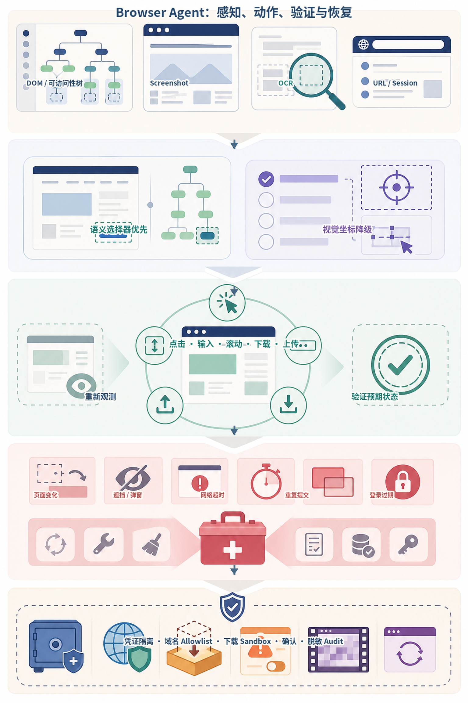
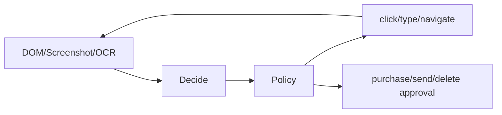
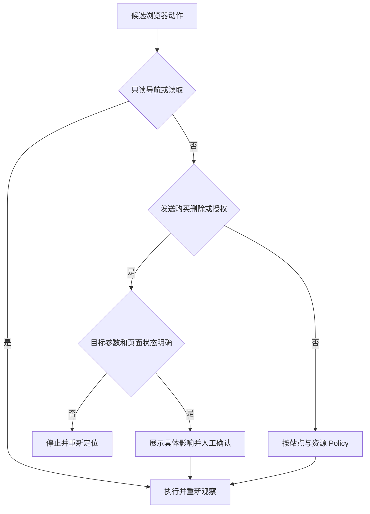
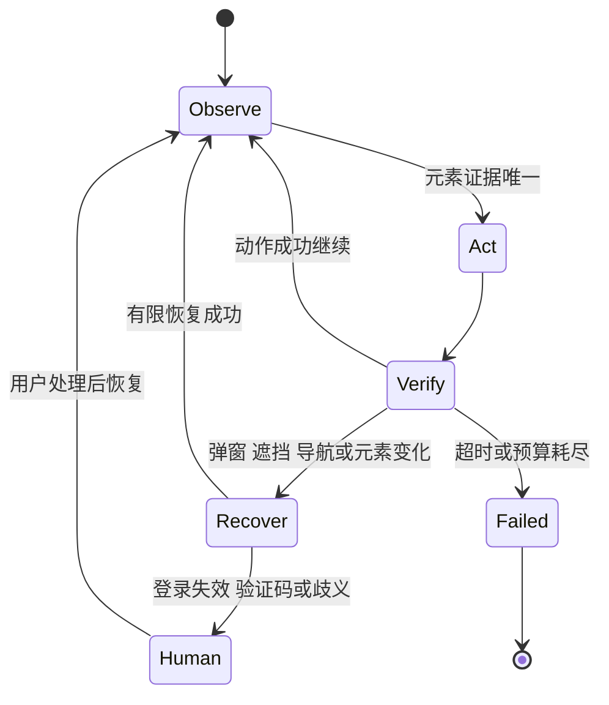
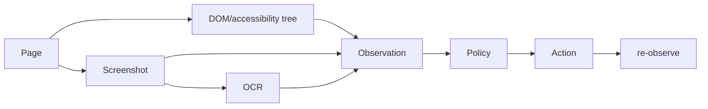
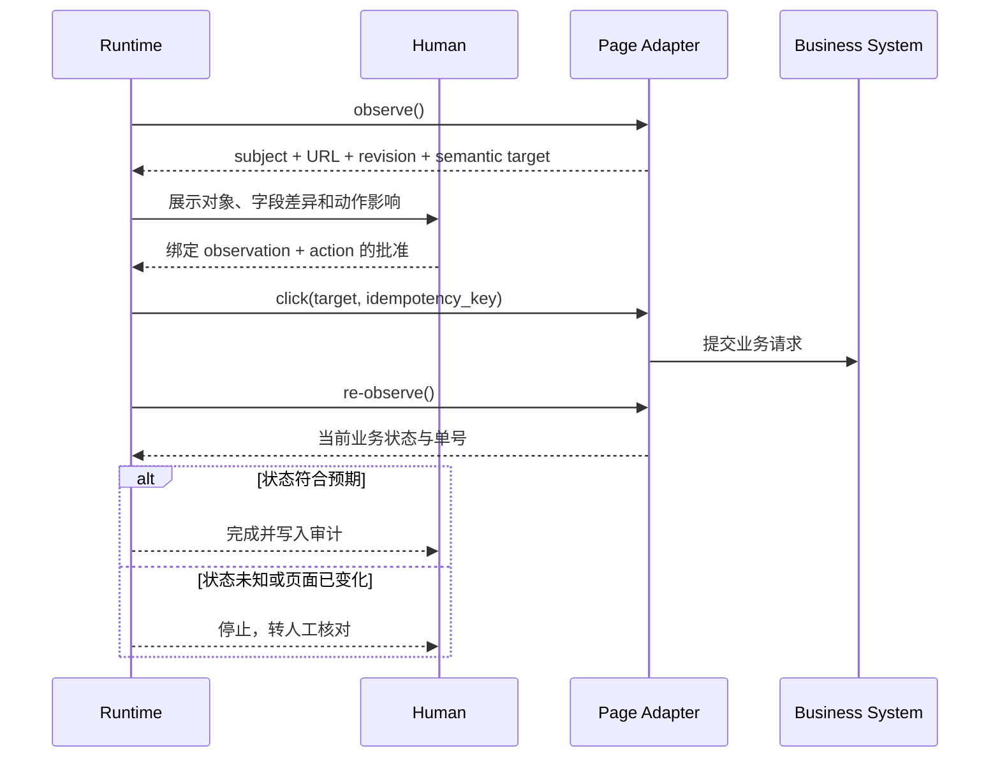

# 第34章：Browser Agent 与 Computer Use

最后核对日期：2026-07-11。

## 导读、目标与前置知识
浏览器和桌面 Agent 通过 DOM、截图、OCR 与 UI 动作工作。本章处理页面变化、错误恢复、登录凭证、人工确认和测试。

学习目标是掌握核心观察—动作循环，并实现一个需要审批的表单示例。前置知识为 Web、权限和第30章。

Browser Agent 的关键不是“能点击”，而是每个动作后重新感知、验证和恢复。主图综合 DOM/可访问性树、截图、OCR、URL 与会话状态，并把语义定位、视觉降级、异常分支和安全边界分层展示。



*图 34-A：Browser / Computer Use 的感知、动作、验证与恢复闭环。视觉坐标是必要降级路径，但比稳定语义选择器更脆弱。*

图 34-A 最底部把凭证、域名、下载、审批和审计放在闭环外强制执行。页面文本和截图都属于不可信输入，不能授权 Agent 导出数据或绕过确认。

## 架构

Browser Agent 每次动作后都必须重新观察页面。主图把 DOM、截图与 OCR 观察连接到 Policy 和审批门禁。



DOM 定位语义元素，截图覆盖画布和视觉状态，OCR 是不可靠补充。动作之后必须重新观察，不能假设点击成功。



批准绑定页面主体、目标、参数和时效；页面刷新或元素内容变化后必须重新确认，不能复用旧决定。



恢复策略限制尝试次数并保存截图证据。验证码、登录和权限问题进入人工流程，不自动绕过。

## 最小与完整工程
最小任务读取公开页面标题。工程版为每步保存页面 URL、元素证据和动作结果，使用稳定语义选择器，处理弹窗、导航和超时。测试站点注入布局变化、延迟与失败。

## 误区、调试、实践与安全
坐标点击脆弱；登录成功不代表有权执行所有操作；验证码不应绕过。凭证由浏览器/秘密系统持有，模型不读取明文；发送、购买、删除前展示具体对象并确认。

## 总结、练习、面试与阅读

### Observation：DOM、Screenshot 与 OCR

DOM 提供角色、名称、层级和可交互属性，适合稳定选择；Screenshot 覆盖 canvas、图表、视觉遮挡与布局；OCR 从像素恢复文本但有识别误差。Agent 根据任务组合，不能把 OCR 当页面权威数据，也不能只靠 DOM 判断元素是否可见。



融合时保留每条事实来源与置信度；DOM 文本与 OCR 冲突时不静默选择，而应重新观察或请求确认。

Observation 保存 URL、标题、选中元素语义、截图引用、时间和登录主体。页面内容可能包含 Prompt Injection，始终视为数据。

### 元素定位与动作

优先使用 accessibility role + name、label、稳定 data-testid 或明确 DOM 关系，最后才用 CSS/XPath，坐标点击是视觉应用的退路。选择器匹配多个元素时停止并缩小，不随机点击第一个。

动作协议是类型化 union：navigate、click、type、select、scroll、upload、download 和 wait。每个动作有目标证据、timeout 和风险。输入密码不把明文返回模型，由凭证管理器/浏览器填充。

```json
{
  "action": "click",
  "target": {"role": "button", "name": "提交审批"},
  "expected": {"url_contains": "/review", "text": "等待审批"}
}
```

动作后重新观察并验证 expected。点击成功的驱动返回不等于业务状态改变；页面可能弹错、导航失败或被遮挡。

### 网页变化与错误恢复

页面会动态加载、A/B、换语言和更新 DOM。等待语义条件而不是固定 sleep，例如元素可见、网络状态或 URL 变化。错误恢复最多重新定位、刷新或回到已知 checkpoint，次数有限。重复提交前查询当前状态或使用幂等键。

浏览器崩溃时恢复 session 要考虑登录与未提交表单。高风险流程不从模糊页面状态继续，转人工确认。

### 登录、凭证与会话

已有浏览器 session 代表用户身份，但 Agent 仍遵守任务授权。Cookie、token、密码和验证码不进入 Prompt/日志。OAuth scope 最小，退出/切换账号后清理 session。MFA 与验证码交给用户，不尝试绕过。

自动化使用专门测试账号与隔离 profile。共享浏览器可能包含私人 tab 和扩展，不在未授权情况下读取。

### Human Approval 与操作安全

发送邮件、发布内容、购买、删除、权限修改和不可逆提交前显示页面、对象、金额/收件人、字段差异与证据。批准绑定当前页面状态和动作参数，页面变化后重新确认。

下载文件进入隔离目录，扫描类型/大小；上传只允许指定文件；浏览器导航使用域名 allowlist 防钓鱼和数据外传。剪贴板读写也属于敏感能力。

### Browser Agent 测试

建立本地测试站点，覆盖正常 DOM、延迟、元素重命名、弹窗、遮挡、登录过期、提交失败和重复点击。断言最终业务状态、动作数、审批和 Audit，不只断言点击调用。视觉回归截图帮助发现布局，但不替代语义断言。

```python
async def test_submit_requires_approval(browser_agent):
    result = await browser_agent.run("提交报销单")
    assert result.status == "approval_required"
    assert result.pending_action.target == "提交审批"
    assert result.audit_events[-1].kind == "approval.requested"
```

上面的测试只表达验收意图；可直接运行的离线工程位于
[`examples/browser_safety_lab/`](https://github.com/wujinjun/ai-agent-book/tree/main/examples/browser_safety_lab)。它没有把浏览器驱动 Mock
成一个永远成功的 `click()`，而是把观察、定位、Policy、审批、执行与业务验证逐层拆开。

```python
page = FakeExpensePage()
runtime = BrowserRuntime(
    page,
    Policy("employee-42", "https://expense.test/"),
)
action = Action(
    "click",
    "button",
    "提交审批",
    "awaiting_approval",
    "ER-2026-001:submit",
)

pending = runtime.execute(action)
assert pending.status == "approval_required"

approval = Approval.issue(page.observe(), action)
completed = runtime.execute(action, approval)
assert completed.status == "completed"
```

`Approval` 同时绑定观察指纹与动作摘要。因此，批准之后若页面 Revision、登录主体、URL、目标
或幂等键发生变化，Runtime 会返回 `stale_approval`，而不是把旧批准套用到新页面。这个约束尤其
重要：页面中的恶意指令可能在用户批准后替换收件人或金额，仅把批准绑定到“允许点击”没有意义。

### 从驱动事件到业务事务

浏览器驱动通常只能证明事件已经派发，不能证明业务事务已提交。例如按钮可能被透明遮罩拦截，
后端可能返回校验错误，网络重试也可能已经提交两次。可靠 Runtime 至少记录以下四类证据：

| 证据 | 示例 | 不能证明什么 |
|---|---|---|
| 动作证据 | 元素 ID、语义名称、点击时间 | 后端已接受请求 |
| 导航证据 | URL 或页面 Revision 改变 | 业务状态正确 |
| 业务证据 | 状态变为“等待审批”、出现服务端单号 | 副作用只发生一次 |
| 幂等证据 | 业务键已登记、重复请求返回同一结果 | 用户仍然授权当前内容 |

因此完整顺序是“读取当前状态—绑定批准—带幂等键执行—重新观察—核对业务状态”。对于不提供
幂等接口的网页，可以在提交前查询业务对象、提交后读取服务端单号，并在状态不确定时转人工，
不能用自动重复点击掩盖超时。



这张时序图把 UI 点击放在更大的业务事务中。幂等键抑制重复副作用，重新观察验证结果，审批则
证明用户同意的是哪一个页面和哪一组参数；三者互补，缺一不可。

### 状态空间与失败预算

恢复策略应按失败类型分层。`detached element` 可以重新观察和定位；加载超时可以在剩余 Deadline
内重试；登录过期、验证码、跨域跳转、目标歧义和批准失效必须暂停。每次恢复都消耗动作预算，
并保留前后 Observation 的指纹。若同一错误连续发生，继续点击通常只会增加副作用风险。

生产测试不能只替换驱动方法。Contract Test 应让 Playwright/WebDriver Adapter 在本地测试页上
生成同一 `Observation` Schema；集成测试验证弹窗、重绘和导航；端到端测试使用隔离账号与可回滚
业务对象。截图回归负责视觉异常，业务 API 或数据库查询负责最终状态，两类断言不能互相替代。

### Computer Use 与桌面应用

桌面应用缺少 DOM 时依赖截图、OCR、窗口树和坐标，风险更高。操作前确认前台应用和窗口标题，避免键盘输入落入错误窗口。OS 权限、文件选择器和系统对话框由明确规则处理。终端或原生 API 可完成的任务优先专用工具，Computer Use 作为最后一公里。

### 常见误区、调试与安全

常见误区：坐标稳定、登录即拥有授权、动作返回成功即完成、验证码可以自动处理。调试保存操作前后截图/DOM、选择器、URL 与事件，不保存凭证。页面诱导 Agent 上传文件或粘贴 Secret 时，Policy 拒绝。
### 练习参考答案与面试要点

1. **表单确认设计。** 参考答案应让批准绑定主体、Origin、业务对象、字段差异、Observation
   Fingerprint、动作摘要与过期时间；执行携带业务幂等键，动作后查询服务端状态。
2. **布局变化测试。** 同一个业务按钮分别改变 DOM 顺序、CSS 类与屏幕坐标。Role + Name 仍应
   定位成功；若出现两个同名按钮必须返回歧义，不能默认点击第一个。
3. **不确定超时。** 若提交后连接中断，先按业务键查询。查到记录则返回已有结果；查不到且接口
   支持同键幂等时才重试；无法确定时进入人工核对。
4. **面试要点。** DOM/Accessibility Tree 提供语义和结构，截图提供视觉可见性与 Canvas 信息，
   OCR 是带置信度的补充。动作后再观察是因为驱动成功不等于业务成功；已有登录 Session 只证明
   身份，不自动扩大本次任务授权。

总结：Browser/Computer Use 是观察—动作—再观察的受控闭环。它的工程质量由授权绑定、目标唯一性、
业务幂等、结果验证和有限恢复共同决定，而不是由一次演示能否点击网页决定。延伸阅读包括 Web
Accessibility、Playwright/WebDriver、安全浏览器自动化和 Human-in-the-Loop 资料。本章独立代码目录为
[`examples/browser_safety_lab/`](https://github.com/wujinjun/ai-agent-book/tree/main/examples/browser_safety_lab)；项目 6、8 展示审批与长流程组合。

## 本章引用
<!-- chapter-citations:start -->
以下资料用于支撑本章的核心原理、工程边界与版本敏感说明：

- [zhou2023webarena：WebArena: A Realistic Web Environment for Building Autonomous Agents](../references.md#ref-zhou2023webarena)
- [xie2024osworld：OSWorld: Benchmarking Multimodal Agents for Open-Ended Tasks](../references.md#ref-xie2024osworld)
- [rfc9110：HTTP Semantics](../references.md#ref-rfc9110)
- [owasp-agentic-top10：OWASP Top 10 for Agentic Applications](../references.md#ref-owasp-agentic-top10)
<!-- chapter-citations:end -->
