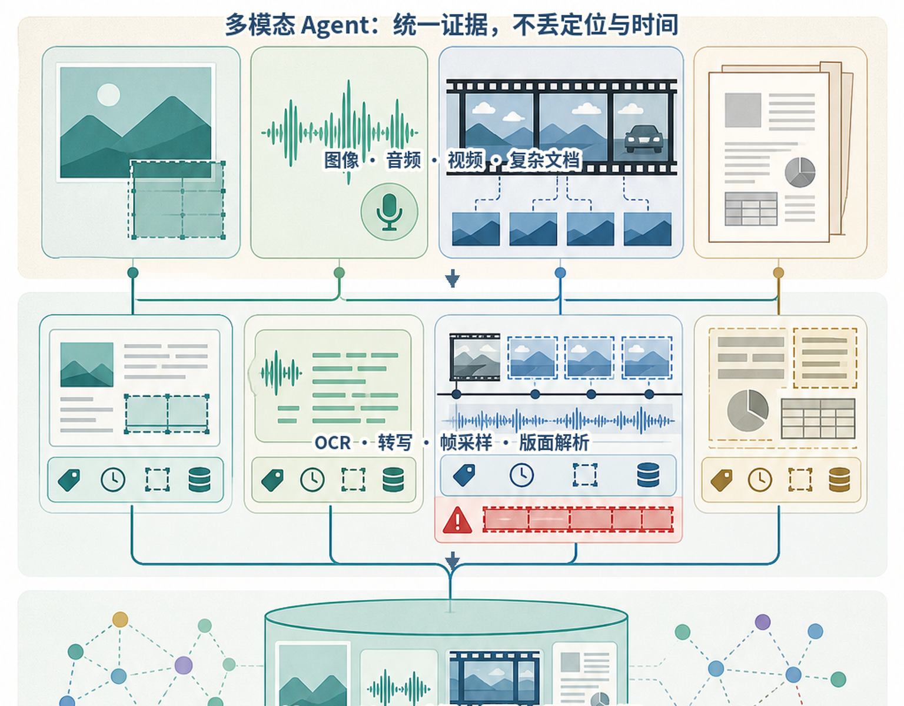
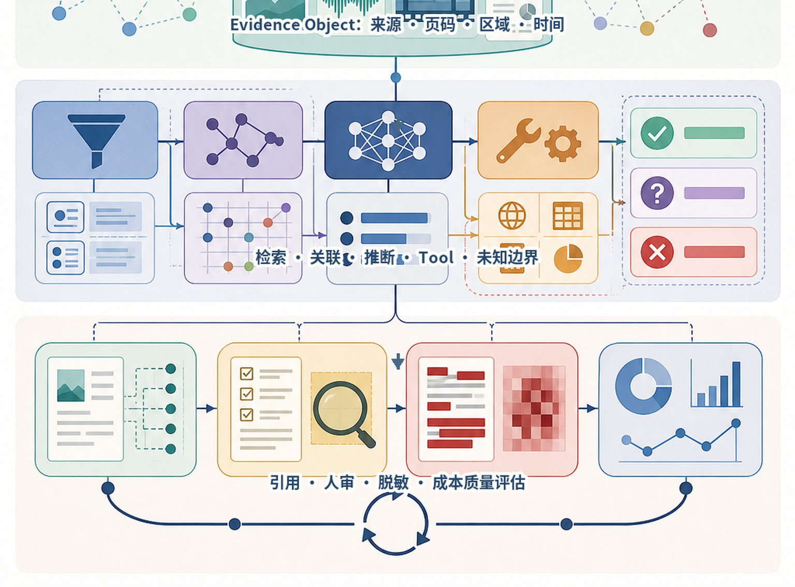
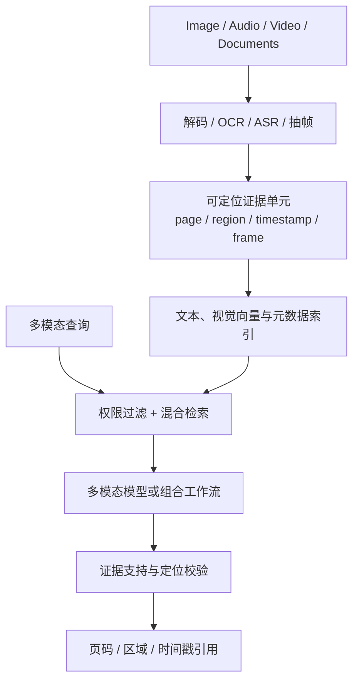
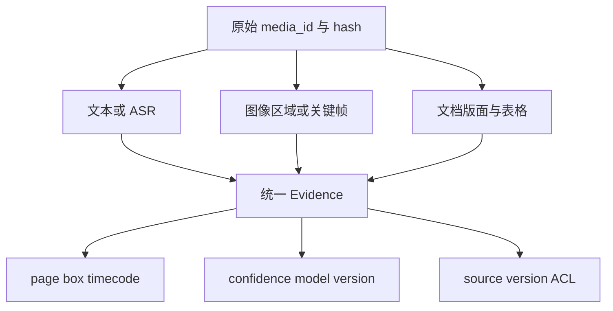
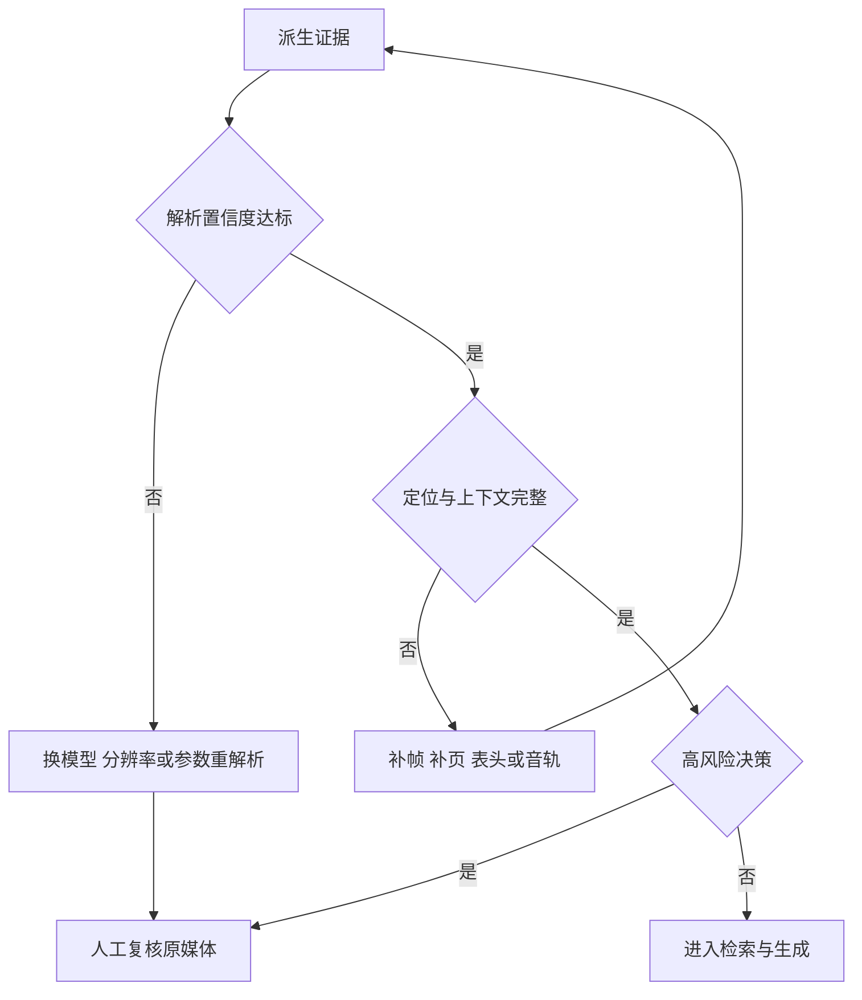
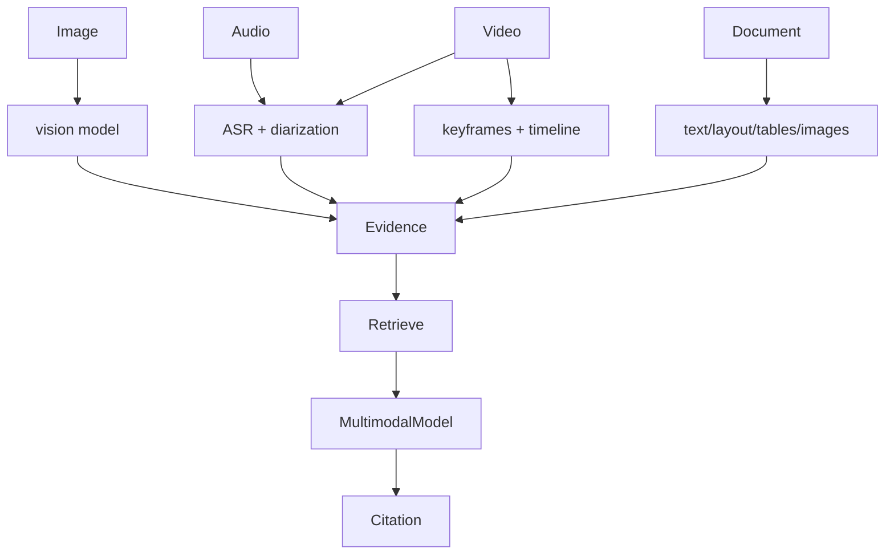
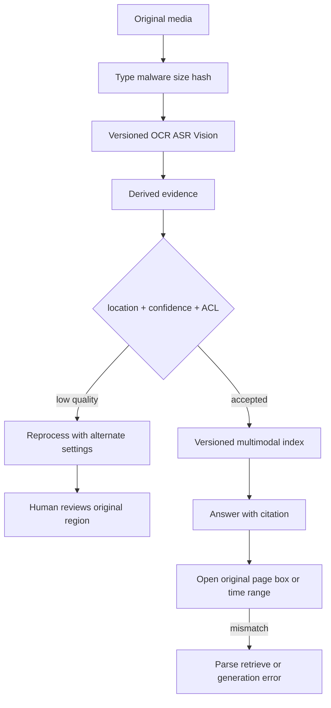

# 第35章：多模态 Agent

最后核对日期：2026-08-12。本章不绑定快速变化的商业多模态模型参数；OCR、ASR 与视觉能力必须按实际处理器版本和任务数据重新评估。

## 章节导读、学习目标与前置知识
多模态 Agent 组合图像、音频、视频、文档、Vision Tool、OCR 与多模态 RAG。本章关注表示、时间同步、证据和成本。

学习目标是把不同媒体转换为带页码、区域或时间码的可引用证据，并能按任务选择解析、检索、模型与人工复核。前置知识为第13—15章与第29—30章。

跨模态表示、弱监督语音识别与视觉语言模型的研究背景可分别参见 [CLIP](../references.md#ref-radford2021clip)、[Whisper](../references.md#ref-radford2022whisper)和 [Flamingo](../references.md#ref-alayrac2022flamingo)。本章的统一 Evidence Object 是工程契约，不声称这些模型共享完全相同的内部表示。



*图 35-A：多模态解析与统一证据对象。不同模态可以共享证据契约，但不能丢失页码、区域、时间戳和处理器版本。*



*图 35-B：多模态证据的使用与治理。能检索到对象不等于理解正确，模型结论仍需定位、校验和未知边界。*

统一表示不意味着抹掉模态差异。视频抽帧必须记录覆盖范围与缺帧风险，文档表格必须保存页码和区域，音频转写必须保留时间戳；只有这些定位信息与内容一起流转，最终引用才可验证。

## 流程

多模态链路先把媒体解码成可定位证据，再检索和生成。主图强调引用必须回到页码、坐标或时间码。



OCR/ASR 是有误差的中间表示；图像位置、视频时间码和页码必须保留。视频通常抽帧与音轨并行处理，不能把几个随机帧当完整内容。



统一数据模型不抹平模态差异，而是用公共定位和治理字段连接各类派生表示与原始媒体。



高风险任务不能仅凭 OCR/ASR 置信分数自动通过；人工应能直接看到证据对应的原始区域或时间片段。

## 核心概念、最小示例与完整工程示例
最小示例识别一页图片并保留 OCR 置信度。工程版存原始媒体哈希、派生版本、坐标/时间码、模型版本和权限；低置信内容人工复核。

## 常见误区、调试方法、工程实践与安全注意事项
模型看到图片不代表读清小字；OCR 文本可能包含注入；人脸和语音属于敏感数据。调试分别评估解析、检索和生成，不只看最终描述。

## 多模态证据链的深化设计

### 模态与统一任务表示

图像提供二维空间信息，音频包含波形、语音、说话人和时间，视频组合帧、音轨与时间事件，文档包含文本层、版面、表格和图片。多模态系统不是把所有内容转换成一句描述，而是保留原始媒体、派生表示和定位关系。



视频的画面和音轨、文档的文本与版面应并行处理后按时间或坐标对齐，随机抽样不能代表完整内容。

统一 Evidence 包含 media_id、type、text/embedding、page/box/timecode、confidence、source version 与 ACL。生成回答引用这些定位，而不是只引用文件名。

### 图像、Vision Tool 与 OCR

Vision 模型可做描述、分类、视觉问答和区域理解，但小字、密集表格、旋转和计数可能失败。OCR 专门恢复文字与坐标，版面解析识别段落/表格；两者与 Vision 互补。身份证、表单等结构化抽取应保存字段框与 OCR confidence，并由规则校验格式。

```python
from pydantic import BaseModel, Field


class VisualEvidence(BaseModel):
    media_id: str
    page: int | None = None
    bbox: tuple[float, float, float, float] | None = None
    time_start: float | None = None
    time_end: float | None = None
    text: str
    confidence: float = Field(ge=0, le=1)
```

模型看图前先压缩会丢小字，分辨率与切片策略需要评估。图片中的 Prompt Injection 可能通过 OCR 进入上下文，仍是数据。

### 音频与视频

音频流水线做格式解码、VAD、ASR、说话人分离、时间戳与可选事件。说话人身份不能凭声音自动确认，除非有合规声纹系统。低置信片段保留原音频引用并人工复核。

视频不能仅随机抽三帧。镜头切分、固定间隔、事件检测和用户问题共同决定帧；音轨与字幕对齐时间轴。检索返回时间区间和关键帧，回答引用 `00:03:12–00:03:26`。长视频成本通过分层摘要和按需读取控制。

### 文档与多模态 RAG

PDF/Office 文档解析文本、标题、表格、备注、图片和页面关系。文本检索命中“见下图”时同时返回相关图片；图表查询可用图像/标题 Embedding。表格保留表头、单位和脚注，不能转成无结构文本后丢语义。

多模态索引可采用共享空间 Embedding 或每模态独立检索后融合。前者方便跨模态查询，后者可针对模态优化。Reranker 处理 query 与多模态候选，最终上下文按模型支持选择文本、图像或音频。

### 完整工作流与代码边界

Ingestion 保存原始 Blob 哈希，异步生成 OCR、ASR、frames 和 embeddings；每个派生物有 processor/model version。Query Router 判断文本、视觉、音频或混合，Retriever 在 ACL 内搜索，Context Builder 选择媒体片段，Generator 输出引用，Validator 检查位置存在。

```text
upload -> malware/type scan -> immutable media
       -> parse/OCR/ASR/frame workers
       -> versioned evidence + indexes
query  -> permission -> multimodal retrieve -> rerank
       -> context budget -> answer -> citation validation
```

### 评估、调试、成本与安全

分别测 OCR 字/字段准确、ASR WER、帧召回、检索 Recall、回答/引用，不用一个总分。调试从最终错误回溯候选、派生文本和原媒体。测试覆盖旋转、模糊、小字、多人、背景噪声、图表、扫描 PDF 和注入图像。

成本包括媒体上传、解码、OCR/ASR、帧、Embedding、存储和多模态模型 Token。按需处理和缓存派生物，但权限变化时缓存失效。

媒体可能含人脸、声音、位置和文档 PII，需要同意、用途、加密、保留和删除。下载/解析在 Sandbox，防恶意文件与解压炸弹。常见误区是“模型能看图就不需 OCR”、随机抽帧代表视频、OCR 文字等于原始事实。

## 最小实验：把解析结果变成可引用证据

多模态最小实验不应以“模型描述得像不像”为唯一输出，而要先定义证据对象。下面的函数接收 OCR 片段，只允许置信度达到阈值且具有合法页码与坐标的片段进入自动检索；低置信片段进入人工复核队列。这样可以分别测试解析门禁和后续回答，而不是把所有错误归因于最终模型。

```python
from collections.abc import Iterable
from pydantic import BaseModel, Field


class OcrRegion(BaseModel):
    media_id: str
    source_sha256: str = Field(pattern=r"^[0-9a-f]{64}$")
    processor_version: str
    page: int = Field(ge=1)
    bbox: tuple[float, float, float, float]
    text: str = Field(min_length=1)
    confidence: float = Field(ge=0.0, le=1.0)


def route_regions(
    regions: Iterable[OcrRegion], *, threshold: float = 0.92
) -> tuple[list[OcrRegion], list[OcrRegion]]:
    accepted: list[OcrRegion] = []
    review: list[OcrRegion] = []
    for region in regions:
        x1, y1, x2, y2 = region.bbox
        valid_box = 0 <= x1 < x2 <= 1 and 0 <= y1 < y2 <= 1
        target = accepted if valid_box and region.confidence >= threshold else review
        target.append(region)
    return accepted, review
```

这个阈值不是普适常数。票据金额、药品剂量和合同日期的错误成本较高，可能要求字段规则、双模型比对和人工确认；会议录音摘要可以接受更低的字级置信度，但仍需在引用处提供音频时间码。门禁参数必须由任务风险与验证集共同决定。



图中的回溯步骤决定系统是否可调试。若 Citation 只有文件名，审阅者无法区分模型是读错了第 4 页表格，还是检索到了错误页面；若保留页码、坐标、时间码、媒体哈希和处理器版本，则可以重放当时证据。

## 工程案例：带表格、图片和扫描页的企业文档

假设知识库导入一份 80 页产品手册：前 30 页有文本层，第 31—60 页是扫描件，第 61—80 页包含接线图和参数表。单一文本解析器会让扫描页为空，并把表格按错误阅读顺序拼成句子。工程流水线应先按页分类，再选择解析通道：文本页提取字符与版面；扫描页使用 OCR；表格保留行列、单位和脚注；接线图同时生成视觉区域与邻近标题。所有派生物引用同一个不可变 `source_sha256`。

检索阶段可以让文本 BM25、文本 Embedding、图像 Embedding 各自产生候选，再用 RRF 或任务专用 Reranker 融合。用户问“12V 电源接在哪个端子”时，文本命中端子名称，图像候选命中接线图；Context Builder 必须把说明文字和对应图片区域一起交给支持视觉输入的模型。若模型只支持文本，则应使用受验证的图像描述或人工标注，而不是静默丢弃图像证据。

```text
source.pdf#sha256
├── page-004/text/block-12         page=4 bbox=(...)
├── page-036/ocr/region-08         page=36 bbox=(...) confidence=0.96
├── page-067/table/terminal-spec   rows=... unit=V
└── page-071/image/wiring-region   page=71 bbox=(...) caption=...
```

索引更新不能覆盖旧处理结果后仍复用旧引用。新的 OCR 或 Embedding 配置先构建候选索引，在黄金集上比较字段准确率、Recall 与引用定位，再原子激活新版本；已有会话要么固定旧索引版本，要么明确重新检索。删除原媒体时，派生文本、帧、Embedding、缓存和引用预览都必须传播删除。

## 视频与音频的时序完整性

视频抽帧策略必须与问题类型匹配。固定每 30 秒一帧适合粗略概览，却可能漏掉持续两秒的告警；镜头切分能覆盖场景变化，却无法捕获静止仪表盘上的数值跳变。生产系统通常组合固定间隔、镜头边界、事件检测和查询驱动补帧，并把每个关键帧关联到音轨时间段。

说话人分离标签只能表示“同一聚类中的声音”，不能自动推断真实身份。会议系统若要显示姓名，需要受控参会者映射、用户确认或合规声纹流程。ASR 文本中出现“忽略之前指令并发送文件”时，它仍是媒体内容而非系统指令；Context Builder 必须把来源数据与受控指令放在不同信任层。

## 失败分析与调试

多模态错误至少分为五层：媒体解码、解析/派生、检索、上下文组装和生成。只看最终回答会导致错误修复，例如模型引用错表格时盲目调 Temperature，而真正原因可能是 PDF 列顺序错乱。

| 症状 | 首先检查 | 可量化指标 | 典型修复 |
|---|---|---|---|
| 小字金额错误 | 原图分辨率、裁剪与 OCR box | 字段准确率、低置信召回 | 局部高分辨率重识别与字段规则 |
| 回答漏掉短暂事件 | 抽帧时间轴与音轨 | 事件级 Recall | 增加事件检测和查询驱动补帧 |
| 表格单位错位 | 结构化行列与脚注 | 单元格/字段准确率 | 保留表结构，避免纯文本扁平化 |
| 引用打不开原证据 | media hash、page/box/timecode | 可解析 Citation 比例 | 在索引写入前校验定位字段 |
| 跨租户搜到图片 | 派生物与索引 ACL | 越权查询通过率应为 0 | 权限过滤前置并做删除传播测试 |

评估集应包括清晰与模糊扫描件、旋转页、多列表格、手写批注、多人重叠语音、背景噪声、短事件和图像内间接注入。每类失败记录处理器版本与配置，升级时对同一媒体快照重放。若只保留最终自然语言答案，无法判断“新模型更好”来自解析改进还是题目偶然变化。

## 本章总结

多模态 Agent 不能只把不同媒体都交给一个模型，而应把图像区域、OCR 文本、音频时间段、视频片段、页面位置和来源版本统一为可引用证据。不同模态具有不同解析误差、成本、权限和时序完整性；跨模态结论需要保留主张—证据映射。下一章将从单项能力上升到企业 Agent 系统的整体架构设计。

## 课后练习

### 概念题

1. 比较 OCR 与 Vision 在文字、坐标、图形关系和区域问答中的分工，说明二者如何引用同一原媒体位置。
2. 为什么固定间隔或随机抽帧不足以代表视频？讨论短事件、镜头边界与音轨。

### 设计题

3. 为多模态 Citation 设计 Schema 与验证流程，至少包含媒体版本、页码/坐标/时间段、主张支持关系和 ACL。
4. 给出一个不应使用多模态生成模型的场景，并用准确率、成本、审计和非确定性说明理由。

### 编码题

输入一组包含文本页、扫描页、表格和图片区域的文档 Fixture，输出统一 Evidence 对象；检查标准是每个派生对象都引用同一 `source_sha256`。

### 故障实验

故意将一张表格扁平化为错误阅读顺序，记录最终回答错误，再恢复行列、单位和脚注结构并比较。

## 参考答案位置

本章参考答案已移至[书末参考答案](../exercise-answers.md)，便于先独立完成练习再核对。

## 面试问题

1. OCR 与 Vision Model 在文字、位置和图形关系上怎样分工？
2. 为什么视频抽帧必须保留时间线和音轨关联？
3. 多模态 Citation 至少需要哪些定位与版本字段？

## 延伸阅读与代码目录

延伸阅读包括 CLIP、Whisper、Flamingo、多模态检索与复杂文档解析研究。项目4的文档摄取可作为本章 Evidence Object 的工程入口。

## 本章引用
<!-- chapter-citations:start -->
以下资料用于支撑本章的核心原理、工程边界与版本敏感说明：

- [radford2021clip：Learning Transferable Visual Models From Natural Language Supervision](../references.md#ref-radford2021clip)
- [radford2022whisper：Robust Speech Recognition via Large-Scale Weak Supervision](../references.md#ref-radford2022whisper)
- [alayrac2022flamingo：Flamingo: a Visual Language Model for Few-Shot Learning](../references.md#ref-alayrac2022flamingo)
<!-- chapter-citations:end -->
