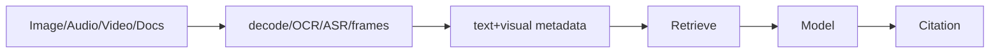
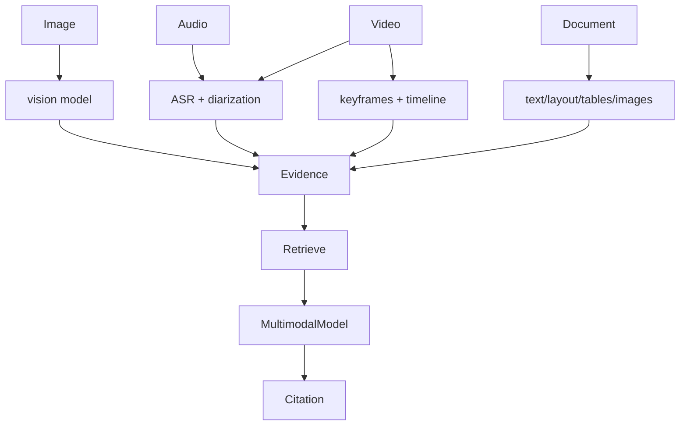

# 第35章：多模态 Agent

最后核对日期：2026-07-11。

## 章节导读、学习目标与前置知识
多模态 Agent 组合图像、音频、视频、文档、Vision Tool、OCR 与多模态 RAG。本章关注表示、时间同步、证据和成本。

## 流程

OCR/ASR 是有误差的中间表示；图像位置、视频时间码和页码必须保留。视频通常抽帧与音轨并行处理，不能把几个随机帧当完整内容。

## 核心概念、最小示例与完整工程示例
最小示例识别一页图片并保留 OCR 置信度。工程版存原始媒体哈希、派生版本、坐标/时间码、模型版本和权限；低置信内容人工复核。

## 常见误区、调试方法、工程实践与安全注意事项
模型看到图片不代表读清小字；OCR 文本可能包含注入；人脸和语音属于敏感数据。调试分别评估解析、检索和生成，不只看最终描述。

## 本章总结、课后练习、面试问题与延伸阅读

### 模态与统一任务表示

图像提供二维空间信息，音频包含波形、语音、说话人和时间，视频组合帧、音轨与时间事件，文档包含文本层、版面、表格和图片。多模态系统不是把所有内容转换成一句描述，而是保留原始媒体、派生表示和定位关系。



统一 Evidence 包含 media_id、type、text/embedding、page/box/timecode、confidence、source version 与 ACL。生成回答引用这些定位，而不是只引用文件名。

### 图像、Vision Tool 与 OCR

Vision 模型可做描述、分类、视觉问答和区域理解，但小字、密集表格、旋转和计数可能失败。OCR 专门恢复文字与坐标，版面解析识别段落/表格；两者与 Vision 互补。身份证、表单等结构化抽取应保存字段框与 OCR confidence，并由规则校验格式。

```python
from pydantic import BaseModel, Field


class VisualEvidence(BaseModel):
    media_id: str
    page: int | None = None
    bbox: tuple[float, float, float, float] | None = None
    time_start: float | None = None
    time_end: float | None = None
    text: str
    confidence: float = Field(ge=0, le=1)
```

模型看图前先压缩会丢小字，分辨率与切片策略需要评估。图片中的 Prompt Injection 可能通过 OCR 进入上下文，仍是数据。

### 音频与视频

音频流水线做格式解码、VAD、ASR、说话人分离、时间戳与可选事件。说话人身份不能凭声音自动确认，除非有合规声纹系统。低置信片段保留原音频引用并人工复核。

视频不能仅随机抽三帧。镜头切分、固定间隔、事件检测和用户问题共同决定帧；音轨与字幕对齐时间轴。检索返回时间区间和关键帧，回答引用 `00:03:12–00:03:26`。长视频成本通过分层摘要和按需读取控制。

### 文档与多模态 RAG

PDF/Office 文档解析文本、标题、表格、备注、图片和页面关系。文本检索命中“见下图”时同时返回相关图片；图表查询可用图像/标题 Embedding。表格保留表头、单位和脚注，不能转成无结构文本后丢语义。

多模态索引可采用共享空间 Embedding 或每模态独立检索后融合。前者方便跨模态查询，后者可针对模态优化。Reranker 处理 query 与多模态候选，最终上下文按模型支持选择文本、图像或音频。

### 完整工作流与代码边界

Ingestion 保存原始 Blob 哈希，异步生成 OCR、ASR、frames 和 embeddings；每个派生物有 processor/model version。Query Router 判断文本、视觉、音频或混合，Retriever 在 ACL 内搜索，Context Builder 选择媒体片段，Generator 输出引用，Validator 检查位置存在。

```text
upload -> malware/type scan -> immutable media
       -> parse/OCR/ASR/frame workers
       -> versioned evidence + indexes
query  -> permission -> multimodal retrieve -> rerank
       -> context budget -> answer -> citation validation
```

### 评估、调试、成本与安全

分别测 OCR 字/字段准确、ASR WER、帧召回、检索 Recall、回答/引用，不用一个总分。调试从最终错误回溯候选、派生文本和原媒体。测试覆盖旋转、模糊、小字、多人、背景噪声、图表、扫描 PDF 和注入图像。

成本包括媒体上传、解码、OCR/ASR、帧、Embedding、存储和多模态模型 Token。按需处理和缓存派生物，但权限变化时缓存失效。

媒体可能含人脸、声音、位置和文档 PII，需要同意、用途、加密、保留和删除。下载/解析在 Sandbox，防恶意文件与解压炸弹。常见误区是“模型能看图就不需 OCR”、随机抽帧代表视频、OCR 文字等于原始事实。
总结：多模态 Agent 的核心是保留位置、时间、置信和来源。练习：为带表格和图片的 PDF 设计双通道检索并画出 Citation。面试：多模态 RAG 的引用如何定位？OCR 与 Vision 如何分工？视频抽帧如何评估？延伸阅读：OCR、ASR、Vision、视频理解和多模态检索资料。代码目录：项目4。
