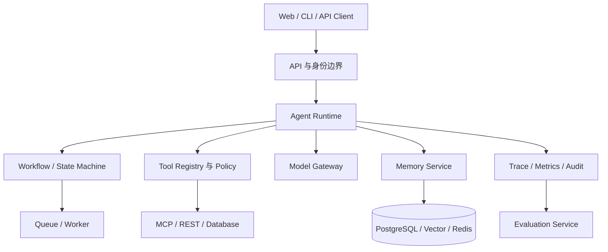
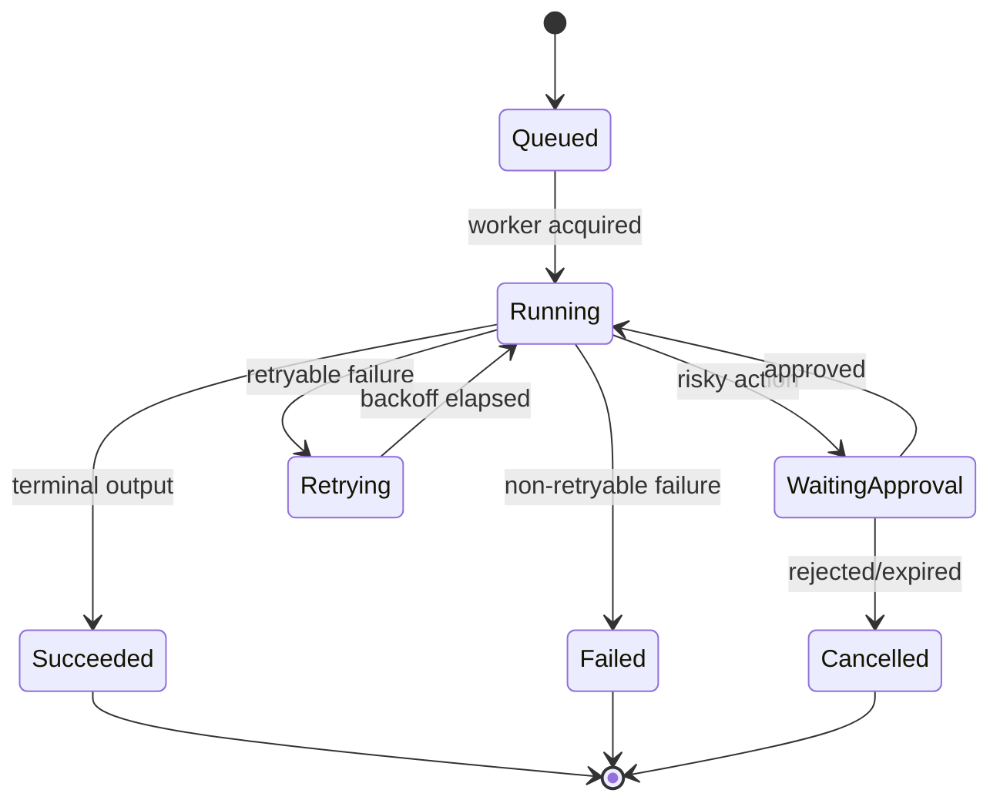

# 第36章：Agent 架构设计

最后核对日期：2026-07-11。

## 章节导读

Agent 架构的难点不是把模型、工具和向量库画在一张图里，而是划清状态、权限、故障和演进边界。本章从模块化单体出发，比较微服务、事件驱动、工作流引擎和状态机，最后给出企业级 Agent 平台的参考分层。

## 学习目标与前置知识

完成本章后，读者应能判断何时采用模块化单体或微服务；区分 Agent Runtime、Workflow Engine 与任务队列；设计 Tool Registry、Model Gateway、Memory、Evaluation 和 Observability 服务；用 ADR 记录架构决策。前置知识包括 HTTP、数据库事务、消息队列、容器与第 9、25、28 章。

## 核心概念：先确定边界，再选择部署形态

模块是职责边界，进程是部署边界，服务是组织与故障边界，三者并不等价。一个模块化单体可以拥有清楚的端口、适配器和依赖方向；一个拆成十个容器的系统也可能因为共享数据库和循环调用而成为“分布式单体”。



图中 Runtime 负责一次运行的控制循环，Workflow 负责可恢复的步骤与状态迁移，Queue 负责把工作可靠交给执行者。三者可以先部署在一个进程中，但接口应独立，避免模型供应商对象渗透到业务层。

## Modular Monolith 与 Microservices

早期产品通常优先模块化单体：同一事务容易维护，本地调试简单，部署与观测成本低。当某一模块需要独立扩缩容、具有不同安全等级、由独立团队负责，或故障不能影响主链路时，再把它拆成服务。例如文档解析需要大量 CPU/GPU 且处理不可信文件，适合独立 Worker；轻量会话读取未必需要单独服务。

拆分前至少回答四个问题：谁拥有数据，接口如何版本化，跨边界失败怎样补偿，调用链如何追踪。如果两个服务直接修改同一组表，它们没有真正的数据所有权；如果一次请求同步穿越七个服务，任何上游抖动都会放大尾延迟。

| 维度 | 模块化单体 | 微服务 |
|---|---|---|
| 一致性 | 本地事务较简单 | 常需最终一致与补偿 |
| 发布 | 一体发布 | 可独立发布但需兼容治理 |
| 调试 | 本地调用链清晰 | 依赖分布式 Trace |
| 扩缩容 | 按整体扩容 | 可按热点模块扩容 |
| 团队成本 | 较低 | 平台与运维成本较高 |

## Event-Driven、Workflow Engine 与 State Machine

事件表达“已经发生的事实”，命令表达“希望执行的动作”。长任务可在状态提交后发布 `RunStarted`、`ToolCompleted` 等事件，由索引、计费和评估消费者异步处理。事件消费必须假设至少一次投递：使用事件 ID 去重，副作用工具使用幂等键，Schema 只能兼容演进。



状态机限定合法迁移；工作流引擎进一步提供持久化、定时器、重试、补偿、人工中断和历史回放。普通队列只保证任务交付，不能自动表达业务状态。不要用模型自由文本充当状态；状态应是版本化、可校验的数据。

## Agent Runtime 与基础服务

Runtime 接收运行请求，装载策略和会话状态，调用模型与工具，记录每一步并判断终止。它不应直接保存供应商响应作为唯一状态，而应转换为内部事件。Tool Registry 保存工具 Schema、版本、所有者、风险等级、超时、幂等和授权规则；调用前后均执行策略检查。

Model Gateway 统一模型标识、凭证、超时、重试、配额、路由与降级，但不应抹平供应商独有语义。Memory Service 管理会话、摘要、长期记忆的写入与删除；Evaluation Service 用黄金集和线上抽样检测回归；Observability Service 汇聚 Trace、Token、成本、延迟和审计事件。

## 最小示例：显式端口与适配器

```python
from dataclasses import dataclass
from typing import Protocol


class ModelPort(Protocol):
    async def generate(self, prompt: str, *, run_id: str) -> str: ...


class ToolPort(Protocol):
    async def execute(self, name: str, arguments: dict[str, object], *, run_id: str) -> object: ...


@dataclass(frozen=True)
class RunRequest:
    run_id: str
    user_id: str
    prompt: str


class AgentRuntime:
    def __init__(self, model: ModelPort, tools: ToolPort) -> None:
        self.model = model
        self.tools = tools

    async def run(self, request: RunRequest) -> str:
        # 业务层依赖内部端口，不依赖具体 SDK 对象。
        return await self.model.generate(request.prompt, run_id=request.run_id)
```

这个最小示例没有展示完整 Tool Loop，但明确了依赖方向。测试可注入 FakeModel，生产环境可接 OpenAI、Anthropic 或本地模型适配器。

## 完整工程示例：企业级平台

项目 10 采用“模块化单体 API + 独立 Worker + PostgreSQL/Redis”的起点。API 处理身份与命令，Worker 执行长任务，Outbox 在事务提交后可靠发布事件。每个 Run 拥有稳定 ID、租户 ID、策略版本和输入快照；每个工具调用记录参数摘要、授权决定、耗时和结果引用。未来拆分 Model Gateway 或 Parser 时，内部端口保持不变。

故障处理遵循边界：模型超时可有限重试；非幂等工具超时先查询执行状态，不能盲目重放；数据库不可用时停止产生新副作用；观测系统故障不能泄漏敏感内容，也不能无限阻塞主链路。

## 常见误区与调试方法

常见误区包括把微服务等同于企业级、把消息队列等同于工作流引擎、让所有服务共享管理员凭证、用一个巨大 `agent_state` JSON 掩盖数据模型。调试时先用 `run_id` 还原时间线，再检查状态迁移、策略版本、模型请求、工具幂等键和事件消费偏移。对偶发问题保存脱敏输入快照与依赖版本，而不是只保存最终答案。

## 工程实践与安全注意事项

为每个边界定义 SLO、所有者和容量；接口采用契约测试；事件 Schema 只做向后兼容变更；数据库迁移与应用发布可回滚。每个服务重新鉴权，服务凭证遵循最小权限，租户 ID 必须参与所有数据查询。外部工具位于出站代理和 Allowlist 后，不可信解析器运行在 Sandbox。审计日志追加写并设置独立保留策略。

## 本章总结

Agent 架构的可维护性来自明确职责、可恢复状态、受控副作用和端到端证据链。部署形态应服从故障域与组织需求，不能反过来决定业务边界。

## 课后练习、面试问题与延伸阅读

1. 把项目 10 分别画成模块化单体与微服务方案，并写出拆分触发条件。
2. 为 `ToolCompleted` 设计可兼容演进的事件 Schema 和去重策略。
3. 面试问题：何时拆分 Model Gateway？Workflow Engine、Queue 与 Runtime 有何不同？如何避免分布式单体？
4. 延伸阅读：领域驱动设计、Transactional Outbox、状态机、工作流引擎、OpenTelemetry 与零信任服务架构。

本章对应代码目录：`projects/10-enterprise-agent-platform/`。
