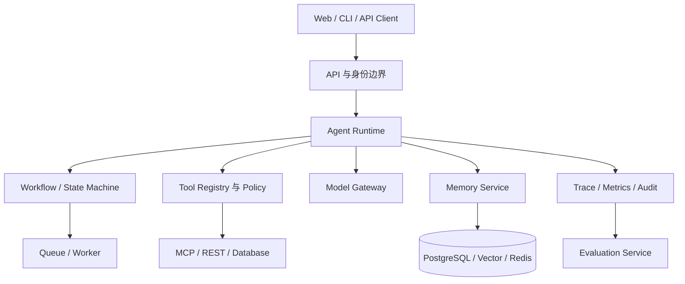
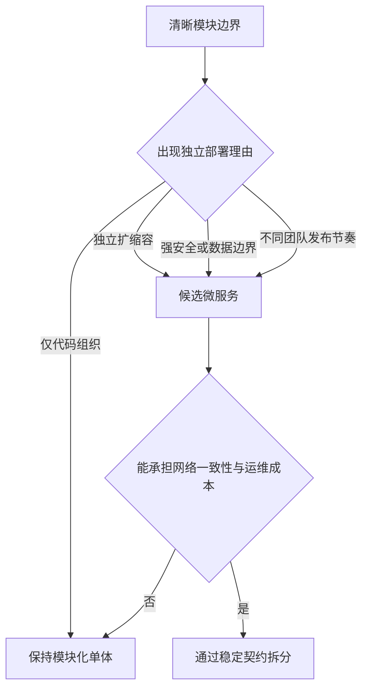
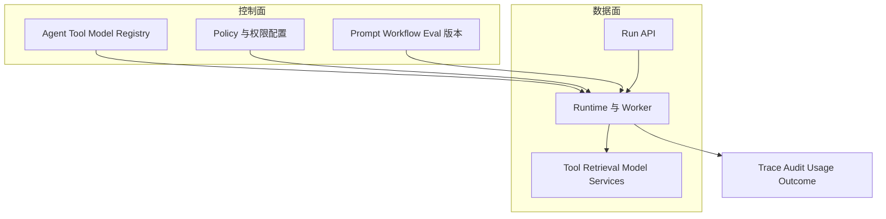
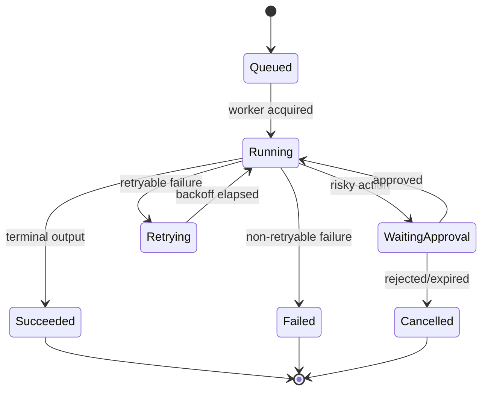
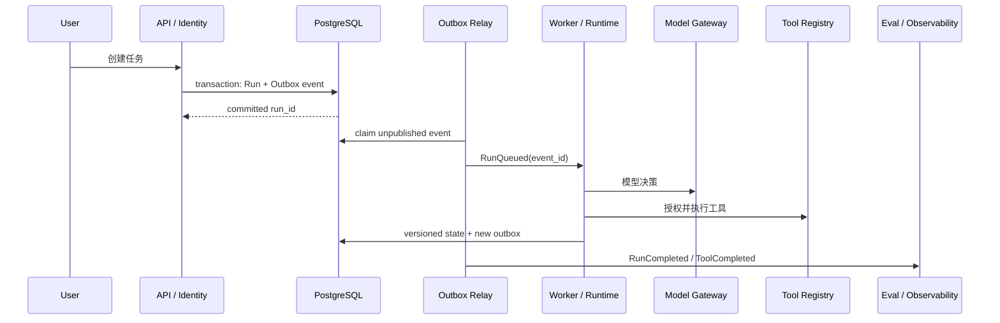
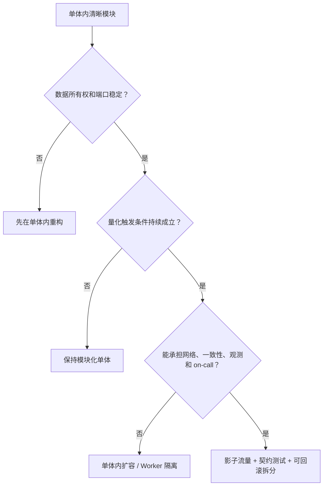

# 第36章：Agent 架构设计

最后核对日期：2026-07-11。

## 章节导读

Agent 架构的难点不是把模型、工具和向量库画在一张图里，而是划清状态、权限、故障和演进边界。本章从模块化单体出发，比较微服务、事件驱动、工作流引擎和状态机，最后给出企业级 Agent 平台的参考分层。

## 学习目标与前置知识

完成本章后，读者应能判断何时采用模块化单体或微服务；区分 Agent Runtime、Workflow Engine 与任务队列；设计 Tool Registry、Model Gateway、Memory、Evaluation 和 Observability 服务；用 ADR 记录架构决策。前置知识包括 HTTP、数据库事务、消息队列、容器与第 9、25、28 章。

## 核心概念：先确定边界，再选择部署形态

模块是职责边界，进程是部署边界，服务是组织与故障边界，三者并不等价。一个模块化单体可以拥有清楚的端口、适配器和依赖方向；一个拆成十个容器的系统也可能因为共享数据库和循环调用而成为“分布式单体”。

下面的参考架构按控制、能力、状态、执行与治理职责划分组件，而不是按框架名称拆服务。



图中 Runtime 负责一次运行的控制循环，Workflow 负责可恢复的步骤与状态迁移，Queue 负责把工作可靠交给执行者。三者可以先部署在一个进程中，但接口应独立，避免模型供应商对象渗透到业务层。



拆分必须解决已观察到的容量、故障、安全或组织问题；如果只是为了“先进”，通常会得到更难调试的分布式单体。



控制面发布不可变版本，数据面每次 Run 记录实际版本与主体。这样线上行为可复现，也能独立扩缩执行资源。

## Modular Monolith 与 Microservices

早期产品通常优先模块化单体：同一事务容易维护，本地调试简单，部署与观测成本低。当某一模块需要独立扩缩容、具有不同安全等级、由独立团队负责，或故障不能影响主链路时，再把它拆成服务。例如文档解析需要大量 CPU/GPU 且处理不可信文件，适合独立 Worker；轻量会话读取未必需要单独服务。

拆分前至少回答四个问题：谁拥有数据，接口如何版本化，跨边界失败怎样补偿，调用链如何追踪。如果两个服务直接修改同一组表，它们没有真正的数据所有权；如果一次请求同步穿越七个服务，任何上游抖动都会放大尾延迟。

| 维度 | 模块化单体 | 微服务 |
|---|---|---|
| 一致性 | 本地事务较简单 | 常需最终一致与补偿 |
| 发布 | 一体发布 | 可独立发布但需兼容治理 |
| 调试 | 本地调用链清晰 | 依赖分布式 Trace |
| 扩缩容 | 按整体扩容 | 可按热点模块扩容 |
| 团队成本 | 较低 | 平台与运维成本较高 |

## Event-Driven、Workflow Engine 与 State Machine

事件表达“已经发生的事实”，命令表达“希望执行的动作”。长任务可在状态提交后发布 `RunStarted`、`ToolCompleted` 等事件，由索引、计费和评估消费者异步处理。事件消费必须假设至少一次投递：使用事件 ID 去重，副作用工具使用幂等键，Schema 只能兼容演进。



状态机是 API、队列、Worker 与 UI 的共同契约。所有迁移采用乐观锁或事件版本，并保留终止原因。

状态机限定合法迁移；工作流引擎进一步提供持久化、定时器、重试、补偿、人工中断和历史回放。普通队列只保证任务交付，不能自动表达业务状态。不要用模型自由文本充当状态；状态应是版本化、可校验的数据。

## Agent Runtime 与基础服务

Runtime 接收运行请求，装载策略和会话状态，调用模型与工具，记录每一步并判断终止。它不应直接保存供应商响应作为唯一状态，而应转换为内部事件。Tool Registry 保存工具 Schema、版本、所有者、风险等级、超时、幂等和授权规则；调用前后均执行策略检查。

Model Gateway 统一模型标识、凭证、超时、重试、配额、路由与降级，但不应抹平供应商独有语义。Memory Service 管理会话、摘要、长期记忆的写入与删除；Evaluation Service 用黄金集和线上抽样检测回归；Observability Service 汇聚 Trace、Token、成本、延迟和审计事件。

## 最小实验

下面的最小示例使用显式端口与适配器。它不展示完整 Tool Loop，而是验证领域 Runtime 不依赖供应商 SDK 对象，Fake 与生产 Adapter 可以替换。

```python
from dataclasses import dataclass
from typing import Protocol


class ModelPort(Protocol):
    async def generate(self, prompt: str, *, run_id: str) -> str: ...


class ToolPort(Protocol):
    async def execute(self, name: str, arguments: dict[str, object], *, run_id: str) -> object: ...


@dataclass(frozen=True)
class RunRequest:
    run_id: str
    user_id: str
    prompt: str


class AgentRuntime:
    def __init__(self, model: ModelPort, tools: ToolPort) -> None:
        self.model = model
        self.tools = tools

    async def run(self, request: RunRequest) -> str:
        # 业务层依赖内部端口，不依赖具体 SDK 对象。
        return await self.model.generate(request.prompt, run_id=request.run_id)
```

这个最小示例没有展示完整 Tool Loop，但明确了依赖方向。测试可注入 FakeModel，生产环境可接 OpenAI、Anthropic 或本地模型适配器。若只有一个实现且没有恢复或替换需求，也可以先用普通函数；端口应由真实变化驱动。

## 工程案例

项目 10 采用“模块化单体 API + 独立 Worker + PostgreSQL/Redis”的起点。API 处理身份与命令，Worker 执行长任务，Outbox 在事务提交后可靠发布事件。每个 Run 拥有稳定 ID、租户 ID、策略版本和输入快照；每个工具调用记录参数摘要、授权决定、耗时和结果引用。未来拆分 Model Gateway 或 Parser 时，内部端口保持不变。

### 模块化单体的内部边界

第一版可以只有一个可部署应用和一个 Worker 镜像，但代码与数据所有权按模块划分：

```text
platform/
├── identity/          # 用户、租户与认证上下文
├── runs/              # Run 状态机、命令和 Checkpoint
├── runtime/           # 模型决策与 Tool Loop
├── model_gateway/     # 模型协议、配额、路由与 Usage
├── tool_registry/     # Tool 元数据、Policy 与执行适配器
├── knowledge/         # 摄取、Retriever 与引用
├── memory/            # 写入门禁、TTL 与删除
├── evaluation/        # Golden Dataset 与发布门禁
├── observability/     # Trace、Metrics 与 Audit 接口
└── infrastructure/    # PostgreSQL、Redis、HTTP Adapter
```

模块只通过公开端口交互，禁止跨模块直接修改表。单体部署仍可在一个数据库事务中更新 Run 并写 Outbox，减少初期分布式一致性成本。测试使用依赖规则或架构测试防止 `knowledge` 反向导入 API 层、Tool Adapter 绕过 Policy 等违规依赖。



图中的 Outbox 解决“数据库已提交但消息未发送”裂缝：业务状态与待发布事件在同一事务写入，Relay 用事件 ID 至少一次发布，消费者幂等去重。它不保证外部工具副作用自动一致；写 Tool 仍需要 action ID、状态核实和补偿。

### Transactional Outbox 最小模型

```python
from dataclasses import dataclass
from datetime import datetime


@dataclass(frozen=True)
class OutboxEvent:
    event_id: str
    aggregate_id: str
    aggregate_version: int
    event_type: str
    payload: dict[str, object]
    occurred_at: datetime


def idempotency_key(event: OutboxEvent, consumer: str) -> tuple[str, str]:
    return consumer, event.event_id
```

实际数据库用唯一约束保证 `(consumer, event_id)` 只处理一次，并为 Relay 使用租约或 `skip locked` 类机制。事件只包含消费者所需字段和稳定引用，不能把完整 Prompt、Secret 或巨大模型响应广播到消息系统。Schema 带版本，并采用向后兼容演进。

### Workflow Engine、Queue 与 Runtime 的责任

| 组件 | 回答的问题 | 保存的核心状态 | 不负责 |
|---|---|---|---|
| Queue | 哪个任务应交给哪个 Worker？ | 投递、租约、重试与死信 | 业务审批与合法状态迁移 |
| Workflow Engine | 长流程下一步是什么、何时恢复？ | 节点、定时器、Checkpoint、补偿 | 模型 Tool Calling 语义 |
| Agent Runtime | 当前决策如何在预算内执行？ | 消息投影、动作、Observation、终止 | 通用消息交付保证 |
| State Machine | 哪些业务状态转换合法？ | 状态、版本、原因 | 任务调度与模型推理 |

简单 Agent 可在 Runtime 中直接实现小状态机；跨天等待、多个审批、补偿和复杂定时器出现后，采用成熟 Workflow Engine 往往比用队列回调手写可靠。不能因为已经有 Redis Queue，就把业务状态藏在 Job 参数中。

### 服务拆分触发条件

是否拆分必须由观测证据支持。下面是候选阈值示例，团队应根据自身 SLO 改写，不能把数字当通用标准：

| 候选模块 | 可量化触发条件 | 拆分收益 | 新成本 |
|---|---|---|---|
| 文档 Parser | CPU/内存峰值影响 API SLO；需不可信文件沙箱 | 资源和安全故障隔离 | 队列、Artifact 与版本一致性 |
| Model Gateway | 多团队独立发布；调用量需单独扩缩；统一配额成为瓶颈 | 集中路由与凭证治理 | 网络跳、单点与供应商能力抽象 |
| Tool Executor | 高风险工具需更强网络/Secret 边界 | 最小权限与审计隔离 | 分布式授权、幂等和延迟 |
| Evaluation | 大批离线任务挤占在线 Worker | 独立容量与发布节奏 | 数据快照和结果一致性 |
| Memory | 单独法规保留、地域或删除 SLO | 数据治理边界清晰 | 跨服务一致性和检索延迟 |

仅“代码很多”“想用不同框架”或“微服务更企业级”不是拆分触发条件。至少观察两个发布周期，并确认模块有清晰所有者、独立数据和稳定契约。拆分前先在单体内部建立端口与契约测试，拆出后接口语义才不会临时发明。



拆分采用绞杀式迁移：新服务先镜像或只读，比较结果；再切少量租户；保留回退到单体 Adapter 的开关。数据库所有权切换要有双写或事件迁移方案，但双写只能短期存在且需一致性验证。

故障处理遵循边界：模型超时可有限重试；非幂等工具超时先查询执行状态，不能盲目重放；数据库不可用时停止产生新副作用；观测系统故障不能泄漏敏感内容，也不能无限阻塞主链路。

## 失败分析与调试

常见误区包括把微服务等同于企业级、把消息队列等同于工作流引擎、让所有服务共享管理员凭证、用一个巨大 `agent_state` JSON 掩盖数据模型。调试时先用 `run_id` 还原时间线，再检查状态迁移、策略版本、模型请求、工具幂等键和事件消费偏移。对偶发问题保存脱敏输入快照与依赖版本，而不是只保存最终答案。

| 症状 | 架构根因 | 证据 | 修复 |
|---|---|---|---|
| 一个模型故障拖垮全部 API | 同步调用、无隔离与截止时间 | Trace、连接池、P95 | Queue/Worker 隔离和有界降级 |
| 事件重复导致重复收费 | 消费者假设 exactly-once | event ID 与消费记录 | 幂等消费者和业务唯一键 |
| 服务拆分后仍同时改一张表 | 没有数据所有权 | SQL 审计与部署依赖 | 先明确聚合与迁移契约 |
| Run 卡在“运行中” | Queue 状态代替业务状态 | Worker 租约与 Run version | 显式状态机、租约过期恢复 |
| Trace 无法跨服务关联 | run/tool/event ID 未传播 | span links 与消息头 | 统一 correlation contract |
| Model Gateway 成单点 | 集中过多同步职责 | 容量、错误率与依赖图 | 无状态扩缩、旁路与降级 |
| 删除用户数据不完整 | Memory、RAG、Trace 各自复制 | 删除清单与验证报告 | 治理事件和各服务删除证明 |

分布式调试按“命令—状态提交—Outbox—投递—消费—副作用—Checkpoint”还原时间线。时间戳只辅助排序，事件 ID、aggregate version 与因果链接才是主要依据。不要通过直接修改数据库把任务强行标成功，这会破坏审计与恢复假设。

## 工程实践与安全注意事项

为每个边界定义 SLO、所有者和容量；接口采用契约测试；事件 Schema 只做向后兼容变更；数据库迁移与应用发布可回滚。每个服务重新鉴权，服务凭证遵循最小权限，租户 ID 必须参与所有数据查询。外部工具位于出站代理和 Allowlist 后，不可信解析器运行在 Sandbox。审计日志追加写并设置独立保留策略。

## 本章总结

Agent 架构的可维护性来自明确职责、可恢复状态、受控副作用和端到端证据链。部署形态应服从故障域与组织需求，不能反过来决定业务边界。

## 课后练习、面试问题与延伸阅读

1. 把项目 10 分别画成模块化单体与微服务方案，并写出拆分触发条件。
2. 为 `ToolCompleted` 设计可兼容演进的事件 Schema 和去重策略。
3. 面试问题：何时拆分 Model Gateway？Workflow Engine、Queue 与 Runtime 有何不同？如何避免分布式单体？
4. 延伸阅读：领域驱动设计、Transactional Outbox、状态机、工作流引擎、OpenTelemetry 与零信任服务架构。

本章对应代码目录：`projects/10-enterprise-platform/`。

## 练习参考答案

1. 项目 10 的模块化单体方案保留一个 API 与 Worker 代码库、模块私有表和事务 Outbox；微服务方案可先只拆 Parser。拆分条件包括 Parser 资源峰值持续破坏 API SLO、需要更强文件沙箱且接口/数据所有权稳定。保留单体 Parser Adapter 作为回滚路径。
2. `ToolCompleted` 事件包含 event ID、run ID、tool call ID、工具版本、状态、结果引用、耗时和 aggregate version，不广播敏感参数正文。消费者以 `(consumer, event_id)` 去重，新字段可选并向后兼容，破坏性变化发布新事件版本。
3. Model Gateway 在多团队需要统一配额/凭证、独立扩缩与发布，且其故障需要隔离时拆分。若只是一个应用调用两个模型，模块内 Adapter 往往足够。
4. Workflow Engine 保存长流程节点、定时器、中断和恢复；Queue 负责可靠交付；Runtime 执行一次 Agent 决策循环。三者可以同进程，但状态契约不能混为一个 Job JSON。
5. 避免分布式单体需要服务拥有自己的数据、接口向后兼容、调用链不过度同步、失败可独立处理并有端到端 Trace。若服务必须同时部署、共享表和互相循环调用，拆分没有获得真正自治。

## 本章引用
<!-- chapter-citations:start -->
以下资料用于支撑本章的核心原理、工程边界与版本敏感说明：

- [iso25010：Systems and Software Quality Models](../references.md#ref-iso25010)
- [twelve-factor：The Twelve-Factor App](../references.md#ref-twelve-factor)
- [otel-spec：OpenTelemetry Specification](../references.md#ref-otel-spec)
- [nist-ai-rmf：Artificial Intelligence Risk Management Framework 1.0](../references.md#ref-nist-ai-rmf)
<!-- chapter-citations:end -->
