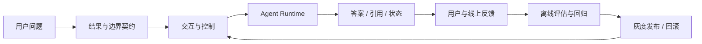
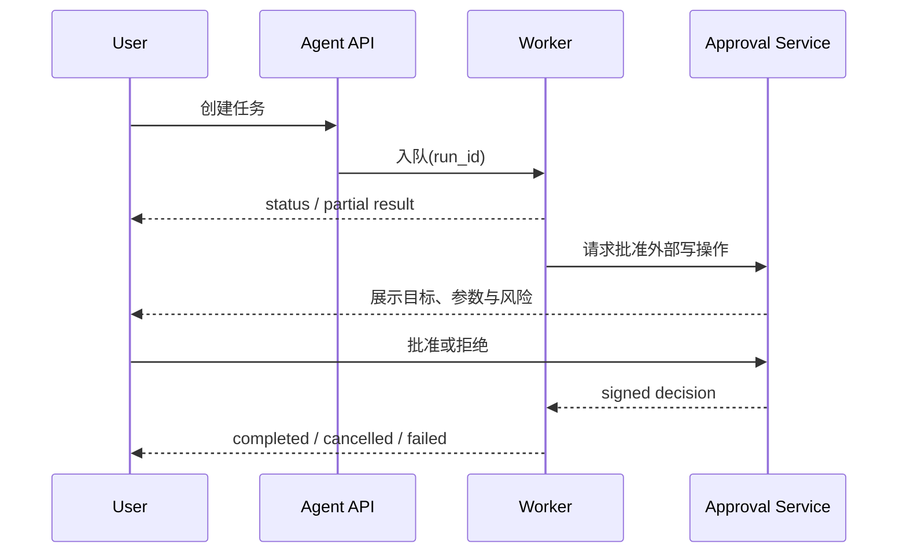

# 第37章：从 Demo 到产品

最后核对日期：2026-07-11。

## 章节导读

Demo 证明某条路径“能够运行”，产品则承诺在真实用户、脏数据、并发、失败和持续升级下仍能交付价值。本章用产品闭环连接需求、边界、可靠性、用户体验、审批、成本、SLA 和维护。

## 学习目标与前置知识

完成本章后，读者应能把模型演示转化为可验证的用户结果，定义产品边界和 SLO，设计 Streaming、中断、重试、人工审批与降级体验，并建立模型升级的评估和回滚机制。前置知识包括 Agent Runtime、Evaluation、Observability、安全和部署。

## 核心概念：结果契约

需求不应写成“接入最强模型”，而应写成用户可验证的结果。例如：“上传公司制度后，员工在 30 秒内获得带页码引用的答案；证据不足时明确拒答。”这句话同时给出了输入、结果、时间和失败行为。



“不做什么”同样属于契约。股票研究 Agent 可以汇总事实与推断，但不承诺收益，不自动交易；代码 Review Agent 可以提出风险，但不绕过仓库保护规则直接合并。

## 可靠性、可解释性与用户体验

可靠性要按阶段分解：请求接收、排队、模型调用、工具调用、持久化和结果交付分别定义超时与错误。最终成功率之外，还应观察引用正确率、工具成功率、人工接管率和取消生效率。上游模型故障时，系统可切换模型、缩小能力或转人工，但不得伪装成功。

可解释性不是展示模型的隐藏思维过程，而是提供用户可核查的证据：数据时间、引用来源、执行过的工具、授权记录、假设与不确定性。良好的 UX 显示当前阶段、预计等待、取消入口和失败后的下一步，不用拟人动画掩盖停滞。

## Streaming、中断、重试与审批

Streaming 改善首字延迟感受，但不降低总执行时间。面向长任务，事件协议比纯文本流更可靠：客户端应能区分状态、增量文本、引用、审批请求和终态。每个事件带递增序号，断线重连使用 `Last-Event-ID` 恢复。

```json
{"seq": 18, "type": "status", "phase": "retrieving", "message": "正在检索制度库"}
{"seq": 19, "type": "citation", "source_id": "policy-7", "page": 12}
{"seq": 20, "type": "approval_required", "action_id": "send-email-42", "risk": "external_write"}
{"seq": 21, "type": "completed", "run_id": "run-20260711-001"}
```

取消需要贯穿 API、Queue、Runtime 和工具层。系统收到取消后停止产生新副作用，并记录已经完成的动作。重试只适用于瞬时错误，采用次数上限、退避和总时间预算；非幂等动作使用业务幂等键或先查询结果。审批必须包含动作、目标、参数摘要、风险、有效期和审批人，不能只弹出含糊的“是否继续”。



## 权限、成本与 SLA

权限要基于用户、租户、资源和动作逐次判断，不能因为 Agent 已登录就默认拥有用户全部权限。读取与写入、草稿与发送、建议与执行应使用不同能力。对高风险动作使用短时凭证和二次确认。

成本预算同时覆盖 Token、检索、重排、工具 API、存储和人工审核。系统应为单次 Run 设置软硬预算：达到软预算时降低检索数量或选择小模型，达到硬预算时保存状态并请求用户继续。SLA 需说明服务时间、可用性、延迟口径、数据恢复和上游依赖；内部用 SLO 和 Error Budget 指导发布节奏。

## 最小示例：产品化运行状态

```python
from enum import StrEnum
from pydantic import BaseModel, Field


class RunStatus(StrEnum):
    QUEUED = "queued"
    RUNNING = "running"
    WAITING_APPROVAL = "waiting_approval"
    SUCCEEDED = "succeeded"
    FAILED = "failed"
    CANCELLED = "cancelled"


class RunView(BaseModel):
    run_id: str
    status: RunStatus
    progress: int = Field(ge=0, le=100)
    message: str
    retryable: bool = False
    evidence_count: int = 0
```

该模型使前端不必解析自然语言判断状态，也为测试非法状态和恢复流程提供稳定契约。

## 完整工程示例：上线闭环

项目 4 的产品化版本需要租户隔离、导入任务状态、引用定位、无答案策略和删除流程；项目 10 增加配额、审计、管理接口和评估任务。上线前建立黄金集、安全攻击集和容量基线，在影子流量中比较候选模型，再向少量租户灰度。发布期间监控任务成功率、P95 延迟、单位成功任务成本和投诉率，超过阈值自动停止扩量。

模型或框架升级不能直接覆盖生产版本。每个 Run 记录模型、Prompt、工具 Schema、检索索引和策略版本；新版本通过离线回归、影子流量、灰度和可回滚迁移。数据结构变化采用双读/双写或兼容窗口，避免旧任务无法恢复。

## 常见误区与调试方法

常见误区包括把“人工兜底”写进方案却没有队列和责任人，把 Streaming 当成性能优化，把模型拒答全部当作失败，以及只优化平均延迟。线上调试先按 Run 时间线定位失败阶段，再比较相同版本的正常样本；检查队列等待、供应商限流、工具超时、权限拒绝和客户端断连。用户反馈必须关联脱敏 Run ID，避免靠截图猜测。

## 工程实践与安全注意事项

发布清单应包含所有者、仪表盘、告警、Runbook、容量、备份、数据保留、降级开关和回滚演练。高风险功能默认关闭，通过权限逐租户开放。提示、日志和 Trace 做 PII 脱敏；支持用户导出与删除数据；事故后更新威胁模型与回归集，而不只修补单个 Prompt。

## 本章总结

从 Demo 到产品的关键是建立结果契约和持续验证闭环。模型只是系统中的非确定性依赖，真正的产品能力来自可控制、可观察、可恢复、可升级以及对失败诚实表达。

## 课后练习、面试问题与延伸阅读

1. 为企业知识库 Agent 写一页产品边界、SLO 和降级策略。
2. 设计支持断线恢复、审批和取消的 SSE 事件协议。
3. 面试问题：如何向用户表达不确定性？模型升级如何灰度？上游模型故障如何计入 SLA？
4. 延伸阅读：SRE、Error Budget、渐进式交付、Human-in-the-Loop 设计、AI 风险管理和服务设计。

本章对应代码目录：`projects/04-enterprise-knowledge-agent/`、`projects/10-enterprise-agent-platform/`。
