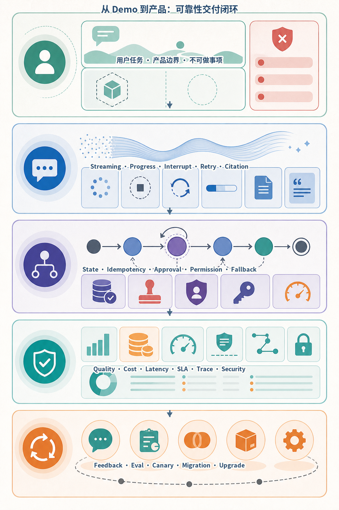
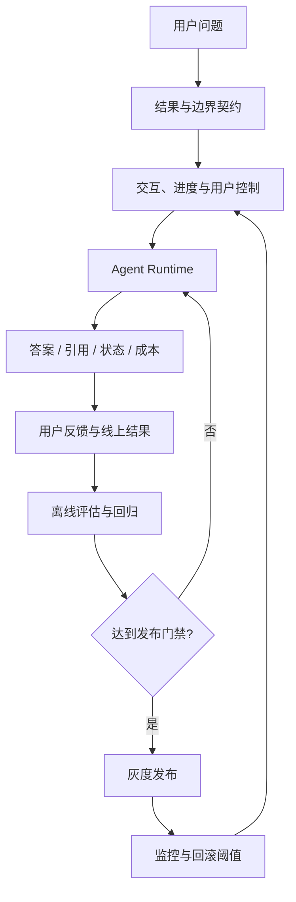
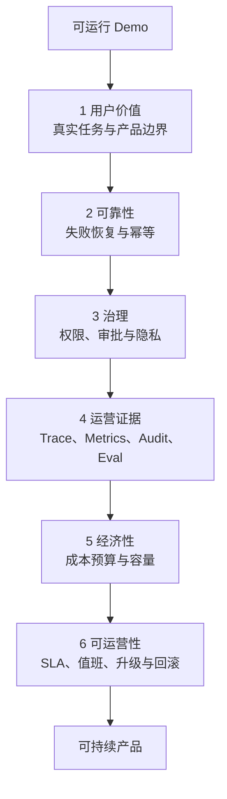
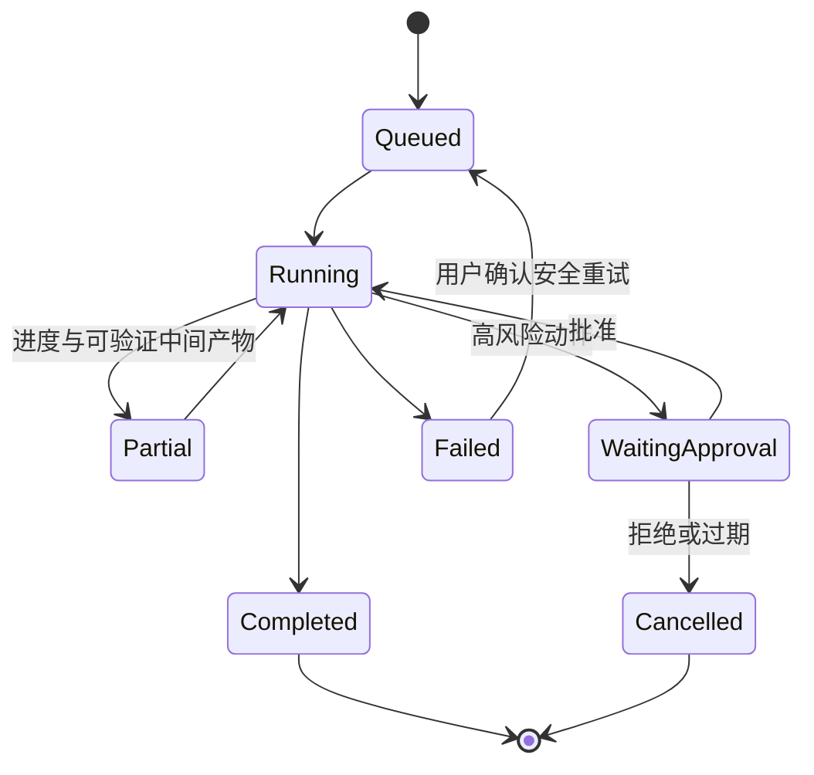
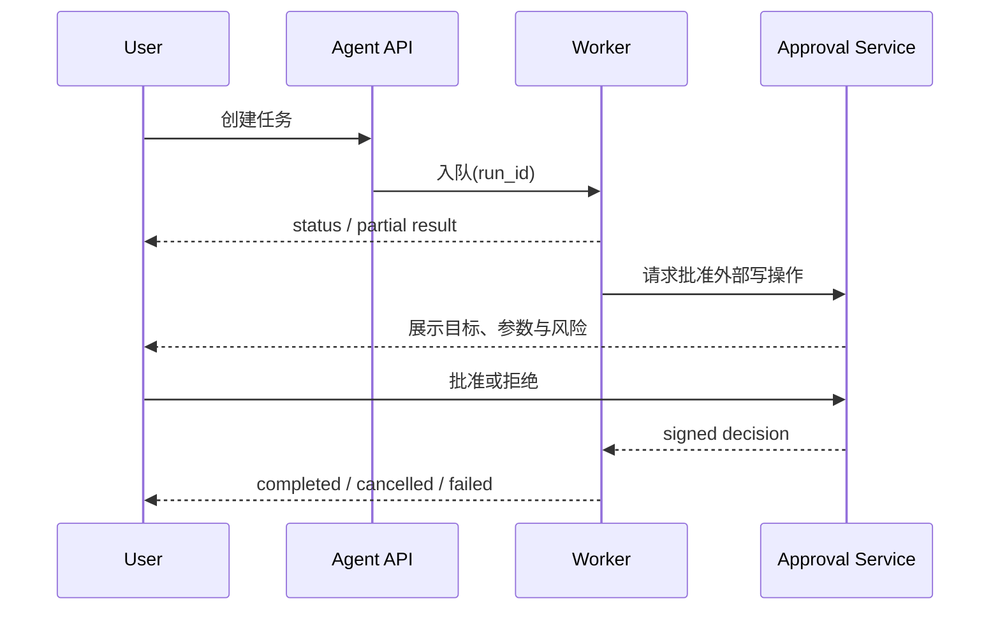
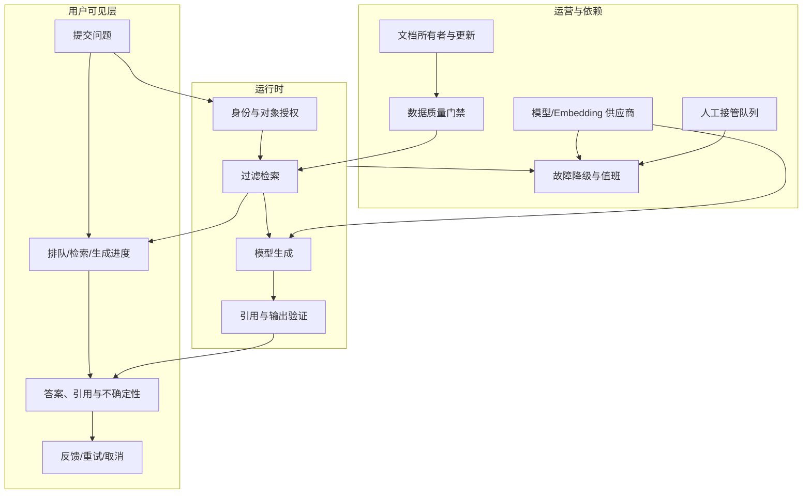
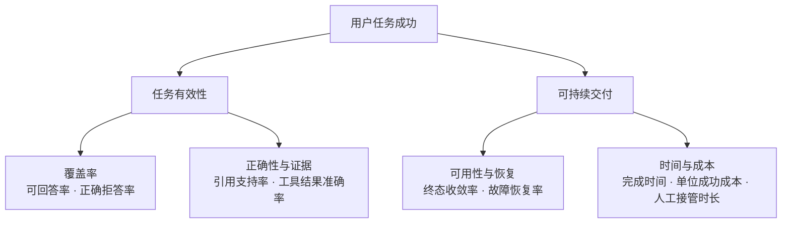
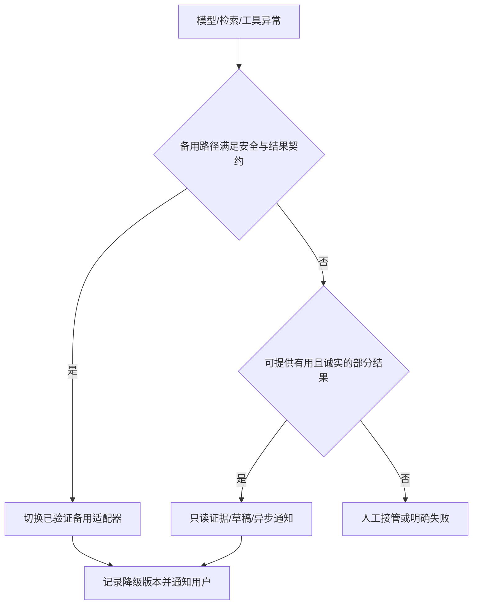

# 第37章：从 Demo 到产品

最后核对日期：2026-07-11。

## 章节导读

Demo 证明某条路径“能够运行”，产品则承诺在真实用户、脏数据、并发、失败和持续升级下仍能交付价值。本章用产品闭环连接需求、边界、可靠性、用户体验、审批、成本、SLA 和维护。

## 学习目标与前置知识

完成本章后，读者应能把模型演示转化为可验证的用户结果，定义产品边界和 SLO，设计 Streaming、中断、重试、人工审批与降级体验，并建立模型升级的评估和回滚机制。前置知识包括 Agent Runtime、Evaluation、Observability、安全和部署。

本章用 [ISO/IEC 25010](../references.md#ref-iso25010)帮助拆分可靠性、可维护性等质量属性，并用 [NIST AI RMF 生成式 AI Profile](../references.md#ref-nist-genai-profile)校对风险治理维度。SLO、成本阈值和人工接管规则仍必须由具体产品场景定义。



*图 37-A　Agent 从 Demo 到产品的可靠性交付闭环。*

Demo 证明某条路径曾经成功，产品则必须定义取消、失败、恢复、审批、降级和维护。图中由上到下从产品边界进入用户体验、运行可靠性和运营治理，再由真实反馈回到评估与发布，形成长期可维护的交付循环。

## 核心概念：结果契约

需求不应写成“接入最强模型”，而应写成用户可验证的结果。例如：“上传公司制度后，员工在 30 秒内获得带页码引用的答案；证据不足时明确拒答。”这句话同时给出了输入、结果、时间和失败行为。

产品化从结果契约出发，经交互、运行时、证据、评估与发布形成持续闭环。



“不做什么”同样属于契约。股票研究 Agent 可以汇总事实与推断，但不承诺收益，不自动交易；代码 Review Agent 可以提出风险，但不绕过仓库保护规则直接合并。



任何缺失门禁都应明确记录为产品风险，而不是用模型演示效果代替。尤其是回滚和数据删除需要真实演练。



流式 Token 只是界面事件之一。用户更需要明确状态、证据、取消、重试边界和审批影响。

## 可靠性、可解释性与用户体验

可靠性要按阶段分解：请求接收、排队、模型调用、工具调用、持久化和结果交付分别定义超时与错误。最终成功率之外，还应观察引用正确率、工具成功率、人工接管率和取消生效率。上游模型故障时，系统可切换模型、缩小能力或转人工，但不得伪装成功。

可解释性不是展示模型的隐藏思维过程，而是提供用户可核查的证据：数据时间、引用来源、执行过的工具、授权记录、假设与不确定性。良好的 UX 显示当前阶段、预计等待、取消入口和失败后的下一步，不用拟人动画掩盖停滞。

## Streaming、中断、重试与审批

Streaming 改善首字延迟感受，但不降低总执行时间。面向长任务，事件协议比纯文本流更可靠：客户端应能区分状态、增量文本、引用、审批请求和终态。每个事件带递增序号，断线重连使用 `Last-Event-ID` 恢复。

```json
{"seq": 18, "type": "status", "phase": "retrieving", "message": "正在检索制度库"}
{"seq": 19, "type": "citation", "source_id": "policy-7", "page": 12}
{"seq": 20, "type": "approval_required", "action_id": "send-email-42", "risk": "external_write"}
{"seq": 21, "type": "completed", "run_id": "run-20260711-001"}
```

取消需要贯穿 API、Queue、Runtime 和工具层。系统收到取消后停止产生新副作用，并记录已经完成的动作。重试只适用于瞬时错误，采用次数上限、退避和总时间预算；非幂等动作使用业务幂等键或先查询结果。审批必须包含动作、目标、参数摘要、风险、有效期和审批人，不能只弹出含糊的“是否继续”。



审批服务独立记录决定与动作摘要，Worker 恢复时再次验证有效期和资源状态，避免陈旧批准执行新动作。

## 权限、成本与 SLA

权限要基于用户、租户、资源和动作逐次判断，不能因为 Agent 已登录就默认拥有用户全部权限。读取与写入、草稿与发送、建议与执行应使用不同能力。对高风险动作使用短时凭证和二次确认。

成本预算同时覆盖 Token、检索、重排、工具 API、存储和人工审核。系统应为单次 Run 设置软硬预算：达到软预算时降低检索数量或选择小模型，达到硬预算时保存状态并请求用户继续。SLA 需说明服务时间、可用性、延迟口径、数据恢复和上游依赖；内部用 SLO 和 Error Budget 指导发布节奏。

## 最小示例：产品化运行状态

```python
from enum import StrEnum
from pydantic import BaseModel, Field


class RunStatus(StrEnum):
    QUEUED = "queued"
    RUNNING = "running"
    WAITING_APPROVAL = "waiting_approval"
    SUCCEEDED = "succeeded"
    FAILED = "failed"
    CANCELLED = "cancelled"


class RunView(BaseModel):
    run_id: str
    status: RunStatus
    progress: int = Field(ge=0, le=100)
    message: str
    retryable: bool = False
    evidence_count: int = 0
```

该模型使前端不必解析自然语言判断状态，也为测试非法状态和恢复流程提供稳定契约。

## 完整工程示例：上线闭环

项目 4 的产品化版本需要租户隔离、导入任务状态、引用定位、无答案策略和删除流程；项目 10 增加配额、审计、管理接口和评估任务。上线前建立黄金集、安全攻击集和容量基线，在影子流量中比较候选模型，再向少量租户灰度。发布期间监控任务成功率、P95 延迟、单位成功任务成本和投诉率，超过阈值自动停止扩量。

模型或框架升级不能直接覆盖生产版本。每个 Run 记录模型、Prompt、工具 Schema、检索索引和策略版本；新版本通过离线回归、影子流量、灰度和可回滚迁移。数据结构变化采用双读/双写或兼容窗口，避免旧任务无法恢复。

## 从功能列表到服务蓝图

产品需求常写成“支持知识库问答、工具调用和多轮对话”，但这些名词无法回答故障时谁负责。服务蓝图
应把用户可见步骤、后台状态、外部依赖和运营动作放在同一张图中。以企业知识库问答为例：



图中的每个跨层连接都应有所有者和验收证据。文档过期是内容运营问题，不应通过调 Temperature 修复；
供应商超时是运行时问题；证据充分但用户不理解引用则是 UX 问题。只有把责任拆开，团队才不会把所有
失败都归因于“模型偶尔不稳定”。

## 风险分级与能力边界

同一个 Agent 的不同动作风险不同。读取公开天气与发送付款指令不应共享一套默认策略。可按影响、
可逆性、数据敏感性和自主程度划分能力层：

| 等级 | 典型能力 | 默认控制 | 失败表达 |
|---|---|---|---|
| R0 只读低风险 | 公共资料摘要 | 来源引用、预算 | 明确无结果或稍后重试 |
| R1 受保护只读 | 企业知识检索 | 主体/对象授权、审计 | 不泄露资源是否存在 |
| R2 可逆写入 | 创建草稿、生成工单 | 幂等、可撤销、对象确认 | 保留草稿并提示用户 |
| R3 外部不可逆写入 | 发送、发布、购买、权限修改 | 内容绑定审批、短时凭证、对账 | 状态未知时暂停人工核对 |
| R4 高影响自动决策 | 医疗、招聘、信贷或交易决定 | 通常不开放全自动；专业治理 | 转交具备责任主体的流程 |

分级不是通用法规结论，具体产品需结合行业义务和组织风险评估。关键是让 Tool Registry、审批策略、
测试强度和上线范围读取同一风险元数据，而不是在 Prompt 中写一句“谨慎执行”。产品页面也应清楚
说明系统能建议、能起草还是能执行。

## 质量指标树与产品价值

模型指标必须映射到用户结果。知识库 Agent 的“答案流畅度”可能提升，但若员工仍需自行翻文档，
产品没有节省时间。一个可操作的指标树把最终价值拆成可诊断信号：



指标之间存在权衡。提高拒答阈值可能改善事实准确率却降低覆盖；增加 Reviewer 可能提升质量却增加
延迟和费用。发布门禁不应要求所有指标单调上升，而应预先声明不可退化指标和可接受交换。例如安全
泄漏率必须为零；“成本最多增加 10%”只可能是团队依据预算设置的示例阈值，不是行业标准。

## 降级不是简单换一个更便宜的模型

降级必须保持结果契约。供应商故障时，可以关闭自动执行只保留草稿、从生成答案退化为列出检索来源、
从实时任务转异步通知，或转人工队列。若备用模型没有结构化输出或工具能力，直接切换可能比失败更
危险。每种降级路径都应在发布前验证 Schema、权限、数据地域和用户提示。



降级事件写入 Trace 和产品指标，不能在仪表盘中与正常成功混为一谈。否则系统表面可用率很高，用户
却长期得到能力缩水的结果。

## 上线、运营与升级门禁

首次上线至少经历内部 Dogfood、受控试点、租户灰度和逐步扩量。每阶段固定退出条件和停止条件：

| 门禁 | 直接证据 | 未通过时动作 |
|---|---|---|
| 用户价值 | 真实任务完成率、节省时间、访谈 | 收窄任务，不靠增加角色掩盖需求错误 |
| 质量 | 黄金集、失败分类、人工双评 | 修数据/流程/模型并重新回归 |
| 安全 | 注入、越权、Secret、审批绕过测试 | Fail Closed，禁止扩量 |
| 可靠性 | 故障注入、恢复、取消、幂等 | 修 Runtime 与 Runbook |
| 容量与经济性 | 并发、P99、单位成功成本 | 限额、队列或架构优化 |
| 运维 | Dashboard、告警、值班、回滚演练 | 指定所有者后再发布 |

模型、Prompt、索引和 Tool Schema 都是独立变更轴。候选版本只改变一个主要轴有利于归因；必须组合
升级时使用配置矩阵和兼容测试。灰度按稳定主体或租户分桶，避免同一会话前后版本漂移。自动回滚只
适用于可准确判定且回滚安全的指标；数据迁移和已经执行的外部副作用需要专门恢复计划。

## SLA、商业承诺与维护

对外 SLA 是合同承诺，内部 SLO 是工程控制目标。SLA 应说明服务窗口、测量点、排除项、补偿和支持
响应；不要直接把模型供应商的可用性承诺转卖成端到端承诺。串联多个依赖时，总体可用性通常低于
单个组件，且模型返回 HTTP 200 仍可能因质量门禁失败而不构成用户任务成功。

多租户产品还需要配额、公平调度、账单归因、数据地域、导出删除、支持分级和滥用处置。成本不可只
按 Token 转嫁：检索、存储、网络、人工复核、支持和失败重试都会影响毛利。定价前应观察单位成功
任务成本的分布和长尾，而不是只看平均 Run 成本。

事故可能是供应商宕机，也可能是错误答案批量发布、权限泄漏、索引污染或成本失控。Runbook 需明确
检测、止血、影响范围、用户通知、数据修复和复盘。每次事故把真实失败转成回归 Fixture、威胁场景
或容量测试。若产品无法持续承担评估、值班和内容治理成本，即使 Demo 很精彩，也不可持续。

## 常见误区与调试方法

常见误区包括把“人工兜底”写进方案却没有队列和责任人，把 Streaming 当成性能优化，把模型拒答全部当作失败，以及只优化平均延迟。线上调试先按 Run 时间线定位失败阶段，再比较相同版本的正常样本；检查队列等待、供应商限流、工具超时、权限拒绝和客户端断连。用户反馈必须关联脱敏 Run ID，避免靠截图猜测。

## 工程实践与安全注意事项

发布清单应包含所有者、仪表盘、告警、Runbook、容量、备份、数据保留、降级开关和回滚演练。高风险功能默认关闭，通过权限逐租户开放。提示、日志和 Trace 做 PII 脱敏；支持用户导出与删除数据；事故后更新威胁模型与回归集，而不只修补单个 Prompt。

## 本章总结

从 Demo 到产品的关键是建立结果契约和持续验证闭环。模型只是系统中的非确定性依赖，真正的产品能力来自可控制、可观察、可恢复、可升级以及对失败诚实表达。下一章将用同一套质量、恢复与锁定约束收束全书的技术选型方法。

## 课后练习

### 设计题

1. 为企业知识库 Agent 写一页产品边界，明确允许的数据源、授权主体、带引用结果、证据不足拒答、延迟口径、文档更新所有者和只读降级。

### 编码题

2. 定义可恢复 SSE 事件协议。输入为乱序、重复和断线重连 Fixture；输出为单调 Run 内 Sequence、Schema Version 与明确终态；检查标准是重连不重复应用事件且断线不自动取消 Run。

### 设计题

3. 为模型、Prompt、索引和策略联合升级设计灰度发布：固定租户分桶、先影子比较、再小流量，并设置质量、安全、单位成功成本和 P99 停止条件。

### 概念题

4. 产品应如何表达来源、数据时间、假设、置信边界和拒答，而不把隐藏思维过程当作“可解释性”？

### 故障实验

5. 注入模型供应商完全不可用和部分限流两类故障，分别计算用户合同 SLA 与内部端到端 SLO，并验证只读缓存、异步受理或明确拒绝等降级路径。

## 面试问题与延伸阅读

面试问题：上游供应商故障是否计入 SLA？如何把一次成功演示转化为可维护的产品能力？

延伸阅读：SRE、Error Budget、渐进式交付、Human-in-the-Loop 设计、AI 风险管理和服务设计。

本章对应代码目录：
[`projects/04-knowledge-agent/`](https://github.com/wujinjun/ai-agent-book/tree/main/projects/04-knowledge-agent)、
[`projects/10-enterprise-platform/`](https://github.com/wujinjun/ai-agent-book/tree/main/projects/10-enterprise-platform)。

## 参考答案位置

本章参考答案已移至[书末参考答案](../exercise-answers.md)，便于先独立完成练习再核对。

## 本章引用
<!-- chapter-citations:start -->
以下资料用于支撑本章的核心原理、工程边界与版本敏感说明：

- [iso25010：Systems and Software Quality Models](../references.md#ref-iso25010)
- [nist-ai-rmf：Artificial Intelligence Risk Management Framework 1.0](../references.md#ref-nist-ai-rmf)
- [nist-genai-profile：Artificial Intelligence Risk Management Framework: Generative AI Profile](../references.md#ref-nist-genai-profile)
- [openai-compat：API Backward Compatibility](../references.md#ref-openai-compat)
<!-- chapter-citations:end -->
