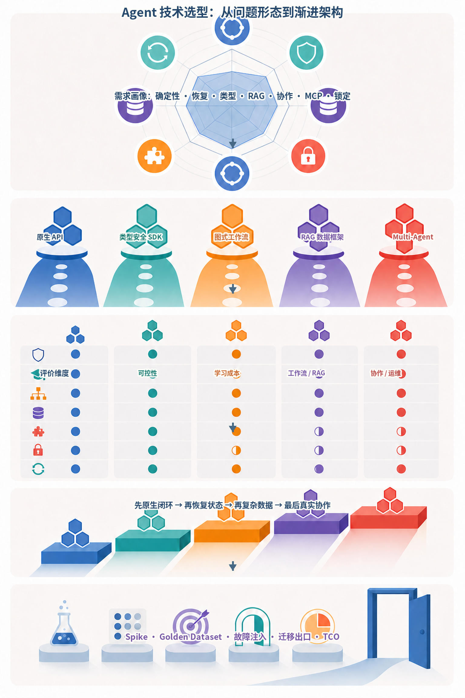
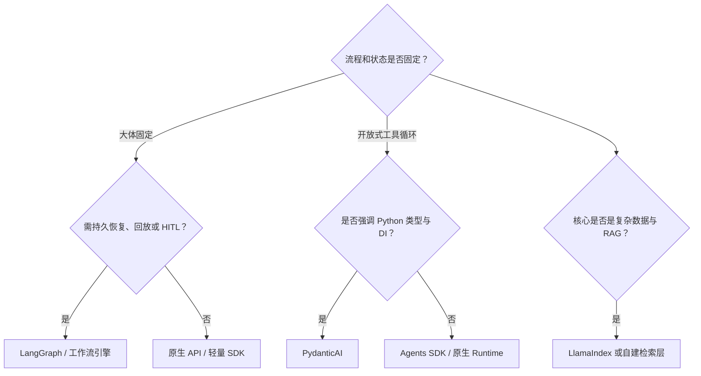
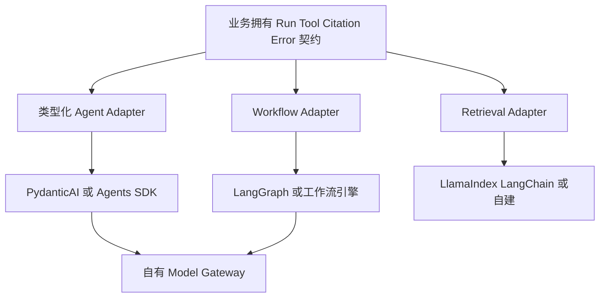
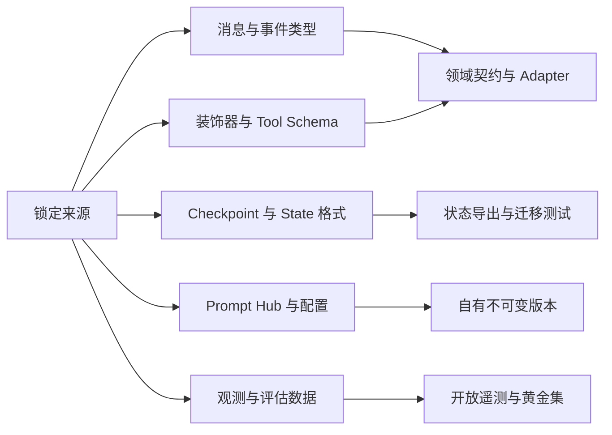
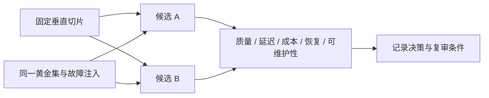
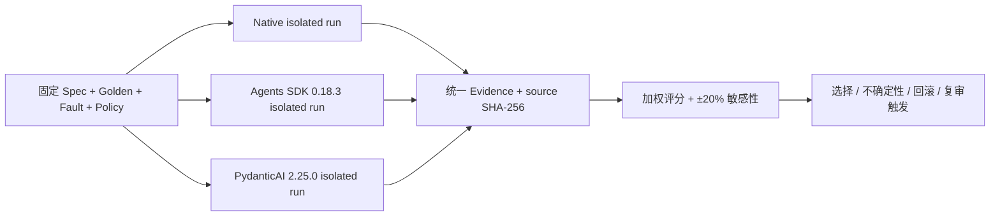

# 第38章：技术选型指南

最后核对日期：2026-08-07。OpenAI Agents SDK 0.18.3、PydanticAI 2.25.0、LangChain 1.3.14、LlamaIndex Core 0.14.23、CrewAI 1.15.12、AutoGen AgentChat 0.7.5 与 Semantic Kernel 1.44.1 已隔离实跑；社区活跃度、许可证、API 和支持状态仍必须在决策当天复核。

## 章节导读

框架选型不是功能清单竞赛。同一个框架在原型阶段可能提高速度，在需要长期恢复、严格类型或跨语言治理时却可能成为约束。本章比较原生 API、OpenAI Agents SDK、PydanticAI、LangGraph、LangChain、LlamaIndex、CrewAI、AutoGen 与 Semantic Kernel，并给出可重复的选型流程。

## 学习目标与前置知识

完成本章后，读者应能把任务状态、团队能力和非功能需求转化为选型标准，用同一垂直切片验证候选方案，识别框架锁定，并通过 ADR 记录结论。前置知识是第 17—22 章以及测试、可观测与安全章节。

技术选型不是框架排行榜。下图先根据任务确定性、恢复需求、类型安全、RAG 深度、协作、MCP、团队能力和锁定风险建立需求画像，再从原生 API 渐进增加 SDK、图工作流、数据框架或 Multi-Agent。



*图 38-A：从问题形态到渐进架构的技术选型地图。五条路线不是优劣排名，复杂度只应在可验证收益出现后增加。*

图 38-A 的升级顺序可以减少框架锁定：先证明原生闭环和测试契约；只有出现跨步骤恢复状态、复杂数据摄取或真实独立责任与并行收益时，才引入相应抽象。最终决策应由小型 Spike 和 Golden Dataset 证据支持。

## 核心概念：先识别问题形态

第一步不是问“哪个框架最好”，而是确认流程是否固定、是否需要持久恢复、是否以 RAG 为核心、是否存在真实的多角色边界，以及团队主要语言。一个两步工具调用服务可能只需要原生 API；跨数小时且等待人工批准的流程需要状态图或工作流引擎；知识检索产品可能更重视数据连接器和索引抽象。

决策树从问题形态出发，把框架作为实现候选，而不是先选框架再寻找适用场景。



决策树不是排他的。生产系统可以用 PydanticAI 定义类型化 Agent，用 LangGraph 编排长状态，再由自建 Model Gateway 调用模型。关键是明确每一层由谁拥有，避免框架对象贯穿全部业务代码。



组合不是把多个框架对象互相嵌套到业务代码，而是让每个 Adapter 对领域接口负责。替换成本由契约测试和状态导出能力控制。



完全消除锁定并不现实，目标是识别高成本边界并保留证据化退出路径，而不是构造抹平所有差异的万能接口。

## 统一比较矩阵

下表是架构特征的稳定判断，不代表 2026 年之后的实时社区排名。

| 方案 | 强项 | 主要代价 | 典型场景 |
|---|---|---|---|
| 原生 API | 控制力高、依赖少、便于理解协议 | 自建循环、恢复、Trace 与适配层 | 短流程、基础设施团队 |
| OpenAI Agents SDK | Tool、Handoff、Guardrail、Session、Trace 集成 | 需管理供应商与 SDK 语义依赖 | OpenAI 生态的多步应用 |
| PydanticAI | Python 类型、依赖注入、验证与测试体验 | 复杂图式持久工作流需外部能力 | 类型化业务服务、FastAPI |
| LangGraph | 显式 State、Checkpoint、Interrupt、恢复 | 状态建模与图调试学习成本 | 长任务、HITL、复杂工作流 |
| LangChain | 模型与工具生态广、组合速度快 | 抽象层和版本迁移需治理 | 多供应商适配、快速集成 |
| LlamaIndex | 文档、Node、Index、Retriever 抽象 | 数据层锁定与调优复杂度 | 知识库、检索密集系统 |
| CrewAI | Crew/Flow 和角色化表达直观 | 容易过度角色化，成本与终止难控 | 有清楚分工的协作流程 |
| AutoGen | AgentChat/Core 分层、消息式协作 | 分布式对话调试和状态治理复杂 | 研究型多 Agent、事件协作 |
| Semantic Kernel | 插件、企业集成与多语言生态 | 平台概念较多，部分能力状态需核对 | .NET、微软技术栈、企业集成 |

评价维度至少包括：学习成本、类型安全、控制力、Workflow、Multi-Agent、MCP、RAG、可观测、测试、生产适用性、社区维护和锁定风险。每个维度要结合自己的权重，不能简单相加通用排行榜。

## 各方案的工程判断

原生 API 最适合学习协议与构建薄 Runtime。当流程较短、团队能够维护重试、状态和 Trace 时，它提供最低的框架锁定。代价是安全和恢复能力必须自己实现，不能把 30 行演示循环直接部署生产。

OpenAI Agents SDK 适合希望快速获得 Tool、Handoff、Guardrail、Session 和 Tracing 的 Python 团队。具体接口应以安装版本和官方文档为准，并通过适配器隔离业务模型。PydanticAI 强调 Pydantic 类型、依赖注入和可测试性，适合 FastAPI 风格服务；图式长工作流可与外部编排层组合。

LangGraph 的价值在显式状态和持久执行，而不是“让 Agent 更聪明”。LangChain 提供广泛集成和高层 Agent API，适合快速组合，但项目应限制抽象渗透。LlamaIndex 在数据摄取、索引与检索方面有优势，选择前要用真实语料验证 Chunk、Metadata 和 Citation 能否导出。

CrewAI、AutoGen 和 Semantic Kernel 都能表达多 Agent 或编排，但角色数量不是评价指标。若两个角色共享同一上下文、工具和目标，普通函数或 Reviewer Node 往往更便宜。使用前必须验证终止、共享状态、错误恢复、预算和 Trace，而不是只看对话演示。

本书的同题 Spike 给出了更窄、可复现的证据。CrewAI 1.15.12 的 Flow、AutoGen AgentChat 0.7.5 的两 Agent Team、Semantic Kernel 1.44.1 的 Kernel/Plugin 路径均通过权限拒绝、状态导出、消息上限和确定终止测试；AutoGen 额外验证了框架 Team State 与组合终止条件。Semantic Kernel 没有使用原生 Agent Orchestration，因此能力矩阵不得把这次测试外推为全部编排模式已验证。三候选均未在此 Fixture 中证明相对单 Agent 的净收益。

## 最小实验

最小示例用 ADR 保存选型证据。ADR 不要求在第一次评审中得到永久真理，而是把当前上下文、证据、不确定性和回滚条件写清楚。

```markdown
# ADR-007：研究工作流编排方案

- 状态：Accepted
- 场景：搜索、读取、Reviewer、人工确认，任务可跨小时恢复
- 候选：原生 Runtime、PydanticAI、LangGraph
- 决策：LangGraph 负责编排，业务工具通过内部 Protocol 注入
- 证据：同一 50 条黄金集；恢复成功率 100%；P95 延迟增加 4%
- 风险：Checkpoint Schema 迁移、框架升级
- 缓解：内部 RunState 模型、契约测试、版本锁定、导出能力
- 复审日期：2026-10-01
```

ADR 记录的是上下文和证据，不是永久结论。复审日期应与升级周期、许可证变化和维护状态关联。

## 工程案例

完整工程使用同一垂直切片 Spike。选择一个包含结构化输出、一个只读工具、一个失败重试和一条 Trace 的真实任务，分别用最多两个候选实现。固定模型、Prompt、数据与黄金集，比较开发时间、代码量只是辅助指标，更重要的是状态可见性、离线测试、恢复、错误定位、权限插入点和迁移难度。

本章选用项目 8 的研究工作流：规划两个查询、使用 Fake 搜索、Reviewer 检查两条独立来源、人工批准、生成带引用报告，并能在进程重启后恢复。候选先限于原生 Runtime、PydanticAI、OpenAI Agents SDK 与 LangGraph；不是要求四套都完整实现，而是先用需求过滤，再对得分接近且证据不足的最多两个方案做 Spike。



Spike 必须覆盖失败、恢复、权限与 Trace，而不只是 happy-path。ADR 记录当规模、团队或版本变化时重新评估的触发条件。

### 本章同题 Spike 的实测结果

独立工程固定 `research-security-v1`：检索两个来源、第一次搜索注入瞬时失败、跨租户文档由确定性 Policy 拒绝，最终报告必须区分来源事实与综合推断。Native、OpenAI Agents SDK 与 PydanticAI 分别在独立 Python 3.12 环境运行 20 次，候选进程只交换规范化 JSON 证据，避免把框架依赖强装进同一环境。

| 候选 | 固定版本 | 任务成功 | Tool Accuracy | 故障恢复 | 状态导出 | 成本代理 |
|---|---|---:|---:|---:|---:|---:|
| Native Runtime | Python stdlib | 通过 | 1.00 | 通过 | 通过 | 4 次决策 |
| OpenAI Agents SDK | 0.18.3 | 通过 | 1.00 | 通过 | 通过 | 5 次模型请求 |
| PydanticAI | 2.25.0 | 通过 | 1.00 | 通过 | 通过 | 5 次模型请求 |

下图把表格背后的复现实验串成证据链：三个候选只接收同一规格，在隔离环境执行后输出统一 Schema，并由源码哈希、评分与敏感性分析共同约束 ADR。这样可以区分“框架文档宣称支持”与“本切片已经运行验证”。



三个候选在本地 50 ms 运行时预算内都满足延迟门槛，因此不使用亚毫秒差异制造虚假优势。当前 ADR 为这个短且无需持久 Checkpoint 的切片选择 Native，原因只是少一次成本代理请求；它明确不外推真实 Provider 延迟、模型质量或长任务恢复。需求加入 Handoff、强类型依赖、持久中断或 Trace 硬约束时必须重新 Spike。完整证据、源码哈希与可逆 ADR 位于 [`examples/framework_comparison/`](https://github.com/wujinjun/ai-agent-book/tree/main/examples/framework_comparison)。

生产适用性不能只从文档推断。Spike 应注入模型超时、无效工具参数、Checkpoint 恢复和权限拒绝，观察是否能从 Trace 中定位根因，并检查框架能否导出原始消息与状态。

针对 RAG 形态，仓库另用 `rag-acl-v1` 同题 Fixture 验证 LangChain 1.3.14 与 LlamaIndex Core 0.14.23。两个候选都正确返回 D1、D2，并在 alpha 主体查询 beta 秘密文档时返回 `None`；该结果只覆盖确定性 Embedding、Metadata ACL 与拒答阈值，不包含真实模型、外部索引、P95 和生成引用质量。证据位于 [`examples/framework_comparison/rag_spike/`](https://github.com/wujinjun/ai-agent-book/tree/main/examples/framework_comparison/rag_spike)。

### 从需求到候选过滤

先区分硬约束与加权偏好。研究工作流的硬约束可以是：Python 3.12、可离线测试、人工中断、持久恢复、状态可导出、工具调用前可插入自有 Policy。任一硬约束无法通过且没有可接受 Adapter 的候选直接淘汰，不应用其他高分补偿。


证据等级可以分为：本仓库安装并测试、官方文档确认但未本地执行、仅需人工核查。功能清单中“支持持久化”若没有跑过重启恢复，只能记为文档证据，不能与实测等价。

### 加权评价矩阵

权重来自业务风险。项目 8 把恢复、可控性和测试放在学习速度之前；一个两天 Demo 可以采用相反权重。评分采用 1—5 级，每个分数带证据引用与信心等级。

| 维度 | 权重 | 原生 API | Agents SDK | PydanticAI | LangGraph | 所需证据 |
|---|---:|---:|---:|---:|---:|---|
| 持久恢复/HITL | 0.20 | 待评 | 待评 | 待评 | 待评 | 重启 + resume 测试 |
| 控制流与终止 | 0.15 | 待评 | 待评 | 待评 | 待评 | 故障注入 Trace |
| 类型与离线测试 | 0.15 | 待评 | 待评 | 待评 | 待评 | Fake/Mock 测试 |
| Tool Policy 插入 | 0.15 | 待评 | 待评 | 待评 | 待评 | 越权动作被拒绝 |
| 状态与数据可移植 | 0.10 | 待评 | 待评 | 待评 | 待评 | 导出/导入实验 |
| 可观测性 | 0.10 | 待评 | 待评 | 待评 | 待评 | 事件与 OTel 映射 |
| 学习和维护成本 | 0.10 | 待评 | 待评 | 待评 | 待评 | 实现时间与复杂度 |
| 框架锁定风险 | 0.05 | 待评 | 待评 | 待评 | 待评 | 替换边界与迁移测试 |

表中不预填虚构分数。可以用下列代码计算已确认评分，并拒绝缺少证据的条目：

```python
from dataclasses import dataclass


@dataclass(frozen=True)
class CriterionScore:
    name: str
    weight: float
    score: float
    evidence: str
    confidence: float


def weighted_score(criteria: list[CriterionScore]) -> float:
    if not criteria:
        raise ValueError("评价维度不能为空")
    if any(not item.evidence.strip() for item in criteria):
        raise ValueError("每个评分必须有证据")
    total_weight = sum(item.weight for item in criteria)
    if abs(total_weight - 1.0) > 1e-9:
        raise ValueError("权重之和必须为 1")
    if any(not 1 <= item.score <= 5 for item in criteria):
        raise ValueError("评分必须在 1 到 5 之间")
    return sum(item.weight * item.score for item in criteria)
```

`confidence` 不直接混入总分，单独报告证据不确定性。若候选 A 总分 4.1、B 为 4.0，但 A 的关键恢复项仅来自文档、B 已实测，不能据 0.1 差值宣布 A 胜出；应优先对 A 做 Spike。

### 敏感性分析与不确定性

加权总分会受权重影响。将恢复权重上下调整、把维护成本提高，观察排序是否反转。若轻微调整就改变结论，说明选择不稳健，应保留可逆边界或继续实验。社区活跃度、许可证、MCP 支持和版本状态属于时间敏感信息，必须注明核查日期和官方来源。

不确定项不能用“估计 4 分”伪装成事实。可以记录区间，例如某能力在 2—4 分之间；用最坏与最好情形计算候选范围。两个范围高度重叠时，ADR 应写“证据不足，先做限时 Spike”，而不是强行给唯一排名。

### Spike 的统一验收

每个候选都运行同一 Fixture 和故障：两条来源正常完成；搜索第一次 503 后成功；Reviewer 因单一来源拒绝；人工拒绝后不写报告；进程重启后恢复相同 run；重复 resume 不产生重复外部动作；跨租户 thread 读取被拒绝。

记录实现时间、领域代码与 Adapter 代码量、测试数量、Trace 可解释性、状态导出格式、P50/P95 和依赖体积。代码量少不是决定性指标；把复杂度藏进不可观察的框架默认值可能让初始代码更短、线上调试更难。

### 可逆 ADR 与回滚

最终 ADR 应包含选中方案、未选方案、关键证据、风险、框架锁定位置、退出接口、迁移数据、复审触发条件和回滚步骤：

```markdown
# ADR-008：研究工作流 Runtime

- 状态：Accepted for one vertical slice
- 决策：LangGraph 1.2.9 仅负责图编排与 Checkpoint
- 领域边界：Tool、RunState、Citation、Policy 由本项目拥有
- 实测证据：黄金集版本；中断恢复；故障注入；Trace 链接
- 不确定性：数据库 Checkpointer 迁移尚未验证
- 框架锁定：图定义、Reducer、Checkpoint 配置与 interrupt 语义
- 回滚：保留原生 Runtime Adapter；停止新 Run；导出未完成状态；
  已开始 Run 在原版本排空，新任务切回原生实现
- 复审触发：持久化迁移失败、P95 越阈值、重大弃用或许可证变化
```

回滚不是 `pip uninstall`。进行中的 Checkpoint 可能无法由旧实现读取，因此需要“旧版本排空 + 新任务切换”或显式状态迁移。框架升级也视为架构变更：先影子执行或小租户灰度，保留旧镜像和数据库兼容窗口。

## 降低框架锁定

锁定不只来自供应商 API，也来自消息类型、装饰器、Checkpoint 格式、Prompt Hub 和观测数据。业务层定义自己的 `RunRequest`、`ToolSpec`、`Citation` 和错误分类；框架代码集中在适配器；黄金集测试跨实现运行；关键状态支持导出。不要为了理论上的可替换性构造一个抹平所有差异的巨型抽象层。

依赖版本应固定，并由自动化更新工具创建小步升级。升级前阅读官方变更日志，运行契约与回归测试，对弃用 API 设置迁移窗口。MCP“可连接”不等于安全，仍需验证 Transport、授权、Tool Schema 和用户确认。

## 失败分析与调试

常见误区包括以 GitHub Star 代替维护承诺、把功能存在等同于生产成熟、同时引入三个重叠框架，以及先选择 Multi-Agent 再寻找问题。调试框架问题时先把失败缩减为最小调用，记录依赖锁、模型和序列化状态；确认问题属于模型、供应商、框架、适配器还是业务逻辑，再决定修复位置。

| 现象 | 根因 | 证据 | 处理 |
|---|---|---|---|
| 演示很快，恢复做不出来 | Spike 只测 happy path | 重启/Checkpoint 用例 | 将恢复设为硬门槛 |
| 评分矩阵总有预期赢家 | 权重或分数事后调整 | ADR 历史与评审记录 | 先定权重，评分必须引用证据 |
| 框架升级修改大量领域代码 | 框架类型渗透 | import 与类型依赖图 | 收敛到 Adapter 与领域契约 |
| 两候选得分接近仍强行决定 | 忽略不确定性 | 评分区间与敏感性分析 | 做限时 Spike 或选更可逆方案 |
| 回滚后未完成任务丢失 | 没有状态导出/排空策略 | Checkpoint 兼容矩阵 | 双版本窗口与迁移演练 |
| 社区活跃但关键 Bug 无人处理 | 用 Star 代替维护证据 | release、issue、security policy | 当天核查官方仓库与支持承诺 |
| 多框架组合无法定位 Trace | 所有对象互相嵌套 | span 与调用边界 | 一个职责一个 Adapter，统一事件协议 |

框架问题先用最小复现验证安装版本，再查官方文档与变更日志。若业务测试在 Fake Adapter 下也失败，问题不在框架；若只有某一 Adapter 失败，避免改写全部领域层。把已知限制写入版本核查清单，不凭记忆试错生产 API。

## 工程实践与安全注意事项

选型评审要包含业务、开发、运维和安全人员。检查许可证、数据出境、遥测默认值、Secret 处理、插件权限、依赖供应链和漏洞响应。任何能自动执行外部写操作的框架都必须置于应用自己的授权与审计边界内。

## 本章总结

没有对所有团队最优的 Agent 框架。高质量选型从问题形态出发，以相同垂直切片和故障注入收集证据，通过边界隔离降低迁移成本，并设置明确的复审条件。

## 课后练习、面试问题与延伸阅读

1. 为项目 8 选择两个候选方案，定义带权评价矩阵并完成 ADR。
2. 找出当前项目中三处框架类型渗透，并设计最小适配边界。
3. 面试问题：如何降低框架锁定？何时拒绝 Multi-Agent？社区活跃度如何核实？
4. 延伸阅读：各框架官方文档与变更日志、Architecture Decision Records、契约测试、可逆架构决策。

本章对应代码目录：可运行工作流位于 `projects/08-research-workflow/`；统一研究/RAG 对照与受限 Multi-Agent 同题实测位于 `examples/framework_comparison/` 和 `examples/framework_comparison/multi_agent_spike/`。

## 练习参考答案

1. 项目 8 可比较原生 Runtime 与 LangGraph。硬约束设人工中断、重启恢复、离线测试和 Policy 插入；权重在评分前确定。用同一 Fixture 与失败注入完成 Spike，把测试、Trace 和状态导出作为 ADR 证据。
2. 常见渗透点包括业务函数直接接收框架 Message、数据库保存框架 Checkpoint 对象、前端消费框架 Stream Event。分别用领域 `Message/RunState/Event` 与 Adapter 映射隔离，保留契约测试。
3. 降低框架锁定不是追求零依赖，而是让 Tool、RunState、Citation、Policy 和错误分类由业务拥有，框架集中在 Adapter，状态可导出，黄金集能跨实现运行，并预先演练回滚。
4. 当角色没有不同权限、工具、上下文或独立验收责任时，应拒绝 Multi-Agent；普通函数、Router 或 Reviewer Node 更便宜且易终止。角色数量不是选型加分项。
5. 社区活跃度在决策当天从官方仓库核对发布频率、维护者响应、支持/弃用政策、安全公告、许可证和路线图，并记录链接与日期。Star 与下载量只能作为背景，不能替代维护承诺。

## 本章引用
<!-- chapter-citations:start -->
以下资料用于支撑本章的核心原理、工程边界与版本敏感说明：

- [openai-agents-guide：Build Agents with the OpenAI Platform](../references.md#ref-openai-agents-guide)
- [pydanticai-docs：PydanticAI Documentation](../references.md#ref-pydanticai-docs)
- [langgraph-overview：LangGraph Overview](../references.md#ref-langgraph-overview)
- [langchain-docs：LangChain Python Documentation](../references.md#ref-langchain-docs)
- [llamaindex-docs：LlamaIndex Documentation](../references.md#ref-llamaindex-docs)
- [crewai-docs：CrewAI Documentation](../references.md#ref-crewai-docs)
- [autogen-docs：AutoGen Documentation](../references.md#ref-autogen-docs)
- [semantic-kernel-docs：Semantic Kernel Documentation](../references.md#ref-semantic-kernel-docs)
<!-- chapter-citations:end -->
