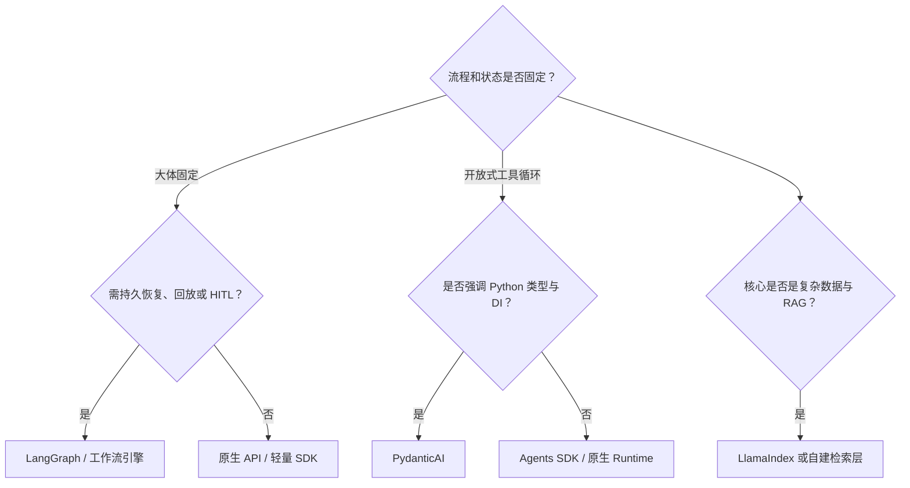
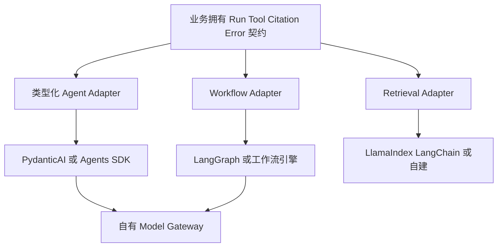
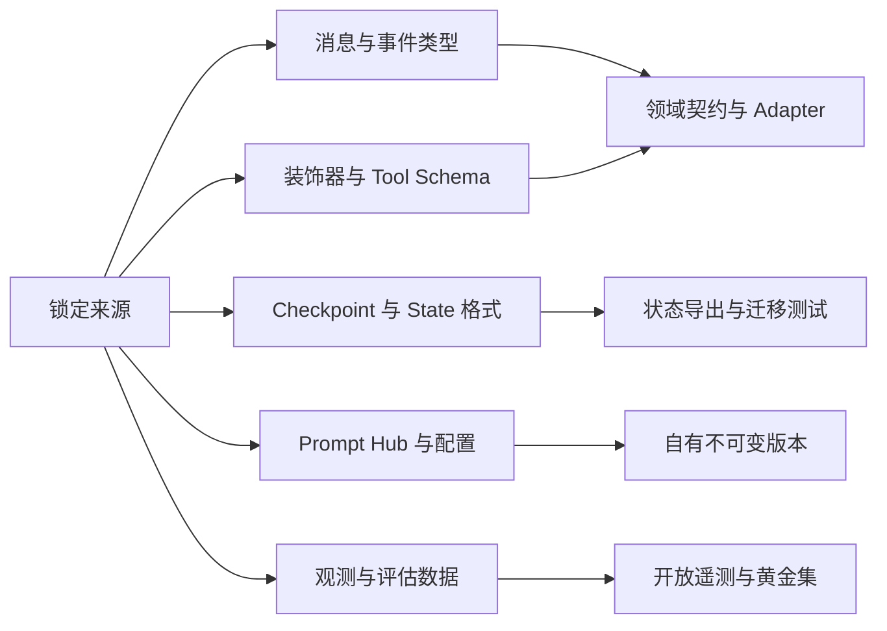
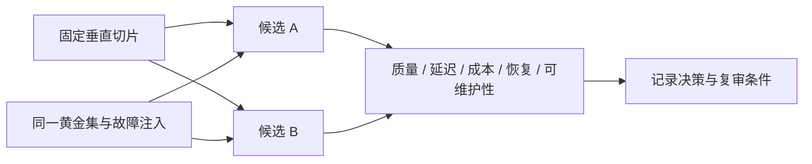

# 第38章：技术选型指南

最后核对日期：2026-07-11。社区活跃度、许可证、API 和支持状态必须在决策当天复核。

## 章节导读

框架选型不是功能清单竞赛。同一个框架在原型阶段可能提高速度，在需要长期恢复、严格类型或跨语言治理时却可能成为约束。本章比较原生 API、OpenAI Agents SDK、PydanticAI、LangGraph、LangChain、LlamaIndex、CrewAI、AutoGen 与 Semantic Kernel，并给出可重复的选型流程。

## 学习目标与前置知识

完成本章后，读者应能把任务状态、团队能力和非功能需求转化为选型标准，用同一垂直切片验证候选方案，识别框架锁定，并通过 ADR 记录结论。前置知识是第 17—22 章以及测试、可观测与安全章节。

## 核心概念：先识别问题形态

第一步不是问“哪个框架最好”，而是确认流程是否固定、是否需要持久恢复、是否以 RAG 为核心、是否存在真实的多角色边界，以及团队主要语言。一个两步工具调用服务可能只需要原生 API；跨数小时且等待人工批准的流程需要状态图或工作流引擎；知识检索产品可能更重视数据连接器和索引抽象。

决策树从问题形态出发，把框架作为实现候选，而不是先选框架再寻找适用场景。



决策树不是排他的。生产系统可以用 PydanticAI 定义类型化 Agent，用 LangGraph 编排长状态，再由自建 Model Gateway 调用模型。关键是明确每一层由谁拥有，避免框架对象贯穿全部业务代码。



组合不是把多个框架对象互相嵌套到业务代码，而是让每个 Adapter 对领域接口负责。替换成本由契约测试和状态导出能力控制。



完全消除锁定并不现实，目标是识别高成本边界并保留证据化退出路径，而不是构造抹平所有差异的万能接口。

## 统一比较矩阵

下表是架构特征的稳定判断，不代表 2026 年之后的实时社区排名。

| 方案 | 强项 | 主要代价 | 典型场景 |
|---|---|---|---|
| 原生 API | 控制力高、依赖少、便于理解协议 | 自建循环、恢复、Trace 与适配层 | 短流程、基础设施团队 |
| OpenAI Agents SDK | Tool、Handoff、Guardrail、Session、Trace 集成 | 需管理供应商与 SDK 语义依赖 | OpenAI 生态的多步应用 |
| PydanticAI | Python 类型、依赖注入、验证与测试体验 | 复杂图式持久工作流需外部能力 | 类型化业务服务、FastAPI |
| LangGraph | 显式 State、Checkpoint、Interrupt、恢复 | 状态建模与图调试学习成本 | 长任务、HITL、复杂工作流 |
| LangChain | 模型与工具生态广、组合速度快 | 抽象层和版本迁移需治理 | 多供应商适配、快速集成 |
| LlamaIndex | 文档、Node、Index、Retriever 抽象 | 数据层锁定与调优复杂度 | 知识库、检索密集系统 |
| CrewAI | Crew/Flow 和角色化表达直观 | 容易过度角色化，成本与终止难控 | 有清楚分工的协作流程 |
| AutoGen | AgentChat/Core 分层、消息式协作 | 分布式对话调试和状态治理复杂 | 研究型多 Agent、事件协作 |
| Semantic Kernel | 插件、企业集成与多语言生态 | 平台概念较多，部分能力状态需核对 | .NET、微软技术栈、企业集成 |

评价维度至少包括：学习成本、类型安全、控制力、Workflow、Multi-Agent、MCP、RAG、可观测、测试、生产适用性、社区维护和锁定风险。每个维度要结合自己的权重，不能简单相加通用排行榜。

## 各方案的工程判断

原生 API 最适合学习协议与构建薄 Runtime。当流程较短、团队能够维护重试、状态和 Trace 时，它提供最低的框架锁定。代价是安全和恢复能力必须自己实现，不能把 30 行演示循环直接部署生产。

OpenAI Agents SDK 适合希望快速获得 Tool、Handoff、Guardrail、Session 和 Tracing 的 Python 团队。具体接口应以安装版本和官方文档为准，并通过适配器隔离业务模型。PydanticAI 强调 Pydantic 类型、依赖注入和可测试性，适合 FastAPI 风格服务；图式长工作流可与外部编排层组合。

LangGraph 的价值在显式状态和持久执行，而不是“让 Agent 更聪明”。LangChain 提供广泛集成和高层 Agent API，适合快速组合，但项目应限制抽象渗透。LlamaIndex 在数据摄取、索引与检索方面有优势，选择前要用真实语料验证 Chunk、Metadata 和 Citation 能否导出。

CrewAI、AutoGen 和 Semantic Kernel 都能表达多 Agent 或编排，但角色数量不是评价指标。若两个角色共享同一上下文、工具和目标，普通函数或 Reviewer Node 往往更便宜。使用前必须验证终止、共享状态、错误恢复、预算和 Trace，而不是只看对话演示。

## 最小示例：用 ADR 保存选型证据

```markdown
# ADR-007：研究工作流编排方案

- 状态：Accepted
- 场景：搜索、读取、Reviewer、人工确认，任务可跨小时恢复
- 候选：原生 Runtime、PydanticAI、LangGraph
- 决策：LangGraph 负责编排，业务工具通过内部 Protocol 注入
- 证据：同一 50 条黄金集；恢复成功率 100%；P95 延迟增加 4%
- 风险：Checkpoint Schema 迁移、框架升级
- 缓解：内部 RunState 模型、契约测试、版本锁定、导出能力
- 复审日期：2026-10-01
```

ADR 记录的是上下文和证据，不是永久结论。复审日期应与升级周期、许可证变化和维护状态关联。

## 完整工程示例：同一垂直切片 Spike

选择一个包含结构化输出、一个只读工具、一个失败重试和一条 Trace 的真实任务，分别用最多两个候选实现。固定模型、Prompt、数据与黄金集，比较开发时间、代码量只是辅助指标，更重要的是状态可见性、离线测试、恢复、错误定位、权限插入点和迁移难度。



Spike 必须覆盖失败、恢复、权限与 Trace，而不只是 happy-path。ADR 记录当规模、团队或版本变化时重新评估的触发条件。

生产适用性不能只从文档推断。Spike 应注入模型超时、无效工具参数、Checkpoint 恢复和权限拒绝，观察是否能从 Trace 中定位根因，并检查框架能否导出原始消息与状态。

## 降低框架锁定

锁定不只来自供应商 API，也来自消息类型、装饰器、Checkpoint 格式、Prompt Hub 和观测数据。业务层定义自己的 `RunRequest`、`ToolSpec`、`Citation` 和错误分类；框架代码集中在适配器；黄金集测试跨实现运行；关键状态支持导出。不要为了理论上的可替换性构造一个抹平所有差异的巨型抽象层。

依赖版本应固定，并由自动化更新工具创建小步升级。升级前阅读官方变更日志，运行契约与回归测试，对弃用 API 设置迁移窗口。MCP“可连接”不等于安全，仍需验证 Transport、授权、Tool Schema 和用户确认。

## 常见误区与调试方法

常见误区包括以 GitHub Star 代替维护承诺、把功能存在等同于生产成熟、同时引入三个重叠框架，以及先选择 Multi-Agent 再寻找问题。调试框架问题时先把失败缩减为最小调用，记录依赖锁、模型和序列化状态；确认问题属于模型、供应商、框架、适配器还是业务逻辑，再决定修复位置。

## 工程实践与安全注意事项

选型评审要包含业务、开发、运维和安全人员。检查许可证、数据出境、遥测默认值、Secret 处理、插件权限、依赖供应链和漏洞响应。任何能自动执行外部写操作的框架都必须置于应用自己的授权与审计边界内。

## 本章总结

没有对所有团队最优的 Agent 框架。高质量选型从问题形态出发，以相同垂直切片和故障注入收集证据，通过边界隔离降低迁移成本，并设置明确的复审条件。

## 课后练习、面试问题与延伸阅读

1. 为项目 8 选择两个候选方案，定义带权评价矩阵并完成 ADR。
2. 找出当前项目中三处框架类型渗透，并设计最小适配边界。
3. 面试问题：如何降低框架锁定？何时拒绝 Multi-Agent？社区活跃度如何核实？
4. 延伸阅读：各框架官方文档与变更日志、Architecture Decision Records、契约测试、可逆架构决策。

本章对应代码目录：当前可运行工作流位于 `projects/08-research-workflow/`；跨框架对照工程列入质量路线图 P2—P3。
