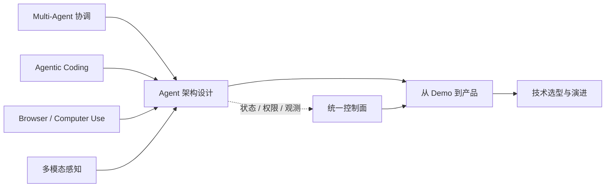

# 第七篇：高级主题

本篇承接十个项目，讨论能力继续扩展后的系统边界。共同问题是：当 Agent 能感知更多环境、执行更长任务并与其他 Agent 协作时，如何继续保持状态、权限和终止条件可控。完成本篇后，读者应能从任务、风险和组织能力出发完成总体架构与技术选型，而不是默认增加更多 Agent。

四类能力从左侧汇入统一架构；控制面贯穿产品化过程，提醒读者能力扩展必须同步增加权限、观测和恢复机制，而不是只增加更多 Agent。

| 章 | 主题 | 核心边界 |
|---:|---|---|
| 32 | [Multi-Agent 原理](ch32-multi-agent-principles.md) | 协调、共享记忆、死锁和终止 |
| 33 | [Agentic Coding](ch33-agentic-coding.md) | 搜索、Patch、测试、Sandbox 与 Git |
| 34 | [Browser/Computer Use](ch34-browser-computer-use.md) | 页面变化、凭证、确认与恢复 |
| 35 | [多模态 Agent](ch35-multimodal.md) | 图像、音频、视频、OCR 与 RAG |
| 36 | [Agent 架构设计](ch36-architecture.md) | Runtime、Gateway、Memory、Eval、Observe |
| 37 | [从 Demo 到产品](ch37-demo-to-product.md) | 可靠性、UX、SLA 与升级 |
| 38 | [技术选型指南](ch38-selection-guide.md) | 控制力、类型、工作流和锁定 |

高级主题不是“增加更多 Agent”，而是识别复杂性何时真正需要，以及如何用明确状态、权限和终止条件约束它。全书最终产出应是一份能说明需求、状态所有权、信任边界、失败恢复、评估、成本和退出路径的 Agent 系统设计。
