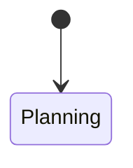

# Full-Book Visual Review Implementation Plan

> **For agentic workers:** REQUIRED SUB-SKILL: Use superpowers:subagent-driven-development (recommended) or superpowers:executing-plans to implement this plan task-by-task. Steps use checkbox (`- [ ]`) syntax for tracking.

**Goal:** 将全书所有适合视觉表达的流程、状态、依赖、边界、决策、数据和协作关系迁移为有引导、有图题、有解释的技术图或表，并验证 HTML、PDF 与 EPUB 的最终可读性。

**Architecture:** Markdown 仍是正文和 Mermaid 唯一来源；每张图使用 `%% title:` 与 `%% alt:` 元数据，`notes/visual-review.yml` 保存逐文件覆盖台账。审计器把台账、Markdown 图形和渲染清单交叉验证，出版管线继续输出 SVG、PNG、HTML、PDF 和 EPUB。

**Tech Stack:** Python 3.12、PyYAML、Mermaid CLI 11.4.2、MkDocs Material、Pandoc 3.10、Chrome Headless、Pillow、pytest、Ruff、mypy。

---

## 文件结构

- `src/ai_agent_book/visual_review.py`：解析图形元数据、章节覆盖台账并返回可排序问题。
- `notes/visual-review.yml`：逐章、逐项目的目标图、关系类型、状态和人工说明。
- `scripts/audit_visual_review.py`：可视化覆盖命令行门禁。
- `scripts/build_diagram_contact_sheet.py`：从 PNG 生成分页缩略图联系表。
- `tests/test_visual_review.py`：元数据、覆盖量、前后解释和台账一致性测试。
- `src/ai_agent_book/diagram_pipeline.py`：读取语义图题和 alt，不再只生成“图 N”。
- `docs/index.md`、七个 `part-*/index.md`：全书和篇章课程地图。
- `docs/part-*/ch*.md`：第 1—38 章图文复审。
- `projects/[0-9][0-9]-*/README.md`：十个项目的架构、数据流与部署/审批图。

### Task 1: 建立语义图形元数据和覆盖审计

**Files:**
- Create: `src/ai_agent_book/visual_review.py`
- Create: `scripts/audit_visual_review.py`
- Create: `tests/test_visual_review.py`
- Create: `notes/visual-review.yml`
- Modify: `src/ai_agent_book/diagram_pipeline.py`
- Modify: `tests/test_diagram_pipeline.py`

- [ ] **Step 1: 编写失败测试**

```python
def test_semantic_diagram_metadata_controls_caption_and_alt() -> None:
    source = """# Runtime

下图说明运行循环。



图中失败路径必须有界。
"""
    record = extract_diagrams(Path("docs/runtime.md"), source)[0]
    assert record.title == "Agent Runtime 状态循环"
    assert record.alt.startswith("请求从接收")
    assert audit_markdown_visuals(Path("docs/runtime.md"), source) == []
```

- [ ] **Step 2: 确认测试因缺少元数据解析和审计器而失败**

Run: `env PYTHONPATH=src .venv/bin/python -m pytest tests/test_visual_review.py tests/test_diagram_pipeline.py -v`
Expected: import/function missing failures

- [ ] **Step 3: 实现元数据解析与视觉问题类型**

实现 `VisualIssue(path, section, code, detail)`、`VisualRequirement(id, relation, section, status, reason)`、`audit_markdown_visuals()` 和 `audit_review_ledger()`。图前与图后至少各有一个非标题、非空、非围栏段落；每张图必须有唯一 `title` 和不少于 12 个汉字/词的 `alt`。

- [ ] **Step 4: 建立覆盖台账**

台账为每个文件定义 `minimum_diagrams` 与 `requirements`；每项包含 `id`、`section`、`relation`、`disposition`。允许的关系为 `flow/state/sequence/architecture/data/decision/hierarchy/comparison/concept/security`，允许的处理为 `diagram/table/code-structure/not-applicable`。

- [ ] **Step 5: 验证红绿循环并提交**

Run: `.venv/bin/ruff check src/ai_agent_book/visual_review.py scripts/audit_visual_review.py tests/test_visual_review.py && env PYTHONPATH=src .venv/bin/python -m pytest tests/test_visual_review.py tests/test_diagram_pipeline.py -q`
Expected: all pass

Commit: `feat: add semantic visual review audit`

### Task 2: 首页与七篇导读课程地图

**Files:**
- Modify: `docs/index.md`
- Modify: `docs/part-01-foundations/index.md`
- Modify: `docs/part-02-agent-core/index.md`
- Modify: `docs/part-03-rag-and-memory/index.md`
- Modify: `docs/part-04-frameworks/index.md`
- Modify: `docs/part-05-engineering/index.md`
- Modify: `docs/part-06-projects/index.md`
- Modify: `docs/part-07-advanced/index.md`
- Modify: `notes/visual-review.yml`

- [ ] **Step 1: 将首页/导读最低覆盖量测试设为 1 并确认失败**

Run: `env PYTHONPATH=src .venv/bin/python scripts/audit_visual_review.py --group guides`
Expected: eight files report `diagram-count`

- [ ] **Step 2: 添加八张语义地图**

| 文件 | 图题 | 类型 | 核心关系 |
|---|---|---|---|
| 首页 | 从模型能力到生产 Agent 的学习地图 | hierarchy | 七篇、十项目与最终能力 |
| 第一篇 | LLM 基础能力依赖图 | concept | Token、Attention、生成、Embedding |
| 第二篇 | 从 Prompt 到 Agent Loop | flow | 结构化输出、工具、规划 |
| 第三篇 | 外部上下文与持久状态地图 | architecture | MCP、RAG、Memory、向量库 |
| 第四篇 | Agent 框架抽象层比较 | hierarchy | 原生 API 到多 Agent 框架 |
| 第五篇 | Agent 生产工程闭环 | flow | 服务、数据、部署、观测、评估、安全、成本 |
| 第六篇 | 十项目能力进阶路线 | hierarchy | 项目依赖与成果 |
| 第七篇 | 高级 Agent 产品化地图 | flow | Multi-Agent、Coding、Browser、多模态、架构、产品 |

- [ ] **Step 3: 为每图补图前问题和图后阅读说明，更新台账为完成**

- [ ] **Step 4: 运行审计、渲染和提交**

Run: `env PYTHONPATH=src .venv/bin/python scripts/audit_visual_review.py --group guides && .venv/bin/python scripts/build_diagrams.py --mmdc node_modules/.bin/mmdc`
Expected: audit pass and eight new SVG/PNG pairs

Commit: `docs: add book and part visual maps`

### Task 3: 第一篇逐章图文复审

**Files:** `docs/part-01-foundations/ch01-what-is-llm.md` through `ch05-embedding.md`, `notes/visual-review.yml`

- [ ] **Step 1: 台账声明下列目标并确认覆盖审计失败**

| 章 | 保留/新增图题 |
|---|---|
| 1 | AI/ML/DL/LLM 包含关系；预训练—微调—对齐生命周期；Token 生成循环；LLM/产品/Agent 技术关系 |
| 2 | Tokenizer 编解码链路；上下文窗口与长期记忆边界；截断/滑窗/摘要决策；Token 成本—延迟—信息密度权衡 |
| 3 | RNN 到 Transformer 演进；Q/K/V 信息路由；Multi-Head 并行视角；Decoder-only 单步生成数据流 |
| 4 | 自回归采样循环；Temperature/Top-k/Top-p 决策顺序；流式输出状态；结构化输出校验与重试 |
| 5 | 文本到向量检索链路；稀疏/稠密/混合检索；Chunk—Embedding—Index 生命周期；相似度高但事实不可靠的边界 |

- [ ] **Step 2: 逐章补图、引导、解释和语义 alt**

- [ ] **Step 3: 审计第一篇并抽查 SVG**

Run: `env PYTHONPATH=src .venv/bin/python scripts/audit_visual_review.py --group part-01 && .venv/bin/python scripts/build_diagrams.py --mmdc node_modules/.bin/mmdc`
Expected: pass; every chapter has 4 diagrams

Commit: `docs: visualize LLM foundations`

### Task 4: 第二篇逐章图文复审

**Files:** `docs/part-02-agent-core/ch06-*.md` through `ch10-*.md`, `notes/visual-review.yml`

- [ ] **Step 1: 以台账声明并实现以下图组**

| 章 | 图组 |
|---|---|
| 6 | 指令层级；Prompt 构建/测试/发布生命周期；直接与间接注入路径；Prompt 到 Context Engineering |
| 7 | 自然语言到 Schema 边界；解析—校验—重试状态；部分解析流；结构化抽取数据流 |
| 8 | Tool Calling 完整循环；多工具并行时序；超时/重试/幂等决策；权限与人工确认边界 |
| 9 | Observation/Action/State 循环；Workflow 与自治 Agent 决策；Routing/Handoff；终止与恢复状态机 |
| 10 | Plan-and-Execute；任务依赖 DAG；失败重规划状态；Planner/Executor/Reviewer 协作时序 |

- [ ] **Step 2: 运行第二篇覆盖、渲染与测试**

Run: `env PYTHONPATH=src .venv/bin/python scripts/audit_visual_review.py --group part-02 && env PYTHONPATH=src .venv/bin/python -m pytest tests/test_visual_review.py -q`
Expected: pass; each chapter 4 diagrams

Commit: `docs: visualize agent core mechanisms`

### Task 5: 第三篇逐章图文复审

**Files:** `docs/part-03-rag-and-memory/ch11-*.md` through `ch16-*.md`, `notes/visual-review.yml`

- [ ] **Step 1: 实现下列图组**

| 章 | 图组 |
|---|---|
| 11 | MCP Client/Server 能力图；初始化与发现时序；Tool/Resource/Prompt 区别；REST/Tool Calling/MCP 分层 |
| 12 | MCP Server 请求生命周期；文件/数据库/外部 API 信任边界；错误映射；部署拓扑 |
| 13 | RAG 端到端管线；摄取与版本链；混合检索与重排；Grounding/Citation/Faithfulness 验证 |
| 14 | Query Rewrite/Multi-Query；Corrective/Self-RAG 状态；Graph/Agentic RAG；高级 RAG 选型树 |
| 15 | 短期/长期/语义/情景记忆层级；写入决策；检索式记忆；遗忘与隐私生命周期 |
| 16 | 向量库组件；HNSW/IVF 查询路径；更新/删除/版本；单机/托管/多租户选型 |

- [ ] **Step 2: 运行第三篇审计与构建**

Run: `env PYTHONPATH=src .venv/bin/python scripts/audit_visual_review.py --group part-03 && .venv/bin/python scripts/build_diagrams.py --mmdc node_modules/.bin/mmdc`
Expected: pass

Commit: `docs: visualize MCP RAG and memory`

### Task 6: 第四篇逐章图文复审

**Files:** `docs/part-04-frameworks/ch17-*.md` through `ch22-*.md`, `notes/visual-review.yml`

- [ ] **Step 1: 实现下列图组**

| 章 | 图组 |
|---|---|
| 17 | 原生 Tool Loop；轻量 Runtime 分层；Retry/Trace；自研框架演进边界 |
| 18 | Agents SDK 核心对象；Handoff 时序；Guardrail 边界；Session/Tracing/MCP 关系 |
| 19 | 类型安全数据流；依赖注入；Validation/Retry 状态；FastAPI 集成 |
| 20 | State/Node/Edge；Conditional Edge 状态图；Checkpoint/Interrupt/Resume；子图与多 Agent |
| 21 | LangChain/LangGraph 关系；LlamaIndex RAG 抽象；框架适用边界；锁定风险分层 |
| 22 | Multi-Agent 框架抽象；Supervisor/角色协作；成本与消息增长；不使用 Multi-Agent 决策树 |

- [ ] **Step 2: 运行第四篇审计、框架版本标记检查和构建**

Run: `env PYTHONPATH=src .venv/bin/python scripts/audit_visual_review.py --group part-04 && env PYTHONPATH=src .venv/bin/python -m pytest tests/test_docs_contract.py -q`
Expected: pass

Commit: `docs: visualize agent frameworks`

### Task 7: 第五篇逐章图文复审

**Files:** `docs/part-05-engineering/ch23-*.md` through `ch31-*.md`, `notes/visual-review.yml`

- [ ] **Step 1: 实现下列图组**

| 章 | 图组 |
|---|---|
| 23 | Python 项目分层；async 调用链；配置/依赖注入；测试金字塔 |
| 24 | FastAPI Agent 请求流；SSE/WebSocket；鉴权/限流；后台任务边界 |
| 25 | PostgreSQL/Redis/pgvector 职责；会话/状态/Checkpoint；缓存一致性；多租户数据边界 |
| 26 | 多阶段镜像；Compose 部署；Secret 注入；CI/CD 与健康检查 |
| 27 | Job 生命周期；Retry/DLQ；取消与进度；分布式 Worker 数据流 |
| 28 | Log/Metric/Trace 关系；Tool/Prompt Trace；成本链；脱敏边界 |
| 29 | 测试层级；Golden Dataset；Agent 任务成功分解；评估流水线/A-B |
| 30 | Prompt Injection 攻击路径；最小权限；审批与沙箱；威胁建模闭环 |
| 31 | 延迟预算；模型路由；缓存/批处理/并行；降级与成本预算 |

- [ ] **Step 2: 运行第五篇审计与构建**

Run: `env PYTHONPATH=src .venv/bin/python scripts/audit_visual_review.py --group part-05 && .venv/bin/python scripts/build_diagrams.py --mmdc node_modules/.bin/mmdc`
Expected: pass

Commit: `docs: visualize agent engineering`

### Task 8: 十个项目图文复审

**Files:** `projects/01-minimal-assistant/README.md` through `projects/10-enterprise-platform/README.md`, `notes/visual-review.yml`

- [ ] **Step 1: 每项目实现三类图**

每个项目固定提供：`系统架构`、`端到端数据/控制流`、`部署或审批/恢复关系`。项目 1 使用 Streaming 时序；项目 2 使用 Tool Loop 与审批；项目 3 使用 MCP 时序；项目 4 使用摄取/检索双管线；项目 5 使用 Diff Review 流；项目 6 使用审批与审计；项目 7 使用事实/推断分离；项目 8 使用 LangGraph 状态；项目 9 使用共享状态与终止；项目 10 使用企业部署和租户权限。

- [ ] **Step 2: 运行项目审计和项目测试**

Run: `env PYTHONPATH=src .venv/bin/python scripts/audit_visual_review.py --group projects && env PYTHONPATH=src .venv/bin/python -m pytest projects/*/tests -q`
Expected: ten READMEs pass and project tests pass

Commit: `docs: visualize all ten projects`

### Task 9: 第七篇逐章图文复审

**Files:** `docs/part-07-advanced/ch32-*.md` through `ch38-*.md`, `notes/visual-review.yml`

- [ ] **Step 1: 实现下列图组**

| 章 | 图组 |
|---|---|
| 32 | Supervisor/Handoff/Blackboard；消息传递；Deadlock；终止策略 |
| 33 | Repo Map/Search/Plan/Patch/Test；Sandbox；长任务恢复；Coding Agent 局限 |
| 34 | DOM/Screenshot/OCR 感知；浏览器动作循环；登录/凭证边界；UI 变化恢复 |
| 35 | 多模态输入路由；OCR/Vision；多模态 RAG；成本与降级 |
| 36 | Modular Monolith/Microservices；Event-Driven；企业 Agent 平台；服务职责 |
| 37 | Demo 到产品阶段；可靠性状态；用户审批体验；SLA/成本商业闭环 |
| 38 | 方案比较层级；框架选型树；Spike/ADR；锁定风险隔离 |

- [ ] **Step 2: 运行第七篇审计与构建**

Run: `env PYTHONPATH=src .venv/bin/python scripts/audit_visual_review.py --group part-07 && .venv/bin/python scripts/build_diagrams.py --mmdc node_modules/.bin/mmdc`
Expected: pass

Commit: `docs: visualize advanced agent topics`

### Task 10: 联系表与全格式视觉验收

**Files:**
- Create: `scripts/build_diagram_contact_sheet.py`
- Create: `tests/test_diagram_contact_sheet.py`
- Modify: `src/ai_agent_book/publication_audit.py`
- Modify: `PROJECT_STATUS.md`

- [ ] **Step 1: 测试联系表分页和图形清单完整性**

联系表每页 4×5 张缩略图，显示文件名、图题和源章节；所有 manifest 条目恰好出现一次。测试使用 21 张临时 PNG，期望输出 2 页。

- [ ] **Step 2: 构建全部图与联系表**

Run: `.venv/bin/python scripts/build_diagrams.py --mmdc node_modules/.bin/mmdc && .venv/bin/python scripts/build_diagram_contact_sheet.py`
Expected: manifest count 150–210; contact sheet covers every diagram

- [ ] **Step 3: 重建并审计 HTML/PDF/EPUB**

Run: `.venv/bin/python scripts/build_html.py && .venv/bin/python scripts/build_pandoc.py all && env PYTHONPATH=src .venv/bin/python scripts/audit_publication.py all output`
Expected: all exit 0

- [ ] **Step 4: 视觉抽检**

检查全部联系表；HTML 抽检首页、七篇导读、每章首图、十项目和 390px 移动端；PDF 抽检目录、每篇首章、宽图、时序图、代码/表格混排和末页；EPUB 使用解包 XHTML+Chrome 与 Apple Books/Calibre 中至少一种独立阅读器。

- [ ] **Step 5: 最终质量门禁**

Run: `.venv/bin/ruff check . && .venv/bin/mypy src/ai_agent_book scripts projects/10-enterprise-platform/api.py && env PYTHONPATH=src .venv/bin/python -m pytest -o addopts='' tests projects/*/tests -q && git diff --check`
Expected: all pass, no secrets, clean worktree after commit

Commit: `test: complete full-book visual acceptance`
