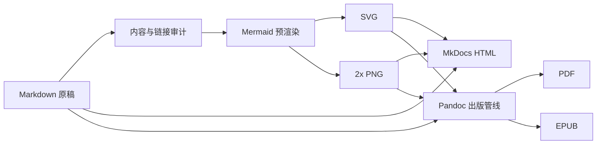

# 《AI Agent 从零到实战（2026版）》多格式出版重设计

日期：2026-07-12  
状态：已完成交互设计确认，等待实施前最终审阅。

## 1. 背景与目标

现有教材已具备完整 Markdown 正文、MkDocs 网站以及 PDF/EPUB 产物，但出版表现存在两个明确问题：PDF 使用简化的 ReportLab 文本流，标题、代码、表格和图形层级不足；EPUB 将 Mermaid 当作源码展示，阅读器无法得到实际图形。

本次改造以 HTML 阅读体验为第一优先级，建立单一 Markdown 源、多格式派生的出版系统。最终交付包括：

- 极简开发者文档风格的可阅读 HTML；
- Mermaid 批量预渲染的 SVG 与 2x PNG；
- 使用 Pandoc 导出的专业排版 PDF；
- 嵌入实际图形并具有兼容回退的 EPUB；
- 自动目录、索引、参考文献、术语表和章节导航；
- 覆盖内容、链接、图形与视觉布局的自动审计。

## 2. 已确认的设计选择

- 视觉优先级：HTML 阅读优先，PDF 与 EPUB 适配同一视觉系统。
- 风格：极简开发者文档，不采用营销落地页或未来科技视觉。
- 字体：标题与正文统一采用无衬线中文字体栈。
- 布局：桌面端三栏，左侧全书导航、中间正文、右侧本章目录；窄屏自动折叠。
- 图形：克制蓝灰配色，只对警告、成功和外部系统使用少量语义色。
- 技术路线：保留 MkDocs Material，增加自定义主题和图形预渲染；Pandoc 负责 PDF/EPUB 出版。

## 3. 总体架构



Markdown 是唯一人工维护的正文源。构建阶段生成的图片、组合 Markdown、Pandoc 中间文件和最终产物均不得反向覆盖原稿。

## 4. 目录与组件边界

```text
docs/                       Markdown 唯一正文源
assets/
├── stylesheets/            HTML 视觉令牌与组件样式
├── javascripts/            阅读增强与图形灯箱
└── diagrams/
    ├── source/             按内容哈希提取的 Mermaid
    ├── svg/                HTML/PDF 首选图形
    └── png/                EPUB 与兼容回退
templates/
├── mkdocs/                 首页与 Material 主题覆盖
└── pandoc/                 HTML、PDF、EPUB 模板与元数据
scripts/
├── build_diagrams.py       提取、缓存、渲染和清单生成
├── build_html.py           HTML 构建入口
├── build_pandoc.py         Pandoc 组合与多格式导出
└── audit_publication.py    内容、链接、图片和产物审计
output/
├── html/
├── pdf/
└── epub/
```

各组件保持单一职责：图形构建器不修改正文，HTML 构建器不生成 PDF，Pandoc 构建器只消费经过审计的组合输入，审计器不修复内容而是报告并使构建失败。

## 5. HTML 信息架构

### 5.1 全局布局

桌面端采用三栏布局：左侧为七篇和章节树，中栏正文宽度控制在 760-820px，右侧为当前章节目录。顶部仅包含书名、搜索、深浅模式与代码仓库入口。平板收起右侧目录，手机同时收起双侧栏。

### 5.2 首页

首页是教材入口而不是营销页，包含：教材定位、适合读者、七篇课程地图、8/12/24 周路线、十个项目、版本核对日期、构建状态，以及“开始阅读”“查看项目”两个主要动作。

### 5.3 正文页

正文页依次呈现篇章路径、章节编号与标题、摘要、最后核对日期、正文和上下章导航。右侧目录跟随滚动并高亮当前小节。锚点可复制，页面提供返回顶部。

### 5.4 组件样式

- 代码块使用深灰背景、语言标签、复制按钮和横向滚动，禁止通过缩小字号容纳长行。
- 表格使用轻边框和弱斑马纹，窄屏横向滚动；长表头保持可见。
- 提示框仅定义说明、注意、风险、实践四种语义。
- SVG/PNG 图形使用白底、细边框和统一图题，可点击灯箱放大并支持键盘关闭。
- 引用使用数字标记；悬停层固定展示文献标题、作者、年份与目标链接。结构化文献中存在摘要时追加最多 120 个汉字的摘要，不存在时不生成空白摘要区域。
- 正文字号、行高、段间距和标题间距使用统一 CSS 变量，避免章节自行定义。

## 6. 图形管线

### 6.1 提取与缓存

构建器扫描全部 Markdown 的 Mermaid 围栏，以规范化源码的 SHA-256 摘要生成稳定 ID。图形清单记录来源文件、序号、标题、替代文本、哈希、SVG 和 PNG 路径。源码未变化时复用缓存。

### 6.2 渲染规则

使用 Mermaid CLI 固定版本渲染。主题采用蓝灰色、系统无衬线字体、统一线宽、圆角、节点间距和白色背景。每图输出 SVG 和 2x PNG；SVG 保留文字，不转轮廓。渲染失败、缺失图题或缺失替代文本都会使构建失败。

### 6.3 格式使用

- HTML 首选 SVG，并提供 PNG 回退和灯箱。
- PDF 首选 SVG 或由 SVG 转换的矢量 PDF，不展示 Mermaid 源码。
- EPUB 使用 `<picture>` 嵌入 SVG 首选资源，并在同一元素中设置 PNG `` 回退；两种资源均写入 EPUB manifest，回退图片继承同一替代文本与图题。
- 位图截图不转换成 SVG，只执行尺寸、压缩和替代文本检查。

## 7. Pandoc 出版管线

### 7.1 组合输入

脚本按 `mkdocs.yml` 的章节顺序组合前言、38 章、十个项目、术语表、参考资料和索引元数据。组合过程中将 Mermaid 围栏替换为带图题和替代文本的图片引用，并保留来源映射以便报错。

### 7.2 PDF

Pandoc 生成 A4 PDF。模板提供封面、版权页、真实目录、篇章扉页、章节起始样式、页眉页脚、图表编号、语法高亮和参考文献。中文使用可嵌入的无衬线字体；代码使用等宽字体。代码允许跨页但不截断单行，宽表格采用缩放、重排或横向页，而不是越出版心。

PDF 固定采用“Pandoc 生成打印版 HTML，再由 Google Chrome Headless 输出 PDF”的两阶段管线。Pandoc 负责章节组合、目录、编号、引用与打印 HTML，Chrome 负责 CSS 分页和 PDF 写出；构建脚本固定浏览器可执行文件探测顺序并记录实际版本。当前 macOS 环境优先使用 `/Applications/Google Chrome.app/Contents/MacOS/Google Chrome`。不能使用旧 ReportLab 结果冒充 Pandoc 产物。

### 7.3 EPUB

Pandoc 生成 EPUB3。EPUB 包含封面、导航文档、章节层级、实际 SVG/PNG、代码样式、表格滚动容器、术语表和参考文献。禁止依赖 Mermaid JavaScript 运行时。构建后检查所有 XHTML 和资源引用。

### 7.4 独立 HTML

除 MkDocs 站点外，Pandoc 可生成单文件或目录式独立 HTML 作为离线阅读版本。该版本复用相同视觉令牌和预渲染图形，但不替代带搜索和三栏导航的 MkDocs 主站。

## 8. 自动目录、索引、参考文献与术语

- 全书目录来自 `mkdocs.yml`/出版清单，不手写重复顺序。
- 章节页导航由清单生成，保证上一章、下一章和篇章目录一致。
- 术语表继续以 `docs/glossary.md` 为权威源，并生成术语锚点与索引条目。
- 参考文献以结构化文献文件为权威源；现有自由文本引用在迁移时映射为稳定 ID。
- 索引至少覆盖核心术语、框架、协议和工程概念，并链接到出现位置。
- 缺失文献 ID、重复锚点和无法解析的内部引用导致构建失败。

## 9. 错误处理与可重复构建

构建开始时检查 Pandoc、Mermaid CLI、浏览器/渲染器、PDF 引擎和字体。缺失依赖时给出精确安装命令并退出，不静默降级为源码图或旧 PDF。

所有外部命令设置超时并捕获 stdout/stderr。图形渲染可并行，但错误按源文件排序汇总。生成文件先写临时目录，全部审计通过后再原子替换 `output/` 对应产物。版本号、构建日期和依赖快照写入产物元数据。

## 10. 测试与视觉验收

### 10.1 自动测试

- 38 章和十个项目均存在于出版清单。
- 所有 Mermaid 生成 SVG 与 PNG，且文件非空、尺寸合理。
- HTML 不包含未处理 Mermaid 围栏或断裂资源。
- 所有图片具有 alt，所有内部链接与导航目标存在。
- EPUB ZIP、manifest、spine、nav 和资源引用完整。
- PDF 可提取目录、章节标题、图题和代码路径，字体已嵌入。
- 构建两次产生相同清单和稳定图形文件名。

### 10.2 HTML 视觉验收

检查桌面、平板、手机三种宽度：首页、普通正文、代码密集页、宽表页、长目录页、图形密集页和项目页。验证导航、搜索、复制、锚点、灯箱、键盘和深浅模式。

### 10.3 PDF 视觉验收

渲染为 PNG 后检查封面、目录、每篇首章、代码密集页、表格页、图形页、项目 4/8/10、术语表、参考文献和末页。不得存在裁切、重叠、孤行标题、过小代码、失真图形或错误字体。

### 10.4 EPUB 视觉验收

至少使用两个渲染器检查封面、目录、章节跳转、中文、SVG、PNG 回退、代码横向滚动、表格和内部链接。EPUB 中不能出现 Mermaid 源码占位。

## 11. 迁移与兼容策略

第一阶段先交付新版 MkDocs HTML，不删除现有发布器。HTML 验收通过后接入图形预渲染，再建立 Pandoc PDF/EPUB。新产物通过视觉验收后，旧 ReportLab 构建器标记为 legacy 并从默认命令移除，但保留一个版本周期用于结果对照。

现有 Markdown 内容只做必要的图题、alt、引用和结构修订，不为适配模板大规模重写正文。MkDocs URL 尽量保持稳定；变更的路径提供重定向或兼容页面。

## 12. 完成标准

1. `output/html/` 可离线阅读，MkDocs 主站三栏布局、搜索、导航与图形可用。
2. 每个 Mermaid 图均存在稳定 SVG 和 PNG，不在 HTML、PDF、EPUB 中展示源码占位。
3. Pandoc PDF 与 EPUB 构建命令可重复运行，产物包含完整目录、术语、索引和参考资料。
4. 自动审计、单元测试、MkDocs 严格构建和多格式产物检查全部通过。
5. HTML、PDF、EPUB 按本规格完成视觉抽检，`PROJECT_STATUS.md` 准确记录结果和任何仍需人工验证的阅读器。
