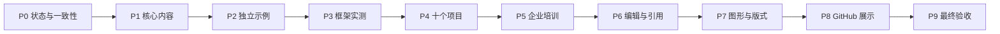

# AI Agent 教材全目标完善设计

## 目标

把当前教材从“可系统学习的出版预览版”提升为同时满足个人学习、企业培训、GitHub 开源展示、商业出版和生产参考模板五类用途的可持续教材工程。

目标完成度如下：

| 用途 | 当前估计 | 目标 |
|---|---:|---:|
| 个人系统学习 | 85% | 95% 以上 |
| 企业内部培训 | 80% | 90% 以上 |
| GitHub 开源展示 | 85% | 95% 以上 |
| 正式商业出版 | 65% | 90% 以上 |
| 十个生产项目模板 | 55% | 80% 以上 |

## 设计原则

1. 先修正完成度口径，再扩充内容，避免状态报告领先于真实交付。
2. 将总目标拆为 P0—P9 十个可独立验收阶段，每阶段都有计划、测试、构建证据和提交记录。
3. 内容完成度、代码完成度、版本核查和出版完成度分别记录，不用单一“完成”掩盖差异。
4. 框架章节只有在固定版本安装、示例运行和回归测试后，才能标记为代码已验证。
5. 十个项目先保持可运行垂直切片，再逐项增加服务化、持久化、权限、观测、评估和恢复能力。
6. 图示以表达状态、时序、依赖和架构为目的，不以固定数量为完成标准。
7. 商业出版增加引用、版权、许可证、设备兼容和人工编辑门禁。

## 阶段架构

P0 建立可信基线；P1—P3 主要提升学习价值；P4 决定生产模板质量；P5—P7 决定培训和商业出版质量；P8—P9 完成公开交付与独立验收。

## 状态模型

章节使用四个互不替代的状态：

- 正文：`outline`、`publishable_draft`、`editor_reviewed`。
- 代码：`inline_only`、`offline_verified`、`online_verified`。
- 版本：`stable_concepts`、`official_docs_checked`、`installed_and_tested`。
- 出版：`markdown_only`、`html_verified`、`pdf_epub_verified`。

项目使用五级状态：

- `concept`：仅设计。
- `vertical_slice`：主要链路可离线运行。
- `service_template`：具备 API、配置、持久化和测试。
- `production_reference`：具备权限、观测、恢复、评估和部署证据。
- `externally_validated`：真实账号或外部系统完成受控联调。

## 质量门禁

每阶段必须满足：

1. 测试先失败，再做最小修复。
2. 正文引用的本地路径全部存在。
3. README 命令可复制运行。
4. `PROJECT_STATUS.md` 与结构化完成矩阵一致。
5. Python 3.12 测试、Ruff、mypy 和出版审计按变更风险执行。
6. 阶段结束时更新路线图复选框和版本核查记录。

## 错误处理与边界

- 外部账号、付费 API 和发布渠道不能被 Mock 验证冒充真实联调。
- 快速变化的框架接口无法确认时保持“待实测”状态，不根据记忆补接口。
- 独立示例未完成时，正文保留内联代码，但不能链接到不存在的目录。
- 生产参考项目默认使用低权限、Mock 和 Fixture；外部写操作必须经过显式批准。
- 商业出版前必须处理当前非商业许可证与商业发行目标之间的关系。

## 验收结果

最终交付包括正文、独立示例、十个增强项目、培训材料、正式引用、图形资产、HTML/PDF/EPUB、GitHub Release、完成矩阵以及第三方审阅记录。任何未完成项必须在状态页中可见，不能仅存在于提交历史或聊天记录。
