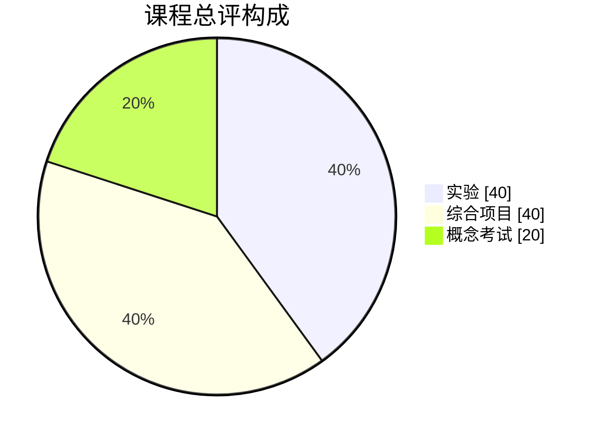

# 评分标准与通过门槛

## 评分原则

评分依据可验证证据，而不是模型输出是否“看起来不错”。相同功能如果缺少测试、权限边界或失败恢复，不能获得同等分数。

## 单项实验 Rubric（100 分）

| 维度 | 权重 | 优秀 | 合格 | 未达标 |
|---|---:|---|---|---|
| 问题与边界 | 10 | 成功、失败、不适用条件明确 | 能说明主要目标和限制 | 只描述功能 |
| 正确性 | 20 | 成功与边界行为均有直接证据 | 核心路径可运行 | 结果不可复现 |
| 测试与评估 | 20 | 单元、集成、失败注入和指标完整 | 至少覆盖成功与一个失败路径 | 只有手工演示 |
| 可靠性与恢复 | 15 | 超时、重试、幂等、终止和恢复边界合理 | 关键操作有超时和显式错误 | 无限循环或吞掉异常 |
| 安全与隐私 | 15 | 最小权限、审批、脱敏和审计均有证据 | 无密钥硬编码并有基础权限检查 | 存在越权或敏感数据泄露 |
| 工程质量 | 10 | 类型、结构、配置和日志清晰 | 代码可读且配置外置 | 难以运行或依赖隐式状态 |
| 决策与表达 | 10 | 能比较替代方案并声明未验证边界 | 能解释主要选择 | 只复述框架文档 |

实验达到 70 分为合格；安全与隐私、可靠性与恢复两个维度均不得低于该维度满分的 60%。

## 综合项目 Rubric（100 分）

| 维度 | 权重 | 必须提交的证据 |
|---|---:|---|
| 需求与产品边界 | 10 | 用户故事、非目标、SLO 或验收用例 |
| 架构与数据流 | 15 | 架构图、状态模型、关键 ADR |
| Agent/Workflow 实现 | 15 | 可运行代码、终止条件、工具契约 |
| 数据与检索质量 | 10 | 数据版本、黄金集、引用或拒答策略 |
| 测试与 Evaluation | 15 | 单元、集成、回归指标和失败样本 |
| 安全治理 | 15 | 威胁模型、权限、审批、审计和 Secret 策略 |
| 可观测与恢复 | 10 | Trace、指标、重试/DLQ/Checkpoint 证据 |
| 部署与复现 | 5 | 配置样例、健康检查、启动与回滚说明 |
| 成本与性能 | 5 | Token/调用预算、延迟测量和降级路径 |

综合项目达到 75 分为合格。以下任一情况触发“一票整改”：提交真实密钥；跨租户读取；高风险副作用没有确认；无上限 Agent 循环；伪造引用或测试结果。

## 课程总评

总评达到 75 分、综合项目合格且没有未整改的一票项，才视为完成课程。企业可以提高门槛，但不应通过降低安全和可靠性权重来提高通过率。

## 同伴评审模板

评审者必须给出一条证据充分的优点、一条可执行改进建议和一个尚未证明的假设。禁止只写“不错”“建议优化 Prompt”等无法验证的意见。

