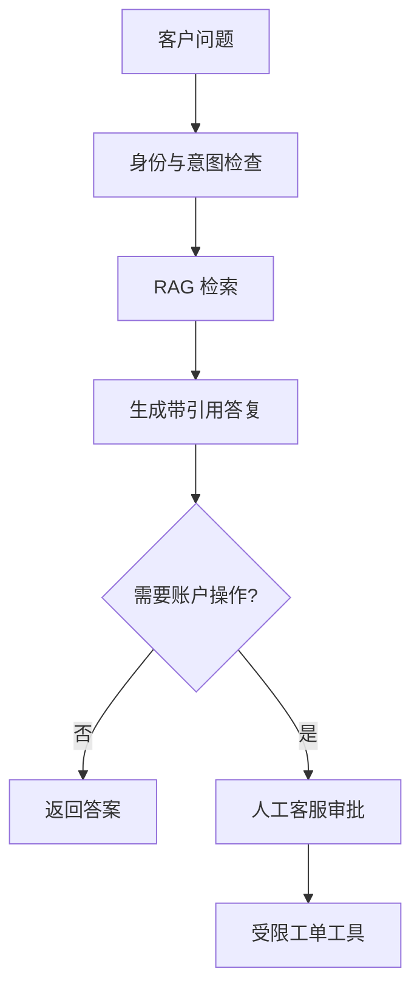

# 企业案例任务书

这些案例用于把课程原理迁移到真实组织约束。每个案例都要求学员先划定非目标，再设计数据流、权限、评估和停止条件。

## 案例一：客户服务 Agent

场景：客服团队希望自动回答产品问题，并在需要时创建工单。系统不得承诺退款、修改账户或暴露其他客户信息。

任务：定义知识版本、拒答策略、账户操作审批和工单幂等键；设计 30 条黄金集，至少覆盖无证据、冲突文档、敏感信息和恶意指令。成功率不能以减少拒答为唯一指标。

## 案例二：企业知识库 Agent

场景：研发、销售和法务文档具有不同 ACL。系统需要回答问题并提供页码或段落引用，文档撤销后不得继续被检索。

任务：设计租户/部门过滤、文档版本、索引激活、删除传播和引用证据；比较关键词、向量和混合检索；为 Recall、MRR、Faithfulness 和权限泄漏建立发布门禁。

## 案例三：研发 Code Review Agent

场景：系统读取 Pull Request Diff，运行静态规则和 LLM Review，但默认不直接发布评论，也不运行仓库中的不可信脚本。

任务：划分只读仓库工具、Sandbox 和评论审批；给出误报、漏报、Prompt Injection 与供应链威胁；用同一组 Diff 对比纯规则、LLM 和混合方案。

## 案例四：办公协作 Agent

场景：系统汇总邮件、生成日报、查询日历并草拟 Notion/飞书内容。发送邮件、创建会议和发布文档必须经过明确审批。

任务：设计 OAuth Scope、审批令牌、Outbox、重复发送防护、审计和撤销路径；区分“生成草稿”和“对外发送”两类副作用；测试审批过期和 Provider 超时。

## 案例五：合规研究 Agent

场景：合规团队希望汇总规范、监管公告和内部政策。系统必须区分原文事实、分析推断和待确认事项，不能替代法律意见。

任务：建立权威来源 Allowlist、发布日期和有效期、引用快照、冲突升级、人工复核和免责声明；设计一次间接 Prompt Injection 演练，并证明外部文档不能扩大工具权限。

## 案例评审问题

每组答辩必须回答：为什么需要 Agent 而不是搜索或普通工作流？哪些状态必须持久化？哪些副作用必须审批？如何证明权限隔离？发生模型退化、索引污染或 Provider 中断时如何降级？哪些结论来自证据，哪些只是设计假设？
