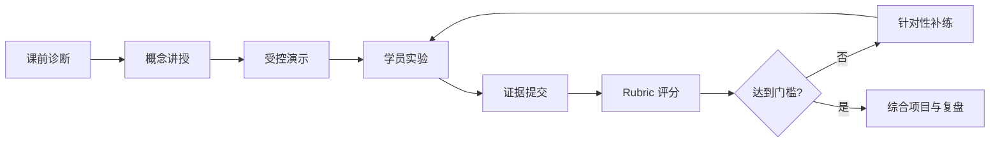

# 企业培训版入口

本目录把教材正文转换为可以实际授课、练习、评分和复盘的课程系统。教材章节负责解释知识，培训材料负责规定教学活动、时间、证据和验收边界。讲师不应把“播放幻灯片”当作完成授课，学员也不以“阅读完毕”代替工程产出。

这条闭环要求每个知识单元最终落到可检查的输出，例如测试结果、Trace、ADR、威胁模型或评估报告。讲师可以调整节奏，但不得删除失败路径、安全边界和证据提交环节。

## 材料导航

| 材料 | 使用者 | 解决的问题 |
|---|---|---|
| [讲师手册](instructor-guide.md) | 讲师、助教 | 如何备课、授课、控时、处理故障并组织复盘 |
| [学员实验手册](student-lab-manual.md) | 学员 | 每个实验做什么、提交什么、怎样判断完成 |
| [评分标准](assessment-rubric.md) | 讲师、评审者 | 如何一致地评价知识、代码、可靠性、安全与表达 |
| [题库与综合考试](question-bank.md) | 讲师、学员 | 如何检查 38 章知识和跨章设计能力 |
| [企业案例](enterprise-cases.md) | 架构师、产品和研发团队 | 如何将课程映射到客服、知识库、研发、办公和合规场景 |
| [工作坊手册](workshops.md) | 讲师、技术负责人 | 如何运行架构评审、威胁建模和成本估算工作坊 |
| [离线培训包](offline-training-pack.md) | 环境管理员、学员 | 如何在无付费账号环境完成核心实验 |
| [常见学员错误](common-mistakes.md) | 讲师、助教 | 如何诊断误解、环境问题和工程反模式 |
| [培训幻灯片](slides.md) | 讲师 | 如何用图示串联课程，而不替代教材与实验 |

## 三种交付模式

| 模式 | 建议周期 | 适用团队 | 必交成果 |
|---|---:|---|---|
| 快速工程入门 | 8 周 | 有开发经验、需要尽快完成 Agent 原型 | 工具 Agent、RAG 原型、评估报告 |
| 系统工程训练 | 12 周 | 平台或业务研发团队 | 可恢复 Agent 服务、选型 ADR、综合项目 |
| 产品与架构训练 | 24 周 | 转岗、架构升级或产品孵化团队 | 生产参考项目、威胁模型、成本模型和作品集 |

每条路线的周计划仍以[学习指南](../learning-guide.md)为基线；讲师手册补充每周教学动作，实验手册提供编码任务，评分标准定义通过条件。

## P5 验收口径

企业培训版只有在以下证据同时存在时才视为完成：

1. 讲师可仅依赖仓库完成备课、授课、实验支持、评分和复盘。
2. 学员在没有付费 Provider 账号时能运行所有核心实验的离线路径。
3. 8、12、24 周路线都有时间预算、编码任务、产出和可观察检查标准。
4. 题库覆盖 38 章，并提供综合考试、参考答案和评分说明。
5. 客服、知识库、研发、办公与合规案例均包含边界、数据流、风险和决策任务。
6. 架构评审、威胁建模和成本估算工作坊均能在 90—120 分钟内独立运行。
7. 课程材料进入自动测试、MkDocs 导航和完成矩阵，不能只存在于讲师个人电脑中。
