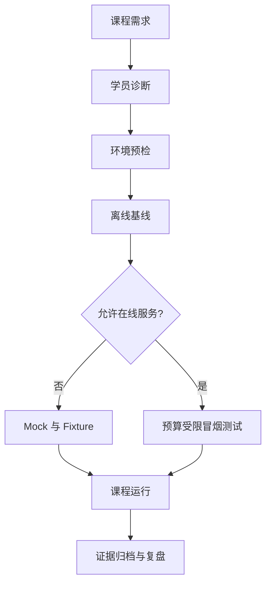

# 讲师手册

## 课程定位

本课程面向已有软件工程经验、但尚未系统掌握 LLM、RAG、MCP 与 Agent 工程的开发者。讲师的任务不是展示模型“很聪明”，而是帮助学员建立可验证的系统设计能力：明确状态、工具权限、失败恢复、评估和成本边界。

## 课前准备

开课前一周完成以下检查：

- 收集学员的 Python、后端、Docker、数据库和 LLM 使用经验。
- 在与学员一致的操作系统或容器环境执行 `python3.12 -m venv`、安装和根级测试。
- 运行离线培训环境初始化脚本，确认不配置 API Key 也能完成核心实验。
- 按企业政策决定哪些在线 Provider、外部搜索和 GitHub 写操作可以启用。
- 准备一个故意失败的演示：参数校验错误、工具超时、检索无结果或预算耗尽。
- 建立提交位置和命名规则，不收集真实客户数据、密钥或内部源代码。

该流程把在线服务视为可选增强，而不是课程能否运行的前提。任何在线演示都应设置预算、超时、数据边界和停止条件。

## 单次课程的标准节奏

以 120 分钟课时为例：

| 环节 | 时间 | 讲师动作 | 学员证据 |
|---|---:|---|---|
| 目标与场景 | 10 分钟 | 给出问题、约束和失败后果 | 用自己的话复述边界 |
| 原理讲授 | 25 分钟 | 使用正文与图示解释机制 | 回答两道概念检查题 |
| 受控演示 | 20 分钟 | 先演示成功，再演示失败与恢复 | 记录关键日志或 Trace |
| 编码实验 | 45 分钟 | 只提供提示和诊断，不代写答案 | 测试、输出和决策记录 |
| 同伴评审 | 10 分钟 | 提供 Rubric 与反例 | 一条可执行改进意见 |
| 总结与迁移 | 10 分钟 | 连接后续章节与企业场景 | 一项课后扩展计划 |

## 8 周授课路线

| 周 | 讲授重点 | 实验 | 讲师检查点 |
|---:|---|---|---|
| 1 | Token、上下文与成本 | L01 Token 预算 | 能解释上下文为何不是长期记忆 |
| 2 | Attention、采样与 Embedding | L02 采样；L03 语义检索 | 能用实验数据解释参数变化 |
| 3 | Prompt 与结构化输出 | L04 结构化抽取 | 非法输出进入显式失败路径 |
| 4 | Tool Calling 与 Agent Loop | L05 工具 Agent | 有超时、幂等和循环上限 |
| 5 | MCP 与 RAG | L06 MCP；L07 RAG | 能追踪来源并拒绝无证据回答 |
| 6 | FastAPI 与状态 | L08 服务化 | 重启后可恢复关键状态 |
| 7 | Observability、Eval、安全 | L09 评估；L10 威胁建模 | 能检测至少一次质量回归 |
| 8 | 综合项目 | L12 项目答辩 | README 可复现，设计取舍可解释 |

## 12 周与 24 周增量

12 周路线在 8 周内容后增加高级检索、框架对照、异步任务和项目 4/8。24 周路线进一步增加项目 5/10、Multi-Agent 基线对照、架构评审、威胁建模、成本估算与作品集评审。详细周次沿用[学习指南](../learning-guide.md)，但每周必须至少产生一种可审计证据：测试、评估表、Trace、ADR、威胁模型或演示录像说明。

## 演示规范

讲师演示应遵守“四步法”：

1. 先展示输入、预期和约束。
2. 运行成功路径并解释可观察信号。
3. 注入一个真实失败，例如超时、无权限或检索污染。
4. 展示恢复、降级或拒绝执行，而不是删除异常代码。

禁止使用包含真实 API Key 的终端历史、客户文档、生产 Token 或未脱敏 Trace。涉及外部写操作时，默认使用 Dry Run，并在实际提交前明确指出副作用。

## 助教与班级规模

建议每 12—15 名学员配置 1 名助教。超过 30 人时，实验提交应自动收集测试结果和结构化元数据，人工评审聚焦 ADR、安全边界和解释质量。助教不直接修复学员代码，而使用[常见学员错误](common-mistakes.md)中的诊断顺序定位问题。

## 评分与补练

课程总评建议由实验 40%、综合项目 40%、概念考试 20% 构成。任何项目即使总分达标，只要出现真实密钥提交、跨租户读取、无上限循环或未经确认的高风险写操作，都必须先整改再通过。补练应针对未达标维度，不要求学员机械重做全部课程。

## 课程结束条件

讲师只有在以下事项完成后才能结束一期课程：成绩和反馈已归档；高风险问题已关闭；失败演示和环境差异已记录；学员能从空环境复现至少一个项目；课程复盘已形成下一期改进清单。

