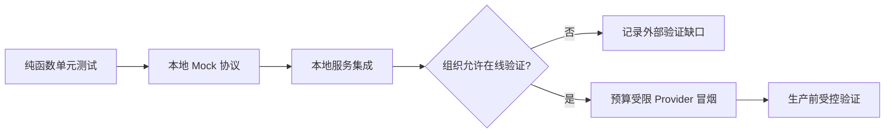

# 离线培训包

离线培训包保证学员在没有付费 API、外部数据库或企业账号时仍能学习核心机制。它不是对真实 Provider 联调的替代，而是稳定、可重复的第一层验收。

## 初始化

```bash
python3.12 -m venv .venv
source .venv/bin/activate
python -m pip install -e '.[dev,docs]'
python scripts/setup_training_env.py --target .training-workspace
```

生成目录包含只读 Fixture 副本、数据清单和学员提交目录。脚本不会读取 `.env`、不会创建 API Key，也不会连接外部网络。

## Fixture 类型

| 文件 | 用途 | 故意覆盖的失败 |
|---|---|---|
| `training/fixtures/tool_cases.jsonl` | Tool Calling 参数与权限实验 | 参数错误、超时、重复请求、未批准写操作 |
| `training/fixtures/rag_questions.jsonl` | RAG 黄金集 | 无证据、ACL 隔离、冲突文档、过期版本 |
| `training/fixtures/security_cases.jsonl` | 安全实验 | 直接/间接注入、数据外传、越权工具调用 |
| `training/fixtures/cost_scenarios.json` | 成本工作坊 | 流量变化、重试放大、缓存失效 |

## 离线与在线分层



学员不得把离线通过写成“生产验证完成”。在线测试报告必须记录 Provider、模型/服务版本、日期、预算、数据范围、成功与失败样本。

## 环境验收与清理

初始化完成后，检查 `training-manifest.json` 中四个 Fixture 文件的记录数和 SHA256，再运行对应示例或项目测试。培训工作区只保存学员生成的合成数据和脱敏证据；课程结束后可直接删除 `.training-workspace`，不会影响源码仓库。若组织需要保留提交，应先进行密钥、个人信息和内部标识扫描，再把必要证据复制到受控归档位置。讲师不得要求学员上传完整终端历史或个人配置目录来证明实验完成。
